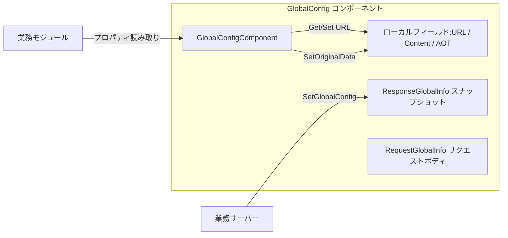

# はじめに

GameFrameX GlobalConfig は GameFrameX フレームワークにおけるグローバル設定コンポーネントであり、サーバーから配信される或いはローカル設定されたグローバルパラメータ（アプリバージョン確認 URL、リソース版本確認 URL、ホストサービスアドレス、AOT メタデータリスト、カスタム拡張内容など）を一元管理するために使用されます。このコンポーネントは Unity MonoBehaviour 形式でアタッチされ、`GameFrameworkComponent` を通じてフレームワークライフサイクルに接続され、業務モジュールが必要に応じて読み取ります。

## クイックスタート

### 1. インストール

任意の方法を選択してコンポーネントを Unity プロジェクトに追加します：

1. `Packages/manifest.json` に scoped registry を追加します：

   ```json
   {
     "scopedRegistries": [
       {
         "name": "GameFrameX",
         "url": "https://gameframex.upm.alianblank.uk",
         "scopes": ["com.gameframex"]
       }
     ],
     "dependencies": {
       "com.gameframex.unity.globalconfig": "1.3.2"
     }
   }
   ```

2. `dependencies` ノードに Git URL を直接追加します：

   ```json
   {
     "com.gameframex.unity.globalconfig": "https://github.com/gameframex/com.gameframex.unity.globalconfig.git"
   }
   ```

3. Unity Package Manager で `Add package from git URL` を介して上記のアドレスを追加します。

4. リポジトリを Unity プロジェクトの `Packages/` ディレクトリに直接クローンします。

### 2. コンポーネントのアタッチ

シーン内の `GameFrameX` フレームワークエントリオブジェクトに `Global Config` コンポーネントを追加します（メニュー：`Add Component → GameFrameX → Global Config`）。コンポーネントは `GameFrameworkComponent` を継承しており、`Awake` で自動登録をオフにし、フレームワークエントリによって一元管理されます。

Source: [GlobalConfigComponent.cs#L11-L13](https://github.com/GameFrameX/com.gameframex.unity.globalconfig/blob/main/Runtime/GlobalConfig/GlobalConfigComponent.cs#L11-L13)

### 3. 設定フィールド

コンポーネントは Inspector で以下のフィールドを公開しており、エディタで直接入力することも、ランタイムでプロパティを介して値を割り当てることもできます：

| フィールド | タイプ | 説明 |
|------|------|------|
| `Check App Version Url` | string | アプリバージョン確認インターフェースアドレス |
| `Check Resource Version Url` | string | リソースバージョン確認インターフェースアドレス |
| `AOT Code List` | string | AOT 補足メタデータリスト（JSON 文字列）、値を割り当てると自動的に `AOTCodeLists` に解析される |
| `Host Server Url` | string | ホストサービスアドレス、バックエンドへの接続に使用 |
| `Content` | string | カスタム拡張内容 |
| `Original Data` | string（読み取り専用） | `SetOriginalData` を介して書き込まれた生データ |

Source: [GlobalConfigComponent.cs#L18-L134](https://github.com/GameFrameX/com.gameframex.unity.globalconfig/blob/main/Runtime/GlobalConfig/GlobalConfigComponent.cs#L18-L134)

### 4. ランタイムでの読み取り

フレームワークエントリからコンポーネントインスタンスを取得した後、プロパティを直接読み取るだけです：

```csharp
var globalConfig = GameFrameXEntry.GetComponent<GlobalConfigComponent>();
string hostUrl = globalConfig.HostServerUrl;
string appVersionUrl = globalConfig.CheckAppVersionUrl;
string content = globalConfig.Content;
```

## 仕組みの概要

コンポーネント内部には `ResponseGlobalInfo` オブジェクトが维护されており、サーバーから配信されたグローバル設定のスナップショットを保存します；ローカルフィールドは URL、生データ、AOT リストなどの拡張情報を保存します。リクエストとレスポンスのタイプは個別に定義されており、業務側が継承して拡張するのに便利です。



## 関連リンク

- [GlobalConfigComponent.cs](https://github.com/GameFrameX/com.gameframex.unity.globalconfig/blob/main/Runtime/GlobalConfig/GlobalConfigComponent.cs)
- [RequestGlobalInfo.cs](https://github.com/GameFrameX/com.gameframex.unity.globalconfig/blob/main/Runtime/GlobalConfig/RequestGlobalInfo.cs)
- [ResponseGlobalInfo.cs](https://github.com/GameFrameX/com.gameframex.unity.globalconfig/blob/main/Runtime/GlobalConfig/ResponseGlobalInfo.cs)
- [RequestBase.cs](https://github.com/GameFrameX/com.gameframex.unity.globalconfig/blob/main/Runtime/GlobalConfig/RequestBase.cs)
- [Editor/Inspector/GlobalConfigComponentInspector.cs](https://github.com/GameFrameX/com.gameframex.unity.globalconfig/blob/main/Editor/Inspector/GlobalConfigComponentInspector.cs)
- [README.zh-CN.md](https://github.com/GameFrameX/com.gameframex.unity.globalconfig/blob/main/README.zh-CN.md)