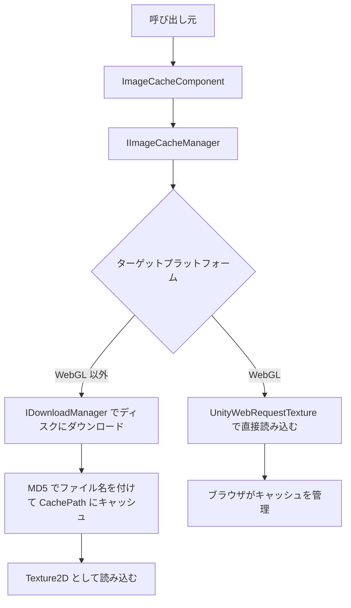

# 概要

GameFrameX.ImageCache は GameFrameX フレームワークの画像キャッシュコンポーネントです。リモート画像をダウンロードしてローカルに保存し、URL の MD5 でファイル名を付けてディスクに書き出します。2 回目以降の読み込み時はディスクから直接 `Texture2D` として読み込むことで、再ダウンロードを回避し UI の画像表示時間を短縮します。

## クイックスタート

1. Unity プロジェクトの `Packages/manifest.json` に GameFrameX のレジストリを追加します：

```json
{
  "scopedRegistries": [
    {
      "name": "GameFrameX",
      "url": "https://gameframex.upm.alianblank.uk",
      "scopes": [
        "com.gameframex"
      ]
    }
  ]
}
```

2. `dependencies` に依存関係を追加します：

```json
{
  "dependencies": {
    "com.gameframex.unity.imagecache": "0.0.1"
  }
}
```

3. シーンに `ImageCacheComponent` を追加し（メニュー `GameFrameX/Image Cache`）、Inspector で必要に応じて `CachePath`、`MaxDiskSize`、`ExpireDays` を調整します。コンポーネントは `Awake` 時に設定を `IImageCacheManager` に同期し、デフォルトのキャッシュパスは `Application path + "/cache/images/"` です。

4. インターフェースを呼び出してリモート画像を読み込みます：

```csharp
// 画像キャッシュコンポーネントを取得
var imageCache = GameEntry.GetComponent<ImageCacheComponent>();

// リモート画像を非同期で読み込む
Texture2D texture = await imageCache.LoadImageAsync("https://example.com/image.png");

// 画像がキャッシュされているか確認
bool cached = imageCache.IsCached("https://example.com/image.png");

// 指定したキャッシュを削除
imageCache.RemoveCache("https://example.com/image.png");

// すべてのキャッシュをクリア
imageCache.ClearCache();
```

出典:[ImageCacheComponent.cs](https://github.com/GameFrameX/com.gameframex.unity.imagecache/blob/main/Runtime/ImageCache/ImageCacheComponent.cs#L73-L76)、[README.zh-CN.md](https://github.com/GameFrameX/com.gameframex.unity.imagecache/blob/main/README.zh-CN.md#L78-L93)

## 仕組みの概要



- **WebGL 以外のプラットフォーム**：`IDownloadManager` を通じて画像をディスクにダウンロードし、ファイルは URL の MD5 で命名されます。読み込み時はまずキャッシュを確認し、なければダウンロードします。
- **WebGL プラットフォーム**：`UnityWebRequestTexture` で画像を直接読み込みます。キャッシュは完全にブラウザが管理するため、ローカルの `IsCached` / `RemoveCache` / `ClearCache` インターフェースは機能しません。

出典:[ImageCacheManager.cs](https://github.com/GameFrameX/com.gameframex.unity.imagecache/blob/main/Runtime/ImageCache/ImageCacheManager.cs)、[IImageCacheManager.cs](https://github.com/GameFrameX/com.gameframex.unity.imagecache/blob/main/Runtime/ImageCache/IImageCacheManager.cs#L26-L47)

## 次に

- キャッシュパラメータとデフォルト値：《reference/config》を参照
- Inspector でのパラメータ調整：《tasks/configure-cache》を参照
- 画像読み込み失敗のトラブルシューティング：《troubleshooting/load-failed》を参照
- プラットフォーム差異と WebGL の動作：《reference/platform-support》を参照