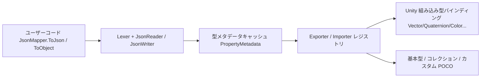

# 概要

GameFrameX.LitJSON は Unity 向けの JSON シリアライズライブラリです。[LitJSON](https://github.com/LitJSON/litjson) をベースに再ラッピングして GameFrameX エコシステムに統合しており、Unity 組み込み型、`float`、属性によるフィールド制御、IL2CPP コードストリッピング保護へのネイティブサポートを提供します。名前空間は `GameFrameX.LitJSON.Runtime` です。

## クイックスタート

### 1. インストール

Unity プロジェクトの `Packages/manifest.json` に、scoped registry 経由でパッケージを追加します:

```json
{
  "scopedRegistries": [
    {
      "name": "GameFrameX",
      "url": "https://gameframex.upm.alianblank.uk",
      "scopes": ["com.gameframex"]
    }
  ],
  "dependencies": {
    "com.gameframex.unity.litjson": "1.1.3"
  }
}
```

その他のインストール方法(Git URL、手動クローン)については [README.md](https://github.com/GameFrameX/com.gameframex.unity.litjson/blob/main/README.md#L60-L96) を参照してください。

### 2. シリアライズとデシリアライズ

```csharp
using GameFrameX.LitJSON.Runtime;

class PlayerData
{
    public int Id { get; set; }
    public string Name { get; set; }
    public float Hp { get; set; }
}

// シリアライズ(デフォルトでは整形された JSON を出力)
var player = new PlayerData { Id = 42, Name = "Blank", Hp = 100.5f };
string json = JsonMapper.ToJson(player);
// {"Id":42,"Name":"Blank","Hp":100.5}(false を渡すとコンパクトな出力になります)

// デシリアライズ
PlayerData restored = JsonMapper.ToObject<PlayerData>(json);
```

出典: [README.md](https://github.com/GameFrameX/com.gameframex.unity.litjson/blob/main/README.md#L100-L128)

### 3. フィールド出力の制御

`[JsonIgnore]` でメンバーをスキップし、`[JsonProperty("name")]` で JSON のキー名をカスタマイズします:

```csharp
class Account
{
    [JsonProperty("user_name")]
    public string UserName { get; set; }

    [JsonIgnore]
    public string Password { get; set; }
}
```

出典: [README.md](https://github.com/GameFrameX/com.gameframex.unity.litjson/blob/main/README.md#L131-L143)

## 仕組みの概要



エントリポイントとなる [JsonMapper](https://github.com/GameFrameX/com.gameframex.unity.litjson/blob/main/Runtime/JsonMapper.cs) は、リーダー/ライターのディスパッチ、型キャッシュ、カスタムコンバーターのレジストリを統括します。リフレクションで読み取ったプロパティ/フィールドは [PropertyMetadata](https://github.com/GameFrameX/com.gameframex.unity.litjson/blob/main/Runtime/JsonMapper.cs#L31-L56) によってキャッシュされます。Unity 組み込み値型の変換は [UnityTypeBindings.cs](https://github.com/GameFrameX/com.gameframex.unity.litjson/blob/main/Runtime/UnityTypeBindings.cs) に一元登録されており、IL2CPP ストリッピング保護は [link.xml](https://github.com/GameFrameX/com.gameframex.unity.litjson/blob/main/link.xml) と、実行時リフレクションによってトリガーされる [LitJsonCroppingHelper](https://github.com/GameFrameX/com.gameframex.unity.litjson/blob/main/Runtime/LitJsonCroppingHelper.cs) が連携して担います。

## 次のステップ

- Unity 型(`Vector3`、`Color` など)を JSON に書き出す方法は、『Unity 組み込み型のシリアライズ方法』を参照
- フィールドをスキップまたはリネームしたい場合は、『フィールド出力を制御する方法』を参照
- ビルド後にデシリアライズで `MissingMethodException` が発生する場合は、『IL2CPP ストリッピングによるデシリアライズ失敗への対処方法』を参照
- 完全な API クイックリファレンスは『API リファレンス』を参照
- アップグレード時の注意事項は [CHANGELOG.md](https://github.com/GameFrameX/com.gameframex.unity.litjson/blob/main/CHANGELOG.md) を参照