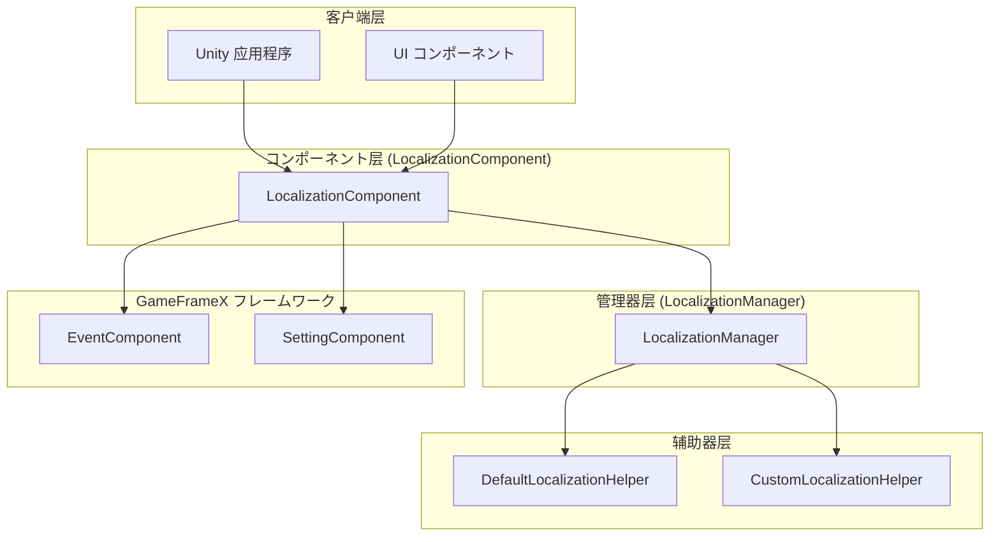
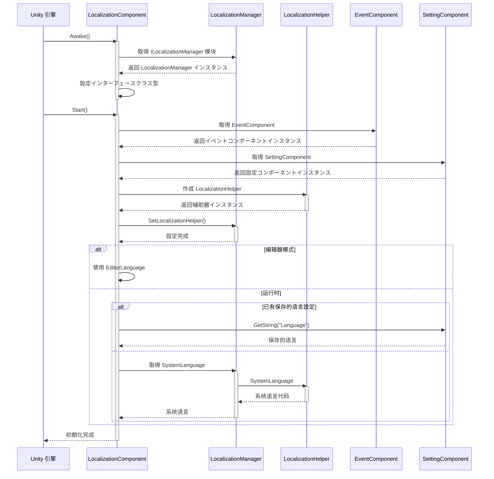
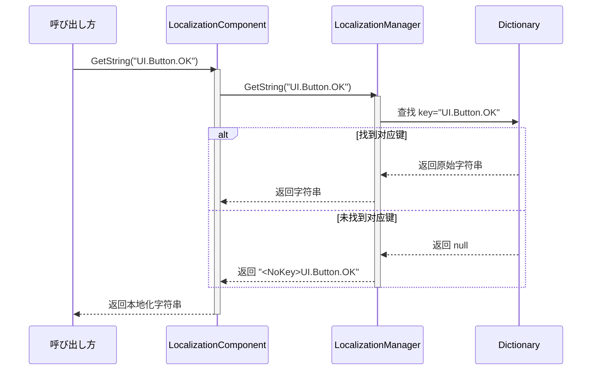
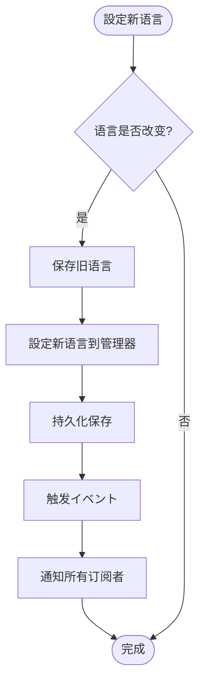
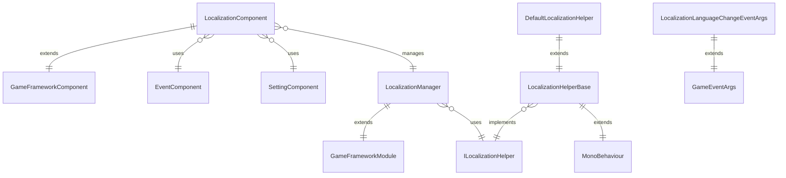

# 概要

GameFrameX Localization 是 GameFrameX ゲームフレームワーク的コアコンポーネント之一，提供完整的 Unity 本地化解決策。该コンポーネントサポート多语言动态切换、字符串格式化、系统语言检测以及完整的字典管理機能，使開発者能够轻松実装ゲーム的国际化需求。

## 概要

GameFrameX Localization コンポーネント是 Unity ゲームフレームワーク中专门负责处理多语言本地化的模块。它采用コンポーネント-管理器-辅助器三层アーキテクチャ設計，を通じてインターフェース分离和依赖注入等设计模式，提供します一个灵活、可扩展的本地化解決策。

本コンポーネント的主要职责包括：管理多语言字典数据、提供本地化字符串取得インターフェース、处理运行时语言切换、检测系统语言环境，以及を通じてイベント系统通知语言变化。開発者可能を通じて简单的 API 呼び出し実装复杂的国际化機能，无需关心底层実装细节。

该コンポーネント是 GameFrameX フレームワーク的コア模块之一，与 Event（イベント系统）、Setting（設定管理）、Asset（リソース管理）等模块紧密协作，共同构建完整的ゲーム开发基础设施。

## 系统架构

GameFrameX Localization 采用清晰的三层アーキテクチャ設計，各层职责明确，层与层之间を通じてインターフェース进行通信，実装了高内聚、低耦合的设计目标。



### コアコンポーネント説明

**LocalizationComponent** 是 Unity 层面的コンポーネント，を継承 GameFrameworkComponent，作为对外提供服务的エントリーポイント点。它実装了 Awake 和 Start 生命周期メソッド，在初期化时作成本地化辅助器并注册到管理器中。コンポーネント提供します丰富的 GetString 重载メソッド，サポート 0 到 16 个参数的字符串格式化需求。

**LocalizationManager** 是コア的业务逻辑管理器，を継承 GameFrameworkModule 并実装 ILocalizationManager インターフェース。它维护一个 Dictionary<string, string> クラス型的字典数据结构，负责字符串的存储、查询和格式化操作。管理器不直接与 Unity 交互，而是を通じて ILocalizationHelper インターフェース取得系统语言信息。

**ILocalizationHelper** インターフェース定义了本地化辅助器的规范，目前只包含一个 SystemLanguage プロパティ，に使用取得当前系统的语言代码。这种设计允许開発者を通じて実装自定义的辅助器来控制语言检测逻辑，例如从服务器取得语言設定或に基づいて用户配置决定初始语言。

**LocalizationHelperBase** 是辅助器的抽象基底クラス，を継承 MonoBehaviour 并実装 ILocalizationHelper インターフェース。这使得辅助器可能挂载到 Unity ゲーム对象上，便于在编辑器中配置和管理。

**DefaultLocalizationHelper** 是默认的辅助器実装，を通じて .NET 的 CultureInfo.CurrentCulture.Name 取得系统语言，并将连字符替换为下划线以符合 RFC 5646 标准（如 zh-CN 转换为 zh_CN）。

## コアフロー

本地化コンポーネント的初期化和字符串取得フロー体现了フレームワーク的コア设计理念。以下フロー图展示了从コンポーネント启动到取得本地化字符串的完整过程。



### 字符串取得フロー

当应用程序必要取得本地化字符串时，会呼び出し LocalizationComponent 的 GetString メソッド。该メソッド将お願いします求转发给 LocalizationManager，后者从字典中查找对应的字符串，并に基づいて必要执行格式化操作。



### 语言切换フロー

语言切换是本地化系统的コア機能之一。当应用程序必要更改当前语言时，必要を通じて LocalizationComponent 的 Language プロパティ进行設定。



语言切换时会触发 LocalizationLanguageChangeEventArgs イベント，应用程序可能を通じて订阅此イベント来响应语言变化，例如刷新 UI 显示或更新ゲーム内容。

## 依赖关系

GameFrameX Localization コンポーネント依赖 GameFrameX フレームワーク的其他コア模块，这些依赖关系确保了本地化機能能够正常运行并与其他系统协调工作。



### 依赖模块説明

| 依赖模块 | 説明 | 用途 |
|---------|------|------|
| GameFrameX.Runtime | コア运行时模块 | 提供基础フレームワーク機能，包括模块系统、オブジェクトプール、日志等 |
| GameFrameX.Event.Runtime | イベント系统模块 | 実装语言切换イベント的发布和订阅机制 |
| GameFrameX.Setting.Runtime | 設定管理模块 | 持久化保存用户的语言設定 |

## 主要特性

GameFrameX Localization 提供します丰富的機能特性，满足各种ゲーム开发中的本地化需求。

**多语言サポート**：コンポーネント不限制语言数量，開発者可能添加任意数量的语言变体。每种语言を通じて唯一的语言代码标识，如 zh_CN（简体中文）、en_US（美式英语）、ja_JP（日语）等。

**动态语言切换**：サポート在ゲーム运行时无缝切换语言，切换过程会自动触发イベント通知，应用程序可能实时响应语言变化，无需重启应用。

**参数化字符串**：提供强大的字符串格式化機能，サポート最多 16 个格式化参数。開発者可能在字典中定义包含占位符的模板字符串，如 "玩家等级：{0}，经验值：{1}"，运行时动态替换参数值。

**系统语言检测**：默认情况下コンポーネント会自动检测操作系统语言并采用相应语言，可能を通じて自定义辅助器実装自定义的语言检测逻辑。

**字典管理**：提供完整的字典 CRUD 操作，包括检查键是否存在、取得原始值、添加新字典项、移除字典项、清空所有字典等機能。

**编辑器サポート**：提供编辑器模式，可能在 Unity 编辑器中预览不同语言的显示效果，方便开发和调试。

## 快速使用

在 Unity プロジェクト中使用 GameFrameX Localization 非常简单。以下是基本的使用フロー。

首先，必要在シーン中的 GameFrameX 管理器上添加 LocalizationComponent コンポーネント。コンポーネント会自动初期化并加载本地化機能。

```csharp
// 取得本地化コンポーネント
var localization = GameEntry.GetComponent<LocalizationComponent>();

// 設定语言
localization.Language = "zh_CN"; // 简体中文
localization.Language = "en_US"; // 英文

// 取得本地化字符串
string text = localization.GetString("UI.Button.OK");

// 带参数的本地化字符串
string message = localization.GetString("UI.Message.Welcome", playerName);
string info = localization.GetString("UI.Info.Score", score, level);
```
> Source: [LocalizationComponent.cs](https://github.com/GameFrameX/com.gameframex.unity.localization/blob/main/Runtime/Localization/LocalizationComponent.cs#L246-L262)

### 字典管理

应用程序可能在运行时动态管理字典数据，実装ホットアップデート语言リソース的機能。

```csharp
// 检查字典是否存在
bool exists = localization.HasRawString("UI.Button.Cancel");

// 取得原始字符串
string rawText = localization.GetRawString("UI.Button.Cancel");

// 添加字典项
localization.AddRawString("UI.Button.NewButton", "新按钮");

// 移除字典项
bool removed = localization.RemoveRawString("UI.Button.Cancel");

// 清空所有字典
localization.RemoveAllRawStrings();
```
> Source: [LocalizationComponent.cs](https://github.com/GameFrameX/com.gameframex.unity.localization/blob/main/Runtime/Localization/LocalizationComponent.cs#L717-L758)

### イベント监听

を通じて订阅语言变化イベント，应用程序可能在语言切换时执行自定义逻辑，如刷新 UI 显示。

```csharp
// 订阅语言变化イベント
GameEntry.GetComponent<EventComponent>().Subscribe(
    LocalizationLanguageChangeEventArgs.EventId, 
    OnLanguageChanged);

private void OnLanguageChanged(object sender, GameEventArgs e)
{
    var args = (LocalizationLanguageChangeEventArgs)e;
    Debug.Log($"语言从 {args.OldLanguage} 切换到 {args.Language}");
    
    // 更新UI显示
    RefreshUI();
}
```
> Source: [LocalizationLanguageChangeEventArgs.cs](https://github.com/GameFrameX/com.gameframex.unity.localization/blob/main/Runtime/EventArgs/LocalizationLanguageChangeEventArgs.cs#L52-L58)

## 语言代码规范

GameFrameX Localization 遵循 RFC 5646 语言标签标准，使用下划线分隔的语言代码格式。以下是常用的语言代码示例：

| 语言代码 | 説明 |
|---------|------|
| zh_CN | 简体中文（中国） |
| zh_TW | 繁体中文（台湾） |
| en_US | 美式英语（美国） |
| en_GB | 英式英语（英国） |
| ja_JP | 日语（日本） |
| ko_KR | 韩语（韩国） |
| fr_FR | 法语（法国） |
| de_DE | 德语（德国） |
| es_ES | 西班牙语（西班牙） |
| ru_RU | 俄语（俄罗斯） |

開発者在定义语言代码时应注意：语言代码区分大小写，建议使用标准的命名规范；每个语言代码由语言和可选的地区两部分组成，使用下划线分隔而非连字符。

## 関連リンク

- [安装指南](./2-installation)
- [快速开始](./3-getting-started)
- [コア機能 - 取得本地化字符串](./4-core-features.get-string)
- [コア機能 - 字典管理](./4-core-features.dictionary-management)
- [コア機能 - 语言切换与イベント](./4-core-features.language-switching)
- [API 参考](./5-api-reference)
- [配置](./6-configuration)
- [最佳实践](./7-best-practices)
- [GitHub 仓库](https://github.com/GameFrameX/com.gameframex.unity.localization.git)
- [官方文档](https://gameframex.doc.alianblank.com/)
