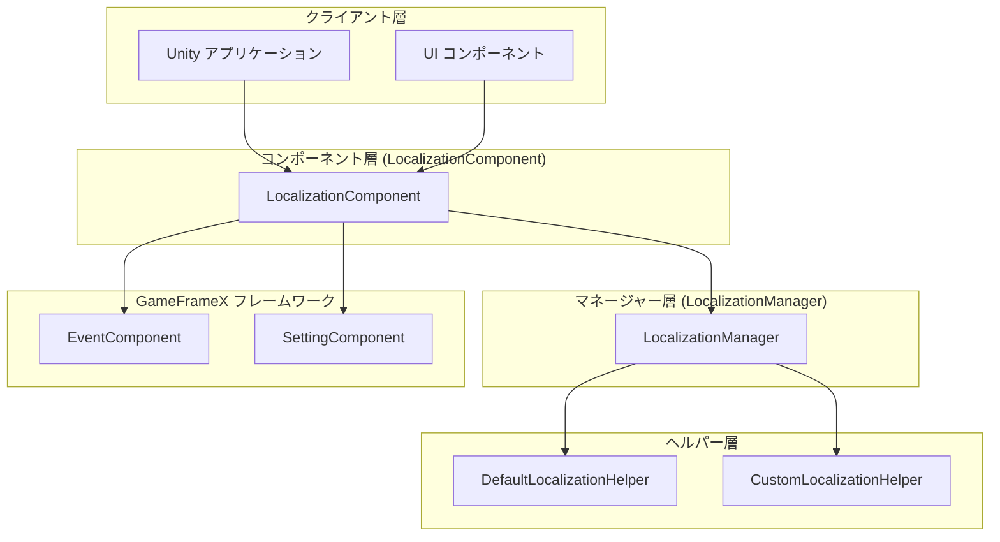
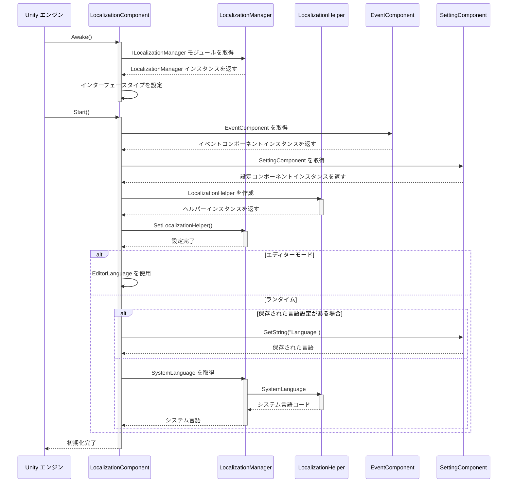
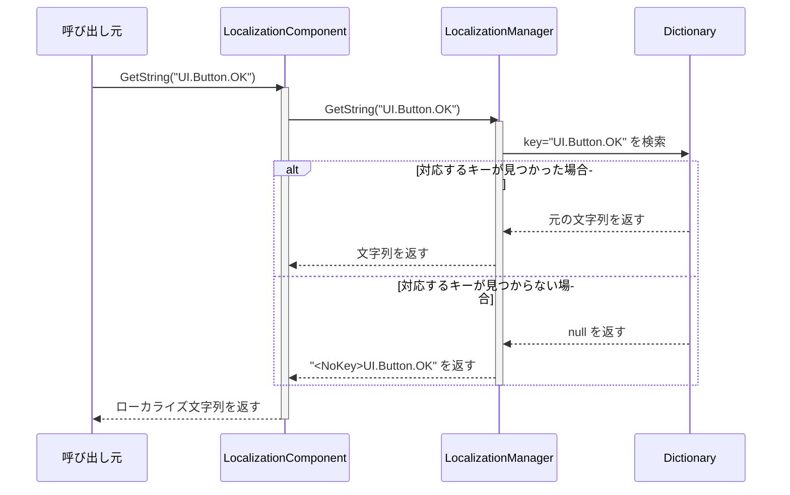
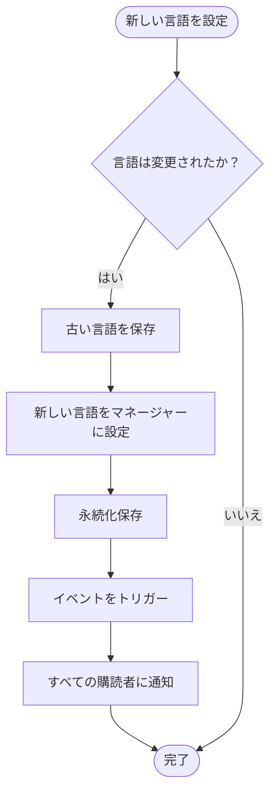
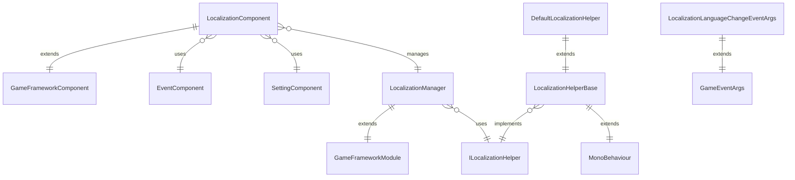

# 概要

GameFrameX Localization は、GameFrameX ゲームフレームワークのコアコンポーネント之一であり、Unity ローカライゼーションの完全なソリューションを提供します。このコンポーネントは多言語の動的切り替え、文字列フォーマット、システム言語検出、完全な辞書管理機能に対応しており、開発者がゲームの国際化要件を簡単に実装できます。

## 概要

GameFrameX Localization コンポーネントは、Unity ゲームフレームワークにおいて多言語ローカライゼーションを担当するモジュールです。コンポーネント-マネージャー-ヘルパーという三層アーキテクチャ設計を採用し、インターフェース分離と依存性注入などのデザインパターンを通じて、柔軟で拡張可能なローカライゼーションソリューションを提供します。

このコンポーネントの主な責務は次のとおりです：多言語辞書データの管理、ローカライズ文字列取得インターフェースの提供、ランタイム時の言語切り替え処理、システム言語環境の検出、イベントシステムを通じた言語変化的通知。開発者はシンプルな API 呼び出しを通じて複雑な国際化機能を実装でき、底层実装の詳細を心配する必要はありません。

このコンポーネントは GameFrameX フレームワークのコアモジュールの一つであり、Event（イベントシステム）、Setting（設定管理）、Asset（リソース管理）などのモジュールと緊密に連携し、完全なゲーム開発インフラを構築します。

## システムアーキテクチャ

GameFrameX Localization は明確な三層アーキテクチャ設計を採用し、各層の責務は明確で、層間ではインターフェースを通じて通信し、高凝集・低結合という設計目標を達成しています。



### コアコンポーネントの説明

**LocalizationComponent** は Unity 層のコンポーネントであり、GameFrameworkComponent を継承し、外部にサービスを提供するエントリーポイントとして機能します。Awake と Start ライフサイクルメソッドを実装し、初期化時にローカライゼーションヘルパーを作成してマネージャーに登録します。コンポーネントは豊富な GetString オーバーロードメソッドを提供し、0 から 16 個の引数による文字列フォーマットのニーズに対応します。

**LocalizationManager** はコアのビジネスロジックマネージャーであり、GameFrameworkModule を継承し、ILocalizationManager インターフェースを実装します。Dictionary<string, string> 型の辞書データ構造を管理し、文字列の保存、検索、フォーマット操作を担当します。マネージャーは Unity と直接対話せず、ILocalizationHelper インターフェースを通じてシステム言語情報を取得します。

**ILocalizationHelper** インターフェースはローカライゼーションヘルパーの仕様を定義し、現在は SystemLanguage プロパティのみを含み、現在のシステム言語コードを取得するために使用されます。この設計により、開発者はカスタムヘルパーを実装することで言語検出ロジックを制御できます，例如はサーバーから言語設定を取得したり、ユーザー設定に基づいて初期言語を決定したりできます。

**LocalizationHelperBase** はヘルパーの抽象基底クラスであり、MonoBehaviour を継承し、ILocalizationHelper インターフェースを実装します。これにより、ヘルパーを Unity ゲームオブジェクトにアタッチでき、エディターでの設定和管理が容易になります。

**DefaultLocalizationHelper** はデフォルトのヘルパー実装であり、.NET の CultureInfo.CurrentCulture.Name を使用してシステム言語を取得し、ハイフンをアンダースコアに置き換えて RFC 5646 標準に準拠します（例：zh-CN を zh_CN に変換）。

## コアフロー

ローカライゼーションコンポーネントの初期化と文字列取得フローは、フレームワークのコア設計理念を反映しています。以下のフローチャートは、コンポーネントの起動からローカライズ文字列の取得までの完全な過程を示しています。



### 文字列取得フロー

アプリケーションがローカライズ文字列を取得する必要がある場合、LocalizationComponent の GetString メソッドを呼び出します。このメソッドはリクエストを LocalizationManager に転送し、後者は辞書で対応する文字列を検索し、必要に応じてフォーマット操作を実行します。



### 言語切り替えフロー

言語切り替えはローカライゼーションシステムのコア機能の一つです。アプリケーションが現在の言語を変更する必要がある場合、LocalizationComponent の Language プロパティを設定する必要があります。



言語切り替え时会触发 LocalizationLanguageChangeEventArgs イベント、アプリケーションは此のイベントを購読して言語変化に応答できます，例如は UI 表示を更新したり、ゲーム内容を更新したりできます。

## 依存関係

GameFrameX Localization コンポーネントは、GameFrameX フレームワークの他のコアモジュールに依存しており、これらの依存関係によりローカライゼーション機能が正常に実行され、他のシステムと連携して動作することが保証されます。



### 依存モジュール説明

| 依存モジュール | 説明 | 用途 |
|---------|------|------|
| GameFrameX.Runtime | コアランタイムモジュール | モジュールシステム、オブジェクトプール、ログなど、基本フレームワーク機能を提供します |
| GameFrameX.Event.Runtime | イベント系統モジュール | 言語切り替えイベントの公開と購読メカニズムを実装します |
| GameFrameX.Setting.Runtime | 設定管理モジュール | ユーザーの言語設定の永続化保存を行います |

## 主要機能

GameFrameX Localization は、ゲーム開発におけるローカライゼーションのニーズに対応する、丰富的な機能特性を提供します。

**多言語サポート**：コンポーネントは言語数を制限せず、開発者は任意数の言語バリアントを追加できます。各言語は zh_CN（簡体字中国語）、en_US（アメリカ英語）、ja_JP（日本語）などのように、一意の言語コードで識別されます。

**動的言語切り替え**：ゲームランタイム時にシームレスに言語を切り替えることをサポートし、切り替え过程は自動的にイベント通知をトリガーし、アプリケーションはアプリケーションを再起動せずに言語変化にリアルタイムで応答できます。

**パラメータ化文字列**：強力な文字列フォーマット機能を提供し、最大 16 個のフォーマット引数をサポートしています。開発者は辞書で "プレイヤーレベル：{0}、経験値：{1}" のようなプレースホルダーを含むテンプレート文字列を定義でき、ランタイム時に動的に引数値を置き換えます。

**システム言語検出**：デフォルトではコンポーネントはオペレーティングシステムの言語を自動的に検出し、対応する言語を採用します。カスタムヘルパーを通じてカスタム言語検出ロジックを実装できます。

**辞書管理**：完全な辞書 CRUD 操作を提供し、キーの存在確認、元値の取得、新規辞書エントリの追加、辞書エントリの削除、すべての辞書のクリアなどの機能が含まれます。

**エディターサポート**：エディターモードを提供し、Unity エディターで異なる言語の表示効果をプレビューできるため、開発とデバッグが容易になります。

## クイック使用

Unity プロジェクトで GameFrameX Localization を使用するのは非常に簡単です。以下は基本的な使用フローです。

まず、シーン内の GameFrameX マネージャーに LocalizationComponent コンポーネントを追加する必要があります。コンポーネントは自動的に初期化され、ローカライゼーション機能をロードします。

```csharp
// ローカライゼーションコンポーネントを取得
var localization = GameEntry.GetComponent<LocalizationComponent>();

// 言語を設定
localization.Language = "zh_CN"; // 簡体字中国語
localization.Language = "en_US"; // 英語

// ローカライズ文字列を取得
string text = localization.GetString("UI.Button.OK");

// 引数付きローカライズ文字列
string message = localization.GetString("UI.Message.Welcome", playerName);
string info = localization.GetString("UI.Info.Score", score, level);
```
> Source: [LocalizationComponent.cs](https://github.com/GameFrameX/com.gameframex.unity.localization/blob/main/Runtime/Localization/LocalizationComponent.cs#L246-L262)

### 辞書管理

アプリケーションはランタイム時に辞書データを動的に管理し、言語リソースのホットアップデート機能を実装できます。

```csharp
// 辞書の存在を確認
bool exists = localization.HasRawString("UI.Button.Cancel");

// 元の文字列を取得
string rawText = localization.GetRawString("UI.Button.Cancel");

// 辞書エントリを追加
localization.AddRawString("UI.Button.NewButton", "新しいボタン");

// 辞書エントリを削除
bool removed = localization.RemoveRawString("UI.Button.Cancel");

// すべての辞書をクリア
localization.RemoveAllRawStrings();
```
> Source: [LocalizationComponent.cs](https://github.com/GameFrameX/com.gameframex.unity.localization/blob/main/Runtime/Localization/LocalizationComponent.cs#L717-L758)

### イベント監視

言語変化イベントを購読することで、アプリケーションは言語切り替え時にカスタムロジックを実行できます，例如は UI 表示を更新したりできます。

```csharp
// 言語変化イベントを購読
GameEntry.GetComponent<EventComponent>().Subscribe(
    LocalizationLanguageChangeEventArgs.EventId,
    OnLanguageChanged);

private void OnLanguageChanged(object sender, GameEventArgs e)
{
    var args = (LocalizationLanguageChangeEventArgs)e;
    Debug.Log($"言語が {args.OldLanguage} から {args.Language} に切り替えられました");

    // UI 表示を更新
    RefreshUI();
}
```
> Source: [LocalizationLanguageChangeEventArgs.cs](https://github.com/GameFrameX/com.gameframex.unity.localization/blob/main/Runtime/EventArgs/LocalizationLanguageChangeEventArgs.cs#L52-L58)

## 言語コード仕様

GameFrameX Localization は RFC 5646 言語タグ標準に準拠し、アンダースコアで区切られた言語コード形式を使用します。以下は一般的な言語コードの例です：

| 言語コード | 説明 |
|---------|------|
| zh_CN | 簡体字中国語（中国） |
| zh_TW | 繁体字中国語（台湾） |
| en_US | アメリカ英語（アメリカ） |
| en_GB | イギリス英語（イギリス） |
| ja_JP | 日本語（日本） |
| ko_KR | 韓国語（韓国） |
| fr_FR | フランス語（フランス） |
| de_DE | ドイツ語（ドイツ） |
| es_ES | スペイン語（スペイン） |
| ru_RU | ロシア語（ロシア） |

開発者が言語コードを定義する際には 다음に注意する必要があります：言語コードは大小文字を区別するため、标准的な命名規則を使用することをお勧めします；各言語コードは言語とオプションの地域の两部分で構成され、ハイフンではなくアンダースコアで区切ります。

## 関連リンク

- [インストールガイド](./02.installation)
- [クイックスタート](./03.getting-started)
- [コア機能 - ローカライズ文字列の取得](./04.get-string)
- [コア機能 - 辞書管理](./05.dictionary-management)
- [コア機能 - 言語切り替えとイベント](./06.language-switching)
- [API リファレンス](./09.api-reference)
- [設定](./07.configuration)
- [ベストプラクティス](./08.best-practices)
- [GitHub リポジトリ](https://github.com/GameFrameX/com.gameframex.unity.localization.git)
- [公式サイト](https://gameframex.doc.alianblank.com/)
