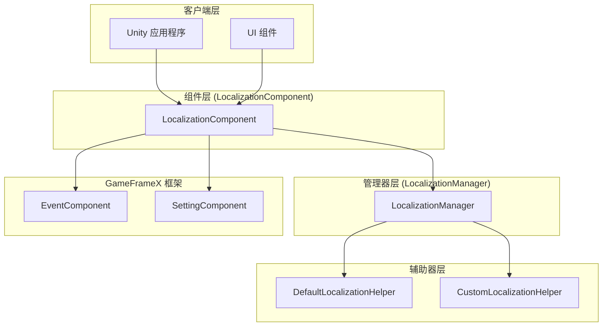
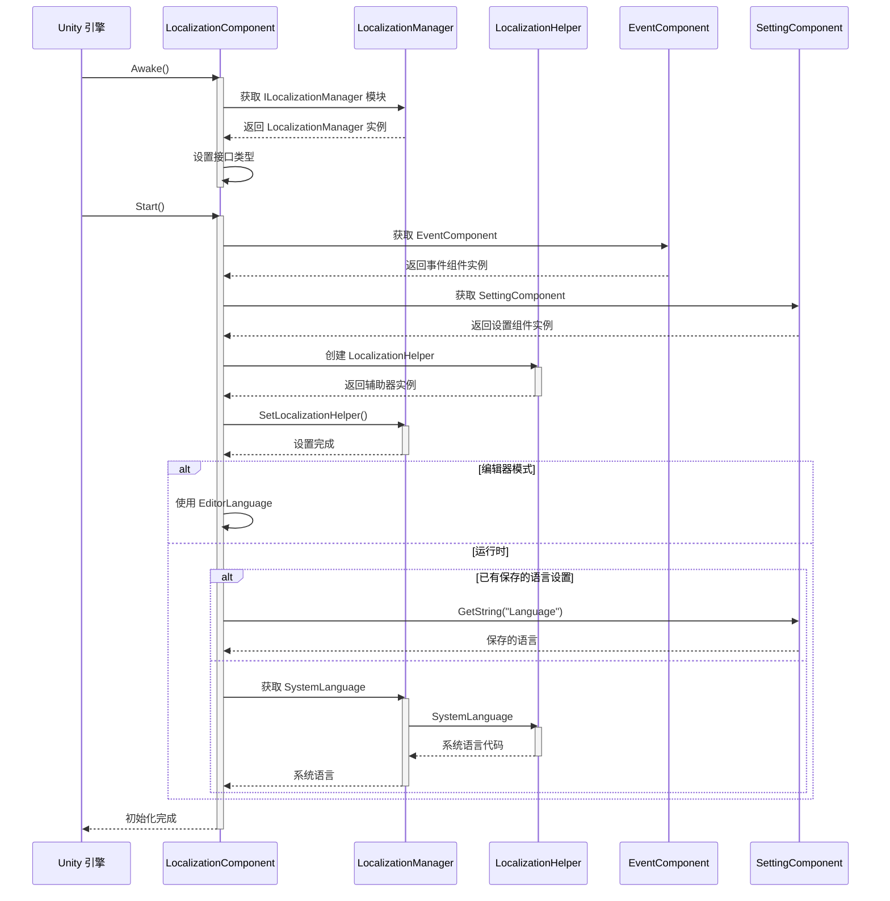
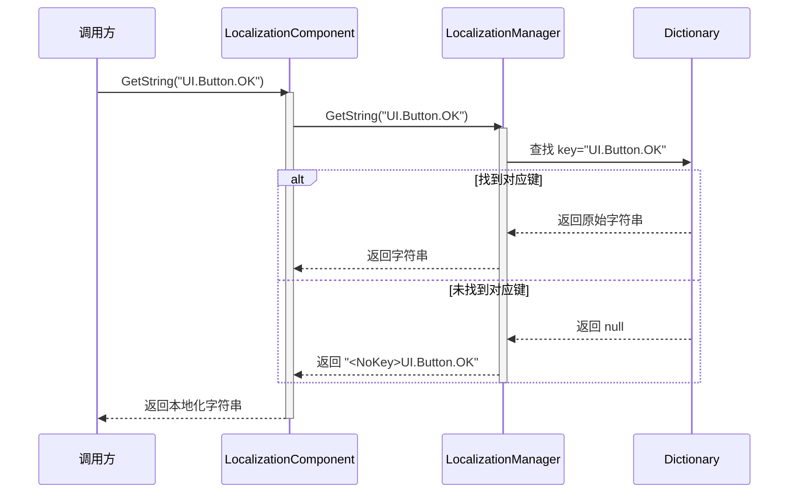
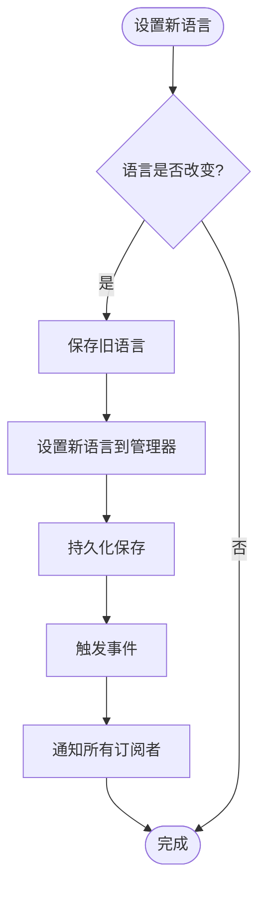
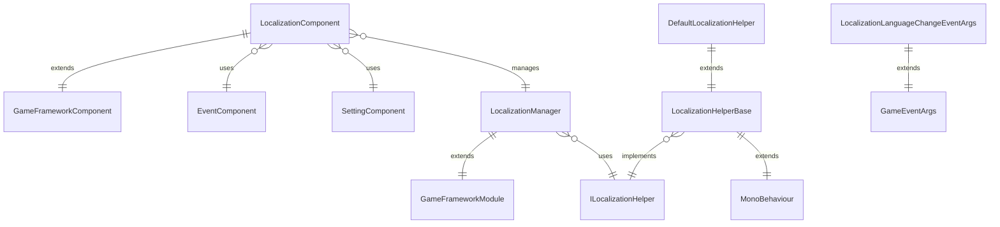

# 概要

GameFrameX Localization 是 GameFrameX 游戏フレームワーク的コアコンポーネント之一，提供完全な的 Unity 本地化解決策。该コンポーネントサポート多语言动态切换、字符串フォーマット化、系统语言检测および完全な的字典管理機能，使開発者能够轻松実装游戏的国际化需求。

## 概要

GameFrameX Localization コンポーネント是 Unity 游戏フレームワーク中专门负责処理多语言本地化的モジュール。它采用コンポーネント-マネージャー-辅助器三层アーキテクチャ設計，通过インターフェース分离和依存性注入等設計モード，提供します一个柔軟、可拡張的本地化解決策。

本コンポーネント的主な职责含みます：管理多语言字典数据、提供本地化字符串取得インターフェース、処理ランタイム语言切换、检测系统语言環境，および通过イベント系统通知语言变化。開発者〜できます通过シンプル的 API 呼び出し実装複雑的国际化機能，无需关心底层実装细节。

该コンポーネント是 GameFrameX フレームワーク的コアモジュール之一，与 Event（イベント系统）、Setting（設定管理）、Asset（リソース管理）等モジュール紧密协作，共同ビルド完全な的游戏开发基本设施。

## システムアーキテクチャ

GameFrameX Localization 采用清晰的三层アーキテクチャ設計，各层职责明确，层与层之间通过インターフェース进行通信，実装了高内聚、低耦合的設計目标。



### コアコンポーネント説明

**LocalizationComponent** 是 Unity 层面的コンポーネント，継承自 GameFrameworkComponent，作为对外提供服务的入口点。它実装了 Awake 和 Start ライフサイクルメソッド，在初期化时作成本地化辅助器并登録到マネージャー中。コンポーネント提供します丰富的 GetString オーバーロードメソッド，サポート 0 到 16 个パラメータ的字符串フォーマット化需求。

**LocalizationManager** 是コア的业务逻辑マネージャー，継承自 GameFrameworkModule 并実装 ILocalizationManager インターフェース。它维护一个 Dictionary<string, string> タイプ的字典数据结构，负责字符串的存储、查询和フォーマット化操作。マネージャー不直接与 Unity 交互，而是通过 ILocalizationHelper インターフェース取得系统语言情報。

**ILocalizationHelper** インターフェース定義了本地化辅助器的规范，目前只パッケージ含一个 SystemLanguage プロパティ，用于取得当前系统的语言コード。这种設計允许開発者通过実装自定義的辅助器来控制语言检测逻辑，例えば从服务器取得语言設定或根据ユーザー設定决定初始语言。

**LocalizationHelperBase** 是辅助器的抽象基底クラス，継承自 MonoBehaviour 并実装 ILocalizationHelper インターフェース。这使得辅助器〜できます挂载到 Unity 游戏对象上，便于在エディタ中設定和管理。

**DefaultLocalizationHelper** 是デフォルト的辅助器実装，通过 .NET 的 CultureInfo.CurrentCulture.Name 取得系统语言，并将连字符置換为下划线以符合 RFC 5646 標準（如 zh-CN 转换为 zh_CN）。

## コアフロー

本地化コンポーネント的初期化和字符串取得フロー体现了フレームワーク的コア設計理念。以下フロー图表示了从コンポーネント启动到取得本地化字符串的完全な过程。



### 字符串取得フロー

当应用程序〜する必要があります取得本地化字符串时，会呼び出し LocalizationComponent 的 GetString メソッド。该メソッド将请求转发给 LocalizationManager，后者从字典中查找对应的字符串，并根据〜する必要があります执行フォーマット化操作。



### 语言切换フロー

语言切换是本地化系统的コア機能之一。当应用程序〜する必要があります更改当前语言时，〜する必要があります通过 LocalizationComponent 的 Language プロパティ进行設定。



语言切换时会トリガー LocalizationLanguageChangeEventArgs イベント，应用程序〜できます通过購読此イベント来响应语言变化，例えば刷新 UI 显示或アップデート游戏内容。

## 依赖关系

GameFrameX Localization コンポーネント依赖 GameFrameX フレームワーク的其他コアモジュール，这些依赖关系確認してください了本地化機能能够正常运行并与其他系统协调工作。



### 依赖モジュール説明

| 依赖モジュール | 説明 | 用途 |
|---------|------|------|
| GameFrameX.Runtime | コアランタイムモジュール | 提供基本フレームワーク機能，含みますモジュール系统、对象池、ログ等 |
| GameFrameX.Event.Runtime | イベント系统モジュール | 実装语言切换イベント的リリース和購読机制 |
| GameFrameX.Setting.Runtime | 設定管理モジュール | 持久化保存ユーザー的语言設定 |

## 主な特性

GameFrameX Localization 提供します丰富的機能特性，满足各种游戏开发中的本地化需求。

**多语言サポート**：コンポーネント不限制语言数量，開発者〜できます追加任意数量的语言变体。每种语言通过唯一的语言コード标识，如 zh_CN（简体中文）、en_US（美式英语）、ja_JP（日语）等。

**动态语言切换**：サポート在游戏ランタイム无缝切换语言，切换过程会自动トリガーイベント通知，应用程序〜できます实时响应语言变化，无需重启应用。

**パラメータ化字符串**：提供強力的字符串フォーマット化機能，サポート最多 16 个フォーマット化パラメータ。開発者〜できます在字典中定義パッケージ含占位符的模板字符串，如 "プレイヤー等级：{0}，经验值：{1}"，ランタイム动态置換パラメータ值。

**系统语言检测**：デフォルト情况下コンポーネント会自动检测操作系统语言并采用相应语言，〜できます通过自定義辅助器実装自定義的语言检测逻辑。

**字典管理**：提供完全な的字典 CRUD 操作，含みます確認键是否存在、取得原始值、追加新字典项、移除字典项、清空所有字典等機能。

**エディタサポート**：提供エディタモード，〜できます在 Unity エディタ中预览不同语言的显示效果，方便开发和デバッグ。

## 快速使用

在 Unity プロジェクト中使用 GameFrameX Localization 非常シンプル。以下是基本的使用フロー。

まず，〜する必要があります在シーン中的 GameFrameX マネージャー上追加 LocalizationComponent コンポーネント。コンポーネント会自动初期化并ロード本地化機能。

```csharp
// 获取本地化组件
var localization = GameEntry.GetComponent<LocalizationComponent>();

// 设置语言
localization.Language = "zh_CN"; // 简体中文
localization.Language = "en_US"; // 英文

// 获取本地化字符串
string text = localization.GetString("UI.Button.OK");

// 带参数的本地化字符串
string message = localization.GetString("UI.Message.Welcome", playerName);
string info = localization.GetString("UI.Info.Score", score, level);
```
> Source: [LocalizationComponent.cs](https://github.com/GameFrameX/com.gameframex.unity.localization/blob/main/Runtime/Localization/LocalizationComponent.cs#L246-L262)

### 字典管理

应用程序〜できます在ランタイム动态管理字典数据，実装ホットアップデート语言リソース的機能。

```csharp
// 检查字典是否存在
bool exists = localization.HasRawString("UI.Button.Cancel");

// 获取原始字符串
string rawText = localization.GetRawString("UI.Button.Cancel");

// 添加字典项
localization.AddRawString("UI.Button.NewButton", "新按钮");

// 移除字典项
bool removed = localization.RemoveRawString("UI.Button.Cancel");

// 清空所有字典
localization.RemoveAllRawStrings();
```
> Source: [LocalizationComponent.cs](https://github.com/GameFrameX/com.gameframex.unity.localization/blob/main/Runtime/Localization/LocalizationComponent.cs#L717-L758)

### イベント监听

通过購読语言变化イベント，应用程序〜できます在语言切换时执行自定義逻辑，如刷新 UI 显示。

```csharp
// 订阅语言变化事件
GameEntry.GetComponent<EventComponent>().Subscribe(
    LocalizationLanguageChangeEventArgs.EventId, 
    OnLanguageChanged);

private void OnLanguageChanged(object sender, GameEventArgs e)
{
    var args = (LocalizationLanguageChangeEventArgs)e;
    Debug.Log($"语言从 {args.OldLanguage} 切换到 {args.Language}");
    
    // 更新UI显示
    RefreshUI();
}
```
> Source: [LocalizationLanguageChangeEventArgs.cs](https://github.com/GameFrameX/com.gameframex.unity.localization/blob/main/Runtime/EventArgs/LocalizationLanguageChangeEventArgs.cs#L52-L58)

## 语言コード规范

GameFrameX Localization 遵循 RFC 5646 语言标签標準，使用下划线分隔的语言コードフォーマット。以下是常用的语言コード例：

| 语言コード | 説明 |
|---------|------|
| zh_CN | 简体中文（中国） |
| zh_TW | 繁体中文（台湾） |
| en_US | 美式英语（美国） |
| en_GB | 英式英语（英国） |
| ja_JP | 日语（日本） |
| ko_KR | 韩语（韩国） |
| fr_FR | 法语（法国） |
| de_DE | 德语（德国） |
| es_ES | 西班牙语（西班牙） |
| ru_RU | 俄语（俄罗斯） |

開発者在定義语言コード时应注意：语言コード区分大小写，お勧め使用標準的命名规范；每个语言コード由语言和可选的地区两部分组成，使用下划线分隔而非连字符。

## 関連リンク

- [インストールガイド](./2-installation)
- [快速开始](./3-getting-started)
- [コア機能 - 取得本地化字符串](./4-core-features.get-string)
- [コア機能 - 字典管理](./4-core-features.dictionary-management)
- [コア機能 - 语言切换与イベント](./4-core-features.language-switching)
- [API リファレンス](./5-api-reference)
- [設定](./6-configuration)
- [最佳实践](./7-best-practices)
- [GitHub リポジトリ](https://github.com/GameFrameX/com.gameframex.unity.localization.git)
- [官方ドキュメント](https://gameframex.doc.alianblank.com/)
