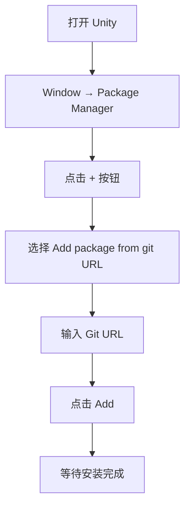
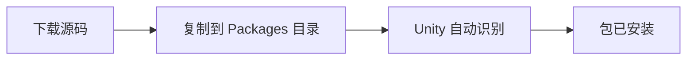
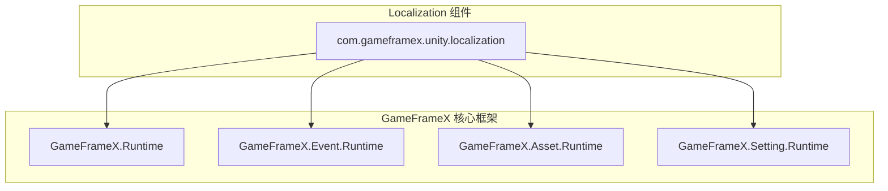

# インストール

このドキュメント介绍如何将 GameFrameX Localization 本地化コンポーネントインストール到您的 Unity プロジェクト中。

## 概要

GameFrameX Localization 是 GameFrameX 游戏フレームワーク的本地化機能コンポーネント，提供完全な的多语言本地化解決策。该コンポーネントサポート动态语言切换、字符串フォーマット化、系统语言检测等機能，可帮助開発者快速実装游戏的国际化。

**バージョン要求：**
- Unity 2019.4 或更高バージョン

**パッケージ情報：**
- パッケージ名：`com.gameframex.unity.localization`
- 显示名称：GameFrameX Localization
- 当前バージョン：2.2.1

## インストールメソッド

### 方法一：通过 Unity Package Manager インストール（推奨）

这是最推奨的インストール方法，〜できます方便地取得最新バージョン并管理依赖。

**操作ステップ：**

1. 打开 Unity エディタ
2. 进入メニュー **Window → Package Manager**
3. 点击左上角的 **+** ボタン
4. 选择 **Add package from git URL...**
5. 在输入框中输入以下 Git URL：

```
https://github.com/GameFrameX/com.gameframex.unity.localization.git
```

6. 点击 **Add** ボタン等待インストール完成



### 方法二：通过 manifest.json インストール

直接编辑プロジェクト的 `Packages/manifest.json` ファイル来追加依赖。

**操作ステップ：**

1. 找到プロジェクト根ディレクトリ下的 `Packages` ファイル夹
2. 使用文本エディタ打开 `manifest.json` ファイル
3. 在 `dependencies` 节点中追加以下内容：

```json
{
  "dependencies": {
    "com.gameframex.unity.localization": "https://github.com/GameFrameX/com.gameframex.unity.localization.git"
  }
}
```

4. 保存ファイル并返す Unity
5. Unity 会自动解析并インストール依赖パッケージ

> 注意：此方法在每次打开プロジェクト时都会尝试从 Git 拉取最新バージョン。如需锁定バージョン，请使用下面的フォーマット指定バージョン号：
> ```json
> "com.gameframex.unity.localization": "2.2.1"
> ```

### 方法三：本地ソースコードインストール

もし您〜する必要があります自定義変更ソースコード或处于离线環境，〜できます使用本地インストール方法。

**操作ステップ：**

1. 从 GitHub リポジトリ克隆或下载ソースコード：
   ```bash
   https://github.com/GameFrameX/com.gameframex.unity.localization.git
   ```
2. 将整个リポジトリファイル夹复制到您 Unity プロジェクト的 `Packages` ディレクトリ下
3. Unity 会自动识别并ロード该パッケージ
4. 如需アップデート，直接置換ファイル夹内容つまり可



## 依赖项説明

GameFrameX Localization コンポーネント依赖以下 GameFrameX コアモジュール：

| 依赖パッケージ | バージョン | 説明 |
|--------|------|------|
| com.gameframex.unity | 1.1.1 | コアランタイムモジュール |
| com.gameframex.unity.asset | 1.0.6 | リソース管理モジュール |
| com.gameframex.unity.event | 1.0.0 | イベント系统モジュール |

**自动依赖解析：**

当使用 Package Manager 或 manifest.json インストール时，Unity 会自动解析并下载所有依赖项。

もし使用本地インストール方法，请確認してください以下モジュール也已インストール：

| モジュール | Assembly 定義 | 説明 |
|------|---------------|------|
| GameFrameX.Runtime | GameFrameX.Runtime | コアフレームワーク |
| GameFrameX.Event.Runtime | GameFrameX.Event.Runtime | イベント系统 |
| GameFrameX.Asset.Runtime | GameFrameX.Asset.Runtime | リソース管理 |
| GameFrameX.Setting.Runtime | GameFrameX.Setting.Runtime | 設定管理 |



## インストールの確認

インストール完成后，请按以下ステップ検証：

### 1. 確認 Package Manager

在 Package Manager ウィンドウ中確認 `GameFrameX Localization` 已出现在列表中，かつステータス显示为正常。

### 2. 確認アセンブリ

在プロジェクトディレクトリ中应存在以下アセンブリ定義ファイル：

- `Packages/com.gameframex.unity.localization/Runtime/GameFrameX.Localization.Runtime.asmdef`
- `Packages/com.gameframex.unity.localization/Editor/GameFrameX.Localization.Editor.asmdef`

### 3. 作成テストシーン

1. 在 Unity シーン中作成一个空 GameObject
2. 追加 **LocalizationComponent** コンポーネント（メニュー路径：**Component → GameFrameX → Localization**）
3. 確認コンポーネント Inspector パネル是否正常显示設定オプション

> Source: [LocalizationComponent.cs](https://github.com/GameFrameX/com.gameframex.unity.localization/blob/main/Runtime/Localization/LocalizationComponent.cs#L44-L47)

### 4. 运行基本コードテスト

```csharp
using GameFrameX.Runtime;

// 获取本地化组件
var localization = GameEntry.GetComponent<LocalizationComponent>();

// 获取系统语言
Debug.Log($"系统语言: {localization.SystemLanguage}");

// 获取一个本地化字符串测试
string text = localization.GetString("Test.Key");
Debug.Log($"测试结果: {text}");
```

## コンポーネント設定

在シーン中追加 LocalizationComponent 后，可在 Inspector パネル中設定以下オプション：

| 設定项 | タイプ | デフォルト值 | 説明 |
|--------|------|--------|------|
| Editor Language | string | zh_CN | エディタモード下使用的语言 |
| Default Language | string | zh_CN | デフォルト语言（ロード失敗时的备用语言） |
| Enable Load Dictionary Update Event | bool | false | 是否启用字典ロードアップデートイベント |
| Is Enable Editor Mode | bool | false | 是否启用エディタモード |
| Localization Helper Type Name | string | DefaultLocalizationHelper | 本地化辅助器タイプ名称 |
| Custom Localization Helper | LocalizationHelperBase | null | 自定義本地化辅助器インスタンス |

> 注意：Editor Language 仅在 Unity エディタ中生效，不会影响打パッケージ后的游戏。

## よくある問題

### Q1: インストール后出现コンパイルエラー

**原因：** 缺少依赖项

**解決策：** 確認してください所有 GameFrameX 依赖项已正确インストール。请尝试重新打开 Package Manager 并確認依赖项ステータス。

### Q2: 无法找到 LocalizationComponent

**原因：** アセンブリ未正确ロード

**解決策：**
1. 確認 Assembly Definition ファイル是否存在
2. 尝试重新导入所有リソース：**Assets → Reimport All**
3. 確認 Console ウィンドウ中的エラー情報

### Q3: バージョン不兼容

**原因：** Unity バージョン过低或依赖パッケージバージョン冲突

**解決策：**
1. 確認 Unity バージョン不低于 2019.4
2. 確認是否有其他パッケージ声明了不同バージョン的 GameFrameX 依赖

## 関連リンク

- [快速开始](./3-getting-started) - 开始使用本地化機能
- [コア機能](./4-core-features.get-string) - 理解するコア機能
- [API リファレンス](./5-api-reference) - 完全な的 API ドキュメント
- [GitHub リポジトリ](https://github.com/GameFrameX/com.gameframex.unity.localization.git) - 取得ソースコード和最新バージョン
- [官方ドキュメント](https://gameframex.doc.alianblank.com/) - GameFrameX 完全なドキュメント
