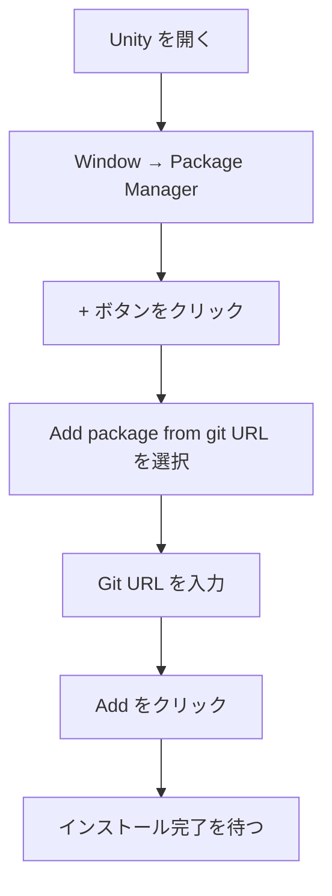
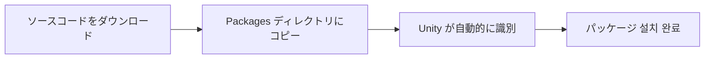
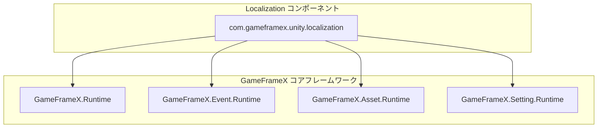

# インストール

このドキュメントでは、GameFrameX Localization ローカライゼーションコンポーネントを Unity プロジェクトにインストールする方法について説明します。

## 概要

GameFrameX Localization は、GameFrameX ゲームフレームワークのローカライゼーション機能コンポーネントであり、完全な多言語ローカライゼーションソリューションを提供します。このコンポーネントは動的言語切り替え、文字列フォーマット、システム言語検出などの機能に対応しており、開発者がゲームの国際化を迅速に実装できます。

**バージョン要件：**
- Unity 2019.4 以降

**パッケージ情報：**
- パッケージ名：`com.gameframex.unity.localization`
- 表示名：GameFrameX Localization
- 現在のバージョン：2.2.1

## インストール方法

### 方法一：Unity Package Manager からのインストール（推奨）

これが最も推奨されるインストール方法であり、最新バージョンを 쉽게 取得し、依存関係を 管理できます。

**操作手順：**

1. Unity エディターを開く
2. メニューから **Window → Package Manager** に移動
3. 左上の **+** ボタンをクリック
4. **Add package from git URL...** を選択
5. 入力フィールドに以下の Git URL を入力：

```
https://github.com/GameFrameX/com.gameframex.unity.localization.git
```

6. **Add** ボタンをクリックしてインストールが完了するのを待つ



### 方法二：manifest.json からのインストール

プロジェクトの `Packages/manifest.json` ファイルを 直接編集して依存関係を追加します。

**操作手順：**

1. プロジェクトルートの `Packages` フォルダを見つける
2. テキストエディターで `manifest.json` ファイルを開く
3. `dependencies` ノードに以下の内容を追加：

```json
{
  "dependencies": {
    "com.gameframex.unity.localization": "https://github.com/GameFrameX/com.gameframex.unity.localization.git"
  }
}
```

4. ファイルを保存して Unity に戻る
5. Unity は自動的に依存関係を解析してインストールする

> 注意：この方法はプロジェクトを開くたびに Git から最新バージョンを取得しようとします。バージョンを固定するには、以下の形式でバージョン番号を指定してください：
> ```json
> "com.gameframex.unity.localization": "2.2.1"
> ```

### 方法三：ローカルソースからのインストール

ソースコードをカスタマイズしたり、オフライン環境にいる場合は、ローカルインストール方法を使用できます。

**操作手順：**

1. GitHub リポジトリからソースコードをクローンまたはダウンロード：
   ```bash
   https://github.com/GameFrameX/com.gameframex.unity.localization.git
   ```
2. リポジトリ全体を Unity プロジェクトの `Packages` ディレクトリにコピー
3. Unity は自動的にパッケージを識別してロードする
4. 更新が必要な場合は、フォルダ内容を直接置き換える



## 依存関係の説明

GameFrameX Localization コンポーネントは、以下の GameFrameX コアモジュールに依存しています：

| 依存パッケージ | バージョン | 説明 |
|--------|------|------|
| com.gameframex.unity | 1.1.1 | コアランタイムモジュール |
| com.gameframex.unity.asset | 1.0.6 | リソース管理モジュール |
| com.gameframex.unity.event | 1.0.0 | イベントシステムモジュール |

**自動依存関係解決：**

Package Manager または manifest.json を使用してインストールする場合、Unity は自動的にすべての依存関係を解析してダウンロードします。

ローカルインストール方式を使用する場合は、以下のモジュールもインストールされていることを確認してください：

| モジュール | Assembly 定義 | 説明 |
|------|---------------|------|
| GameFrameX.Runtime | GameFrameX.Runtime | コアフレームワーク |
| GameFrameX.Event.Runtime | GameFrameX.Event.Runtime | イベントシステム |
| GameFrameX.Asset.Runtime | GameFrameX.Asset.Runtime | リソース管理 |
| GameFrameX.Setting.Runtime | GameFrameX.Setting.Runtime | 設定管理 |



## インストール確認

インストール完了後、以下の手順で検証してください：

### 1. Package Manager の確認

Package Manager ウィンドウで `GameFrameX Localization` がリストに表示され、 상태が正常であることを確認します。

### 2. アセンブリ確認

プロジェクトディレクトリに以下のアセンブリ定義ファイルが存在する必要があります：

- `Packages/com.gameframex.unity.localization/Runtime/GameFrameX.Localization.Runtime.asmdef`
- `Packages/com.gameframex.unity.localization/Editor/GameFrameX.Localization.Editor.asmdef`

### 3. テストシーンの作成

1. Unity シーンに空の GameObject を作成
2. **LocalizationComponent** コンポーネントを追加（メニュー経路：**Component → GameFrameX → Localization**）
3. コンポーネントの Inspector パネルが正しく設定オプションを表示していることを確認

> Source: [LocalizationComponent.cs](https://github.com/GameFrameX/com.gameframex.unity.localization/blob/main/Runtime/Localization/LocalizationComponent.cs#L44-L47)

### 4. 基本的なコードテストの実行

```csharp
using GameFrameX.Runtime;

// ローカライゼーションコンポーネントを取得
var localization = GameEntry.GetComponent<LocalizationComponent>();

// システム言語を取得
Debug.Log($"システム言語: {localization.SystemLanguage}");

// ローカライズ文字列のテストを取得
string text = localization.GetString("Test.Key");
Debug.Log($"テスト結果: {text}");
```

## コンポーネント設定

シーンに LocalizationComponent を追加した後、Inspector パネルで以下のオプションを設定できます：

| 設定項目 | タイプ | 默认値 | 説明 |
|--------|------|--------|------|
| Editor Language | string | zh_CN | エディターモードで使用する言語 |
| Default Language | string | zh_CN | デフォルト言語（ロード失敗時の代替言語） |
| Enable Load Dictionary Update Event | bool | false | 辞書ロード更新イベントを有効にするか |
| Is Enable Editor Mode | bool | false | エディターモードを有効にするか |
| Localization Helper Type Name | string | DefaultLocalizationHelper | ローカライゼーションヘルパーのタイプ名 |
| Custom Localization Helper | LocalizationHelperBase | null | カスタムローカライゼーションヘルパーのインスタンス |

> 注意：Editor Language は Unity エディター内でのみ有効であり、パッケージ化されたゲームには影響しません。

## よくある質問

### Q1: インストール後にコンパイルエラーが発生する

**原因：** 依存関係が不足しています

**解決策：** すべての GameFrameX 依存関係が正しくインストールされていることを確認してください。Package Manager を再度開き、依存関係的状态を確認してみてください。

### Q2: LocalizationComponent が見つからない

**原因：** アセンブリが正しくロードされていません

**解決策：**
1. Assembly Definition ファイルが存在するか確認
2. すべてのリソースを再インポートしてみてください：**Assets → Reimport All**
3. Console ウィンドウのエラーメッセージを確認

### Q3: バージョンが互換性がない

**原因：** Unity バージョンが低すぎるか、依存パッケージのバージョンが衝突しています

**解決策：**
1. Unity バージョンが 2019.4 以上であることを確認
2. 他のパッケージが異なるバージョンの GameFrameX 依存関係を宣言していないか確認

## 関連リンク

- [クイックスタート](./03.getting-started) - ローカライゼーション機能の使用開始
- [コア機能](./04.get-string) - コア機能の概要
- [API リファレンス](./09.api-reference) - 完全な API ドキュメント
- [GitHub リポジトリ](https://github.com/GameFrameX/com.gameframex.unity.localization.git) - ソースコードと最新バージョンの入手
- [公式サイト](https://gameframex.doc.alianblank.com/) - GameFrameX 完全ドキュメント
