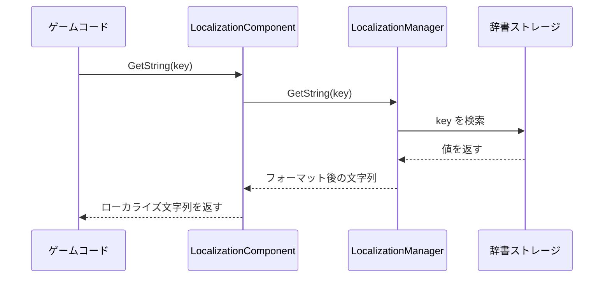
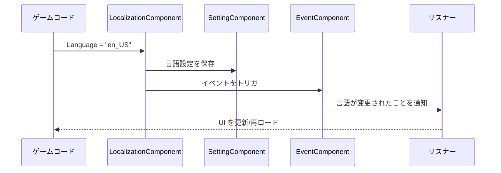

# クイックスタート

このガイドでは、GameFrameX Localization コンポーネント素早く始める，帮助您实现 Unity ゲームのローカライゼーション機能。

## 概要

GameFrameX Localization は、GameFrameX ゲームフレームワークのローカライゼーションコンポーネントであり、完全なゲームローカライゼーションソリューションを提供します。このコンポーネントは次の機能に対応しています：
- 多言語文字列管理（辞書形式）
- 動的パラメータ補間（最大 16 個のパラメータをサポート）
- ランタイム時言語切り替え
- システム言語自動検出
- 言語設定の永続化

## アーキテクチャ概要


**コンポーネントの説明：**
- **LocalizationComponent**：Unity コンポーネントであり、Game Framework に統合され、初期化と調整を担当
- **LocalizationManager**：コアマネージャーであり、辞書ストレージと文字列取得を処理
- **LocalizationHelper**：ヘルパーであり、システム言語の検出に使用
- **EventComponent**：イベントシステムであり、言語切り替えイベントの公開に使用
- **SettingComponent**：設定システムであり、言語設定の永続化に使用

## コアフロー

### 文字列取得フロー



### 言語切り替えフロー



## 使用例

### 基本的な使用方法

Unity シーンに LocalizationComponent コンポーネントを追加した後、以下の方法でローカライズ文字列を取得できます：

```csharp
using GameFrameX.Localization.Runtime;

// LocalizationComponent インスタンスを取得
var localization = GameEntry.GetComponent<LocalizationComponent>();

// 単純な文字列を取得
string greeting = localization.GetString("greeting"); // 出力：你好

// パラメータ付き文字列を取得
string playerName = localization.GetString("welcome_player", "张三"); // 出力：欢迎，张三！
```

> Source: [LocalizationComponent.cs](https://github.com/GameFrameX/com.gameframex.unity.localization/blob/main/Runtime/Localization/LocalizationComponent.cs#L246-L262)

### 上級使用方法：複数パラメータ補間

コンポーネントは最大 16 個のパラメータを持つ文字列補間をサポートしています：

```csharp
// 2 つのパラメータ
string message = localization.GetString("level_complete", 5, "1000");
// 辞書假设：level_complete = "第 {0} 关完成！得分：{1}"
// 出力：第 5 关完成！得分：1000

// 4 つのパラメータ
string complex = localization.GetString("battle_result", "勝利", 1000, 500, 50);
// 辞書假设：battle_result = "{0}！経験+{1}，コイン+{2}，ダイヤ+{3}"
// 出力：勝利！経験+1000，コイン+500，ダイヤ+50
```

> Source: [LocalizationManager.cs](https://github.com/GameFrameX/com.gameframex.unity.localization/blob/main/Runtime/Localization/Localization/LocalizationManager#L168-L311)

### 辞書管理

辞書の手動追加与管理：

```csharp
// 辞書を追加
localization.AddRawString("game_title", "私のゲーム");
localization.AddRawString("start_game", "ゲーム開始");

// 辞書の存在を確認
bool exists = localization.HasRawString("game_title"); // true

// 元の値を取得（フォーマットなし）
string rawValue = localization.GetRawString("game_title"); // 私のゲーム

// 辞書を削除
localization.RemoveRawString("game_title");

// すべての辞書をクリア
localization.RemoveAllRawStrings();
```

### 言語切り替えとイベント監視

言語切り替えイベントを監視：

```csharp
using GameFrameX.Event.Runtime;

// 言語切り替えイベントを購読
EventComponent eventComponent = GameEntry.GetComponent<EventComponent>();
eventComponent.Subscribe(LocalizationLanguageChangeEventArgs.EventId, OnLanguageChanged);

// イベント処理メソッド
private void OnLanguageChanged(object sender, GameEventArgs e)
{
    var args = (LocalizationLanguageChangeEventArgs)e;
    Debug.Log($"言語が {args.OldLanguage} から {args.Language} に切り替えられました");

    // すべての UI テキストを更新
    RefreshAllUI();
}

// 言語を切り替え
localization.Language = "en_US";
```

> Source: [LocalizationLanguageChangeEventArgs.cs](https://github.com/GameFrameX/com.gameframex.unity.localization/blob/main/Runtime/EventArgs/LocalizationLanguageChangeEventArgs.cs#L52-L58)

## 設定の説明

Unity エディターで LocalizationComponent を設定：

| 設定項目 | タイプ | 默认値 | 説明 |
|--------|------|--------|------|
| EditorLanguage | string | "zh_CN" | エディターで使用する言語 |
| DefaultLanguage | string | "zh_CN" | デフォルト言語（ロード失敗時使用） |
| EnableLoadDictionaryUpdateEvent | bool | false | 辞書ロード更新イベントを有効にするか |
| IsEnableEditorMode | bool | false | エディターモードを有効にするか |
| LocalizationHelperTypeName | string | "GameFrameX.Localization.Runtime.DefaultLocalizationHelper" | ローカライゼーションヘルパーのタイプ |

> Source: [LocalizationComponent.cs](https://github.com/GameFrameX/com.gameframex.unity.localization/blob/main/Runtime/Localization/LocalizationComponent.cs#L60-L69)

## 辞書フォーマットの例

典型的なローカライゼーション辞書フォーマットは次のとおりです：

```json
{
  "zh_CN": {
    "greeting": "你好",
    "welcome_player": "欢迎，{0}！",
    "level_complete": "第 {0} 关完成！得分：{1}",
    "battle_result": "{0}！经验+{1}，金币+{2}"
  },
  "en_US": {
    "greeting": "Hello",
    "welcome_player": "Welcome, {0}!",
    "level_complete": "Level {0} Complete! Score: {1}",
    "battle_result": "{0}! EXP+{1}, Gold+{2}"
  }
}
```

## 依存関係

このコンポーネントは次の GameFrameX コアモジュールに依存しています：
- `com.gameframex.unity` (>= 1.1.1)
- `com.gameframex.unity.asset` (>= 1.0.6)
- `com.gameframex.unity.event` (>= 1.0.0)

## 次の手順

- コア機能について詳しく学ぶには、[ローカライズ文字列の取得](./04.get-string) を参照
- 辞書管理について詳しく学ぶには、[辞書管理](./05.dictionary-management) を参照
- 言語切り替えメカニズムについて詳しく学ぶには、[言語切り替えとイベント](./06.language-switching) を参照
- 完全な API を表示するには、[API リファレンス](./09.api-reference) を参照
