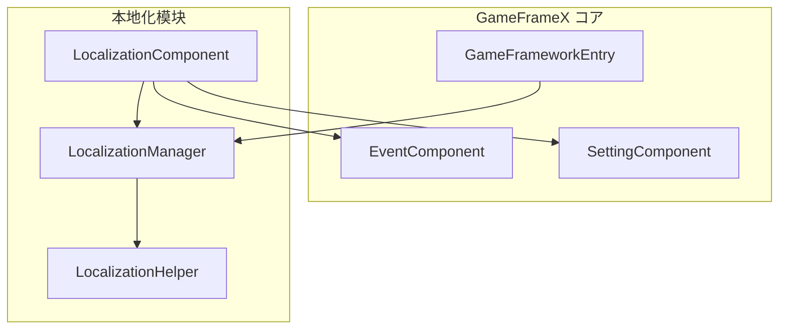
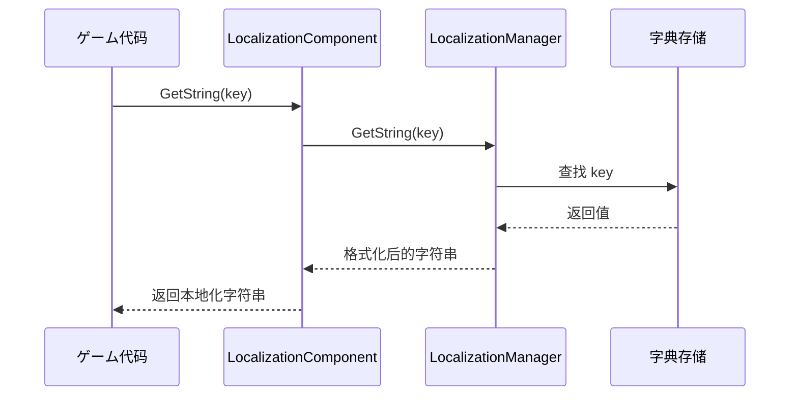
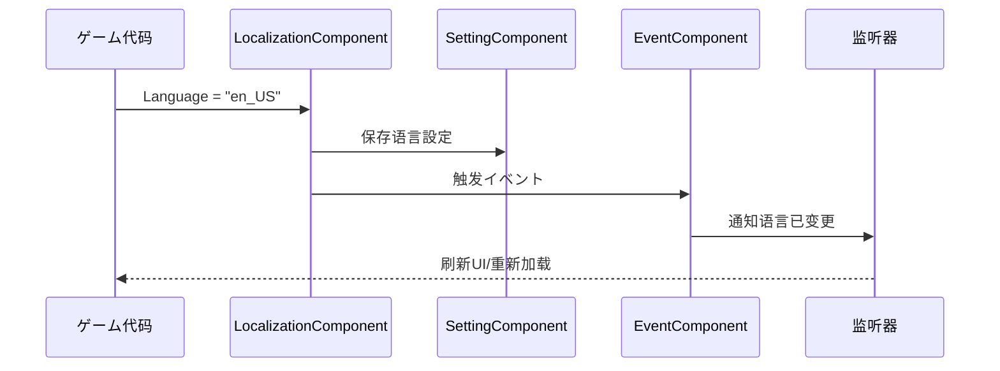

# 快速开始

本指南将帮助您快速上手 GameFrameX Localization コンポーネント，実装 Unity ゲーム的本地化機能。

## 概要

GameFrameX Localization 是 GameFrameX ゲームフレームワーク的本地化コンポーネント，提供完整的ゲーム本地化解決策。该コンポーネントサポート：
- 多语言字符串管理（字典形式）
- 动态参数插值（最多サポート 16 个参数）
- 运行时语言切换
- 系统语言自动检测
- 语言設定持久化

## アーキテクチャ概要



**コンポーネント説明：**
- **LocalizationComponent**：Unity コンポーネント，集成到 Game Framework，负责初期化和协调
- **LocalizationManager**：コア管理器，处理字典存储和字符串取得
- **LocalizationHelper**：辅助器，に使用检测系统语言
- **EventComponent**：イベント系统，に使用发布语言切换イベント
- **SettingComponent**：設定系统，に使用持久化语言偏好

## コアフロー

### 字符串取得フロー



### 语言切换フロー



## 使用例

### 基本用法

在 Unity シーン中添加 LocalizationComponent コンポーネント后，可能を通じて以下方法取得本地化字符串：

```csharp
using GameFrameX.Localization.Runtime;

// 取得 LocalizationComponent インスタンス
var localization = GameEntry.GetComponent<LocalizationComponent>();

// 取得简单字符串
string greeting = localization.GetString("greeting"); // 输出：你好

// 取得带参数的字符串
string playerName = localization.GetString("welcome_player", "张三"); // 输出：欢迎，张三！
```

> Source: [LocalizationComponent.cs](https://github.com/GameFrameX/com.gameframex.unity.localization/blob/main/Runtime/Localization/LocalizationComponent.cs#L246-L262)

### 高级用法：多参数插值

コンポーネントサポート最多 16 个参数的字符串插值：

```csharp
// 两个参数
string message = localization.GetString("level_complete", 5, "1000"); 
// 假设字典：level_complete = "第 {0} 关完成！得分：{1}"
// 输出：第 5 关完成！得分：1000

// 四个参数
string complex = localization.GetString("battle_result", "胜利", 1000, 500, 50);
// 假设字典：battle_result = "{0}！经验+{1}，金币+{2}，钻石+{3}"
// 输出：胜利！经验+1000，金币+500，钻石+50
```

> Source: [LocalizationManager.cs](https://github.com/GameFrameX/com.gameframex.unity.localization/blob/main/Runtime/Localization/Localization/LocalizationManager#L168-L311)

### 字典管理

手动添加和管理字典：

```csharp
// 添加字典
localization.AddRawString("game_title", "我的ゲーム");
localization.AddRawString("start_game", "开始ゲーム");

// 检查字典是否存在
bool exists = localization.HasRawString("game_title"); // true

// 取得原始值（不经过格式化）
string rawValue = localization.GetRawString("game_title"); // 我的ゲーム

// 移除字典
localization.RemoveRawString("game_title");

// 清空所有字典
localization.RemoveAllRawStrings();
```

### 语言切换与イベント监听

监听语言切换イベント：

```csharp
using GameFrameX.Event.Runtime;

// 订阅语言切换イベント
EventComponent eventComponent = GameEntry.GetComponent<EventComponent>();
eventComponent.Subscribe(LocalizationLanguageChangeEventArgs.EventId, OnLanguageChanged);

// イベント处理メソッド
private void OnLanguageChanged(object sender, GameEventArgs e)
{
    var args = (LocalizationLanguageChangeEventArgs)e;
    Debug.Log($"语言从 {args.OldLanguage} 切换到 {args.Language}");
    
    // 刷新所有UI文本
    RefreshAllUI();
}

// 切换语言
localization.Language = "en_US";
```

> Source: [LocalizationLanguageChangeEventArgs.cs](https://github.com/GameFrameX/com.gameframex.unity.localization/blob/main/Runtime/EventArgs/LocalizationLanguageChangeEventArgs.cs#L52-L58)

## 設定説明

在 Unity 编辑器中配置 LocalizationComponent：

| 配置项 | クラス型 | 默认值 | 説明 |
|--------|------|--------|------|
| EditorLanguage | string | "zh_CN" | 编辑器中使用的语言 |
| DefaultLanguage | string | "zh_CN" | 默认语言（加载失败时使用） |
| EnableLoadDictionaryUpdateEvent | bool | false | 是否启用字典加载更新イベント |
| IsEnableEditorMode | bool | false | 是否启用编辑器模式 |
| LocalizationHelperTypeName | string | "GameFrameX.Localization.Runtime.DefaultLocalizationHelper" | 本地化辅助器クラス型 |

> Source: [LocalizationComponent.cs](https://github.com/GameFrameX/com.gameframex.unity.localization/blob/main/Runtime/Localization/LocalizationComponent.cs#L60-L69)

## 字典格式示例

典型的本地化字典格式如下：

```json
{
  "zh_CN": {
    "greeting": "你好",
    "welcome_player": "欢迎，{0}！",
    "level_complete": "第 {0} 关完成！得分：{1}",
    "battle_result": "{0}！经验+{1}，金币+{2}"
  },
  "en_US": {
    "greeting": "Hello",
    "welcome_player": "Welcome, {0}!",
    "level_complete": "Level {0} Complete! Score: {1}",
    "battle_result": "{0}! EXP+{1}, Gold+{2}"
  }
}
```

## 依赖项

本コンポーネント依赖以下 GameFrameX コア模块：
- `com.gameframex.unity` (>= 1.1.1)
- `com.gameframex.unity.asset` (>= 1.0.6)
- `com.gameframex.unity.event` (>= 1.0.0)

## 后续手順

- 了解更多コア機能，お願いします参阅 [取得本地化字符串](./4-core-features.get-string)
- 了解字典管理，お願いします参阅 [字典管理](./4-core-features.dictionary-management)
- 了解语言切换机制，お願いします参阅 [语言切换与イベント](./4-core-features.language-switching)
- 查看完整 API，お願いします参阅 [API 参考](./5-api-reference)
