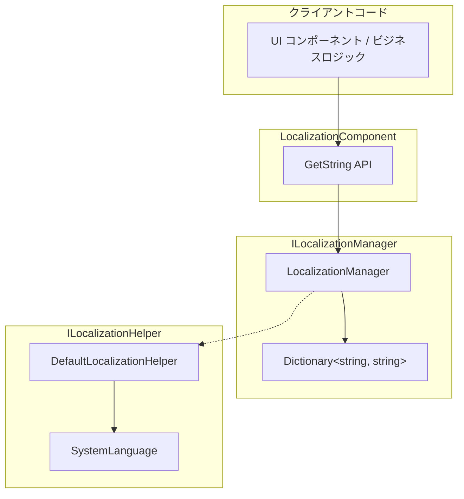

# ローカライズ文字列の取得

ローカライズ文字列の取得は、GameFrameX Localization モジュールのコア機能です。辞書メインキー（Key）を通じて対応する言語の文字列コンテンツを取得でき、動的パラメータ置換機能に対応しています。

## 概要

LocalizationComponent コンポーネントは、ローカライズ文字列を取得するための丰富的な `GetString` メソッドを提供します。これらのメソッドは以下をサポートしています：

- **基本的な取得**：key に基づいて文字列を直接取得
- **パラメータ置換**：0〜16 個のパラメータをサポートし、動的文字列フォーマットを実装
- **エラー処理**：key が存在しないかフォーマットに失敗した場合、意味のあるエラーを返す

設計意図：タイプセーフなパラメータ化文字列取得方法を提供し、ランタイム時の文字列連結エラーを回避的同时、.NET string.Format と同様の用法を維持します。

## アーキテクチャ



### コンポーネントの説明

| コンポーネント | 責務 |
|------|------|
| LocalizationComponent | Unity コンポーネント層、パブリック API を公開 |
| ILocalizationManager | ローカライゼーション管理のインターフェース契約を定義 |
| LocalizationManager | 辞書ストレージと文字列フォーマットロジックを実装 |
| ILocalizationHelper | システム言語検出インターフェース |

## コアフロー

```mermaid
sequenceDiagram
    participant Client as クライアント
    participant Comp as LocalizationComponent
    participant Mgr as LocalizationManager
    participant Dict as Dictionary

    Client->>Comp: GetString(key)
    Comp->>Mgr: GetString(key)
    Mgr->>Dict: TryGetValue(key)

    alt Key が存在する場合
        Dict-->>Mgr: rawString
        Mgr-->>Comp: rawString
        Comp-->>Client: 文字列
    else Key が存在しない場合
        Dict-->>Mgr: null
        Mgr-->>Comp: &lt;NoKey&gt;{key}
        Comp-->>Client: エラーメッセージ文字列
    end
```

```mermaid
sequenceDiagram
    participant Client as クライアント
    participant Comp as LocalizationComponent
    participant Mgr as LocalizationManager
    participant Dict as Dictionary
    participant Format as string.Format

    Client->>Comp: GetString(key, arg1, arg2)
    Comp->>Mgr: GetString(key, arg1, arg2)
    Mgr->>Dict: TryGetValue(key)

    alt Key が存在する場合
        Dict-->>Mgr: rawString
        Mgr->>Format: Format(rawString, arg1, arg2)

        alt フォーマット成功
            Format-->>Mgr: formattedString
            Mgr-->>Comp: formattedString
            Comp-->>Client: フォーマット後の文字列
        else フォーマット失敗
            Format-->>Mgr: Exception
            Mgr-->>Comp: &lt;Error&gt;{details}
            Comp-->>Client: エラーメッセージ文字列
        end
    else Key が存在しない場合
        Dict-->>Mgr: null
        Mgr-->>Comp: &lt;NoKey&gt;{key}
        Comp-->>Client: エラーメッセージ文字列
    end
```

## 使用例

### 基本的な使用方法

最もシンプルな使用方法は、key に基づいて文字列を取得することです：

```csharp
using GameFrameX.Localization.Runtime;

// LocalizationComponent インスタンスを取得
var localization = GameEntry.GetComponent<LocalizationComponent>();

// パラメータなしの単純な文字列を取得
string welcome = localization.GetString("UI_Welcome");
```

> Source: [LocalizationComponent.cs](https://github.com/GameFrameX/com.gameframex.unity.localization/blob/main/Runtime/Localization/LocalizationComponent.cs#L246-L249)

### 単一パラメータの使用

文字列内のプレースホルダー `{0}` を単一パラメータで置換：

```csharp
// 辞書内容: "Hello {0}, welcome to {1}!"
// パラメータ付き文字列を取得
string message = localization.GetString<string>("UI_Greeting", "Player");
// 結果: "Hello Player, welcome to {1}!"
```

> Source: [LocalizationComponent.cs](https://github.com/GameFrameX/com.gameframex.unity.localization/blob/main/Runtime/Localization/LocalizationComponent.cs#L272-L275)

### 複数パラメータの使用

最大 16 個のパラメータをサポートし、複雑なメッセージフォーマットに適しています：

```csharp
// 辞書内容: "{0} found {1} items in {2}"
// 2 つのパラメータを使用
string result = localization.GetString<string, int, string>("UI_FindItems", "Player", 100);
// 結果: "Player found 100 items in {2}"

// 3 つのパラメータを使用（完全なフォーマット）
string fullResult = localization.GetString<string, int, string>("UI_FindItems", "Player", 100, "Dungeon");
// 結果: "Player found 100 items in Dungeon"
```

> Source: [LocalizationComponent.cs](https://github.com/GameFrameX/com.gameframex.unity.localization/blob/main/Runtime/Localization/LocalizationComponent.cs#L287-L290)

### 動的パラメータ配列の使用

`params` 方式で不定数のパラメータを渡します：

```csharp
// params 配列を使用
object[] args = new object[] { "Alice", 25, "Beijing" };
string message = localization.GetString("UI_UserInfo", args);
```

> Source: [LocalizationComponent.cs](https://github.com/GameFrameX/com.gameframex.unity.localization/blob/main/Runtime/Localization/LocalizationComponent.cs#L259-L262)

### 辞書操作

文字列を取得する前に、辞書にデータを追加する必要があります：

```csharp
// 辞書エントリを追加
localization.AddRawString("UI_StartGame", "ゲーム開始");
localization.AddRawString("UI_Score", "スコア: {0}");

// key が存在するかをチェック
if (localization.HasRawString("UI_StartGame"))
{
    // 文字列を取得
    string text = localization.GetString("UI_StartGame");
}

// 辞書エントリを削除
localization.RemoveRawString("UI_StartGame");

// すべての辞書をクリア
localization.RemoveAllRawStrings();
```

> Source: [LocalizationComponent.cs](https://github.com/GameFrameX/com.gameframex.unity.localization/blob/main/Runtime/Localization/LocalizationComponent.cs#L737-L758)

## API リファレンス

### LocalizationComponent

#### `GetString(string key): string`

パラメータなしのローカライズ文字列を取得します。

**パラメータ：**
- `key` (string): 辞書メインキー

**戻り値：** 文字列コンテンツ。key が存在しない場合は `<NoKey>{key}` を返します

**例：**
```csharp
string text = localization.GetString("UI_Title");
```

---

#### `GetString<T>(string key, T arg): string`

単一パラメータ付きローカライズ文字列を取得します。

**パラメータ：**
- `key` (string): 辞書メインキー
- `arg` (T): 置換パラメータ

**戻り値：** フォーマット後の文字列

**例：**
```csharp
string text = localization.GetString<int>("UI_Score", 100);
// 辞書: "Score: {0}" → 結果: "Score: 100"
```

---

#### `GetString<T1, T2>(string key, T1 arg1, T2 arg2): string`

2 つのパラメータ付きローカライズ文字列を取得します。

**パラメータ：**
- `key` (string): 辞書メインキー
- `arg1` (T1): 最初のパラメータ
- `arg2` (T2): 2 番目のパラメータ

**戻り値：** フォーマット後の文字列

---

#### `GetString(string key, params object[] args): string`

パラメータ配列を使用してローカライズ文字列を取得します。

**パラメータ：**
- `key` (string): 辞書メインキー
- `args` (object[]): パラメータ配列

**戻り値：** フォーマット後の文字列

---

#### `HasRawString(string key): bool`

指定された key の辞書にアクセスできるかどうかを確認します。

**パラメータ：**
- `key` (string): 辞書メインキー

**戻り値：** 存在する場合は true、それ以外の場合は false

---

#### `GetRawString(string key): string`

元の辞書値を取得します（フォーマットなし）。

**パラメータ：**
- `key` (string): 辞書メインキー

**戻り値：** 元の文字列。key が存在しない場合は空の文字列を返します

---

#### `AddRawString(string key, string value): void`

辞書に新しいエントリを追加します。

**パラメータ：**
- `key` (string): 辞書メインキー
- `value` (string): 辞書値

---

#### `RemoveRawString(string key): bool`

辞書から指定されたエントリを削除します。

**パラメータ：**
- `key` (string): 辞書メインキー

**戻り値：** 削除成功の場合は true、key が存在しない場合は false

---

#### `RemoveAllRawStrings(): void`

すべての辞書エントリをクリアします。

---

### ILocalizationManager

ILocalizationManager インターフェースはコアのローカライゼーション管理機能を定義します。完全なメソッドリストは [API リファレンス](./09.api-reference) ドキュメントを参照してください。

## エラー処理

システムはエラー情況に対して丁寧な処理メカニズムを提供します：

| エラーシーン | 戻り値の例 |
|---------|-----------|
| Key が存在しない | `<NoKey>UI_MissingKey` |
| フォーマットパラメータが一致しない | `<Error>UI_Format,{0}実際の内容,arg,System.FormatException` |

この設計により、以下が保証されます：
1. 開発時に不足している key をすばやく発見できます
2. ランタイム時にエラーでアプリケーションがクラッシュしません
3. エラーメッセージにはデバッグに必要な关键データが含まれています

## 関連リンク

- [概要](./01.overview) - ローカライゼーションモジュールの全体アーキテクチャを理解する
- [インストール](./02.installation) - ローカライゼーションモジュールのインストールと設定
- [クイックスタート](./03.getting-started) - ローカライゼーション機能の迅速な使い方
- [辞書管理](./05.dictionary-management) - ローカライズ辞書の管理
- [言語切り替えとイベント](./06.language-switching) - 言語の切り替えとイベント処理
- [API リファレンス](./09.api-reference) - 完全な API ドキュメント
- [設定](./07.configuration) - モジュールの設定オプション
- [ベストプラクティス](./08.best-practices) - 使用のヒントとテクニック
