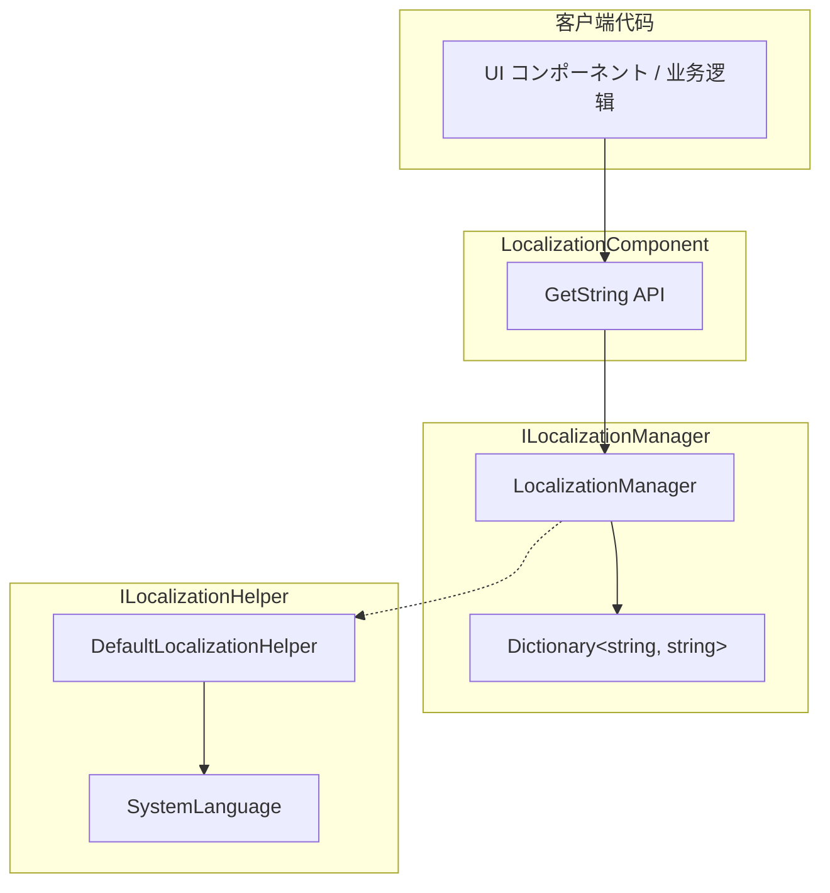

# 取得本地化字符串

取得本地化字符串是 GameFrameX Localization 模块的コア機能。を通じて字典主键（Key）可能取得对应语言的字符串内容，并サポート动态参数替换機能。

## 概要

LocalizationComponent コンポーネント提供します丰富的 `GetString` メソッド来取得本地化字符串。这些メソッドサポート：

- **基础取得**：に基づいて key 直接取得字符串
- **参数替换**：サポート 0-16 个参数，実装动态字符串格式化
- **错误处理**：当 key 不存在或格式化失败时，返回有意义的错误ヒント

设计意图：提供クラス型安全的参数化字符串取得方法，避免运行时字符串拼接错误，同时保持与 .NET string.Format クラス似的用法。

## 架构



### コンポーネント説明

| コンポーネント | 职责 |
|------|------|
| LocalizationComponent | Unity コンポーネント层，暴露公共 API |
| ILocalizationManager | 定义本地化管理的インターフェース契约 |
| LocalizationManager | 実装字典存储和字符串格式化逻辑 |
| ILocalizationHelper | 系统语言检测インターフェース |

## コアフロー

```mermaid
sequenceDiagram
    participant Client as 客户端
    participant Comp as LocalizationComponent
    participant Mgr as LocalizationManager
    participant Dict as Dictionary

    Client->>Comp: GetString(key)
    Comp->>Mgr: GetString(key)
    Mgr->>Dict: TryGetValue(key)
    
    alt Key 存在
        Dict-->>Mgr: rawString
        Mgr-->>Comp: rawString
        Comp-->>Client: 字符串
    else Key 不存在
        Dict-->>Mgr: null
        Mgr-->>Comp: &lt;NoKey&gt;{key}
        Comp-->>Client: 错误ヒント字符串
    end
```

```mermaid
sequenceDiagram
    participant Client as 客户端
    participant Comp as LocalizationComponent
    participant Mgr as LocalizationManager
    participant Dict as Dictionary
    participant Format as string.Format

    Client->>Comp: GetString(key, arg1, arg2)
    Comp->>Mgr: GetString(key, arg1, arg2)
    Mgr->>Dict: TryGetValue(key)
    
    alt Key 存在
        Dict-->>Mgr: rawString
        Mgr->>Format: Format(rawString, arg1, arg2)
        
        alt 格式化成功
            Format-->>Mgr: formattedString
            Mgr-->>Comp: formattedString
            Comp-->>Client: 格式化后的字符串
        else 格式化失败
            Format-->>Mgr: Exception
            Mgr-->>Comp: &lt;Error&gt;{details}
            Comp-->>Client: 错误ヒント字符串
        end
    else Key 不存在
        Dict-->>Mgr: null
        Mgr-->>Comp: &lt;NoKey&gt;{key}
        Comp-->>Client: 错误ヒント字符串
    end
```

## 使用例

### 基础用法

最简单的用法是に基づいて key 取得字符串：

```csharp
using GameFrameX.Localization.Runtime;

// 取得 LocalizationComponent インスタンス
var localization = GameEntry.GetComponent<LocalizationComponent>();

// 取得简单字符串（无参数）
string welcome = localization.GetString("UI_Welcome");
```

> Source: [LocalizationComponent.cs](https://github.com/GameFrameX/com.gameframex.unity.localization/blob/main/Runtime/Localization/LocalizationComponent.cs#L246-L249)

### 单参数用法

使用单参数替换字符串中的占位符 `{0}`：

```csharp
// 字典内容: "Hello {0}, welcome to {1}!"
// 取得带参数的字符串
string message = localization.GetString<string>("UI_Greeting", "Player");
// 结果: "Hello Player, welcome to {1}!"
```

> Source: [LocalizationComponent.cs](https://github.com/GameFrameX/com.gameframex.unity.localization/blob/main/Runtime/Localization/LocalizationComponent.cs#L272-L275)

### 多参数用法

サポート最多 16 个参数，适に使用复杂的消息格式化：

```csharp
// 字典内容: "{0} found {1} items in {2}"
// 使用两个参数
string result = localization.GetString<string, int, string>("UI_FindItems", "Player", 100);
// 结果: "Player found 100 items in {2}"

// 使用三个参数（完整格式化）
string fullResult = localization.GetString<string, int, string>("UI_FindItems", "Player", 100, "Dungeon");
// 结果: "Player found 100 items in Dungeon"
```

> Source: [LocalizationComponent.cs](https://github.com/GameFrameX/com.gameframex.unity.localization/blob/main/Runtime/Localization/LocalizationComponent.cs#L287-L290)

### 动态参数数组用法

使用 `params` 方法传递不确定数量的参数：

```csharp
// 使用 params 数组
object[] args = new object[] { "Alice", 25, "Beijing" };
string message = localization.GetString("UI_UserInfo", args);
```

> Source: [LocalizationComponent.cs](https://github.com/GameFrameX/com.gameframex.unity.localization/blob/main/Runtime/Localization/LocalizationComponent.cs#L259-L262)

### 字典操作

在取得字符串之前，必要先向字典添加数据：

```csharp
// 添加字典条目
localization.AddRawString("UI_StartGame", "开始ゲーム");
localization.AddRawString("UI_Score", "得分: {0}");

// 检查 key 是否存在
if (localization.HasRawString("UI_StartGame"))
{
    // 取得字符串
    string text = localization.GetString("UI_StartGame");
}

// 移除字典条目
localization.RemoveRawString("UI_StartGame");

// 清空所有字典
localization.RemoveAllRawStrings();
```

> Source: [LocalizationComponent.cs](https://github.com/GameFrameX/com.gameframex.unity.localization/blob/main/Runtime/Localization/LocalizationComponent.cs#L737-L758)

## API 参考

### LocalizationComponent

#### `GetString(string key): string`

取得无参数的本地化字符串。

**参数：**
- `key` (string): 字典主键

**返回：** 字符串内容，如果 key 不存在返回 `<NoKey>{key}`

**示例：**
```csharp
string text = localization.GetString("UI_Title");
```

---

#### `GetString<T>(string key, T arg): string`

取得带单个参数的本地化字符串。

**参数：**
- `key` (string): 字典主键
- `arg` (T): 替换参数

**返回：** 格式化后的字符串

**示例：**
```csharp
string text = localization.GetString<int>("UI_Score", 100);
// 字典: "Score: {0}" → 结果: "Score: 100"
```

---

#### `GetString<T1, T2>(string key, T1 arg1, T2 arg2): string`

取得带两个参数的本地化字符串。

**参数：**
- `key` (string): 字典主键
- `arg1` (T1): 第一个参数
- `arg2` (T2): 第二个参数

**返回：** 格式化后的字符串

---

#### `GetString(string key, params object[] args): string`

使用参数数组取得本地化字符串。

**参数：**
- `key` (string): 字典主键
- `args` (object[]): 参数数组

**返回：** 格式化后的字符串

---

#### `HasRawString(string key): bool`

检查字典中是否存在指定的 key。

**参数：**
- `key` (string): 字典主键

**返回：** 存在返回 true，否则返回 false

---

#### `GetRawString(string key): string`

取得原始字典值（不经过格式化）。

**参数：**
- `key` (string): 字典主键

**返回：** 原始字符串，key 不存在时返回空字符串

---

#### `AddRawString(string key, string value): void`

向字典添加新条目。

**参数：**
- `key` (string): 字典主键
- `value` (string): 字典值

---

#### `RemoveRawString(string key): bool`

从字典移除指定条目。

**参数：**
- `key` (string): 字典主键

**返回：** 移除成功返回 true，key 不存在返回 false

---

#### `RemoveAllRawStrings(): void`

清空所有字典条目。

---

### ILocalizationManager

ILocalizationManager インターフェース定义了コア的本地化管理機能，完整メソッド列表お願いします参考 [API 参考](./5-api-reference) 文档。

## 错误处理

系统对错误情况提供します友好的处理机制：

| 错误シーン | 返回值示例 |
|---------|-----------|
| Key 不存在 | `<NoKey>UI_MissingKey` |
| 格式化参数不匹配 | `<Error>UI_Format,{0}实际内容,arg,System.FormatException` |

这种设计确保了：
1. 开发时能快速发现缺失的 key
2. 运行时不会因为错误导致应用崩溃
3. 错误信息包含了调试所需的关键数据

## 関連リンク

- [概述](./1-overview) - 了解本地化模块整体架构
- [安装](./2-installation) - 安装和配置本地化模块
- [快速开始](./3-getting-started) - 快速上手本地化機能
- [字典管理](./4-core-features.dictionary-management) - 管理本地化字典
- [语言切换与イベント](./4-core-features.language-switching) - 切换语言和イベント处理
- [API 参考](./5-api-reference) - 完整的 API 文档
- [配置](./6-configuration) - 模块配置选项
- [最佳实践](./7-best-practices) - 使用建议和技巧
