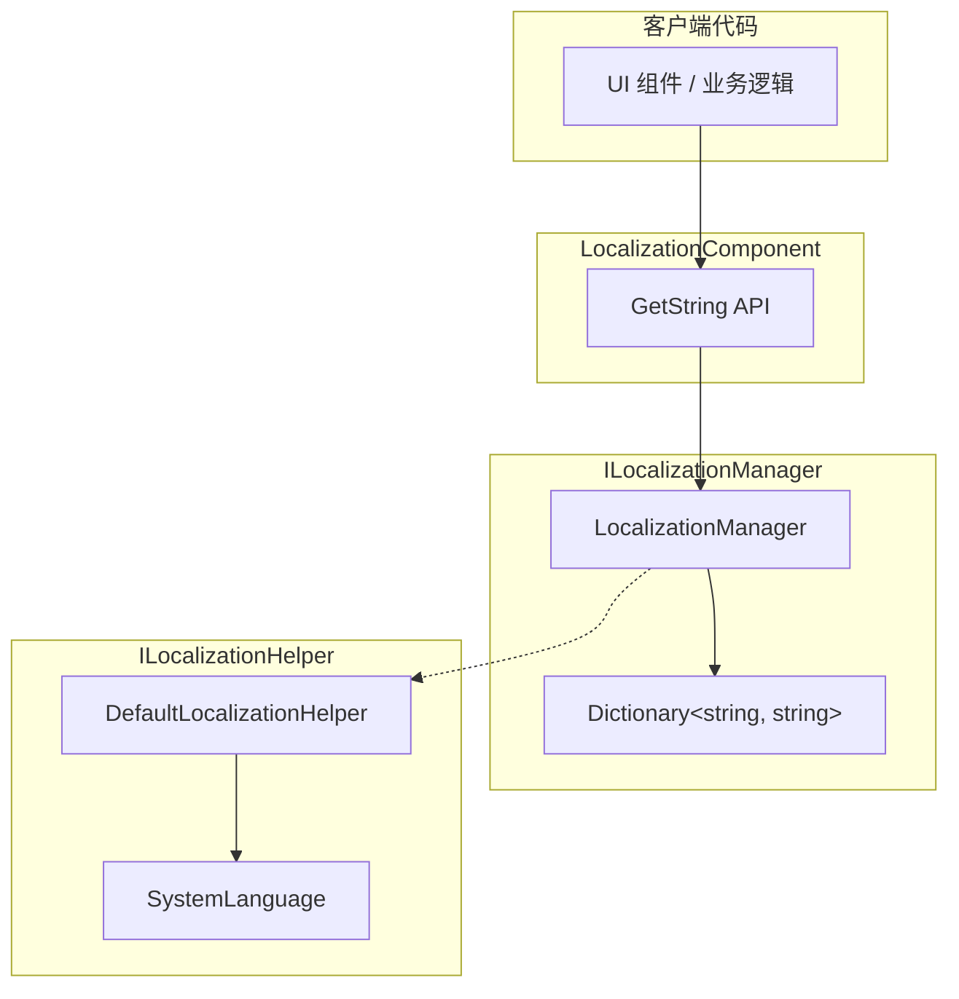

# 取得本地化字符串

取得本地化字符串是 GameFrameX Localization モジュール的コア機能。通过字典主键（Key）〜できます取得对应语言的字符串内容，并サポート动态パラメータ置換機能。

## 概要

LocalizationComponent コンポーネント提供します丰富的 `GetString` メソッド来取得本地化字符串。这些メソッドサポート：

- **基本取得**：根据 key 直接取得字符串
- **パラメータ置換**：サポート 0-16 个パラメータ，実装动态字符串フォーマット化
- **エラー処理**：当 key 不存在或フォーマット化失敗时，返す有意义的エラーヒント

設計意图：提供タイプ安全的パラメータ化字符串取得方法，避免ランタイム字符串拼接エラー，同時に保持与 .NET string.Format 类似的用法。

## アーキテクチャ



### コンポーネント説明

| コンポーネント | 职责 |
|------|------|
| LocalizationComponent | Unity コンポーネント層，暴露公共 API |
| ILocalizationManager | 定義本地化管理的インターフェース契约 |
| LocalizationManager | 実装字典存储和字符串フォーマット化逻辑 |
| ILocalizationHelper | 系统语言检测インターフェース |

## コアフロー

```mermaid
sequenceDiagram
    participant Client as 客户端
    participant Comp as LocalizationComponent
    participant Mgr as LocalizationManager
    participant Dict as Dictionary

    Client->>Comp: GetString(key)
    Comp->>Mgr: GetString(key)
    Mgr->>Dict: TryGetValue(key)
    
    alt Key 存在
        Dict-->>Mgr: rawString
        Mgr-->>Comp: rawString
        Comp-->>Client: 字符串
    else Key 不存在
        Dict-->>Mgr: null
        Mgr-->>Comp: &lt;NoKey&gt;{key}
        Comp-->>Client: 错误提示字符串
    end
```

```mermaid
sequenceDiagram
    participant Client as 客户端
    participant Comp as LocalizationComponent
    participant Mgr as LocalizationManager
    participant Dict as Dictionary
    participant Format as string.Format

    Client->>Comp: GetString(key, arg1, arg2)
    Comp->>Mgr: GetString(key, arg1, arg2)
    Mgr->>Dict: TryGetValue(key)
    
    alt Key 存在
        Dict-->>Mgr: rawString
        Mgr->>Format: Format(rawString, arg1, arg2)
        
        alt 格式化成功
            Format-->>Mgr: formattedString
            Mgr-->>Comp: formattedString
            Comp-->>Client: 格式化后的字符串
        else 格式化失败
            Format-->>Mgr: Exception
            Mgr-->>Comp: &lt;Error&gt;{details}
            Comp-->>Client: 错误提示字符串
        end
    else Key 不存在
        Dict-->>Mgr: null
        Mgr-->>Comp: &lt;NoKey&gt;{key}
        Comp-->>Client: 错误提示字符串
    end
```

## 使用例

### 基本用法

最シンプル的用法是根据 key 取得字符串：

```csharp
using GameFrameX.Localization.Runtime;

// 获取 LocalizationComponent 实例
var localization = GameEntry.GetComponent<LocalizationComponent>();

// 获取简单字符串（无参数）
string welcome = localization.GetString("UI_Welcome");
```

> Source: [LocalizationComponent.cs](https://github.com/GameFrameX/com.gameframex.unity.localization/blob/main/Runtime/Localization/LocalizationComponent.cs#L246-L249)

### 单パラメータ用法

使用单パラメータ置換字符串中的占位符 `{0}`：

```csharp
// 字典内容: "Hello {0}, welcome to {1}!"
// 获取带参数的字符串
string message = localization.GetString<string>("UI_Greeting", "Player");
// 结果: "Hello Player, welcome to {1}!"
```

> Source: [LocalizationComponent.cs](https://github.com/GameFrameX/com.gameframex.unity.localization/blob/main/Runtime/Localization/LocalizationComponent.cs#L272-L275)

### 多パラメータ用法

サポート最多 16 个パラメータ，適しています複雑的メッセージフォーマット化：

```csharp
// 字典内容: "{0} found {1} items in {2}"
// 使用两个参数
string result = localization.GetString<string, int, string>("UI_FindItems", "Player", 100);
// 结果: "Player found 100 items in {2}"

// 使用三个参数（完整格式化）
string fullResult = localization.GetString<string, int, string>("UI_FindItems", "Player", 100, "Dungeon");
// 结果: "Player found 100 items in Dungeon"
```

> Source: [LocalizationComponent.cs](https://github.com/GameFrameX/com.gameframex.unity.localization/blob/main/Runtime/Localization/LocalizationComponent.cs#L287-L290)

### 动态パラメータ数组用法

使用 `params` 方法传递不确定数量的パラメータ：

```csharp
// 使用 params 数组
object[] args = new object[] { "Alice", 25, "Beijing" };
string message = localization.GetString("UI_UserInfo", args);
```

> Source: [LocalizationComponent.cs](https://github.com/GameFrameX/com.gameframex.unity.localization/blob/main/Runtime/Localization/LocalizationComponent.cs#L259-L262)

### 字典操作

在取得字符串之前，〜する必要があります先向字典追加数据：

```csharp
// 添加字典条目
localization.AddRawString("UI_StartGame", "开始游戏");
localization.AddRawString("UI_Score", "得分: {0}");

// 检查 key 是否存在
if (localization.HasRawString("UI_StartGame"))
{
    // 获取字符串
    string text = localization.GetString("UI_StartGame");
}

// 移除字典条目
localization.RemoveRawString("UI_StartGame");

// 清空所有字典
localization.RemoveAllRawStrings();
```

> Source: [LocalizationComponent.cs](https://github.com/GameFrameX/com.gameframex.unity.localization/blob/main/Runtime/Localization/LocalizationComponent.cs#L737-L758)

## API リファレンス

### LocalizationComponent

#### `GetString(string key): string`

取得无パラメータ的本地化字符串。

**パラメータ：**
- `key` (string): 字典主键

**返す：** 字符串内容，もし key 不存在返す `<NoKey>{key}`

**例：**
```csharp
string text = localization.GetString("UI_Title");
```

---

#### `GetString<T>(string key, T arg): string`

取得带单个パラメータ的本地化字符串。

**パラメータ：**
- `key` (string): 字典主键
- `arg` (T): 置換パラメータ

**返す：** フォーマット化后的字符串

**例：**
```csharp
string text = localization.GetString<int>("UI_Score", 100);
// 字典: "Score: {0}" → 结果: "Score: 100"
```

---

#### `GetString<T1, T2>(string key, T1 arg1, T2 arg2): string`

取得带两个パラメータ的本地化字符串。

**パラメータ：**
- `key` (string): 字典主键
- `arg1` (T1): 第1个パラメータ
- `arg2` (T2): 第2个パラメータ

**返す：** フォーマット化后的字符串

---

#### `GetString(string key, params object[] args): string`

使用パラメータ数组取得本地化字符串。

**パラメータ：**
- `key` (string): 字典主键
- `args` (object[]): パラメータ数组

**返す：** フォーマット化后的字符串

---

#### `HasRawString(string key): bool`

確認字典中是否存在指定的 key。

**パラメータ：**
- `key` (string): 字典主键

**返す：** 存在返す true，否则返す false

---

#### `GetRawString(string key): string`

取得原始字典值（不经过フォーマット化）。

**パラメータ：**
- `key` (string): 字典主键

**返す：** 原始字符串，key 不存在时返す空字符串

---

#### `AddRawString(string key, string value): void`

向字典追加新条目。

**パラメータ：**
- `key` (string): 字典主键
- `value` (string): 字典值

---

#### `RemoveRawString(string key): bool`

从字典移除指定条目。

**パラメータ：**
- `key` (string): 字典主键

**返す：** 移除成功返す true，key 不存在返す false

---

#### `RemoveAllRawStrings(): void`

清空所有字典条目。

---

### ILocalizationManager

ILocalizationManager インターフェース定義了コア的本地化管理機能，完全なメソッド列表请リファレンス [API リファレンス](./5-api-reference) ドキュメント。

## エラー処理

系统对エラー情况提供します使いやすい的処理机制：

| エラーシーン | 戻り値例 |
|---------|-----------|
| Key 不存在 | `<NoKey>UI_MissingKey` |
| フォーマット化パラメータ不匹配 | `<Error>UI_Format,{0}实际内容,arg,System.FormatException` |

这种設計確認してください了：
1. 开发时能快速发现缺失的 key
2. ランタイム不会因为エラー导致应用崩溃
3. エラー情報パッケージ含了デバッグ所需的关键数据

## 関連リンク

- [概要](./1-overview) - 理解する本地化モジュール整体アーキテクチャ
- [インストール](./2-installation) - インストール和設定本地化モジュール
- [快速开始](./3-getting-started) - 快速上手本地化機能
- [字典管理](./4-core-features.dictionary-management) - 管理本地化字典
- [语言切换与イベント](./4-core-features.language-switching) - 切换语言和イベント処理
- [API リファレンス](./5-api-reference) - 完全な的 API ドキュメント
- [設定](./6-configuration) - モジュール設定オプション
- [最佳实践](./7-best-practices) - 使用お勧め和技巧
