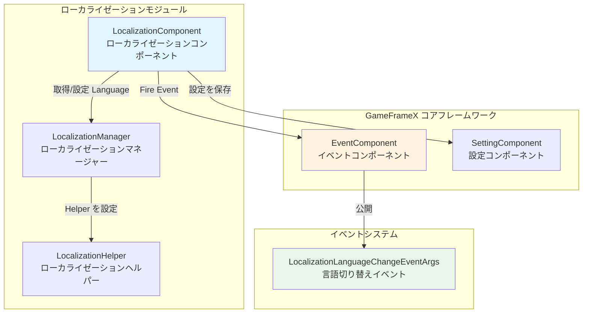
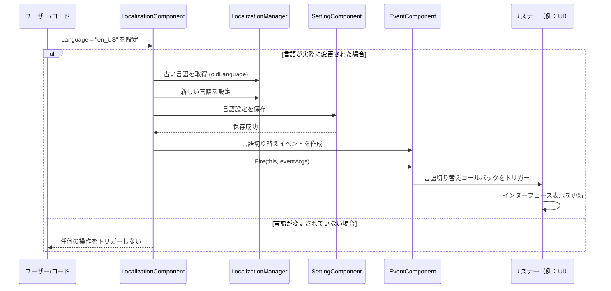

# 言語切り替えとイベント

言語切り替えとイベントは、GameFrameX ローカライゼーションシステムのコア機能の一つであり、開発者がランタイム時にアプリケーションの言語を動的に切り替え、イベントメカニズムを通じてすべてのリスナーに言語が変更されたことを通知し、UI、テキストなどのコンテンツの自動更新を実装できます。

## 概要

GameFrameX ローカライゼーションシステムは、言語切り替え機能を実装するために**イベント駆動アーキテクチャ**を採用しています。アプリケーションの言語設定が変更されると、システムは次のことを行います：

1. 内部言語ステータスを更新
2. 新しい言語設定を永続化保存
3. イベントシステムを通じて言語切り替えイベントを公开发信
4. リスナーがイベント收到後に相应操作を実行（如：UI 表示を更新）

この設計は**疎結合**を実装しています：言語切り替えの发起者は言語変化に応答する是谁かをを知る必要がなく、応答者も言語がどのように切り替えられたかを心配する必要がありません。

> **設計意図**：イベントメカニズムを使用して言語切り替えを処理することで、UI システム、音効システム、日付フォーマットシステムなどの複数のシステムが言語変化に獨立して応答でき、言語切り替えコード内でこれらのシステムに直接依存する必要がありません。これは**観察者パターン**の設計理念に従い、システムの拡張性と保守性を向上させます。

## アーキテクチャ設計

### コンポーネント関係図



### 言語切り替えフロー



## 言語切り替えの詳細

### 言語の設定

`LocalizationComponent` の `Language` プロパティを通じて現在の言語を設定できます：

```csharp
// ローカライゼーションコンポーネントを取得
var localizationComponent = GameEntry.GetComponent<LocalizationComponent>();

// 言語を英語に設定
localizationComponent.Language = "en_US";

// 言語を中国語に設定
localizationComponent.Language = "zh_CN";

// 言語を日本語に設定
localizationComponent.Language = "ja_JP";
```
> Source: [LocalizationComponent.cs](https://github.com/GameFrameX/com.gameframex.unity.localization/blob/main/Runtime/Localization/LocalizationComponent.cs#L116-L143)

**言語切り替えの内部実装ロジック：**

```csharp
public string Language
{
    get { /* ... */ }
    set
    {
        if (m_LocalizationManager.Language != value)  // 言語が実際に変更された場合にのみ処理
        {
            var oldLanguage = m_LocalizationManager.Language;  // 古い言語を記録
            m_LocalizationManager.Language = value;            // 新しい言語を設定
            m_SettingComponent.SetString(...);                 // 永続化保存
            m_SettingComponent.Save();

            // 言語切り替えイベントをトリガー
            var eventArgs = LocalizationLanguageChangeEventArgs.Create(oldLanguage, value);
            m_EventComponent.Fire(this, eventArgs);
        }
    }
}
```
> Source: [LocalizationComponent.cs](https://github.com/GameFrameX/com.gameframex.unity.localization/blob/main/Runtime/Localization/LocalizationComponent.cs#L131-L142)

### 現在の言語の取得

```csharp
var localizationComponent = GameEntry.GetComponent<LocalizationComponent>();

// 現在の言語を取得
string currentLanguage = localizationComponent.Language;

// システム言語を取得
string systemLanguage = localizationComponent.SystemLanguage;

// デフォルト言語を取得
string defaultLanguage = localizationComponent.DefaultLanguage;
```

### システム言語の取得

システム言語とは、デバイスの現在の地域言語設定を指します：

```csharp
var localizationComponent = GameEntry.GetComponent<LocalizationComponent>();
string systemLang = localizationComponent.SystemLanguage;
```

## イベントの詳細

### 言語切り替えイベント

言語が切り替えられると、システムは `LocalizationLanguageChangeEventArgs` イベントを公开发信します。

#### イベントパラメータ構造

```csharp
public sealed class LocalizationLanguageChangeEventArgs : GameEventArgs
{
    /// <summary>
    /// イベントID
    /// </summary>
    public static readonly string EventId = typeof(LocalizationLanguageChangeEventArgs).FullName;

    /// <summary>
    /// 現在の言語
    /// </summary>
    public string Language { get; set; }

    /// <summary>
    /// 古い言語
    /// </summary>
    public string OldLanguage { get; set; }
}
```
> Source: [LocalizationLanguageChangeEventArgs.cs](https://github.com/GameFrameX/com.gameframex.unity.localization/blob/main/Runtime/EventArgs/LocalizationLanguageChangeEventArgs.cs#L11-L33)

#### 言語切り替えイベントの購読

```csharp
using GameFrameX.Event.Runtime;
using GameFrameX.Localization.Runtime;

public class MyLanguageListener : MonoBehaviour
{
    private EventComponent _eventComponent;

    private void Start()
    {
        _eventComponent = GameEntry.GetComponent<EventComponent>();

        // 言語切り替えイベントを購読
        _eventComponent.Subscribe(LocalizationLanguageChangeEventArgs.EventId, OnLanguageChanged);
    }

    private void OnLanguageChanged(object sender, GameEventArgs e)
    {
        var args = e as LocalizationLanguageChangeEventArgs;
        Debug.Log($"言語が {args.OldLanguage} から {args.Language} に切り替えられました");

        // ここで UI 表示を更新、ローカライズ文字列を再ロードなどを実行
        RefreshUI();
    }

    private void OnDestroy()
    {
        // 購読解除を忘れないように（メモリリークを避ける）
        if (_eventComponent != null)
        {
            _eventComponent.Unsubscribe(LocalizationLanguageChangeEventArgs.EventId, OnLanguageChanged);
        }
    }

    private void RefreshUI()
    {
        // UI 更新ロジックを実装
    }
}
```
> Source: [LocalizationLanguageChangeEventArgs.cs](https://github.com/GameFrameX/com.gameframex.unity.localization/blob/main/Runtime/EventArgs/LocalizationLanguageChangeEventArgs.cs#L52-L58)

### 辞書ロードイベント

言語切り替えイベント 외에도、システムには辞書ロード関連のイベントが用意されています（現在コードではコメントステータスですが、クラスは既に定義されています）：

| イベント | 説明 |
|------|------|
| `LoadDictionarySuccessEventArgs` | 辞書ロード成功イベント |
| `LoadDictionaryFailureEventArgs` | 辞書ロード失敗イベント |

```csharp
// 辞書ロード成功イベントパラメータ
public sealed class LoadDictionarySuccessEventArgs : GameEventArgs
{
    /// <summary>
    /// イベントID
    /// </summary>
    public static readonly string EventId = typeof(LoadDictionarySuccessEventArgs).FullName;

    /// <summary>
    /// 辞書リソース名
    /// </summary>
    public string DictionaryAssetName { get; private set; }

    /// <summary>
    /// ロード継続時間
    /// </summary>
    public float Duration { get; private set; }

    /// <summary>
    /// ユーザーカスタムデータ
    /// </summary>
    public object UserData { get; private set; }
}
```
> Source: [LoadDictionarySuccessEventArgs.cs](https://github.com/GameFrameX/com.gameframex.unity.localization/blob/main/Runtime/EventArgs/LoadDictionarySuccessEventArgs.cs#L42-L85)

## ベストプラクティス

### 1. 言語切り替えの自動監視による UI 更新

ローカライズが必要なすべての UI 要素を自動的に更新する汎用言語切り替えリスナーを作成：

```csharp
using UnityEngine;
using GameFrameX.Event.Runtime;
using GameFrameX.Localization.Runtime;

public class LanguageChangedListener : MonoBehaviour
{
    private EventComponent _eventComponent;

    private void Awake()
    {
        _eventComponent = GameEntry.GetComponent<EventComponent>();
    }

    private void OnEnable()
    {
        _eventComponent.Subscribe(LocalizationLanguageChangeEventArgs.EventId, OnLanguageChanged);
    }

    private void OnDisable()
    {
        _eventComponent.Unsubscribe(LocalizationLanguageChangeEventArgs.EventId, OnLanguageChanged);
    }

    private void OnLanguageChanged(object sender, GameEventArgs e)
    {
        var args = e as LocalizationLanguageChangeEventArgs;
        Debug.Log($"言語が切り替えられました: {args.OldLanguage} → {args.Language}");

        // 更新が必要なすべてのコンポーネントに通知
        BroadcastMessage("OnLanguageChanged", SendMessageOptions.DontRequireReceiver);
    }
}
```

### 2. ユーザーの言語設定の保存

言語設定は自動的にローカルに保存されますが、手動で保存タイミングを制御できます：

```csharp
var localizationComponent = GameEntry.GetComponent<LocalizationComponent>();

// ユーザーが前回保存した言語を取得
string savedLanguage = localizationComponent.Language;

// 言語を変更すると自動的に保存されますが、直ちに保存する必要がある場合は呼び出してください：
// (Set プロパティには既に自動保存ロジックが含まれています)

// デフォルト言語を設定（初回起動時のみ使用）
string defaultLang = localizationComponent.DefaultLanguage;
```

### 3. 言語切り替え時のリソース処理

言語を切り替えるときに、いくつかの言語関連のリソースを再ロードする必要がある場合があります：

```csharp
private void OnLanguageChanged(object sender, GameEventArgs e)
{
    var args = e as LocalizationLanguageChangeEventArgs;

    // 古い辞書キャッシュをクリア
    var localizationComponent = GameEntry.GetComponent<LocalizationComponent>();
    localizationComponent.RemoveAllRawStrings();

    // 新しい言語の辞書を再ロード
    // LoadNewLanguageDictionary(args.Language);

    // インターフェースを更新
    RefreshAllLocalizedContent();
}
```

## よくある質問

### Q: 言語を切り替えた後、UI が自動的に更新されません？

**A**: 言語切り替えイベントを購読し、UI 更新ロジックを実装する必要があります。GameFrameX は UI を自動的に更新しません。開発者がイベントを監視後に手動で更新する必要があります。

### Q: システムの現在の言語を取得するにはどうすればいいですか？

```csharp
var localizationComponent = GameEntry.GetComponent<LocalizationComponent>();
string systemLang = localizationComponent.SystemLanguage;
```

### Q: 言語切り替えイベントはどこでトリガーされますか？

**A**: 言語切り替えイベントは `LocalizationComponent.Language` プロパティの setter でトリガーされます。設定された値が現在の言語と異なる場合にのみ、イベントがトリガーされます。

### Q: 言語切り替えイベントの重複トリガーを防止するにはどうすればいいですか？

**A**: `LocalizationComponent` 内部では既にチェックされており、新しい言語が現在の言語と異なる場合にのみイベントがトリガーされます：

```csharp
if (m_LocalizationManager.Language != value)
{
    // 値が異なる場合にのみ実行
}
```

## 関連リンク

- [ローカライズ文字列の取得](./04.get-string) - ローカライズテキストの取得方法を理解する
- [辞書管理](./05.dictionary-management) - 辞書のロードと管理の理解
- [API リファレンス](./09.api-reference) - 完全な API ドキュメント
- [設定](./07.configuration) - ローカライゼーションシステム設定の説明
- [ベストプラクティス](./08.best-practices) - より多くの使用テクニック
