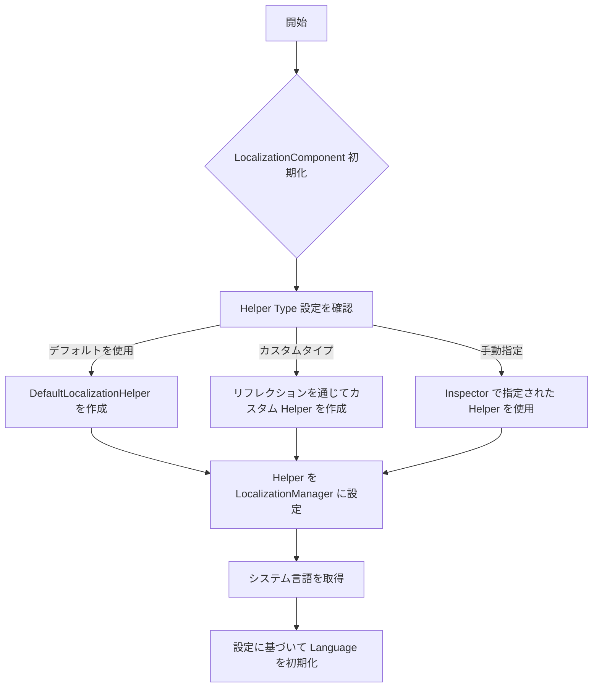
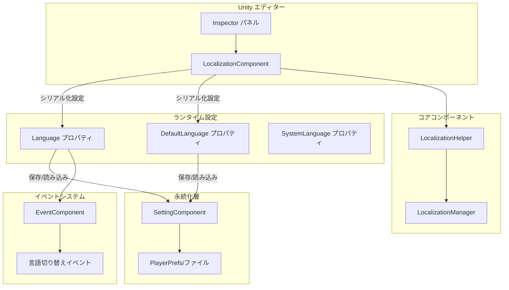

# 設定

このドキュメントでは、GameFrameX Localization コンポーネントの各設定オプションについて詳しく説明します。エディター設定とランタイム設定を含みます。

## 概要

GameFrameX Localization コンポーネントは、柔軟なローカライゼーション設定メカニズムを提供し、Unity エディターインターフェースを通じた設定とコードランタイム設定の 2 つの方法をサポートしています。設定システムは階層化設計を採用し、開発者がローカライゼーションヘルパーのカスタマイズ、デフォルト言語の設定、エディターテストモードの有効化などの機能を設定できます。

LocalizationComponent は Unity エンジンのコアコンポーネントであり、GameFrameworkComponent を継承し、シリアル化フィールドを通じて設定オプションを提供します。これらの設定はコンポーネントの初期化時に有効になり、ローカライゼーションシステムの動作を制御します。

> ソースコードファイル：
> - [LocalizationComponent.cs](https://github.com/GameFrameX/com.gameframex.unity.localization/blob/main/Runtime/Localization/LocalizationComponent.cs#L48-L777)
> - [LocalizationManager.cs](https://github.com/GameFrameX/com.gameframex.unity.localization/blob/main/Runtime/Localization/Localization/LocalizationManager.cs#L43-L937)

## エディター設定

### ローカライゼーションコンポーネントの追加

Unity エディターで、以下の手順でローカライゼーションコンポーネントを追加します：

1. シーンに空の GameObject を作成するか、既存オブジェクトを選択
2. メニューから **GameObject → GameFrameX → Localization** を選択
3. または Inspector パネルで **Add Component** をクリックし、"Localization" を検索

コンポーネントを追加すると、Inspector パネルに設定オプションが表示されます。

### 設定オプションの説明

```csharp
// LocalizationComponent コア設定フィールド
[SerializeField] private string m_EditorLanguage = "zh_CN";           // エディター言語
[SerializeField] private string m_DefaultLanguage = "zh_CN";         // デフォルト言語
[SerializeField] private bool m_IsEnableEditorMode = false;          // エディターモードの有効化
[SerializeField] private string m_LocalizationHelperTypeName;        // ヘルパータイプ名
[SerializeField] private LocalizationHelperBase m_CustomLocalizationHelper; // カスタムヘルパーインスタンス
```

> Source: [LocalizationComponentInspector.cs](https://github.com/GameFrameX/com.gameframex.unity.localization/blob/main/Editor/Inspector/LocalizationComponentInspector.cs#L42-L46)

以下の表は各設定項目の詳細な説明です：

| 設定項目 | タイプ | 默认値 | 説明 |
|--------|------|--------|------|
| **Default Language** | string | "zh_CN" | デフォルト言語コード。ローカライゼーションのロードに失敗した場合にこの言語を使用 |
| **Is Enable Editor Mode** | bool | false | エディターモードを有効にするか。有効にするとエディター言語を使用 |
| **Editor Language** | string | "zh_CN" | エディターモードで使用する言語。エディター内でのみ有効 |
| **Localization Helper** | HelperInfo | DefaultLocalizationHelper | ローカライゼーションヘルパーのタイプ。カスタマイズ実装可能 |

### 言語コードリファレンス

言語コードは RFC 5646 標準に準拠し、フォーマットは `[言語コード]_[国/地域コード]` です。例えば：
- `zh_CN` - 簡体字中国語（中国）
- `zh_TW` - 繁体字中国語（台湾）
- `en_US` - 英語（アメリカ）
- `ja_JP` - 日本語（日本）
- `ko_KR` - 韓国語（韓国）

システムには豊富な定義済み言語コード定数が用意されており、`LocalizationCode` クラスを通じて直接参照できます：

```csharp
// 定義済み言語コード定数を使用
LocalizationComponent component = gameObject.GetComponent<LocalizationComponent>();
component.DefaultLanguage = LocalizationCode.Chinese;        // zh_CN
component.DefaultLanguage = LocalizationCode.English;         // en_US
component.DefaultLanguage = LocalizationCode.Japanese;        // ja_JP
```

> Source: [LocalizationCode.cs](https://github.com/GameFrameX/com.gameframex.unity.localization/blob/main/Runtime/Localization/LocalizationCode.cs#L45-L986)

## ランタイム設定

### コードで言語を設定

ゲームのランタイム時に、コードを通じて動的に言語設定を行うことができます：

```csharp
using GameFrameX.Localization.Runtime;

// ローカライゼーションコンポーネントを取得
var localizationComponent = GameEntry.GetComponent<LocalizationComponent>();

// 現在の言語を設定
localizationComponent.Language = "en_US";

// デフォルト言語を設定（ロードに失敗した場合に使用）
localizationComponent.DefaultLanguage = "zh_CN";

// 現在の言語を取得
string currentLanguage = localizationComponent.Language;

// システム言語を取得
string systemLanguage = localizationComponent.SystemLanguage;
```

> Source: [LocalizationComponent.cs](https://github.com/GameFrameX/com.gameframex.unity.localization/blob/main/Runtime/Localization/LocalizationComponent.cs#L116-L143)

### 設定永続化メカニズム

Language と DefaultLanguage の設定は自動的にローカルの設定システムに永続化保存されます。初回実行時には、システム言語がデフォルト言語として使用されます：

```csharp
// 初期化フロー疑似コード
if (Language == UnknownLocalization)
{
    Language = SystemLanguage;  // システム言語を使用
}
DefaultLanguage = m_DefaultLanguage != UnknownLocalization ? m_DefaultLanguage : SystemLanguage;
```

> Source: [LocalizationComponent.cs](https://github.com/GameFrameX/com.gameframex.unity.localization/blob/main/Runtime/Localization/LocalizationComponent.cs#L232-L237)

### 設定プロパティの詳細

#### Language プロパティ

現在のローカライゼーション言語を取得または設定。新しい言語を設定的时候会トリガー言語切り替えイベント：

```csharp
public string Language
{
    get
    {
        if (m_LocalizationManager.Language == UnknownLocalization)
        {
            var value = m_SettingComponent.GetString(nameof(LocalizationComponent) + "." + nameof(Language));
            if (value.IsNotNullOrWhiteSpace())
            {
                m_LocalizationManager.Language = value;
            }
        }
        return m_LocalizationManager.Language;
    }
    set
    {
        if (m_LocalizationManager.Language != value)
        {
            var oldLanguage = m_LocalizationManager.Language;
            m_LocalizationManager.Language = value;
            m_SettingComponent.SetString(nameof(LocalizationComponent) + "." + nameof(Language), value);
            m_SettingComponent.Save();
            var localizationLanguageChangeEventArgs = LocalizationLanguageChangeEventArgs.Create(oldLanguage, value);
            m_EventComponent.Fire(this, localizationLanguageChangeEventArgs);
        }
    }
}
```

**設計意図**：Language プロパティは延迟加载メカニズムを採用しており、永続化ストレージから前回保存された言語設定を読み取ります。新しい値を設定的时候会自動的に保存され、言語の好ましいがセッション間で維持されることが保証されます。同時に、イベントをトリガーして他のシステムに言語が変更されたことを通知します。

#### DefaultLanguage プロパティ

デフォルトのローカライゼーション言語を取得または設定。ローカライゼーションのロードに失敗した場合に使用されます：

```csharp
public string DefaultLanguage
{
    get
    {
        if (m_LocalizationManager.DefaultLanguage == UnknownLocalization)
        {
            var value = m_SettingComponent.GetString(nameof(LocalizationComponent) + "." + nameof(DefaultLanguage));
            if (value.IsNotNullOrWhiteSpace())
            {
                m_LocalizationManager.DefaultLanguage = value;
            }
        }
        return m_LocalizationManager.DefaultLanguage;
    }
    set
    {
        if (m_LocalizationManager.DefaultLanguage != value)
        {
            m_LocalizationManager.DefaultLanguage = value;
            m_SettingComponent.SetString(nameof(LocalizationComponent) + "." + nameof(DefaultLanguage), value);
            m_SettingComponent.Save();
        }
    }
}
```

**設計意図**：DefaultLanguage はフォールバックメカニズムとして機能し、ターゲット言語のリソースがない場合でもコンテンツを表示できるようにし、ユーザーエクスペリエンスを向上させます。

#### SystemLanguage プロパティ

デバイスシステム言語を取得します：

```csharp
public string SystemLanguage
{
    get { return m_LocalizationManager.SystemLanguage; }
}
```

システム言語は LocalizationHelper によって提供され、DefaultLocalizationHelper は CultureInfo を通じて取得します：

```csharp
public override string SystemLanguage
{
    get { return _regionName; }  // 例："zh_CN", "en_US"
}
```

> Source: [DefaultLocalizationHelper.cs](https://github.com/GameFrameX/com.gameframex.unity.localization/blob/main/Runtime/Localization/DefaultLocalizationHelper.cs#L43-L57)

## カスタムローカライゼーションヘルパー

### なぜカスタムヘルパーが必要か

デフォルトの LocalizationHelper は `CultureInfo.CurrentCulture.Name` を通じてシステム言語を取得します。某些シナリオでは、システム言語を決定するためにカスタムロジックが必要な場合があります。例えば：
- サーバーから言語設定を取得
- プレイヤーのアカウント設定に基づいて言語を決定
- 設定ファイル内の言語設定を使用

### カスタムヘルパーの作成

1. LocalizationHelperBase を継承：

```csharp
using GameFrameX.Localization.Runtime;
using UnityEngine;

public class CustomLocalizationHelper : LocalizationHelperBase
{
    // カスタムシステム言語取得ロジック
    public override string SystemLanguage
    {
        get
        {
            // サーバーまたは設定から言語を取得
            return PlayerPrefs.GetString("Language", "zh_CN");
        }
    }
}
```

> Source: [LocalizationHelperBase.cs](https://github.com/GameFrameX/com.gameframex.unity.localization/blob/main/Runtime/Localization/LocalizationHelperBase.cs#L41-L48)

2. エディターでカスタムヘルパーを設定：

LocalizationComponent の Inspector パネルで、Helper Type をカスタムクラスに設定するか、カスタムヘルパーコンポーネントを Custom Localization Helper フィールドにドラッグします。

### ヘルパー設定フロー



> Source: [LocalizationComponent.cs](https://github.com/GameFrameX/com.gameframex.unity.localization/blob/main/Runtime/Localization/LocalizationComponent.cs#L214-L237)

## 設定アーキテクチャ図



## 設定オプション一覧

### LocalizationComponent 設定

| プロパティ | タイプ | 默认値 | ランタイム書き込み可能 | 説明 |
|------|------|--------|------------|------|
| `EditorLanguage` | string | "zh_CN" | いいえ（エディターのみ） | エディターテスト用言語 |
| `DefaultLanguage` | string | "zh_CN" | はい | ロード失敗時のフォールバック言語 |
| `IsEnableEditorMode` | bool | false | いいえ | エディターで EditorLanguage を使用するか |
| `Language` | string | システム言語 | はい | 現在使用中の言語 |
| `SystemLanguage` | string | デバイス言語 | 読み取り専用 | オペレーティングシステム言語 |

### LocalizationManager コアプロパティ

| プロパティ | タイプ | 説明 |
|------|------|------|
| `DefaultLanguage` | string | デフォルト言語 |
| `Language` | string | 現在の言語 |
| `SystemLanguage` | string | システム言語 |
| `DictionaryCount` | int | 現在の辞書数 |

### 定義済み言語コード（よく使用するもの）

| 定数 | 値 | 説明 |
|------|-----|------|
| `LocalizationCode.Chinese` | "zh_CN" | 簡体字中国語 |
| `LocalizationCode.ChineseTraditionalTW` | "zh_TW" | 繁体字中国語（台湾） |
| `LocalizationCode.Japanese` | "ja_JP" | 日本語 |
| `LocalizationCode.Korean` | "ko_KR" | 韓国語 |
| `LocalizationCode.English` | "en_US" | 英語（アメリカ） |
| `LocalizationCode.EnglishUK` | "en_GB" | 英語（イギリス） |
| `LocalizationCode.French` | "fr_FR" | フランス語 |
| `LocalizationCode.German` | "de_DE" | ドイツ語 |
| `LocalizationCode.Spanish` | "es_ES" | スペイン語 |
| `LocalizationCode.Russian` | "ru_RU" | ロシア語 |

> Source: [LocalizationCode.cs](https://github.com/GameFrameX/com.gameframex.unity.localization/blob/main/Runtime/Localization/LocalizationCode.cs#L46-L148)

## ベストプラクティス

### 1. ゲーム起動時に言語を設定

ゲームの起動フローできるだけ早期に言語を設定し、すべての UI テキストが正しい言語を使用하도록することをお勧めします：

```csharp
// ゲームの初期化段階で言語を設定
var localizationComponent = GameEntry.GetComponent<LocalizationComponent>();

// 方法一：保存された言語設定を使用
string savedLanguage = PlayerPrefs.GetString("GameLanguage");
if (!string.IsNullOrEmpty(savedLanguage))
{
    localizationComponent.Language = savedLanguage;
}
else
{
    // 方法二：システム言語をデフォルトとして使用
    localizationComponent.Language = localizationComponent.SystemLanguage;
}
```

### 2. 言語切り替えの監視

言語切り替えイベントを監視して UI を更新します：

```csharp
// 言語切り替えイベントを購読
EventComponent eventComponent = GameEntry.GetComponent<EventComponent>();
eventComponent.Subscribe(LocalizationLanguageChangeEventArgs.EventId, OnLanguageChanged);

private void OnLanguageChanged(object sender, GameEventArgs e)
{
    var args = (LocalizationLanguageChangeEventArgs)e;
    Debug.Log($"言語が {args.OldLanguage} から {args.Language} に切り替えられました");

    // ローカライズが必要なすべての UI コンポーネントを更新
    // RefreshAllLocalizedUI();
}
```

> Source: [LocalizationLanguageChangeEventArgs.cs](https://github.com/GameFrameX/com.gameframex.unity.localization/blob/main/Runtime/EventArgs/LocalizationLanguageChangeEventArgs.cs#L52-L58)

### 3. 設定チェックリスト

ゲームをデプロイする前に以下の設定を確認します：

- [ ] DefaultLanguage をプロジェクトの主要言語に設定
- [ ] サポートされているすべての言語に対応する辞書リソースがある
- [ ] カスタム LocalizationHelper が正しく実装されている
- [ ] 言語切り替えイベントが正しく処理されている
- [ ] システム言語がサポートリストにない場合のフォールバック動作をテスト

## 関連リンク

- [ローカライズ文字列の取得](./04.get-string) - ローカライズテキストの取得方法を理解する
- [辞書管理](./05.dictionary-management) - 辞書データ管理の理解
- [言語切り替えとイベント](./06.language-switching) - 言語切り替えメカニズムの理解
- [API リファレンス](./09.api-reference) - 完全な API ドキュメント
- [クイックスタート](./03.getting-started) - クイックスタートガイド
