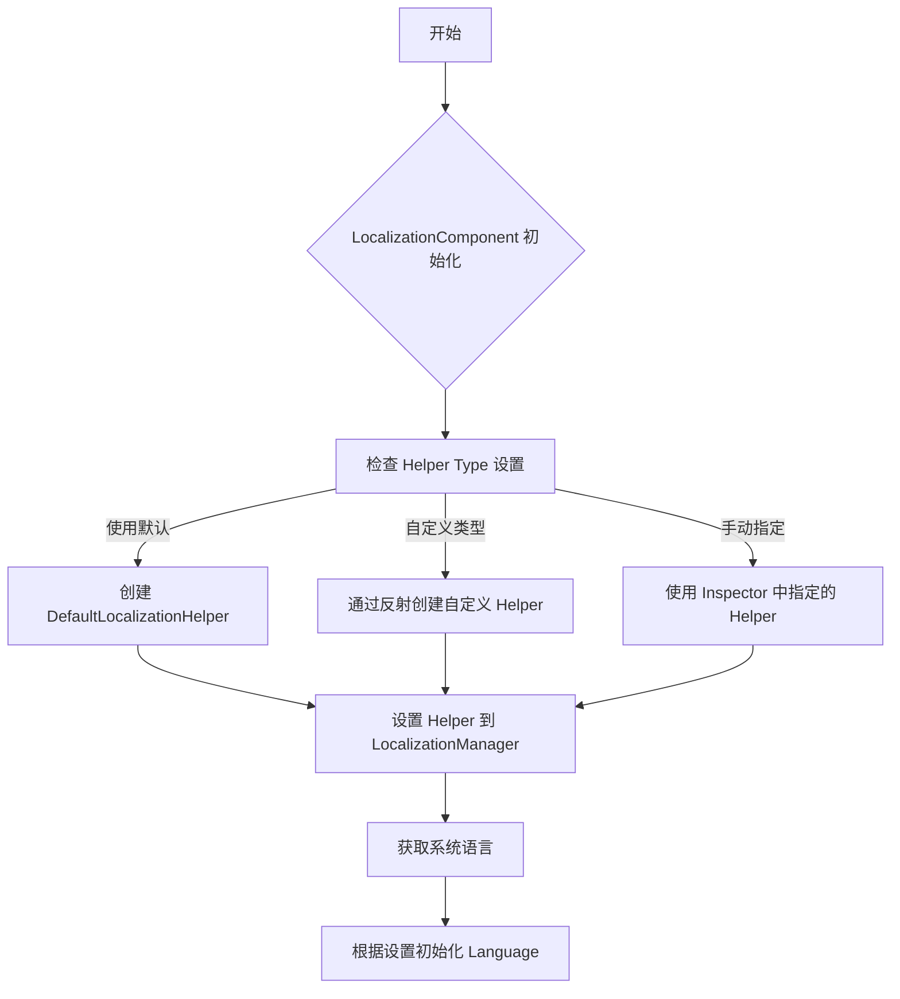
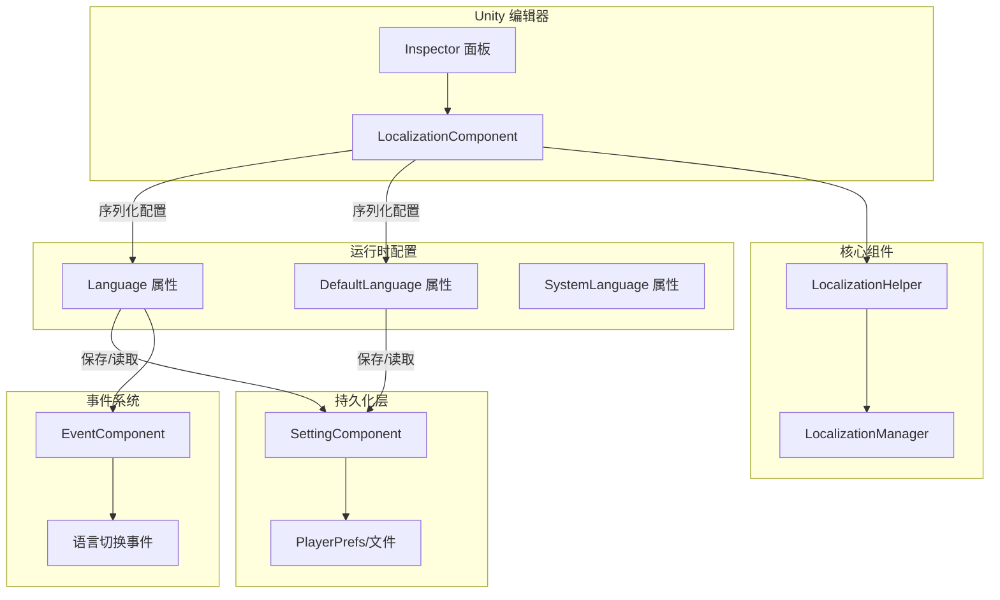

# 設定

このドキュメント詳細介绍 GameFrameX Localization コンポーネント的各项設定オプション，含みますエディタ設定和ランタイム設定。

## 概要

GameFrameX Localization コンポーネント提供柔軟的本地化設定机制，サポート通过 Unity エディタ界面設定和コードランタイム設定两种方法。設定系统采用分层設計，允许開発者自定義本地化辅助器、設定デフォルト语言、启用エディタテストモード等機能。

LocalizationComponent 是 Unity 引擎的コアコンポーネント，継承自 GameFrameworkComponent，通过シリアライズフィールド提供設定オプション。这些設定在コンポーネント初期化时生效，控制本地化系统的行为。

> ソースコードファイル：
> - [LocalizationComponent.cs](https://github.com/GameFrameX/com.gameframex.unity.localization/blob/main/Runtime/Localization/LocalizationComponent.cs#L48-L777)
> - [LocalizationManager.cs](https://github.com/GameFrameX/com.gameframex.unity.localization/blob/main/Runtime/Localization/Localization/LocalizationManager.cs#L43-L937)

## エディタ設定

### 追加本地化コンポーネント

在 Unity エディタ中，通过以下ステップ追加本地化コンポーネント：

1. 在シーン中作成空 GameObject 或选择现有对象
2. 点击メニュー **GameObject → GameFrameX → Localization**
3. 或在 Inspector パネル中点击 **Add Component**，検索 "Localization"

コンポーネント追加后，Inspector パネル将显示設定オプション。

### 設定オプション説明

```csharp
// LocalizationComponent 核心配置字段
[SerializeField] private string m_EditorLanguage = "zh_CN";           // 编辑器语言
[SerializeField] private string m_DefaultLanguage = "zh_CN";         // 默认语言
[SerializeField] private bool m_IsEnableEditorMode = false;          // 启用编辑器模式
[SerializeField] private string m_LocalizationHelperTypeName;        // 辅助器类型名称
[SerializeField] private LocalizationHelperBase m_CustomLocalizationHelper; // 自定义辅助器实例
```

> Source: [LocalizationComponentInspector.cs](https://github.com/GameFrameX/com.gameframex.unity.localization/blob/main/Editor/Inspector/LocalizationComponentInspector.cs#L42-L46)

下表詳細説明各設定项：

| 設定项 | タイプ | デフォルト值 | 説明 |
|--------|------|--------|------|
| **Default Language** | string | "zh_CN" | デフォルト语言コード，当ロード本地化失敗时使用此语言 |
| **Is Enable Editor Mode** | bool | false | 是否启用エディタモード，启用后使用エディタ语言而非ランタイム语言 |
| **Editor Language** | string | "zh_CN" | エディタモード下使用的语言，仅在エディタ中有效 |
| **Localization Helper** | HelperInfo | DefaultLocalizationHelper | 本地化辅助器タイプ，可自定義実装 |

### 语言コードリファレンス

语言コード遵循 RFC 5646 標準，フォーマット为 `[语言代码]_[国家/地区代码]`，例えば：
- `zh_CN` - 简体中文（中国）
- `zh_TW` - 繁体中文（台湾）
- `en_US` - 英语（美国）
- `ja_JP` - 日语（日本）
- `ko_KR` - 韩语（韩国）

系统预定義了丰富的语言コード常量，可通过 `LocalizationCode` 类直接参照：

```csharp
// 使用预定义的语言代码常量
LocalizationComponent component = gameObject.GetComponent<LocalizationComponent>();
component.DefaultLanguage = LocalizationCode.Chinese;        // zh_CN
component.DefaultLanguage = LocalizationCode.English;         // en_US
component.DefaultLanguage = LocalizationCode.Japanese;        // ja_JP
```

> Source: [LocalizationCode.cs](https://github.com/GameFrameX/com.gameframex.unity.localization/blob/main/Runtime/Localization/LocalizationCode.cs#L45-L986)

## ランタイム設定

### 通过コード設定语言

在游戏ランタイム，〜できます通过コード动态設定语言設定：

```csharp
using GameFrameX.Localization.Runtime;

// 获取本地化组件
var localizationComponent = GameEntry.GetComponent<LocalizationComponent>();

// 设置当前语言
localizationComponent.Language = "en_US";

// 设置默认语言（当加载失败时使用）
localizationComponent.DefaultLanguage = "zh_CN";

// 获取当前语言
string currentLanguage = localizationComponent.Language;

// 获取系统语言
string systemLanguage = localizationComponent.SystemLanguage;
```

> Source: [LocalizationComponent.cs](https://github.com/GameFrameX/com.gameframex.unity.localization/blob/main/Runtime/Localization/LocalizationComponent.cs#L116-L143)

### 設定持久化机制

Language 和 DefaultLanguage 設定会自动持久化到本地設定系统中。首次ランタイム，系统语言将作为デフォルト语言：

```csharp
// 初始化流程伪代码
if (Language == UnknownLocalization)
{
    Language = SystemLanguage;  // 使用系统语言
}
DefaultLanguage = m_DefaultLanguage != UnknownLocalization ? m_DefaultLanguage : SystemLanguage;
```

> Source: [LocalizationComponent.cs](https://github.com/GameFrameX/com.gameframex.unity.localization/blob/main/Runtime/Localization/LocalizationComponent.cs#L232-L237)

### 設定プロパティ详解

#### Language プロパティ

取得或設定当前本地化语言。設定新语言时会トリガー语言切换イベント：

```csharp
public string Language
{
    get
    {
        if (m_LocalizationManager.Language == UnknownLocalization)
        {
            var value = m_SettingComponent.GetString(nameof(LocalizationComponent) + "." + nameof(Language));
            if (value.IsNotNullOrWhiteSpace())
            {
                m_LocalizationManager.Language = value;
            }
        }
        return m_LocalizationManager.Language;
    }
    set
    {
        if (m_LocalizationManager.Language != value)
        {
            var oldLanguage = m_LocalizationManager.Language;
            m_LocalizationManager.Language = value;
            m_SettingComponent.SetString(nameof(LocalizationComponent) + "." + nameof(Language), value);
            m_SettingComponent.Save();
            var localizationLanguageChangeEventArgs = LocalizationLanguageChangeEventArgs.Create(oldLanguage, value);
            m_EventComponent.Fire(this, localizationLanguageChangeEventArgs);
        }
    }
}
```

**設計意图**：Language プロパティ采用延迟ロード机制，从持久化存储中读取上次保存的语言設定。設定新值时自动保存，確認してください语言偏好跨会话保持。同時にトリガーイベント通知其他系统语言已更改。

#### DefaultLanguage プロパティ

取得或設定デフォルト本地化语言，当ロード本地化失敗时使用：

```csharp
public string DefaultLanguage
{
    get
    {
        if (m_LocalizationManager.DefaultLanguage == UnknownLocalization)
        {
            var value = m_SettingComponent.GetString(nameof(LocalizationComponent) + "." + nameof(DefaultLanguage));
            if (value.IsNotNullOrWhiteSpace())
            {
                m_LocalizationManager.DefaultLanguage = value;
            }
        }
        return m_LocalizationManager.DefaultLanguage;
    }
    set
    {
        if (m_LocalizationManager.DefaultLanguage != value)
        {
            m_LocalizationManager.DefaultLanguage = value;
            m_SettingComponent.SetString(nameof(LocalizationComponent) + "." + nameof(DefaultLanguage), value);
            m_SettingComponent.Save();
        }
    }
}
```

**設計意图**：DefaultLanguage 作为回退机制，確認してください在目标语言リソース缺失时仍能显示内容，提升ユーザー体验。

#### SystemLanguage プロパティ

取得设备系统语言：

```csharp
public string SystemLanguage
{
    get { return m_LocalizationManager.SystemLanguage; }
}
```

系统语言由 LocalizationHelper 提供，DefaultLocalizationHelper 通过 CultureInfo 取得：

```csharp
public override string SystemLanguage
{
    get { return _regionName; }  // 如 "zh_CN", "en_US"
}
```

> Source: [DefaultLocalizationHelper.cs](https://github.com/GameFrameX/com.gameframex.unity.localization/blob/main/Runtime/Localization/DefaultLocalizationHelper.cs#L43-L57)

## 自定義本地化辅助器

### 为什么〜する必要があります自定義辅助器

デフォルト的 LocalizationHelper 通过 `CultureInfo.CurrentCulture.Name` 取得系统语言。在某些シーン下，你〜の可能性があります〜する必要があります自定義逻辑来确定系统语言，例えば：
- 从服务器取得语言設定
- 根据プレイヤー账户設定确定语言
- 使用設定ファイル中的语言設定

### 作成自定義辅助器

1. 継承 LocalizationHelperBase：

```csharp
using GameFrameX.Localization.Runtime;
using UnityEngine;

public class CustomLocalizationHelper : LocalizationHelperBase
{
    // 自定义系统语言获取逻辑
    public override string SystemLanguage
    {
        get
        {
            // 从服务器或配置获取语言
            return PlayerPrefs.GetString("Language", "zh_CN");
        }
    }
}
```

> Source: [LocalizationHelperBase.cs](https://github.com/GameFrameX/com.gameframex.unity.localization/blob/main/Runtime/Localization/LocalizationHelperBase.cs#L41-L48)

2. 在エディタ中設定自定義辅助器：

在 LocalizationComponent 的 Inspector パネル中，設定 Helper Type 为自定義类，或直接将自定義辅助器コンポーネント拖入 Custom Localization Helper フィールド。

### 辅助器設定フロー



> Source: [LocalizationComponent.cs](https://github.com/GameFrameX/com.gameframex.unity.localization/blob/main/Runtime/Localization/LocalizationComponent.cs#L214-L237)

## 設定アーキテクチャ图



## 設定オプション汇总表

### LocalizationComponent 設定

| プロパティ | タイプ | デフォルト值 | ランタイム可写 | 説明 |
|------|------|--------|------------|------|
| `EditorLanguage` | string | "zh_CN" | 否（仅エディタ） | エディタテスト用语言 |
| `DefaultLanguage` | string | "zh_CN" | 是 | ロード失敗时的回退语言 |
| `IsEnableEditorMode` | bool | false | 否 | 是否在エディタ中使用 EditorLanguage |
| `Language` | string | 系统语言 | 是 | 当前使用的语言 |
| `SystemLanguage` | string | 设备语言 | 只读 | 操作系统语言 |

### LocalizationManager コアプロパティ

| プロパティ | タイプ | 説明 |
|------|------|------|
| `DefaultLanguage` | string | デフォルト语言 |
| `Language` | string | 当前语言 |
| `SystemLanguage` | string | 系统语言 |
| `DictionaryCount` | int | 当前字典数量 |

### 预定義语言コード（常用）

| 常量 | 值 | 説明 |
|------|-----|------|
| `LocalizationCode.Chinese` | "zh_CN" | 简体中文 |
| `LocalizationCode.ChineseTraditionalTW` | "zh_TW" | 繁体中文（台湾） |
| `LocalizationCode.Japanese` | "ja_JP" | 日语 |
| `LocalizationCode.Korean` | "ko_KR` | 韩语 |
| `LocalizationCode.English` | "en_US" | 英语（美国） |
| `LocalizationCode.EnglishUK` | "en_GB" | 英语（英国） |
| `LocalizationCode.French` | "fr_FR" | 法语 |
| `LocalizationCode.German` | "de_DE" | 德语 |
| `LocalizationCode.Spanish` | "es_ES" | 西班牙语 |
| `LocalizationCode.Russian` | "ru_RU` | 俄语 |

> Source: [LocalizationCode.cs](https://github.com/GameFrameX/com.gameframex.unity.localization/blob/main/Runtime/Localization/LocalizationCode.cs#L46-L148)

## ベストプラクティス

### 1. 游戏启动时設定语言

お勧め在游戏启动フロー中尽早設定语言，確認してください所有 UI 文本使用正确的语言：

```csharp
// 在游戏初始化阶段设置语言
var localizationComponent = GameEntry.GetComponent<LocalizationComponent>();

// 方式一：使用保存的语言设置
string savedLanguage = PlayerPrefs.GetString("GameLanguage");
if (!string.IsNullOrEmpty(savedLanguage))
{
    localizationComponent.Language = savedLanguage;
}
else
{
    // 方式二：使用系统语言作为默认
    localizationComponent.Language = localizationComponent.SystemLanguage;
}
```

### 2. 语言切换监听

监听语言切换イベント以アップデート UI：

```csharp
// 订阅语言切换事件
EventComponent eventComponent = GameEntry.GetComponent<EventComponent>();
eventComponent.Subscribe(LocalizationLanguageChangeEventArgs.EventId, OnLanguageChanged);

private void OnLanguageChanged(object sender, GameEventArgs e)
{
    var args = (LocalizationLanguageChangeEventArgs)e;
    Debug.Log($"语言从 {args.OldLanguage} 切换到 {args.Language}");
    
    // 刷新所有需要本地化的 UI 组件
    // RefreshAllLocalizedUI();
}
```

> Source: [LocalizationLanguageChangeEventArgs.cs](https://github.com/GameFrameX/com.gameframex.unity.localization/blob/main/Runtime/EventArgs/LocalizationLanguageChangeEventArgs.cs#L52-L58)

### 3. 設定確認清单

デプロイ游戏前確認以下設定：

- [ ] DefaultLanguage 設定为プロジェクト主な语言
- [ ] 所有サポート的语言都有对应的字典リソース
- [ ] 自定義 LocalizationHelper 已正确実装
- [ ] 语言切换イベント已正确処理
- [ ] テスト了系统语言不在サポート列表时的回退行为

## 関連リンク

- [取得本地化字符串](../4-core-features.get-string) - 理解する如何取得本地化文本
- [字典管理](../4-core-features.dictionary-management) - 理解する字典数据管理
- [语言切换与イベント](../4-core-features.language-switching) - 理解する语言切换机制
- [API リファレンス](../5-api-reference) - 完全な的 API ドキュメント
- [快速开始](../3-getting-started) - 快速上手ガイド
