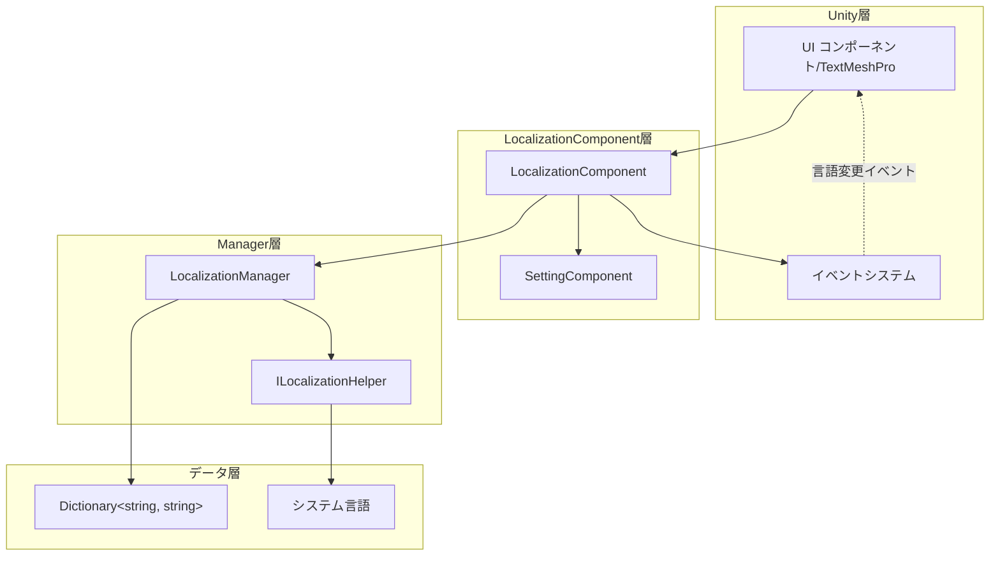

# ベストプラクティス

このドキュメントでは、GameFrameX Localization コンポーネントのベストプラクティスガイドを提供し、開発者が効率的かつ规范的に多言語機能を実装できるように支援します。

## 概要

GameFrameX Localization コンポーネントは、Unity ゲームに完全なローカライゼーションソリューションを提供します。このドキュメントのベストプラクティスに従うことで、保守可能で拡張可能な多言語システムを構築し、一般的な落とし穴や逆パターンを避けることができます。

## コアアーキテクチャの復習



### コンポーネントの責務

| コンポーネント | 責務 |
|------|------|
| LocalizationComponent | Unity コンポーネント層、初期化とイベントトリガーを担当 |
| LocalizationManager | コアマネージャー、辞書ストレージと文字列検索を処理 |
| ILocalizationHelper | システム言語検出インターフェース、カスタム実装可能 |
| SettingComponent | 言語設定の永続化 |

## ベストプラクティス

### 1. キー名の命名規則

管理と検索を容易にするために、階層的なキー名命名戦略を採用します。

**推奨フォーマット：**

```csharp
// フォーマット：機能モジュール_画面要素_具体的な説明
"main_menu_start_button"           // メインメニュー-開始ボタン
"main_menu_settings_button"        // メインメニュー-設定ボタン
"game_hud_score_label"             // ゲームHUD- scorelabel
"game_dialog_confirm_message"      // ゲームダイアログ-確認メッセージ
"settings_audio_master_volume"     // 設定-オーディオ-マスターボリューム
```

**非推奨：**

```csharp
// ❌ 規則性のない命名
"start"                            // 意味が不明確
"button1"                          // コンテキストがない
"msg_001"                          // 保守が難しい
```

**定数クラスを使用してキーを管理：**

```csharp
// キーを管理するための专門的な定数クラスを作成することを推奨
public static class LocalizationKeys
{
    public const string MainMenuStart = "main_menu_start_button";
    public const string MainMenuSettings = "main_menu_settings_button";
    public const string GameHudScore = "game_hud_score_label";
}
```

> Source: [LocalizationManager.cs](https://github.com/GameFrameX/com.gameframex.unity.localization/blob/main/Runtime/Localization/Localization/LocalizationManager.cs#L168-L177)

### 2. デフォルト言語の設定

常に合理的なデフォルト言語を設定し、`DefaultLanguage` プロパティをフォールバックメカニズムとして使用します。

**基本的な設定：**

```csharp
var localizationComponent = GameEntry.GetComponent<LocalizationComponent>();
// デフォルト言語を簡体字中国語に設定
localizationComponent.DefaultLanguage = LocalizationCode.ChineseSimplified;
```

> Source: [LocalizationComponent.cs](parameterName=86-L110)

**多层フォールバック戦略：**

```csharp
// フォールバックチェーンを設計：ユーザー設定 → システム言語 → デフォルト言語
// 1. まずユーザーが保存した言語設定を使用しようとする
// 2. 設定されていない場合は、システム言語を使用
// 3. システム言語がサポートされていない場合は、デフォルト言語にフォールバック
if (string.IsNullOrEmpty(savedLanguage))
{
    localizationComponent.Language = localizationComponent.SystemLanguage;
}
```

### 3. パラメータ化文字列の処理

ジェネリックメソッドを使用して動的コンテンツを処理し、最大 16 個のパラメータをサポートしています。

**単一パラメータの使用：**

```csharp
// 简单なパラメータ置換
string welcome = localizationComponent.GetString("game_welcome_message", playerName);
// テンプレート："おかえりなさい、{0}！" → "おかえりなさい、田中！"
```

> Source: [LocalizationManager.cs](parameterName=205-L221)

**複数パラメータの使用：**

```csharp
// 複雑なフォーマット
string levelInfo = localizationComponent.GetString("game_level_info",
    currentLevel,      // T1
    maxLevel,          // T2
    playerScore);      // T3
// テンプレート："第 {0} ステージ / 全 {1} ステージ - スコア：{2}"
```

> Source: [LocalizationManager.cs](parameterName=263-L279)

**params 配列の使用：**

```csharp
// 動的数のパラメータ
object[] args = { itemName, itemCount, playerGold };
string message = localizationComponent.GetString("shop_purchase_info", args);
```

> Source: [LocalizationManager.cs](parameterName=186-L195)

### 4. 言語変更イベントの処理

言語変更イベントを監視して、UI の自動更新を実装します。

**イベントの購読：**

```csharp
private void OnLanguageChanged(object sender, LocalizationLanguageChangeEventArgs e)
{
    // すべてのローカライズテキストを更新
    RefreshAllLocalizedTexts();

    // または現在のシーンを再ロード
    // SceneManager.LoadScene(SceneManager.GetActiveScene().name);
}

private void Start()
{
    var eventComponent = GameEntry.GetComponent<EventComponent>();
    eventComponent.Subscribe(LocalizationLanguageChangeEventArgs.EventId, OnLanguageChanged);
}
```

> Source: [LocalizationLanguageChangeEventArgs.cs](https://github.com/GameFrameX/com.gameframex.unity.localization/blob/main/Runtime/EventArgs/LocalizationLanguageChangeEventArgs.cs#L52-L58)

**イベントのトリガーメカニズム：**

```csharp
// LocalizationComponent で言語を設定的时候会自動的にイベントをトリガー
localizationComponent.Language = LocalizationCode.English;
// LocalizationLanguageChangeEventArgs イベントをトリガー
```

> Source: [LocalizationComponent.cs](parameterName=131-L143)

### 5. 辞書管理策略

**機能モジュール別に辞書を整理：**

```csharp
// UI 辞書
AddRawString("ui_main_menu_title", "メインメニュー");
AddRawString("ui_main_menu_start", "ゲーム開始");
AddRawString("ui_main_menu_settings", "設定");

// ゲーム内辞書
AddRawString("game_hud_health", "体力");
AddRawString("game_hud_energy", "エネルギー");
AddRawString("game_level_complete", "ステージ完了！");

// ヒント情報辞書
AddRawString("tips_welcome", "ゲームの世界へようこそ");
AddRawString("tips_first_step", "方向キーでキャラクターを移動");
```

**辞書の動的追加：**

```csharp
// ゲーム起動時に言語パックをロード
public void LoadLanguagePack(string languageCode)
{
    // リソースシステムから言語パックデータをロード
    var languageData = Resources.Load<TextAsset>($"Languages/{languageCode}");
    var lines = languageData.text.Split('\n');

    foreach (var line in lines)
    {
        var parts = line.Split('=');
        if (parts.Length == 2)
        {
            localizationComponent.AddRawString(parts[0].Trim(), parts[1].Trim());
        }
    }
}
```

> Source: [LocalizationManager.cs](parameterName=899-L913)

### 6. パフォーマンス最適化

**Update での GetString の頻繁な呼び出しを避ける：**

```csharp
// ❌ アンチパターン：每フレーム呼び出し
void Update()
{
    text.text = localizationComponent.GetString("game_timer", currentTime);
}

// ✅ 正しいパターン：文字列をキャッシュし、値が変わった場合のみ更新
private string _cachedTimeKey = "game_timer";
private float _lastUpdateTime;

void Update()
{
    if (Mathf.Abs(currentTime - _lastUpdateTime) > 0.1f)
    {
        text.text = localizationComponent.GetString(_cachedTimeKey, currentTime);
        _lastUpdateTime = currentTime;
    }
}
```

**HasRawString を使用した存在確認：**

```csharp
// キーが存在するかをチェックし、エラーシンボルを返すのを避ける
if (localizationComponent.HasRawString(key))
{
    var value = localizationComponent.GetString(key);
}
```

> Source: [LocalizationManager.cs](parameterName=862-L870)

### 7. カスタム言語検出ヘルパー

デフォルトのシステム言語検出が要件を満たさない場合は、`ILocalizationHelper` を拡張できます。

**カスタムヘルパーの実装：**

```csharp
public class CustomLocalizationHelper : LocalizationHelperBase
{
    public override string SystemLanguage
    {
        get
        {
            // カスタム言語検出ロジック
            // 例：プレイヤー設定から言語設定を読み取る
            var config = PlayerPrefs.GetString("language_preference");
            return string.IsNullOrEmpty(config)
                ? base.SystemLanguage
                : config;
        }
    }
}
```

> Source: [DefaultLocalizationHelper.cs](https://github.com/GameFrameX/com.gameframex.unity.localization/blob/main/Runtime/Localization/DefaultLocalizationHelper.cs#L41-L58)

### 8. 標準言語コードの使用

`LocalizationCode` クラスの定数を使用して、言語コードの一貫性を確保します。

```csharp
// ✅ 推奨：定義済み定数を使用
localizationComponent.Language = LocalizationCode.ChineseSimplified;  // "zh_CN"
localizationComponent.Language = LocalizationCode.English;             // "en_US"
localizationComponent.Language = LocalizationCode.Japanese;           // "ja_JP"

// ❌ 非推奨：手動で文字列を入力
localizationComponent.Language = "zh-CN";  // フォーマットが一致しない
```

> Source: [LocalizationCode.cs](https://github.com/GameFrameX/com.gameframex.unity.localization/blob/main/Runtime/Localization/LocalizationCode.cs#L1-L986)

### 9. エラー処理とフォールバック

**欠落しているキーの処理：**

```csharp
// GetString メソッドは欠落しているキーを自動的に処理
// 戻り値フォーマット：<NoKey>key_name
string result = localizationComponent.GetString("nonexistent_key");
// 戻り値：<NoKey>nonexistent_key>
```

> Source: [LocalizationManager.cs](parameterName=170-L177)

**カスタムフォールバックロジックの追加：**

```csharp
public string GetStringSafe(string key, string fallback = "")
{
    if (localizationComponent.HasRawString(key))
    {
        return localizationComponent.GetString(key);
    }

    Log.Warning($"Localization key not found: {key}");
    return fallback;
}
```

### 10. エディターモードのサポート

エディターモードを使用して、開発とテストを加速します。

```csharp
// LocalizationComponent でエディターモードを有効化
// m_IsEnableEditorMode = true;
// m_EditorLanguage = "zh_CN";

// エディターでは素早く言語を切り替えてプレビュー效果を確認可能
// ランタイムの動作には影響しない
```

> Source: [LocalizationComponent.cs](parameterName=227-L236)

## 一般的なシナリオの実践

### シナリオ一：ゲーム内言語切り替え

```csharp
public class LanguageSwitcher : MonoBehaviour
{
    public void SwitchToChinese()
    {
        var loc = GameEntry.GetComponent<LocalizationComponent>();
        loc.Language = LocalizationCode.ChineseSimplified;
    }

    public void SwitchToEnglish()
    {
        var loc = GameEntry.GetComponent<LocalizationComponent>();
        loc.Language = LocalizationCode.English;
    }
}
```

### シナリオ二：ローカライズテキストコンポーネント

```csharp
public class LocalizedText : MonoBehaviour
{
    [SerializeField] private string _localizationKey;
    private TextMeshProUGUI _text;

    private void Start()
    {
        _text = GetComponent<TextMeshProUGUI>();
        RefreshText();

        // 言語変更イベントを購読
        GameEntry.GetComponent<EventComponent>()
            .Subscribe(LocalizationLanguageChangeEventArgs.EventId, OnLanguageChanged);
    }

    private void RefreshText()
    {
        var loc = GameEntry.GetComponent<LocalizationComponent>();
        _text.text = loc.GetString(_localizationKey);
    }

    private void OnLanguageChanged(object sender, GameEventArgs e)
    {
        RefreshText();
    }
}
```

### シナリオ三：動的フォーマットテキスト

```csharp
// アイテム情報のフォーマット
string itemDescription = localizationComponent.GetString(
    "game_item_description",
    itemName,      // アイテム名
    itemRarity,    // レアリティ
    itemLevel,     // アイテムレベル
    itemDamage     // 攻击力
);
// テンプレート："【{0}】\nレアリティ：{1}\nレベル：{2}\n攻击力：{3}"
```

## まとめ

上記のベストプラクティスに従うことで、高品質な多言語システムの構築に役立ちます：

1. **キー名の規範化** - 階層的な命名を使用して、保守と検索を容易にする
2. **デフォルト言語戦略** - 合理的なフォールバックメカニズムを設定
3. **イベント駆動更新** - 言語変更イベントを使用して UI を更新
4. **パフォーマンス关注** - 不必要な繰り返し呼び出しを避ける
5. **拡張性設計** - インターフェースシステムを使用して動作をカスタマイズ
6. **標準化コード** - `LocalizationCode` 定数クラスを使用

---

## 関連リンク

- [コア機能 - ローカライズ文字列の取得](./04.get-string)
- [コア機能 - 辞書管理](./05.dictionary-management)
- [コア機能 - 言語切り替えとイベント](./06.language-switching)
- [API リファレンス](./09.api-reference)
- [設定](./07.configuration)
