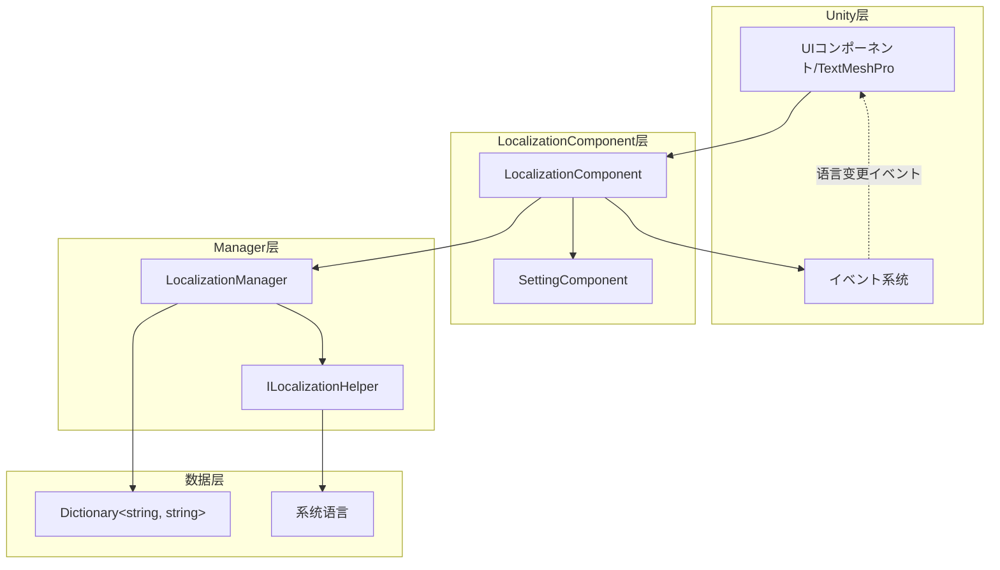

# 最佳实践

本文档提供 GameFrameX Localization コンポーネント的最佳实践指南，帮助開発者高效、规范地実装多语言機能。

## 概要

GameFrameX Localization コンポーネント为 Unity ゲーム提供します完整的本地化解決策。遵循本文档的最佳实践，可能帮助你构建可维护、可扩展的多语言系统，避免常见的陷阱和反模式。

## コア架构回顾



### コンポーネント职责

| コンポーネント | 职责 |
|------|------|
| LocalizationComponent | Unity コンポーネント层，负责初期化和イベント触发 |
| LocalizationManager | コア管理器，处理字典存储和字符串检索 |
| ILocalizationHelper | 系统语言检测インターフェース，可自定义実装 |
| SettingComponent | 持久化语言設定 |

## 最佳实践

### 1. 键名命名规范

采用层级化的键名命名策略，便于管理和查找。

**推荐格式：**

```csharp
// 格式：機能模块_界面元素_具体説明
"main_menu_start_button"           // 主菜单-开始按钮
"main_menu_settings_button"        // 主菜单-設定按钮
"game_hud_score_label"             // ゲームHUD-分数标签
"game_dialog_confirm_message"      // ゲーム弹窗-确认消息
"settings_audio_master_volume"     // 設定-音频-主音量
```

**不推荐：**

```csharp
// ❌ 无规律命名
"start"                            // 含义不明确
"button1"                          // 无上下文
"msg_001"                          // 难以维护
```

**使用常量クラス管理键名：**

```csharp
// 建议作成专门的常量クラス管理键名
public static class LocalizationKeys
{
    public const string MainMenuStart = "main_menu_start_button";
    public const string MainMenuSettings = "main_menu_settings_button";
    public const string GameHudScore = "game_hud_score_label";
}
```

> Source: [LocalizationManager.cs](https://github.com/GameFrameX/com.gameframex.unity.localization/blob/main/Runtime/Localization/Localization/LocalizationManager.cs#L168-L177)

### 2. 默认语言設定

始终設定合理的默认语言，并利用 `DefaultLanguage` プロパティ作为回退机制。

**基础設定：**

```csharp
var localizationComponent = GameEntry.GetComponent<LocalizationComponent>();
// 設定默认语言为简体中文
localizationComponent.DefaultLanguage = LocalizationCode.ChineseSimplified;
```

> Source: [LocalizationComponent.cs](parameterName=86-L110)

**多层回退策略：**

```csharp
// 设计回退链：用户設定 -> 系统语言 -> 默认语言
// 1. 首先尝试使用用户保存的语言設定
// 2. 如果未設定，使用系统语言
// 3. 如果系统语言不サポート，回退到默认语言
if (string.IsNullOrEmpty(savedLanguage))
{
    localizationComponent.Language = localizationComponent.SystemLanguage;
}
```

### 3. 参数化字符串处理

利用泛型メソッド处理动态内容，サポート最多 16 个参数。

**单参数使用：**

```csharp
// 简单参数替换
string welcome = localizationComponent.GetString("game_welcome_message", playerName);
// 模板："欢迎回来，{0}！" -> "欢迎回来，张三！"
```

> Source: [LocalizationManager.cs](parameterName=205-L221)

**多参数使用：**

```csharp
// 复杂格式化
string levelInfo = localizationComponent.GetString("game_level_info", 
    currentLevel,      // T1
    maxLevel,          // T2
    playerScore);      // T3
// 模板："第 {0} 关 / 共 {1} 关 - 分数：{2}"
```

> Source: [LocalizationManager.cs](parameterName=263-L279)

**使用 params 数组：**

```csharp
// 动态数量的参数
object[] args = { itemName, itemCount, playerGold };
string message = localizationComponent.GetString("shop_purchase_info", args);
```

> Source: [LocalizationManager.cs](parameterName=186-L195)

### 4. 语言变更イベント处理

监听语言变更イベント，実装 UI 的自动刷新。

**イベント订阅：**

```csharp
private void OnLanguageChanged(object sender, LocalizationLanguageChangeEventArgs e)
{
    // 刷新所有本地化文本
    RefreshAllLocalizedTexts();
    
    // 或者重新加载当前シーン
    // SceneManager.LoadScene(SceneManager.GetActiveScene().name);
}

private void Start()
{
    var eventComponent = GameEntry.GetComponent<EventComponent>();
    eventComponent.Subscribe(LocalizationLanguageChangeEventArgs.EventId, OnLanguageChanged);
}
```

> Source: [LocalizationLanguageChangeEventArgs.cs](https://github.com/GameFrameX/com.gameframex.unity.localization/blob/main/Runtime/EventArgs/LocalizationLanguageChangeEventArgs.cs#L52-L58)

**イベント触发机制：**

```csharp
// 在 LocalizationComponent 中設定语言时会自动触发イベント
localizationComponent.Language = LocalizationCode.English; 
// 触发 LocalizationLanguageChangeEventArgs イベント
```

> Source: [LocalizationComponent.cs](parameterName=131-L143)

### 5. 字典管理策略

**按機能模块组织字典：**

```csharp
// UI 字典
AddRawString("ui_main_menu_title", "主菜单");
AddRawString("ui_main_menu_start", "开始ゲーム");
AddRawString("ui_main_menu_settings", "設定");

// ゲーム内字典
AddRawString("game_hud_health", "生命值");
AddRawString("game_hud_energy", "能量值");
AddRawString("game_level_complete", "关卡完成！");

// ヒント信息字典
AddRawString("tips_welcome", "欢迎来到ゲーム世界");
AddRawString("tips_first_step", "使用方向键移动角色");
```

**动态添加字典：**

```csharp
// 在ゲーム启动时加载语言包
public void LoadLanguagePack(string languageCode)
{
    // 从リソース系统加载语言包数据
    var languageData = Resources.Load<TextAsset>($"Languages/{languageCode}");
    var lines = languageData.text.Split('\n');
    
    foreach (var line in lines)
    {
        var parts = line.Split('=');
        if (parts.Length == 2)
        {
            localizationComponent.AddRawString(parts[0].Trim(), parts[1].Trim());
        }
    }
}
```

> Source: [LocalizationManager.cs](parameterName=899-L913)

### 6. 性能优化

**避免在 Update 中频繁呼び出し GetString：**

```csharp
// ❌ 反模式：每帧呼び出し
void Update()
{
    text.text = localizationComponent.GetString("game_timer", currentTime);
}

// ✅ 正确模式：缓存字符串，只在值变化时更新
private string _cachedTimeKey = "game_timer";
private float _lastUpdateTime;

void Update()
{
    if (Mathf.Abs(currentTime - _lastUpdateTime) > 0.1f)
    {
        text.text = localizationComponent.GetString(_cachedTimeKey, currentTime);
        _lastUpdateTime = currentTime;
    }
}
```

**使用 HasRawString 进行存在性检查：**

```csharp
// 检查键是否存在，避免返回错误标记
if (localizationComponent.HasRawString(key))
{
    var value = localizationComponent.GetString(key);
}
```

> Source: [LocalizationManager.cs](parameterName=862-L870)

### 7. 自定义语言检测助手

当默认的系统语言检测不满足需求时，可能扩展 `ILocalizationHelper`。

**実装自定义助手：**

```csharp
public class CustomLocalizationHelper : LocalizationHelperBase
{
    public override string SystemLanguage
    {
        get 
        {
            // 自定义语言检测逻辑
            // 例如：从玩家配置中读取语言設定
            var config = PlayerPrefs.GetString("language_preference");
            return string.IsNullOrEmpty(config) 
                ? base.SystemLanguage 
                : config;
        }
    }
}
```

> Source: [DefaultLocalizationHelper.cs](https://github.com/GameFrameX/com.gameframex.unity.localization/blob/main/Runtime/Localization/DefaultLocalizationHelper.cs#L41-L58)

### 8. 使用标准语言代码

使用 `LocalizationCode` クラス中的常量确保语言代码的一致性。

```csharp
// ✅ 推荐：使用预定义常量
localizationComponent.Language = LocalizationCode.ChineseSimplified;  // "zh_CN"
localizationComponent.Language = LocalizationCode.English;             // "en_US"
localizationComponent.Language = LocalizationCode.Japanese;           // "ja_JP"

// ❌ 不推荐：手动输入字符串
localizationComponent.Language = "zh-CN";  // 格式不一致
```

> Source: [LocalizationCode.cs](https://github.com/GameFrameX/com.gameframex.unity.localization/blob/main/Runtime/Localization/LocalizationCode.cs#L1-L986)

### 9. 错误处理与回退

**处理缺失的键：**

```csharp
// GetString メソッド会自动处理缺失的键
// 返回格式：<NoKey>key_name
string result = localizationComponent.GetString("nonexistent_key");
// 返回：<NoKey>nonexistent_key>
```

> Source: [LocalizationManager.cs](parameterName=170-L177)

**添加自定义回退逻辑：**

```csharp
public string GetStringSafe(string key, string fallback = "")
{
    if (localizationComponent.HasRawString(key))
    {
        return localizationComponent.GetString(key);
    }
    
    Log.Warning($"Localization key not found: {key}");
    return fallback;
}
```

### 10. 编辑器模式サポート

利用编辑器模式加速开发和测试。

```csharp
// 在 LocalizationComponent 中启用编辑器模式
// m_IsEnableEditorMode = true;
// m_EditorLanguage = "zh_CN";

// 在编辑器中可能快速切换语言预览效果
// 不影响运行时行为
```

> Source: [LocalizationComponent.cs](parameterName=227-L236)

## 常见シーン实践

### シーン一：ゲーム内语言切换

```csharp
public class LanguageSwitcher : MonoBehaviour
{
    public void SwitchToChinese()
    {
        var loc = GameEntry.GetComponent<LocalizationComponent>();
        loc.Language = LocalizationCode.ChineseSimplified;
    }

    public void SwitchToEnglish()
    {
        var loc = GameEntry.GetComponent<LocalizationComponent>();
        loc.Language = LocalizationCode.English;
    }
}
```

### シーン二：本地化文本コンポーネント

```csharp
public class LocalizedText : MonoBehaviour
{
    [SerializeField] private string _localizationKey;
    private TextMeshProUGUI _text;

    private void Start()
    {
        _text = GetComponent<TextMeshProUGUI>();
        RefreshText();
        
        // 订阅语言变更イベント
        GameEntry.GetComponent<EventComponent>()
            .Subscribe(LocalizationLanguageChangeEventArgs.EventId, OnLanguageChanged);
    }

    private void RefreshText()
    {
        var loc = GameEntry.GetComponent<LocalizationComponent>();
        _text.text = loc.GetString(_localizationKey);
    }

    private void OnLanguageChanged(object sender, GameEventArgs e)
    {
        RefreshText();
    }
}
```

### シーン三：动态格式化文本

```csharp
// 物品信息格式化
string itemDescription = localizationComponent.GetString(
    "game_item_description",
    itemName,      // 物品名称
    itemRarity,    // 稀有度
    itemLevel,     // 物品等级
    itemDamage     // 攻击力
);
// 模板："【{0}】\n稀有度：{1}\n等级：{2}\n攻击力：{3}"
```

## 总结

遵循以上最佳实践，可能帮助你构建高质量的多语言系统：

1. **键名规范化** - 使用层级化命名，便于维护和查找
2. **默认语言策略** - 設定合理的回退机制
3. **イベント驱动更新** - 利用语言变更イベント刷新 UI
4. **性能关注** - 避免不必要的重复呼び出し
5. **扩展性设计** - 利用インターフェース系统自定义行为
6. **标准化代码** - 使用 `LocalizationCode` 常量クラス

---

## 関連リンク

- [コア機能 - 取得本地化字符串](./4-core-features.get-string)
- [コア機能 - 字典管理](./4-core-features.dictionary-management)
- [コア機能 - 语言切换与イベント](./4-core-features.language-switching)
- [API 参考](./5-api-reference)
- [配置](./6-configuration)
