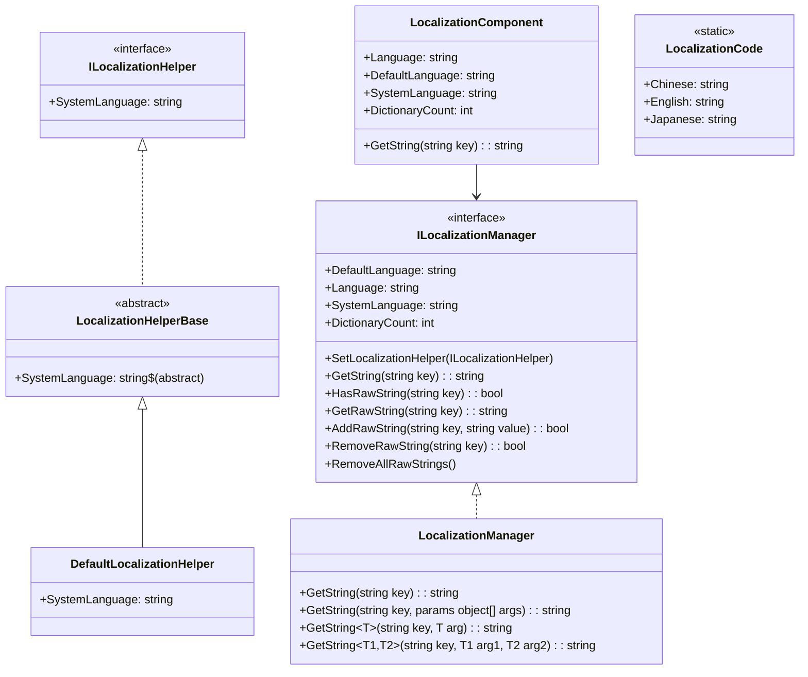
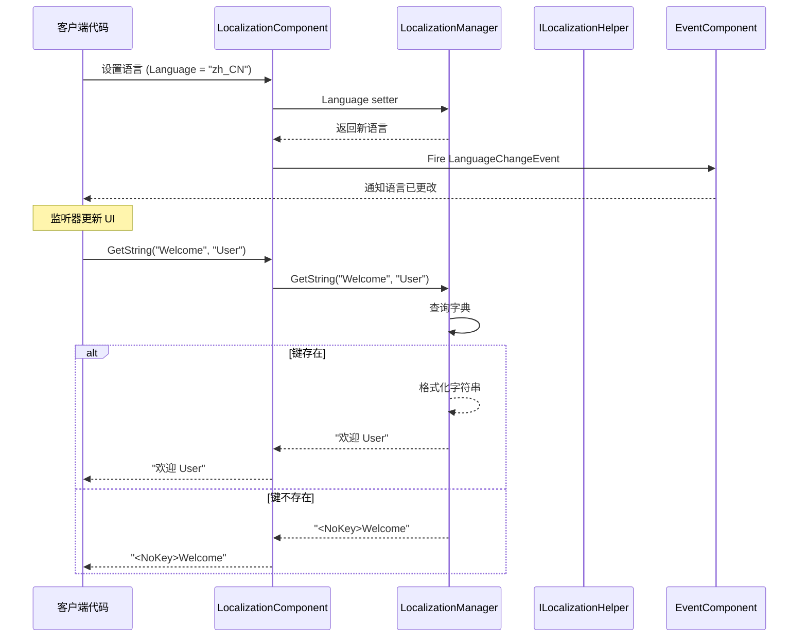

# API リファレンス

このドキュメント詳細介绍 GameFrameX Localization モジュール提供的所有公共 API インターフェース、类和メソッド。

## 概要

GameFrameX Localization モジュール提供します一套完全な的本地化解決策，含みます：
- 多语言字符串管理
- ランタイム语言切换
- パラメータ化字符串フォーマット化
- 系统语言自动检测
- イベント驱动アーキテクチャ

## コアアーキテクチャ



## ILocalizationManager インターフェース

`ILocalizationManager` 是本地化系统的コアインターフェース，定義了管理本地化字符串的所有必需操作。

> Source: [ILocalizationManager.cs](https://github.com/GameFrameX/com.gameframex.unity.localization/blob/main/Runtime/Localization/Localization/ILocalizationManager.cs#L34-L529)

### プロパティ

| プロパティ | タイプ | 説明 |
|------|------|------|
| `DefaultLanguage` | `string` | 取得或設定デフォルト本地化语言。当ロード本地化失敗时使用此语言。 |
| `Language` | `string` | 取得或設定当前本地化语言。 |
| `SystemLanguage` | `string` | 取得系统语言。 |
| `DictionaryCount` | `int` | 取得当前ロード的字典数量。 |

### メソッド

#### `SetLocalizationHelper`

```csharp
void SetLocalizationHelper(ILocalizationHelper localizationHelper)
```

設定本地化辅助器，用于取得系统语言情報。

**パラメータ：**
- `localizationHelper` (ILocalizationHelper): 本地化辅助器インスタンス。

> Source: [ILocalizationManager.cs](https://github.com/GameFrameX/com.gameframex.unity.localization/blob/main/Runtime/Localization/Localization/ILocalizationManager.cs#L71)

---

#### `GetString(string key): string`

根据字典主键取得字典内容字符串。

```csharp
string GetString(string key)
```

**パラメータ：**
- `key` (string): 字典主键。

**返す：** 字典内容字符串，もし键不存在返す `<NoKey>{key}` フォーマット的エラー情報。

> Source: [LocalizationManager.cs](https://github.com/GameFrameX/com.gameframex.unity.localization/blob/main/Runtime/Localization/Localization/LocalizationManager.cs#L168-L177)

---

#### `GetString(string key, params object[] args): string`

根据字典主键取得字典内容字符串，并使用パラメータ列表フォーマット化。

```csharp
string GetString(string key, params object[] args)
```

**パラメータ：**
- `key` (string): 字典主键。
- `args` (params object[]): フォーマット化パラメータ列表。

**返す：** フォーマット化后的字典内容字符串。

> Source: [LocalizationManager.cs](https://github.com/GameFrameX/com.gameframex.unity.localization/blob/main/Runtime/Localization/Localization/LocalizationManager.cs#L186-L195)

---

#### ジェネリック GetString メソッド

系统提供します 17 个ジェネリックオーバーロードメソッド，サポート 0 到 16 个タイプ安全パラメータ：

| メソッド签名 | 説明 |
|----------|------|
| `GetString<T>(string key, T arg)` | 单パラメータフォーマット化 |
| `GetString<T1, T2>(string key, T1 arg1, T2 arg2)` | 双パラメータフォーマット化 |
| `GetString<T1, T2, T3>(string key, T1 arg1, T2 arg2, T3 arg3)` | 三パラメータフォーマット化 |
| ... | ... |
| `GetString<T1, ..., T16>(string key, T1 arg1, ..., T16 arg16)` | 十六パラメータフォーマット化 |

```csharp
// 示例：使用泛型 GetString 进行类型安全的格式化
string message = localizationManager.GetString("Welcome", "John", 25);
// 字典内容："欢迎 {0}，您今年 {1} 岁了"
// 结果："欢迎 John，您今年 25 岁了"
```

> Source: [LocalizationManager.cs](https://github.com/GameFrameX/com.gameframex.unity.localization/blob/main/Runtime/Localization/Localization/LocalizationManager.cs#L205-L855)

---

#### `HasRawString(string key): bool`

確認指定键的字典是否存在。

```csharp
bool HasRawString(string key)
```

**パラメータ：**
- `key` (string): 字典主键。

**返す：** 是否存在该字典。

> Source: [LocalizationManager.cs](https://github.com/GameFrameX/com.gameframex.unity.localization/blob/main/Runtime/Localization/Localization/LocalizationManager.cs#L862-L870)

---

#### `GetRawString(string key): string`

取得字典原始值（不经过フォーマット化処理）。

```csharp
string GetRawString(string key)
```

**パラメータ：**
- `key` (string): 字典主键。

**返す：** 字典原始值，もし键不存在返す空字符串。

> Source: [LocalizationManager.cs](https://github.com/GameFrameX/com.gameframex.unity.localization/blob/main/Runtime/Localization/Localization/LocalizationManager.cs#L878-L891)

---

#### `AddRawString(string key, string value): bool`

追加新的字典条目。

```csharp
bool AddRawString(string key, string value)
```

**パラメータ：**
- `key` (string): 字典主键。
- `value` (string): 字典内容。

**返す：** 是否追加成功。もし键已存在则返す false。

> Source: [LocalizationManager.cs](https://github.com/GameFrameX/com.gameframex.unity.localization/blob/main/Runtime/Localization/Localization/LocalizationManager.cs#L899-L913)

---

#### `RemoveRawString(string key): bool`

移除指定的字典条目。

```csharp
bool RemoveRawString(string key)
```

**パラメータ：**
- `key` (string): 字典主键。

**返す：** 是否移除成功。

> Source: [LocalizationManager.cs](https://github.com/GameFrameX/com.gameframex.unity.localization/blob/main/Runtime/Localization/Localization/LocalizationManager.cs#L920-L928)

---

#### `RemoveAllRawStrings()`

清空所有字典。

```csharp
void RemoveAllRawStrings()
```

> Source: [LocalizationManager.cs](https://github.com/GameFrameX/com.gameframex.unity.localization/blob/main/Runtime/Localization/Localization/LocalizationManager.cs#L933-L936)

---

## ILocalizationHelper インターフェース

`ILocalizationHelper` インターフェース用于抽象系统语言检测逻辑，允许開発者実装自定義的语言检测方法。

> Source: [ILocalizationHelper.cs](https://github.com/GameFrameX/com.gameframex.unity.localization/blob/main/Runtime/Localization/Localization/ILocalizationHelper.cs#L34-L47)

### プロパティ

| プロパティ | タイプ | 説明 |
|------|------|------|
| `SystemLanguage` | `string` | 取得系统语言。 |

```csharp
public interface ILocalizationHelper
{
    string SystemLanguage { get; }
}
```

---

## LocalizationHelperBase 抽象类

`LocalizationHelperBase` 是本地化辅助器的抽象基底クラス，継承自 `MonoBehaviour` 并実装 `ILocalizationHelper` インターフェース。

> Source: [LocalizationHelperBase.cs](https://github.com/GameFrameX/com.gameframex.unity.localization/blob/main/Runtime/Localization/LocalizationHelperBase.cs#L35-L48)

```csharp
public abstract class LocalizationHelperBase : MonoBehaviour, ILocalizationHelper
{
    public abstract string SystemLanguage { get; }
}
```

---

## DefaultLocalizationHelper 类

`DefaultLocalizationHelper` 是デフォルト的本地化辅助器実装，使用 .NET 的 `CultureInfo` 取得系统区域設定。

> Source: [DefaultLocalizationHelper.cs](https://github.com/GameFrameX/com.gameframex.unity.localization/blob/main/Runtime/Localization/DefaultLocalizationHelper.cs#L36-L58)

```csharp
public class DefaultLocalizationHelper : LocalizationHelperBase
{
    readonly string _regionName = CultureInfo.CurrentCulture.Name.Replace("-", "_");

    public override string SystemLanguage
    {
        get { return _regionName; }
    }
}
```

**設計説明：** デフォルト実装将系统区域情報（如 `zh-CN`）转换为下划线フォーマット（`zh_CN`），与 `LocalizationCode` 中定義的语言コード保持一致。

---

## LocalizationComponent 类

`LocalizationComponent` 是 Unity コンポーネントカプセル化类，継承自 `GameFrameworkComponent`，提供与 Unity 生态系统无缝集成的本地化機能。

> Source: [LocalizationComponent.cs](https://github.com/GameFrameX/com.gameframex.unity.localization/blob/main/Runtime/Localization/LocalizationComponent.cs#L38-L777)

### プロパティ

| プロパティ | タイプ | 説明 |
|------|------|------|
| `EditorLanguage` | `string` | エディタ语言（仅在エディタ内有效）。 |
| `DefaultLanguage` | `string` | デフォルト本地化语言。 |
| `Language` | `string` | 当前本地化语言。設定此プロパティ会トリガー语言切换イベント。 |
| `SystemLanguage` | `string` | 取得系统语言。 |
| `DictionaryCount` | `int` | 取得字典数量。 |

### メソッド

`LocalizationComponent` 提供します与 `ILocalizationManager` 完全相同的メソッド签名，含みます：

- `GetString(string key)` - 取得本地化字符串
- `GetString(string key, params object[] args)` - 带パラメータフォーマット化
- `GetString<T>(string key, T arg)` - ジェネリック单パラメータ
- `GetString<T1, T2>(string key, T1 arg1, T2 arg2)` - ジェネリック双パラメータ
- ...（共 17 个オーバーロード，サポート最多 16 个パラメータ）
- `HasRawString(string key)` - 確認键是否存在
- `GetRawString(string key)` - 取得原始值
- `AddRawString(string key, string value)` - 追加字典
- `RemoveRawString(string key)` - 移除字典
- `RemoveAllRawStrings()` - 清空字典

### 使用例

```csharp
// 获取 LocalizationComponent 实例
var localization = GameEntry.GetComponent<LocalizationComponent>();

// 简单字符串获取
string greeting = localization.GetString("Greeting");

// 带参数的字符串格式化
string message = localization.GetString("PlayerInfo", "张三", 100);
// 字典内容："玩家 {0}，等级 {1}"
// 结果："玩家 张三，等级 100"

// 切换语言
localization.Language = "en_US";

// 检查字典
if (localization.HasRawString("ImportantKey"))
{
    string value = localization.GetRawString("ImportantKey");
}
```

---

## LocalizationCode 静态类

`LocalizationCode` 提供します標準化的语言コード常量，遵循 ISO 639-1 语言コード和 ISO 3166-1 国家/地区コード標準。

> Source: [LocalizationCode.cs](https://github.com/GameFrameX/com.gameframex.unity.localization/blob/main/Runtime/Localization/LocalizationCode.cs#L35-L985)

### 主な语言コード常量

| 常量 | コード | 説明 |
|------|------|------|
| `Chinese` / `ChineseSimplified` | `zh_CN` | 中文简体 |
| `ChineseTraditionalTW` | `zh_TW` | 中文繁体（台湾） |
| `ChineseTraditionalHK` | `zh_HK` | 中文繁体（香港） |
| `Japanese` | `ja_JP` | 日语 |
| `Korean` | `ko_KR` | 韩语 |
| `English` | `en_US` | 英语（美国） |
| `EnglishUK` | `en_GB` | 英语（英国） |
| `French` | `fr_FR` | 法语 |
| `German` | `de_DE` | 德语 |
| `Spanish` | `es_ES` | 西班牙语 |
| `Portuguese` | `pt_PT` | 葡萄牙语 |
| `Russian` | `ru_RU` | 俄语 |
| `Arabic` | `ar_SA` | 阿拉伯语 |
| `Hindi` | `hi_IN` | 印地语 |
| `Thai` | `th_TH` | 泰语 |
| `Vietnamese` | `vi_VN` | 越南语 |
| `Indonesian` | `id_ID` | 印尼语 |

**使用例：**

```csharp
// 使用常量设置语言
LocalizationComponent localization = GameEntry.GetComponent<LocalizationComponent>();
localization.Language = LocalizationCode.Chinese;      // 设为简体中文
localization.Language = LocalizationCode.English;       // 设为英语
localization.Language = LocalizationCode.Japanese;      // 设为日语
```

---

## イベント系统

### LocalizationLanguageChangeEventArgs

当语言发生切换时トリガー的イベントパラメータ。

> Source: [LocalizationLanguageChangeEventArgs.cs](https://github.com/GameFrameX/com.gameframex.unity.localization/blob/main/Runtime/EventArgs/LocalizationLanguageChangeEventArgs.cs#L5-L79)

```csharp
public sealed class LocalizationLanguageChangeEventArgs : GameEventArgs
{
    public static readonly string EventId = typeof(LocalizationLanguageChangeEventArgs).FullName;
    
    /// <summary>
    /// 当前语言
    /// </summary>
    public string Language { get; set; }
    
    /// <summary>
    /// 旧的 language
    /// </summary>
    public string OldLanguage { get; set; }
    
    public static LocalizationLanguageChangeEventArgs Create(string oldLanguage, string language);
    public override void Clear();
    public override string Id { get; }
}
```

### 購読语言切换イベント

```csharp
void OnLanguageChanged(object sender, LocalizationLanguageChangeEventArgs e)
{
    Debug.Log($"语言从 {e.OldLanguage} 切换到 {e.Language}");
}

// 订阅事件
var eventComponent = GameEntry.GetComponent<EventComponent>();
eventComponent.Subscribe(LocalizationLanguageChangeEventArgs.EventId, OnLanguageChanged);

// 取消订阅
eventComponent.Unsubscribe(LocalizationLanguageChangeEventArgs.EventId, OnLanguageChanged);
```

---

## API 使用フロー



---

## エラー処理

### エラー戻り値

当发生エラー时，系统会返す特定フォーマット的エラー情報：

| エラータイプ | 返すフォーマット | 例 |
|----------|----------|------|
| 键不存在 | `<NoKey>{key}` | `<NoKey>Welcome` |
| フォーマット化エラー | `<Error>{key},{value},{args},{exception}` | `<Error>PlayerName,玩家{0}...` |

### 例外情况

| シーン | 行为 |
|------|------|
| 設定 `Language` 为 `zxx`（未知语言） | 抛出 `GameFrameworkException` |
| 設定 `DefaultLanguage` 为 `zxx` | 抛出 `GameFrameworkException` |
| 未設定 `ILocalizationHelper` 时访问 `SystemLanguage` | 抛出 `GameFrameworkException` |

---

## 関連リンク

- [概要](./1-overview)
- [インストール](./2-installation)
- [快速开始](./3-getting-started)
- [コア機能 - 取得本地化字符串](./4-core-features.get-string)
- [コア機能 - 字典管理](./4-core-features.dictionary-management)
- [コア機能 - 语言切换与イベント](./4-core-features.language-switching)
- [設定](./6-configuration)
- [最佳实践](./7-best-practices)
