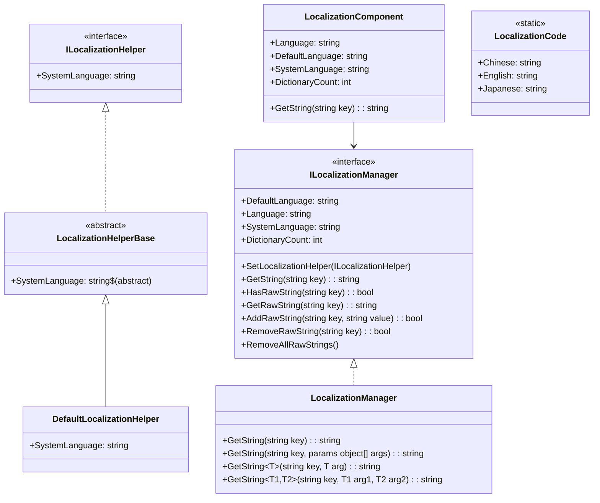
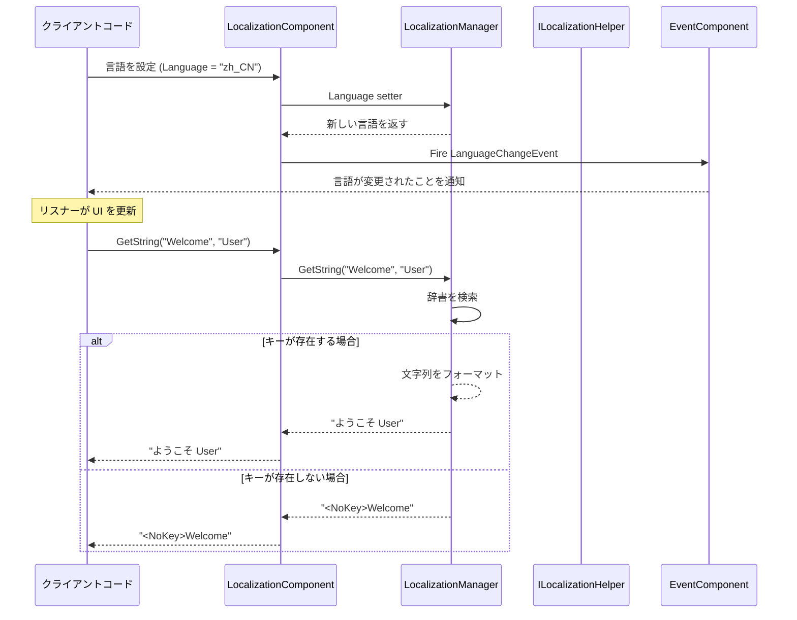

# API リファレンス

このドキュメントでは、GameFrameX Localization モジュールが提供するすべての public API インターフェース、クラス、メソッドについて詳しく説明します。

## 概要

GameFrameX Localization モジュールは、完全なローカライゼーションソリューションを提供します：
- 多言語文字列管理
- ランタイム時の言語切り替え
- パラメータ化文字列フォーマット
- システム言語自動検出
- イベント駆動アーキテクチャ

## コアアーキテクチャ



## ILocalizationManager インターフェース

`ILocalizationManager` は、ローカライゼーションシステムのコアインターフェースであり、ローカライズ文字列の管理に関するすべての必需操作を定義します。

> Source: [ILocalizationManager.cs](https://github.com/GameFrameX/com.gameframex.unity.localization/blob/main/Runtime/Localization/Localization/ILocalizationManager.cs#L34-L529)

### プロパティ

| プロパティ | タイプ | 説明 |
|------|------|------|
| `DefaultLanguage` | `string` | デフォルトのローカライゼーション言語を取得または設定。ローカライゼーションのロードに失敗した場合にこの言語を使用します。 |
| `Language` | `string` | 現在のローカライゼーション言語を取得または設定します。 |
| `SystemLanguage` | `string` | システム言語を取得します。 |
| `DictionaryCount` | `int` | 現在のロードされた辞書数を取得します。 |

### メソッド

#### `SetLocalizationHelper`

```csharp
void SetLocalizationHelper(ILocalizationHelper localizationHelper)
```

ローカライゼーションヘルパーを設定し、システム言語情報を取得するために使用します。

**パラメータ：**
- `localizationHelper` (ILocalizationHelper): ローカライゼーションヘルパーのインスタンス。

> Source: [ILocalizationManager.cs](https://github.com/GameFrameX/com.gameframex.unity.localization/blob/main/Runtime/Localization/Localization/ILocalizationManager.cs#L71)

---

#### `GetString(string key): string`

辞書メインキーに基づいて辞書コンテンツ文字列を取得します。

```csharp
string GetString(string key)
```

**パラメータ：**
- `key` (string): 辞書メインキー。

**戻り値：** 辞書コンテンツ文字列。キーが存在しない場合は `<NoKey>{key}` フォーマットで返します。

> Source: [LocalizationManager.cs](https://github.com/GameFrameX/com.gameframex.unity.localization/blob/main/Runtime/Localization/Localization/LocalizationManager.cs#L168-L177)

---

#### `GetString(string key, params object[] args): string`

辞書メインキーに基づいて辞書コンテンツ文字列を取得し、パラメータリストでフォーマットします。

```csharp
string GetString(string key, params object[] args)
```

**パラメータ：**
- `key` (string): 辞書メインキー。
- `args` (params object[]): フォーマットパラメータリスト。

**戻り値：** フォーマット後の辞書コンテンツ文字列。

> Source: [LocalizationManager.cs](https://github.com/GameFrameX/com.gameframex.unity.localization/blob/main/Runtime/Localization/Localization/LocalizationManager.cs#L186-L195)

---

#### ジェネリック GetString メソッド

システムは 17 のジェネリックオーバーロードメソッドを提供し、0 から 16 のタイプセーフパラメータをサポートしています：

| メソッドシグネチャ | 説明 |
|----------|------|
| `GetString<T>(string key, T arg)` | 単一パラメータフォーマット |
| `GetString<T1, T2>(string key, T1 arg1, T2 arg2)` | 二パラメータフォーマット |
| `GetString<T1, T2, T3>(string key, T1 arg1, T2 arg2, T3 arg3)` | 三パラメータフォーマット |
| ... | ... |
| `GetString<T1, ..., T16>(string key, T1 arg1, ..., T16 arg16)` | 十六パラメータフォーマット |

```csharp
// 例：ジェネリック GetString を使用したタイプセーフなフォーマット
string message = localizationManager.GetString("Welcome", "John", 25);
// 辞書内容："ようこそ {0}、今年 {1} 歳です"
// 結果："ようこそ John、今年 25 歳です"
```

> Source: [LocalizationManager.cs](https://github.com/GameFrameX/com.gameframex.unity.localization/blob/main/Runtime/Localization/Localization/LocalizationManager.cs#L205-L855)

---

#### `HasRawString(string key): bool`

指定されたキーの辞書にアクセスできるかどうかを確認します。

```csharp
bool HasRawString(string key)
```

**パラメータ：**
- `key` (string): 辞書メインキー。

**戻り値：** その辞書が存在するかどうか。

> Source: [LocalizationManager.cs](https://github.com/GameFrameX/com.gameframex.unity.localization/blob/main/Runtime/Localization/Localization/LocalizationManager.cs#L862-L870)

---

#### `GetRawString(string key): string`

辞書の元の値を取得します（フォーマットの処理なし）。

```csharp
string GetRawString(string key)
```

**パラメータ：**
- `key` (string): 辞書メインキー。

**戻り値：** 辞書の元の値。キーが存在しない場合は空の文字列を返します。

> Source: [LocalizationManager.cs](https://github.com/GameFrameX/com.gameframex.unity.localization/blob/main/Runtime/Localization/Localization/LocalizationManager.cs#L878-L891)

---

#### `AddRawString(string key, string value): bool`

新しい辞書エントリを追加します。

```csharp
bool AddRawString(string key, string value)
```

**パラメータ：**
- `key` (string): 辞書メインキー。
- `value` (string): 辞書コンテンツ。

**戻り値：** 追加が成功したかどうか。キーが既に存在する場合は false を返します。

> Source: [LocalizationManager.cs](https://github.com/GameFrameX/com.gameframex.unity.localization/blob/main/Runtime/Localization/Localization/LocalizationManager.cs#L899-L913)

---

#### `RemoveRawString(string key): bool`

指定された辞書エントリを削除します。

```csharp
bool RemoveRawString(string key)
```

**パラメータ：**
- `key` (string): 辞書メインキー。

**戻り値：** 削除が成功したかどうか。

> Source: [LocalizationManager.cs](https://github.com/GameFrameX/com.gameframex.unity.localization/blob/main/Runtime/Localization/Localization/LocalizationManager.cs#L920-L928)

---

#### `RemoveAllRawStrings()`

すべての辞書をクリアします。

```csharp
void RemoveAllRawStrings()
```

> Source: [LocalizationManager.cs](https://github.com/GameFrameX/com.gameframex.unity.localization/blob/main/Runtime/Localization/Localization/LocalizationManager.cs#L933-L936)

---

## ILocalizationHelper インターフェース

`ILocalizationHelper` インターフェースは、システム言語検出ロジックを抽象化し、開発者がカスタム言語検出メソッドを実装できるようにします。

> Source: [ILocalizationHelper.cs](https://github.com/GameFrameX/com.gameframex.unity.localization/blob/main/Runtime/Localization/Localization/ILocalizationHelper.cs#L34-L47)

### プロパティ

| プロパティ | タイプ | 説明 |
|------|------|------|
| `SystemLanguage` | `string` | システム言語を取得します。 |

```csharp
public interface ILocalizationHelper
{
    string SystemLanguage { get; }
}
```

---

## LocalizationHelperBase 抽象クラス

`LocalizationHelperBase` は、ローカライゼーションヘルパーの抽象基底クラスであり、`MonoBehaviour` を継承し、`ILocalizationHelper` インターフェースを実装します。

> Source: [LocalizationHelperBase.cs](https://github.com/GameFrameX/com.gameframex.unity.localization/blob/main/Runtime/Localization/LocalizationHelperBase.cs#L35-L48)

```csharp
public abstract class LocalizationHelperBase : MonoBehaviour, ILocalizationHelper
{
    public abstract string SystemLanguage { get; }
}
```

---

## DefaultLocalizationHelper クラス

`DefaultLocalizationHelper` はデフォルトのローカライゼーションヘルパー実装であり、.NET の `CultureInfo` を使用してシステム地域設定を取得します。

> Source: [DefaultLocalizationHelper.cs](https://github.com/GameFrameX/com.gameframex.unity.localization/blob/main/Runtime/Localization/DefaultLocalizationHelper.cs#L36-L58)

```csharp
public class DefaultLocalizationHelper : LocalizationHelperBase
{
    readonly string _regionName = CultureInfo.CurrentCulture.Name.Replace("-", "_");

    public override string SystemLanguage
    {
        get { return _regionName; }
    }
}
```

**設計説明：** デフォルト実装ではシステム地域情報（例：`zh-CN`）をアンダースコア形式（`zh_CN`）に変換し、`LocalizationCode` で定義された言語コードと一貫性を保ちます。

---

## LocalizationComponent クラス

`LocalizationComponent` は Unity コンポーネント封裝クラスであり、`GameFrameworkComponent` を継承し、Unity エコシステムと无缝に統合されたローカライゼーション機能を提供します。

> Source: [LocalizationComponent.cs](https://github.com/GameFrameX/com.gameframex.unity.localization/blob/main/Runtime/Localization/LocalizationComponent.cs#L38-L777)

### プロパティ

| プロパティ | タイプ | 説明 |
|------|------|------|
| `EditorLanguage` | `string` | エディター言語（エディター内でのみ有効）。 |
| `DefaultLanguage` | `string` | デフォルトのローカライゼーション言語。 |
| `Language` | `string` | 現在のローカライゼーション言語。このプロパティを設定すると言語切り替えイベントがトリガーされます。 |
| `SystemLanguage` | `string` | システム言語を取得します。 |
| `DictionaryCount` | `int` | 辞書数を取得します。 |

### メソッド

`LocalizationComponent` は、`ILocalizationManager` と完全に同一のメソッドシグネチャを提供します：

- `GetString(string key)` - ローカライズ文字列を取得
- `GetString(string key, params object[] args)` - パラメータ付きフォーマット
- `GetString<T>(string key, T arg)` - ジェネリック単一パラメータ
- `GetString<T1, T2>(string key, T1 arg1, T2 arg2)` - ジェネリック二パラメータ
- ...（合計 17 のオーバーロード、最大 16 個のパラメータをサポート）
- `HasRawString(string key)` - キーが存在するかをチェック
- `GetRawString(string key)` - 元の値を取得
- `AddRawString(string key, string value)` - 辞書を追加
- `RemoveRawString(string key)` - 辞書を削除
- `RemoveAllRawStrings()` - 辞書をクリア

### 使用例

```csharp
// LocalizationComponent インスタンスを取得
var localization = GameEntry.GetComponent<LocalizationComponent>();

// 単純文字列の取得
string greeting = localization.GetString("Greeting");

// パラメータ付き文字列のフォーマット
string message = localization.GetString("PlayerInfo", "田中", 100);
// 辞書内容："プレイヤー {0}、レベル {1}"
// 結果："プレイヤー 田中、レベル 100"

// 言語の切り替え
localization.Language = "en_US";

// 辞書のチェック
if (localization.HasRawString("ImportantKey"))
{
    string value = localization.GetRawString("ImportantKey");
}
```

---

## LocalizationCode 静的クラス

`LocalizationCode` は、标准化された言語コード定数を提供し、ISO 639-1 言語コードと ISO 3166-1 国/地域コード標準に準拠しています。

> Source: [LocalizationCode.cs](https://github.com/GameFrameX/com.gameframex.unity.localization/blob/main/Runtime/Localization/LocalizationCode.cs#L35-L985)

### 主要な言語コード定数

| 定数 | コード | 説明 |
|------|------|------|
| `Chinese` / `ChineseSimplified` | `zh_CN` | 簡体字中国語 |
| `ChineseTraditionalTW` | `zh_TW` | 繁体字中国語（台湾） |
| `ChineseTraditionalHK` | `zh_HK` | 繁体字中国語（香港） |
| `Japanese` | `ja_JP` | 日本語 |
| `Korean` | `ko_KR` | 韓国語 |
| `English` | `en_US` | 英語（アメリカ） |
| `EnglishUK` | `en_GB` | 英語（イギリス） |
| `French` | `fr_FR` | フランス語 |
| `German` | `de_DE` | ドイツ語 |
| `Spanish` | `es_ES` | スペイン語 |
| `Portuguese` | `pt_PT` | ポルトガル語 |
| `Russian` | `ru_RU` | ロシア語 |
| `Arabic` | `ar_SA` | アラビア語 |
| `Hindi` | `hi_IN` | ヒンディー語 |
| `Thai` | `th_TH` | タイ語 |
| `Vietnamese` | `vi_VN` | ベトナム語 |
| `Indonesian` | `id_ID` | インドネシア語 |

**使用例：**

```csharp
// 定数を使用して言語を設定
LocalizationComponent localization = GameEntry.GetComponent<LocalizationComponent>();
localization.Language = LocalizationCode.Chinese;      // 簡体字中国語に設定
localization.Language = LocalizationCode.English;       // 英語に設定
localization.Language = LocalizationCode.Japanese;     // 日本語に設定
```

---

## イベントシステム

### LocalizationLanguageChangeEventArgs

言語が切り替えられるときにトリガーされるイベントパラメータ。

> Source: [LocalizationLanguageChangeEventArgs.cs](https://github.com/GameFrameX/com.gameframex.unity.localization/blob/main/Runtime/EventArgs/LocalizationLanguageChangeEventArgs.cs#L5-L79)

```csharp
public sealed class LocalizationLanguageChangeEventArgs : GameEventArgs
{
    public static readonly string EventId = typeof(LocalizationLanguageChangeEventArgs).FullName;

    /// <summary>
    /// 現在の言語
    /// </summary>
    public string Language { get; set; }

    /// <summary>
    /// 古い言語
    /// </summary>
    public string OldLanguage { get; set; }

    public static LocalizationLanguageChangeEventArgs Create(string oldLanguage, string language);
    public override void Clear();
    public override string Id { get; }
}
```

### 言語切り替えイベントの購読

```csharp
void OnLanguageChanged(object sender, LocalizationLanguageChangeEventArgs e)
{
    Debug.Log($"言語が {e.OldLanguage} から {e.Language} に切り替えられました");
}

// イベントを購読
var eventComponent = GameEntry.GetComponent<EventComponent>();
eventComponent.Subscribe(LocalizationLanguageChangeEventArgs.EventId, OnLanguageChanged);

// 購読解除
eventComponent.Unsubscribe(LocalizationLanguageChangeEventArgs.EventId, OnLanguageChanged);
```

---

## API 使用フロー



---

## エラー処理

### エラー戻り値

エラーが発生すると、システムは特定のフォーマットのエラーメッセージを返します：

| エラータイプ | 戻り値フォーマット | 例 |
|----------|----------|------|
| キーが存在しない | `<NoKey>{key}` | `<NoKey>Welcome` |
| フォーマットエラー | `<Error>{key},{value},{args},{exception}` | `<Error>PlayerName,プレイヤー{0}...` |

### 例外情況

| シーン | 動作 |
|------|------|
| `Language` を `zxx`（不明な言語）に設定 | `GameFrameworkException` をスロー |
| `DefaultLanguage` を `zxx` に設定 | `GameFrameworkException` をスロー |
| `ILocalizationHelper` を設定せずに `SystemLanguage` にアクセス | `GameFrameworkException` をスロー |

---

## 関連リンク

- [概要](./01.overview)
- [インストール](./02.installation)
- [クイックスタート](./03.getting-started)
- [コア機能 - ローカライズ文字列の取得](./04.get-string)
- [コア機能 - 辞書管理](./05.dictionary-management)
- [コア機能 - 言語切り替えとイベント](./06.language-switching)
- [設定](./07.configuration)
- [ベストプラクティス](./08.best-practices)
