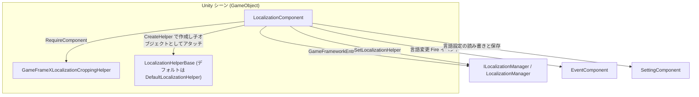

# 動作原理：コンポーネント、Manager と Helper の役割分担

本パッケージは三層構造で構成されています：`LocalizationComponent` は Unity シーンにアタッチする Mono ファサード、`ILocalizationManager` / `LocalizationManager` はフレームワークのコアモジュール（辞書データと言語状態を担当）、`ILocalizationHelper` / `LocalizationHelperBase` は置き換え可能なヘルパー（システム言語などの機能を担当）です。ビジネスコードは `LocalizationComponent` とのみやり取りし、残りの二層は起動時に自動的に組み立てられます。

## 三層の役割分担一覧

| 層 | 実際の型 | ファイル | 職責 |
|------|----------|------|------|
| コンポーネント層 | `LocalizationComponent : GameFrameworkComponent` | `Runtime/Localization/LocalizationComponent.cs` | Unity ファサード：Inspector 設定項目を保持し、Manager/Helper を初期化し、`GetString` / `Language` などの呼び出しを Manager に転送し、言語設定を `SettingComponent` に永続化する |
| マネージャー層 | `ILocalizationManager` / `LocalizationManager` | `Runtime/Localization/Localization/` | フレームワークのコアモジュール：`GameFrameworkEntry.GetModule<ILocalizationManager>()` で取得され、辞書データ、現在の言語、デフォルト言語、システム言語を保持し、定数 `UnknownLocalization` を定義する |
| ヘルパー層 | `ILocalizationHelper` / `LocalizationHelperBase` / `DefaultLocalizationHelper` | `Runtime/Localization/` | 置き換え可能な実装：コンポーネントが `Helper.CreateHelper` で作成して Manager に注入する。インターフェースは `SystemLanguage` のみを宣言 |

三層の関係と連携コンポーネント（矢印はすべてソースコード内で検証可能な呼び出しに基づきます）：



ヘルパーインターフェースは非常に簡潔で、システム言語のみを宣言しています：

```csharp
public interface ILocalizationHelper
{
    string SystemLanguage { get; }
}
```

出典: [ILocalizationHelper.cs](https://github.com/GameFrameX/com.gameframex.unity.localization/blob/main/Runtime/Localization/Localization/ILocalizationHelper.cs#L40-L47)

## 起動時の初期化フロー

`LocalizationComponent` は二つのライフサイクルメソッドで組み立てを完了します。その順序は以下の通りです：

1. **`Awake()` — コアモジュールの取得**。実装型とインターフェース型を設定し、その後フレームワークのエントリから `ILocalizationManager` を取得します。失敗した場合は `Log.Fatal("Localization manager is invalid.")` を出力して停止します。

```csharp
protected override void Awake()
{
    ImplementationComponentType = Utility.Assembly.GetType(componentType);
    InterfaceComponentType = typeof(ILocalizationManager);
    base.Awake();
    m_LocalizationManager = GameFrameworkEntry.GetModule<ILocalizationManager>();
    if (m_LocalizationManager == null)
    {
        Log.Fatal("Localization manager is invalid.");
        return;
    }
}
```

出典: [LocalizationComponent.cs](https://github.com/GameFrameX/com.gameframex.unity.localization/blob/main/Runtime/Localization/LocalizationComponent.cs#L211-L222)

2. **`Start()` — 依存コンポーネントの検証**。`GameEntry.GetComponent<T>()` を通じて `BaseComponent`、`EventComponent`、`SettingComponent` を順に取得し、いずれか一つでも欠けていれば `Log.Fatal("Base component is invalid." / "Event component is invalid." / "Setting component is invalid.")` を出力します。

3. **`Start()` — Helper の作成と注入**。Inspector 上の `m_LocalizationHelperTypeName`（デフォルトは `"GameFrameX.Localization.Runtime.DefaultLocalizationHelper"`）または `m_CustomLocalizationHelper` の参照を使ってヘルパーを作成し、`"Localization Helper"` と命名して本コンポーネントの子オブジェクトとしてアタッチし、その後 `SetLocalizationHelper` を呼び出して Manager に注入します。

```csharp
LocalizationHelperBase localizationHelper = Helper.CreateHelper(m_LocalizationHelperTypeName, m_CustomLocalizationHelper);
if (localizationHelper == null)
{
    Log.Fatal("Can not create localization helper.");
    return;
}

localizationHelper.name = "Localization Helper";
Transform localizationHelperTransform = localizationHelper.transform;
localizationHelperTransform.SetParent(this.transform);
localizationHelperTransform.localScale = Vector3.one;
m_LocalizationManager.SetLocalizationHelper(localizationHelper);
```

出典: [LocalizationComponent.cs](https://github.com/GameFrameX/com.gameframex.unity.localization/blob/main/Runtime/Localization/LocalizationComponent.cs#L249-L260)

4. **`Start()` — 言語の初期化**。エディターモードで `m_IsEnableEditorMode` がチェックされていれば `EditorLanguage`（デフォルトは `"zh_CN"`）を使用します。実行時に `Language` がまだ `UnknownLocalization` であれば `SystemLanguage` にフォールバックします。`DefaultLanguage` のフォールバックロジックも同じです。

```csharp
#if UNITY_EDITOR
    if (m_IsEnableEditorMode)
    {
        Language = EditorLanguage != UnknownLocalization ? EditorLanguage : m_LocalizationManager.SystemLanguage;
    }
#else
    if (Language == UnknownLocalization)
    {
        Language = m_LocalizationManager.SystemLanguage;
    }
#endif
    DefaultLanguage = m_DefaultLanguage != UnknownLocalization ? m_DefaultLanguage : m_LocalizationManager.SystemLanguage;
```

出典: [LocalizationComponent.cs](https://github.com/GameFrameX/com.gameframex.unity.localization/blob/main/Runtime/Localization/LocalizationComponent.cs#L261-L272)

### コンポーネント上のシリアライズ設定項目

| 設定項目 | デフォルト値 | 役割 |
|--------|--------|------|
| `m_EditorLanguage` | `"zh_CN"` | エディター内の言語（エディターモードでのみ有効） |
| `m_DefaultLanguage` | `"zh_CN"` | デフォルトのローカライズ言語。読み込み失敗時のフォールバック |
| `m_EnableLoadDictionaryUpdateEvent` | `false` | 辞書読み込み進捗更新イベントを有効にするかどうか |
| `m_IsEnableEditorMode` | `false` | エディターモード言語を有効にするかどうか |
| `m_LocalizationHelperTypeName` | `"GameFrameX.Localization.Runtime.DefaultLocalizationHelper"` | ヘルパー型の完全名 |
| `m_CustomLocalizationHelper` | `null` | カスタムヘルパー参照（型名より優先） |

出典: [LocalizationComponent.cs](https://github.com/GameFrameX/com.gameframex.unity.localization/blob/main/Runtime/Localization/LocalizationComponent.cs#L66-L75)

コンポーネントの宣言自体も、クロッピングヘルパーへのハード依存を示しています：`[RequireComponent(typeof(GameFrameXLocalizationCroppingHelper))]`、`[DisallowMultipleComponent]`、`[AddComponentMenu("GameFrameX/Localization")]`（[LocalizationComponent.cs](https://github.com/GameFrameX/com.gameframex.unity.localization/blob/main/Runtime/Localization/LocalizationComponent.cs#L46-L51) を参照）。

## 言語切り替えのデータフロー

`Language` プロパティの setter は、コンポーネント層が Manager、Setting、Event の三者を調整する典型的な例です。値が変化すると、次の四つのことを順番に行います：Manager の言語を更新し、`SettingComponent` に書き込んで永続化のため保存します。その後、固定された順序で三つの言語変更イベント（Before → Change → After）をブロードキャストします。

```csharp
set
{
    if (m_LocalizationManager.Language != value)
    {
        var oldLanguage = m_LocalizationManager.Language;
        m_LocalizationManager.Language = value;
        m_SettingComponent.SetString(nameof(LocalizationComponent) + "." + nameof(Language), value);
        m_SettingComponent.Save();
        var localizationLanguageChangeBeforeEventArgs = LocalizationLanguageChangeBeforeEventArgs.Create(oldLanguage, value);
        m_EventComponent.Fire(this, localizationLanguageChangeBeforeEventArgs);
        var localizationLanguageChangeEventArgs = LocalizationLanguageChangeEventArgs.Create(oldLanguage, value);
        m_EventComponent.Fire(this, localizationLanguageChangeEventArgs);
        var localizationLanguageChangeAfterEventArgs = LocalizationLanguageChangeAfterEventArgs.Create(oldLanguage, value);
        m_EventComponent.Fire(this, localizationLanguageChangeAfterEventArgs);
    }
}
```

出典: [LocalizationComponent.cs](https://github.com/GameFrameX/com.gameframex.unity.localization/blob/main/Runtime/Localization/LocalizationComponent.cs#L155-L170)

一方 getter は遅延読み込みです：Manager 内の言語がまだ `UnknownLocalization` である場合、まず `SettingComponent` から前回保存された値（キー名は `LocalizationComponent.Language`）を読み取り、それを Manager に書き戻します。

三つの言語変更イベントに対応するパラメータクラスはすべて `Runtime/EventArgs/` にあります：

| イベントパラメータクラス | ファイル | 発火タイミング |
|------------|------|----------|
| `LocalizationLanguageChangeBeforeEventArgs` | `Runtime/EventArgs/LocalizationLanguageChangeBeforeEventArgs.cs` | 言語が変更される直前（最初） |
| `LocalizationLanguageChangeEventArgs` | `Runtime/EventArgs/LocalizationLanguageChangeEventArgs.cs` | 言語が変更された |
| `LocalizationLanguageChangeAfterEventArgs` | `Runtime/EventArgs/LocalizationLanguageChangeAfterEventArgs.cs` | 変更後の後処理（最後） |
| `LoadDictionaryFailureEventArgs` | `Runtime/EventArgs/LoadDictionaryFailureEventArgs.cs` | 辞書の読み込み失敗 |
| `LoadDictionarySuccessEventArgs` | `Runtime/EventArgs/LoadDictionarySuccessEventArgs.cs` | 辞書の読み込み成功 |
| `LoadDictionaryUpdateEventArgs` | `Runtime/EventArgs/LoadDictionaryUpdateEventArgs.cs` | 辞書読み込み進捗の更新（`m_EnableLoadDictionaryUpdateEvent` で制御） |

## ビジネス呼び出しが三層を貫通する仕組み

ビジネスコードが `LocalizationComponent.GetString(...)` を呼び出すと、コンポーネントはそれをそのまま `m_LocalizationManager` に転送し、Manager が辞書から値を取得して引数に応じてフォーマットします。コンポーネントは 0 個から 6 個の引数を持つ `GetString` オーバーロードを提供しており、すべて純粋な転送です：

```csharp
public string GetString(string key)
{
    return m_LocalizationManager.GetString(key);
}

public string GetString(string key, params object[] args)
{
    return m_LocalizationManager.GetString(key, args);
}
```

出典: [LocalizationComponent.cs](https://github.com/GameFrameX/com.gameframex.unity.localization/blob/main/Runtime/Localization/LocalizationComponent.cs#L284-L303)

したがって実行時において、`LocalizationComponent` は単なるファサードです。実際の辞書データ、言語状態、読み込みコールバックはすべて `LocalizationManager` 内に存在し、さらに Manager は「システム言語とは何か」といったプラットフォーム依存の問題を、自身が保持する `LocalizationHelperBase` 実装に委譲しています。Helper の置き換え（例えばカスタムのシステム言語判定に切り替える場合）は、Inspector 上のヘルパー型または参照を変更するだけでよく、コンポーネントやビジネスコードを変更する必要はありません。

## よくあるエラー

| 症状（Log.Fatal の原文） | 根本原因 | 修正方法 |
|------|------|------|
| `Localization manager is invalid.` | `GameFrameworkEntry.GetModule<ILocalizationManager>()` が null を返す | フレームワークのコアが初期化済みであること、パッケージが正しく導入されていることを確認 |
| `Base component is invalid.` | シーンに `BaseComponent` がない | GameEntry に `BaseComponent` を追加する |
| `Event component is invalid.` | シーンに `EventComponent` がない | `EventComponent` を追加（言語変更イベントはこれに依存） |
| `Setting component is invalid.` | シーンに `SettingComponent` がない | `SettingComponent` を追加（言語の永続化はこれに依存） |
| `Can not create localization helper.` | `m_LocalizationHelperTypeName` の型名が誤っており、かつ `m_CustomLocalizationHelper` が未指定 | ヘルパー型の完全名を確認するか、カスタム Helper の参照を直接設定する |

以上のメッセージの原文はすべて `Start()`/`Awake()` 内の検証ロジックによるものです（[LocalizationComponent.cs](https://github.com/GameFrameX/com.gameframex.unity.localization/blob/main/Runtime/Localization/LocalizationComponent.cs#L217-L253)）。

## 関連リンク

- [LocalizationComponent.cs](https://github.com/GameFrameX/com.gameframex.unity.localization/blob/main/Runtime/Localization/LocalizationComponent.cs) — コンポーネント層のファサードと初期化フロー
- [ILocalizationManager.cs](https://github.com/GameFrameX/com.gameframex.unity.localization/blob/main/Runtime/Localization/Localization/ILocalizationManager.cs) — マネージャーインターフェース
- [LocalizationManager.cs](https://github.com/GameFrameX/com.gameframex.unity.localization/blob/main/Runtime/Localization/Localization/LocalizationManager.cs) — マネージャー実装
- [ILocalizationHelper.cs](https://github.com/GameFrameX/com.gameframex.unity.localization/blob/main/Runtime/Localization/Localization/ILocalizationHelper.cs) — ヘルパーインターフェース
- [LocalizationHelperBase.cs](https://github.com/GameFrameX/com.gameframex.unity.localization/blob/main/Runtime/Localization/LocalizationHelperBase.cs) — ヘルパー基底クラス
- [DefaultLocalizationHelper.cs](https://github.com/GameFrameX/com.gameframex.unity.localization/blob/main/Runtime/Localization/DefaultLocalizationHelper.cs) — デフォルトヘルパー
- [LocalizationComponentInspector.cs](https://github.com/GameFrameX/com.gameframex.unity.localization/blob/main/Editor/Inspector/LocalizationComponentInspector.cs) — エディター Inspector