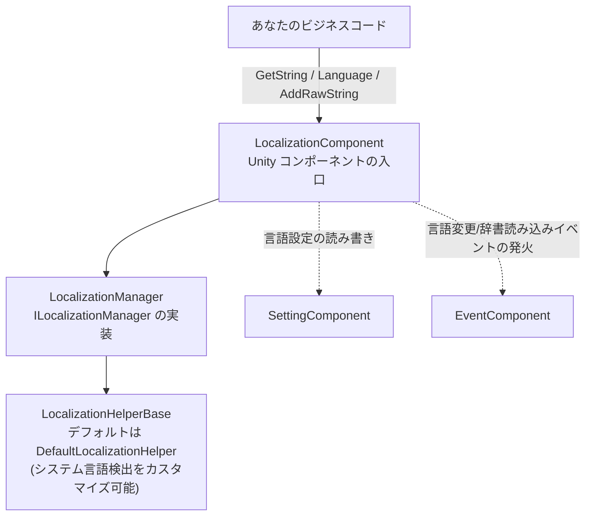

# ローカライズパッケージ概要：何ができるか

Game Frame X Localization(`com.gameframex.unity.localization`)は、GameFrameX フレームワークをベースにした Unity ローカライズ機能パッケージです。「辞書 key → 翻訳テキスト」の方式で多言語文字列を管理し、パラメータ化フォーマット(最大16個の型付きパラメータ)、実行時の言語切替とイベントのブロードキャスト、システム言語の自動検出、および言語設定の Setting システムへの永続化をサポートしています。中核となるエントリは `LocalizationComponent` コンポーネントで、アタッチするだけで使用できます。

このパッケージはあなたのゲームに以下の機能を提供します:

- **辞書ベースのローカライズ** — 実行時に翻訳エントリの追加・検索・削除が可能(`AddRawString` / `GetString` / `RemoveRawString`)
- **パラメータ化された文字列フォーマット** — 1~16個の型付きパラメータに対応するジェネリック `GetString` オーバーロード。.NET 標準のプレースホルダ `{0}`、`{1}`、`{2:P}` などをサポート
- **実行時の言語切替** — `Language` プロパティを設定するだけで変更イベントが発火し、UI を即時に更新可能
- **システム言語の検出とフォールバック** — `CultureInfo` を使ってデバイスの言語を検出し、読み込み失敗時はデフォルト言語にフォールバック
- **言語設定の永続化** — 言語とデフォルト言語は `SettingComponent` 経由で自動保存
- **エディタモード** — Play Mode 中に指定言語でシステム言語を上書きでき、テストに便利
- **180以上の言語コード定数** — `LocalizationCode` 静的クラス。例： `ChineseSimplified`(`zh_CN`)、`Japanese`(`ja_JP`)
- **置き換え可能な Helper** — `LocalizationHelperBase` を継承するだけでシステム言語検出をカスタマイズ可能

## クイックスタート

1. Unity プロジェクトの `Packages/manifest.json` を編集し、GameFrameX の scoped registry と依存関係を追加します:

```json
{
  "scopedRegistries": [
    {
      "name": "GameFrameX",
      "url": "https://gameframex.upm.alianblank.uk",
      "scopes": [
        "com.gameframex"
      ]
    }
  ],
  "dependencies": {
    "com.gameframex.unity.localization": "2.3.0"
  }
}
```

出典： [README.zh-CN.md](https://github.com/GameFrameX/com.gameframex.unity.localization/blob/main/README.zh-CN.md#L68-L84)

   `dependencies` 配下に直接 Git URL(`https://github.com/gameframex/com.gameframex.unity.localization.git`)を記述することも、リポジトリをダウンロードして `Packages` ディレクトリに配置することもできます。

2. シーンオブジェクトにコンポーネントをアタッチします：メニューパスは `GameFrameX/Localization` です(`LocalizationComponent` には `[AddComponentMenu("GameFrameX/Localization")]` が付いており、自動的に `GameFrameXLocalizationCroppingHelper` に依存します)。Inspector で Helper、`Default Language`(デフォルト `zh_CN`)、エディタモードなどを設定できます。コンポーネントのシリアライズ時のデフォルト値は以下のソースコードを参照してください:

```csharp
[SerializeField] private string m_EditorLanguage = "zh_CN";

[SerializeField] private string m_DefaultLanguage = "zh_CN";

[SerializeField] private bool m_EnableLoadDictionaryUpdateEvent = false;
[SerializeField] private bool m_IsEnableEditorMode = false;

[SerializeField] private string m_LocalizationHelperTypeName = "GameFrameX.Localization.Runtime.DefaultLocalizationHelper";
```

出典： [LocalizationComponent.cs](https://github.com/GameFrameX/com.gameframex.unity.localization/blob/main/Runtime/Localization/LocalizationComponent.cs#L66-L75)

3. コード内でコンポーネントを取得して使用します:

```csharp
using GameFrameX.Localization.Runtime;

// 標準的な方法：GameEntry 経由で取得
var localization = GameEntry.GetComponent<LocalizationComponent>();
```

出典： [README.zh-CN.md](https://github.com/GameFrameX/com.gameframex.unity.localization/blob/main/README.zh-CN.md#L100-L105)

4. 翻訳エントリの追加、言語の切替、文字列の取得を行い、最初の機能を動かします:

```csharp
// 新しいエントリを追加（key が既に存在する、または null/空の場合は false を返す）
bool added = localization.AddRawString("UI.Button.NewButton", "新按钮");

// 現在の言語を設定（変更イベントを発火し、自動的に永続化）
localization.Language = "zh_CN";
localization.Language = "en_US";

// シンプルなキー検索；key が存在しない場合は "<NoKey>{key}" を返す
string okText = localization.GetString("UI.Button.OK");
```

出典： [README.zh-CN.md](https://github.com/GameFrameX/com.gameframex.unity.localization/blob/main/README.zh-CN.md#L110-L116) · [README.zh-CN.md](https://github.com/GameFrameX/com.gameframex.unity.localization/blob/main/README.zh-CN.md#L134-L143) · [README.zh-CN.md](https://github.com/GameFrameX/com.gameframex.unity.localization/blob/main/README.zh-CN.md#L174-L179)

## 仕組みの概要



各コンポーネントの役割は一目瞭然です:`LocalizationComponent`([LocalizationComponent.cs](https://github.com/GameFrameX/com.gameframex.unity.localization/blob/main/Runtime/Localization/LocalizationComponent.cs#L51-L56))は `ILocalizationManager`、`EventComponent`、`SettingComponent` の3つの依存を保持します。`Language` の読み取り時、値が Unknown であればまず Setting から復元します。`Language` への書き込み時は、順に永続化を行い、3つのイベント(Before / Change / After)を連続して発火します:

```csharp
var localizationLanguageChangeBeforeEventArgs = LocalizationLanguageChangeBeforeEventArgs.Create(oldLanguage, value);
m_EventComponent.Fire(this, localizationLanguageChangeBeforeEventArgs);
var localizationLanguageChangeEventArgs = LocalizationLanguageChangeEventArgs.Create(oldLanguage, value);
m_EventComponent.Fire(this, localizationLanguageChangeEventArgs);
var localizationLanguageChangeAfterEventArgs = LocalizationLanguageChangeAfterEventArgs.Create(oldLanguage, value);
m_EventComponent.Fire(this, localizationLanguageChangeAfterEventArgs);
```

出典： [LocalizationComponent.cs](https://github.com/GameFrameX/com.gameframex.unity.localization/blob/main/Runtime/Localization/LocalizationComponent.cs#L155-L169)

## よく使う機能のクイックリファレンス

| 機能 | 主要 API(`LocalizationComponent`) | 説明 |
|------|----------------------------------|------|
| 現在の言語 | `Language` | get 時に未設定の場合は Setting→システム言語へフォールバック。set でイベントを発火し永続化 |
| デフォルト言語 | `DefaultLanguage` | 読み込み失敗時のフォールバック言語、Setting に永続化 |
| システム言語 | `SystemLanguage` | デバイスで検出された言語コード |
| 翻訳の取得 | `GetString(key)` / `GetString<T1..T16>(key, ...)` | key が存在しない場合は `<NoKey>{key}` を返す。ジェネリックオーバーロードでボックス化を回避 |
| 存在確認/原文の取得 | `HasRawString(key)` / `GetRawString(key)` | フォーマット前の生の値、見つからない場合は `null` を返す |
| エントリの追加・削除 | `AddRawString` / `RemoveRawString` / `RemoveAllRawStrings` | 実行時の辞書管理 |
| エントリ数 | `DictionaryCount` | 読み込み済みエントリの総数 |
| 言語コード | `LocalizationCode.ChineseSimplified` など | 180以上の定数、形式は `语言_地区` |

パラメータ化の例(辞書値は `{0}`、`{1}` などの .NET プレースホルダを使用。パラメータが一致しない場合、結果は `<Error>` で始まります):

```csharp
// ジェネリックオーバーロード（推奨——値型のボックス化を回避）
string info = localization.GetString<string, int, int>("UI.Info.Score", playerName, score, level);
```

出典： [README.zh-CN.md](https://github.com/GameFrameX/com.gameframex.unity.localization/blob/main/README.zh-CN.md#L156-L167)

## イベント一覧

| イベントクラス | 発火条件 | 主なフィールド |
|--------|----------|----------|
| `LocalizationLanguageChangeEventArgs` | `Language` プロパティを設定した時 | `OldLanguage`、`Language` |
| `LoadDictionarySuccessEventArgs` | 辞書リソースの読み込み完了 | `DictionaryAssetName`、`Duration`、`UserData` |
| `LoadDictionaryFailureEventArgs` | 辞書リソースの読み込み失敗 | `DictionaryAssetName`、`ErrorMessage`、`UserData` |
| `LoadDictionaryUpdateEventArgs` | 辞書読み込みの進捗更新 | `DictionaryAssetName`、`Progress`、`UserData` |

(ペアとなる `LocalizationLanguageChangeBeforeEventArgs` / `LocalizationLanguageChangeAfterEventArgs` もあります。詳細は [Runtime/EventArgs](https://github.com/GameFrameX/com.gameframex.unity.localization/blob/main/Runtime/EventArgs/LocalizationLanguageChangeBeforeEventArgs.cs) を参照してください。すべてのイベントクラスは GameFrameX の参照プールを使用しており、ゼロアロケーションでイベントを発火します。)

## 次のステップ

- インストールの詳細とコンポーネントの Inspector フィールドの説明(`Enable Editor Mode`、`Editor Language` など)：リポジトリの [README.zh-CN.md](https://github.com/GameFrameX/com.gameframex.unity.localization/blob/main/README.zh-CN.md) を参照
- 言語変更を監視して UI を更新する完全な例:[README.zh-CN.md #言語変更の監視](https://github.com/GameFrameX/com.gameframex.unity.localization/blob/main/README.zh-CN.md#L198-L244)
- 言語コード定数の完全なリスト:[LocalizationCode.cs](https://github.com/GameFrameX/com.gameframex.unity.localization/blob/main/Runtime/Localization/LocalizationCode.cs)
- システム言語検出のカスタマイズ(`LocalizationHelperBase` を継承):[LocalizationHelperBase.cs](https://github.com/GameFrameX/com.gameframex.unity.localization/blob/main/Runtime/Localization/LocalizationHelperBase.cs)
- マネージャーのインターフェースと実装:[ILocalizationManager.cs](https://github.com/GameFrameX/com.gameframex.unity.localization/blob/main/Runtime/Localization/Localization/ILocalizationManager.cs) · [LocalizationManager.cs](https://github.com/GameFrameX/com.gameframex.unity.localization/blob/main/Runtime/Localization/Localization/LocalizationManager.cs)
- バージョン履歴:[CHANGELOG.md](https://github.com/GameFrameX/com.gameframex.unity.localization/blob/main/CHANGELOG.md)