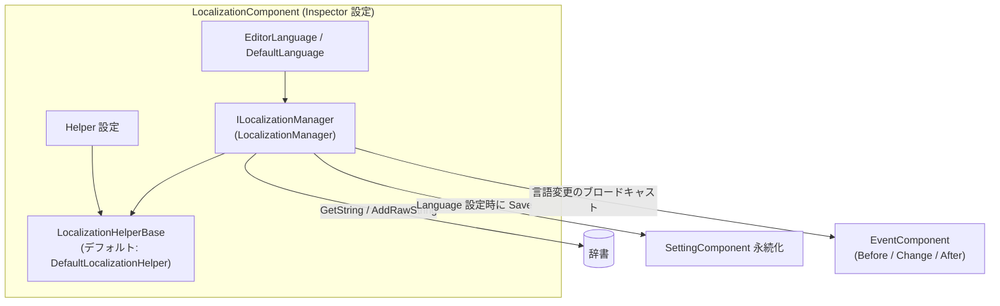

# インストールと初回実行：パッケージ導入、コンポーネントのアタッチ、Inspector の設定

このページでは、GameFrameX Localization を動作させる手順を案内します：UPM パッケージのインストール、シーンへの `LocalizationComponent` のアタッチ、Inspector での言語と Helper フィールドの設定、そして最後にコードで最初の翻訳テキストが正しく取得できることを検証します。全体で数分しかかかりません。

## クイックスタート

### 1. パッケージのインストール

以下のいずれかの方法を選択してください（方法 1 を推奨。GameFrameX シリーズパッケージの一括アップグレードに便利です）：

- Unity プロジェクトの `Packages/manifest.json` を編集し、`scopedRegistries` を追加して依存関係を宣言します：

```json
{
  "scopedRegistries": [
    {
      "name": "GameFrameX",
      "url": "https://gameframex.upm.alianblank.uk",
      "scopes": [
        "com.gameframex"
      ]
    }
  ],
  "dependencies": {
    "com.gameframex.unity.localization": "2.3.0"
  }
}
```

`scopes` はどのパッケージがこのレジストリ経由で解決されるかを制御します。`com.gameframex` で始まるパッケージのみがこのレジストリから取得されます。

Source: [README.zh-CN.md](https://github.com/GameFrameX/com.gameframex.unity.localization/blob/main/README.zh-CN.md#L68-L86)

- `manifest.json` の `dependencies` ノードの直下に Git アドレスを直接追加します：

```json
{
   "com.gameframex.unity.localization": "https://github.com/gameframex/com.gameframex.unity.localization.git"
}
```

Source: [README.zh-CN.md](https://github.com/GameFrameX/com.gameframex.unity.localization/blob/main/README.zh-CN.md#L88-L93)

- または Unity の `Package Manager` で `Git URL` 方式で追加します：`https://github.com/gameframex/com.gameframex.unity.localization.git`。
- またはリポジトリを直接ダウンロードして Unity プロジェクトの `Packages` ディレクトリに配置すると、Unity が自動的に読み込んで認識します。

バージョン要件：Unity 2019.4 以上（[README.zh-CN.md](https://github.com/GameFrameX/com.gameframex.unity.localization/blob/main/README.zh-CN.md#L9) を参照）。コンポーネントは GameFrameX の Event、Setting、およびコアランタイムアセンブリに依存します。

### 2. コンポーネントのアタッチ

起動シーンの GameFrameX コンポーネントホストオブジェクトに対して、`Add Component` メニューから `GameFrameX/Localization` を選択し、`LocalizationComponent` を追加します：

```csharp
[DisallowMultipleComponent]
[AddComponentMenu("GameFrameX/Localization")]
[HelpURL("https://datatracker.ietf.org/doc/html/rfc5646")]
[Preserve]
[RequireComponent(typeof(GameFrameXLocalizationCroppingHelper))]
public sealed class LocalizationComponent : GameFrameworkComponent
```

Source: [LocalizationComponent.cs](https://github.com/GameFrameX/com.gameframex.unity.localization/blob/main/Runtime/Localization/LocalizationComponent.cs#L46-L51)

ポイント：

- `[RequireComponent(typeof(GameFrameXLocalizationCroppingHelper))]`：このコンポーネントを追加すると、クロッピング用ヘルパーコンポーネントが自動的に付属します。手動でアタッチする必要はありません。
- `[DisallowMultipleComponent]`：同じオブジェクトには 1 つしかアタッチできず、重複追加は Unity によって阻止されます。

### 3. Inspector の設定

コンポーネントのシリアライズフィールドとデフォルト値は以下の通りです。すべて Inspector で直接変更できます：

| Inspector フィールド | デフォルト値 | 説明 |
|------|------|------|
| EditorLanguage | `zh_CN` | エディター言語。エディター内でのみ有効で、Play モードで異なる言語をテストするのに便利です |
| DefaultLanguage | `zh_CN` | デフォルトのローカライズ言語。ローカライズの読み込みに失敗した場合のフォールバックとして使用されます |
| EnableLoadDictionaryUpdateEvent | `false` | 辞書読み込み進捗更新イベントを有効にするかどうか |
| IsEnableEditorMode | `false` | エディターモードを有効にするかどうか |
| LocalizationHelperTypeName | `GameFrameX.Localization.Runtime.DefaultLocalizationHelper` | ローカライズ Helper の型名 |
| CustomLocalizationHelper | `null` | カスタム Helper。空欄の場合は上記のデフォルト Helper が使用されます |

フィールド定義のソースコード：

```csharp
[SerializeField] private string m_EditorLanguage = "zh_CN";
[SerializeField] private string m_DefaultLanguage = "zh_CN";
[SerializeField] private bool m_EnableLoadDictionaryUpdateEvent = false;
[SerializeField] private bool m_IsEnableEditorMode = false;
[SerializeField] private string m_LocalizationHelperTypeName = "GameFrameX.Localization.Runtime.DefaultLocalizationHelper";
[SerializeField] private LocalizationHelperBase m_CustomLocalizationHelper = null;
```

Source: [LocalizationComponent.cs](https://github.com/GameFrameX/com.gameframex.unity.localization/blob/main/Runtime/Localization/LocalizationComponent.cs#L66-L75)

言語コードは RFC 5646 スタイルを使用します。例：`zh_CN`、`en_US`、`ja_JP`（コンポーネントの `HelpURL` は RFC 5646 仕様を指しています）。

### 4. 初回実行の検証

Play モードに入り、まず翻訳を 1 件登録してからコードで取得します：

```csharp
using GameFrameX.Localization.Runtime;

// 標準的な方法：GameEntry 経由で取得
var localization = GameEntry.GetComponent<LocalizationComponent>();

// 実行時に翻訳を 1 件追加（key が既に存在する、または null/空の場合は false を返す）
bool added = localization.AddRawString("UI.Button.NewButton", "新按钮");

// 翻訳を取得；key が存在しない場合は "<NoKey>{key}" を返す
string text = localization.GetString("UI.Button.NewButton");
```

Sources: [README.zh-CN.md](https://github.com/GameFrameX/com.gameframex.unity.localization/blob/main/README.zh-CN.md#L100-L105) · [README.zh-CN.md](https://github.com/GameFrameX/com.gameframex.unity.localization/blob/main/README.zh-CN.md#L173-L176) · [README.zh-CN.md](https://github.com/GameFrameX/com.gameframex.unity.localization/blob/main/README.zh-CN.md#L134-L137)

`text` が「新按钮」を出力すればインストール成功です。注意：key が存在しない場合は `<NoKey>{key}` が返り、フォーマット引数が一致しない場合は結果が `<Error>` で始まります。これらのプレフィックスは、辞書の内容または引数に問題があることを示しています。

## 仕組みの概要

コンポーネントは「コンポーネントシェル + マネージャー + Helper」の階層構造を採用しており、Inspector の設定は最終的に `LocalizationManager` に渡されて実行されます。言語切り替えは Setting に自動的に書き込まれ、イベントがブロードキャストされます：



コンポーネントは `Language` を設定する際、まず `SettingComponent` に書き込んで `Save()` を実行し、その後 `LocalizationLanguageChangeBeforeEventArgs`、`LocalizationLanguageChangeEventArgs`、`LocalizationLanguageChangeAfterEventArgs` の 3 つのイベントを順番にトリガーします。`Language`/`DefaultLanguage` を取得する際に値が不明な場合は、まず Setting から読み込みます。

Source: [LocalizationComponent.cs](https://github.com/GameFrameX/com.gameframex.unity.localization/blob/main/Runtime/Localization/LocalizationComponent.cs#L140-L171)

## よくあるエラー

| 症状 | 原因 | 修正方法 |
|------|------|------|
| 取得したテキストが `<NoKey>{key}` になる | 辞書に該当する key が存在しない | まず `AddRawString` でエントリを登録するか、`HasRawString` で事前にチェックする |
| フォーマット結果が `<Error>` で始まる | プレースホルダーと渡された引数が一致しない | 辞書値内の `{0}`、`{1}` と渡す引数の数・型を確認する |
| コンポーネントが依存関係の不足を報告する | Event/Setting などの依存パッケージがインストールされていない | scoped registry 経由で `com.gameframex` シリーズのパッケージをまとめてインストールする |
| 同じオブジェクトに 2 つ目がアタッチできない | `[DisallowMultipleComponent]` | 1 つのシーンホストには 1 つの `LocalizationComponent` のみアタッチする |

エラー動作の根拠については [README.zh-CN.md](https://github.com/GameFrameX/com.gameframex.unity.localization/blob/main/README.zh-CN.md#L167) と [LocalizationComponent.cs](https://github.com/GameFrameX/com.gameframex.unity.localization/blob/main/Runtime/Localization/LocalizationComponent.cs#L46-L51) を参照してください。

## 次のステップ

- 実行時の言語切り替えとイベントリスニングの例：[README.zh-CN.md](https://github.com/GameFrameX/com.gameframex.unity.localization/blob/main/README.zh-CN.md#L194-L236) を参照
- パラメータ化されたフォーマット（最大 16 個の型付き引数を持つ `GetString` オーバーロード）：[README.zh-CN.md](https://github.com/GameFrameX/com.gameframex.unity.localization/blob/main/README.zh-CN.md#L146-L165) を参照
- 言語コード定数 `LocalizationCode`（180 以上の言語）：[LocalizationCode.cs](https://github.com/GameFrameX/com.gameframex.unity.localization/blob/main/Runtime/Localization/LocalizationCode.cs) を参照
- カスタム Helper（`LocalizationHelperBase` を継承してシステム言語検出をオーバーライド）：[LocalizationHelperBase.cs](https://github.com/GameFrameX/com.gameframex.unity.localization/blob/main/Runtime/Localization/LocalizationHelperBase.cs) を参照
- Inspector カスタム画面の実装：[LocalizationComponentInspector.cs](https://github.com/GameFrameX/com.gameframex.unity.localization/blob/main/Editor/Inspector/LocalizationComponentInspector.cs) を参照
- 公式ドキュメント：<https://gameframex.doc.alianblank.com/>