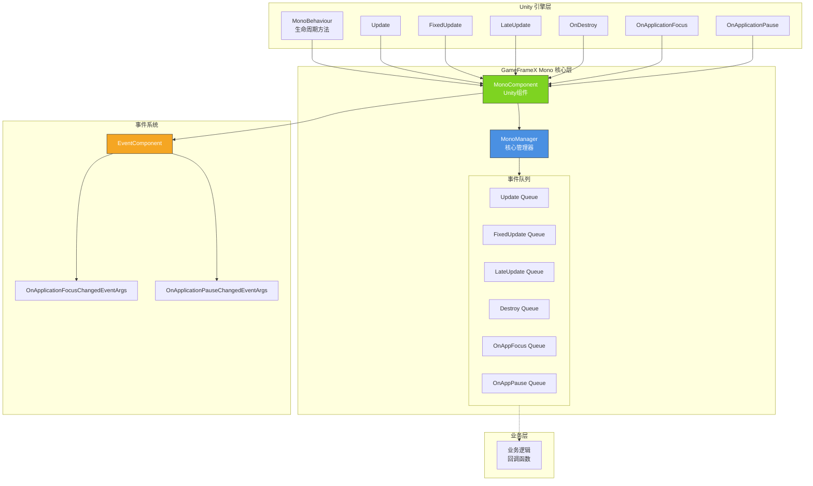

# プラグイン介绍

GameFrameX Unity Mono コンポーネント是 GameFrameX 游戏フレームワーク的コアモジュール之一，专门用于統一された管理 Unity 中 MonoBehaviour 的ライフサイクルイベント，并提供便捷的イベント监听机制。

## 概要

在 Unity 开发中，MonoBehaviour 的ライフサイクルメソッド（如 `Update`、`FixedUpdate`、`LateUpdate`、`OnDestroy` 等）是游戏逻辑的コア载体。然而，传统写法存在以下問題：

- **耦合度高**：业务逻辑直接写在 MonoBehaviour 中，难以复用和テスト
- **管理混乱**：多个脚本〜の可能性があります〜する必要があります访问相同的ライフサイクルイベント，缺乏統一された管理
- **性能問題**：频繁作成和破棄 MonoBehaviour 影响性能

GameFrameX Mono コンポーネント通过以下設計解决这些問題：

- **統一された管理**：通过 MonoManager 集中管理所有ライフサイクルイベント监听
- **观察者モード**：使用コールバック函数購読/取消購読イベント，解耦业务逻辑
- **线程安全**：使用锁机制確認してください多线程環境下的安全性
- **イベント集成**：与 Event コンポーネント集成，サポート全局イベント系统

## アーキテクチャ設計



### コアコンポーネント

| コンポーネント | 説明 | 职责 |
|------|------|------|
| **MonoManager** | コアマネージャー | 統一された管理所有ライフサイクルイベント的监听和分发 |
| **MonoComponent** | Unity コンポーネント | 提供 Unity 层面的イベント入口，自动转发ライフサイクルイベント |
| **IMonoManager** | インターフェース定義 | 定義 MonoManager 的標準インターフェース，便于テスト和拡張 |

### イベントフロー

```mermaid
sequenceDiagram
    participant Unity as Unity 引擎
    participant MC as MonoComponent
    participant MM as MonoManager
    participant EC as EventComponent
    participant BL as 业务逻辑

    Unity->>MC: Unity 生命周期方法调用
    activate MC
    MC->>MM: 转发事件
    activate MM
    MM->>BL: 遍历调用回调队列
    BL-->>MM: 执行回调
    deactivate BL
    
    MM-->>MC: 返回
    deactivate MM
    
    alt 应用焦点/暂停事件
        MC->>EC: Fire 事件
        activate EC
        EC-->>MC: 事件分发
        deactivate EC
    end
    
    MC-->>Unity: 返回
    deactivate MC
```

## 機能特性

### 1. ライフサイクルイベント管理

MonoManager サポート以下ライフサイクルイベント的統一された管理：

| イベント | 説明 | コールバックパラメータ |
|------|------|----------|
| **Update** | 每帧呼び出し | `(float elapseSeconds, float realElapseSeconds)` |
| **FixedUpdate** | 固定帧率呼び出し | `(float elapseSeconds, float fixedElapseSeconds)` |
| **LateUpdate** | 所有 Update 后呼び出し | `(float elapseSeconds, float fixedElapseSeconds)` |
| **OnDestroy** | 对象破棄时呼び出し | `()` |
| **OnApplicationFocus** | 应用焦点变化 | `(bool focusStatus)` |
| **OnApplicationPause** | 应用暂停变化 | `(bool pauseStatus)` |

### 2. 线程安全性

所有イベント队列的操作都使用 `lock` 机制確認してください线程安全：

```csharp
// 线程安全的添加监听器示例
public void AddUpdateListener(Action<float, float> action)
{
    if (action == null)
    {
        throw new ArgumentNullException(nameof(action));
    }

    lock (Lock)
    {
        _updateQueue.AddLast(action);
    }
}
```
> Source: [MonoManager.cs](https://github.com/GameFrameX/com.gameframex.unity.mono/blob/main/Runtime/Mono/MonoManager.cs#L176-L187)

### 3. 例外処理

每个监听器的呼び出し都パッケージ含在 try-catch 块中，確認してください单个コールバック的例外不会影响其他コールバック的执行：

```csharp
private static void QueueInvoking(LinkedList<Action<float, float>> list, float elapseSeconds, float fixedElapseSeconds)
{
    lock (Lock)
    {
        foreach (var action in list)
        {
            try
            {
                action.Invoke(elapseSeconds, fixedElapseSeconds);
            }
            catch (Exception e)
            {
                Log.Error(e);
            }
        }
    }
}
```
> Source: [MonoManager.cs](https://github.com/GameFrameX/com.gameframex.unity.mono/blob/main/Runtime/Mono/MonoManager.cs#L364-L380)

### 4. 性能最適化

- 使用 Unity Profiler 进行性能分析
- サポート主动解放リソース (`Release()` メソッド)
- 使用 LinkedList 提供 O(1) 的追加/削除複雑度

## クイックスタート

### 基本使用フロー

1. **作成 MonoComponent**：在シーン中作成带有 `MonoComponent` 的 GameObject
2. **取得マネージャー**：通过 `MonoComponent` 取得イベント监听能力
3. **登録监听**：追加相应的ライフサイクルイベント监听
4. **执行业务**：在コールバック函数中编写业务逻辑
5. **注销监听**：在适当时候移除监听（避免内存泄漏）

### コード例

```csharp
public class MyGameController : MonoBehaviour
{
    private MonoComponent _monoComponent;

    private void Start()
    {
        // 获取 MonoComponent
        _monoComponent = GetComponent<MonoComponent>();
        
        // 注册 Update 监听
        _monoComponent.AddUpdateListener(OnUpdate);
        
        // 注册 FixedUpdate 监听
        _monoComponent.AddFixedUpdateListener(OnFixedUpdate);
        
        // 注册应用暂停监听
        _monoComponent.AddOnApplicationPauseListener(OnApplicationPause);
    }

    private void OnUpdate(float elapseSeconds, float realElapseSeconds)
    {
        // 每帧执行的逻辑
    }

    private void OnFixedUpdate(float elapseSeconds, float fixedElapseSeconds)
    {
        // 固定帧率执行的逻辑（如物理计算）
    }

    private void OnApplicationPause(bool pauseStatus)
    {
        Debug.Log($"应用暂停状态: {pauseStatus}");
    }

    private void OnDestroy()
    {
        // 移除所有监听器
        if (_monoComponent != null)
        {
            _monoComponent.RemoveUpdateListener(OnUpdate);
            _monoComponent.RemoveFixedUpdateListener(OnFixedUpdate);
            _monoComponent.RemoveOnApplicationPauseListener(OnApplicationPause);
        }
    }
}
```
> Source: [MonoComponent.cs](https://github.com/GameFrameX/com.gameframex.unity.mono/blob/main/Runtime/Mono/MonoComponent.cs#L186-L210)

## 依赖关系

GameFrameX Mono コンポーネント依赖以下モジュール：

| 依赖モジュール | バージョン要求 | 説明 |
|----------|----------|------|
| GameFrameX.Runtime | ≥1.0.0 | コアフレームワーク，提供基本服务 |
| GameFrameX.Event | ≥1.0.0 | イベント系统，サポート全局イベント |

```json
{
  "dependencies": {
    "com.gameframex.unity.runtime": ">=1.0.0",
    "com.gameframex.unity.event": ">=1.0.0"
  }
}
```
> Source: [GameFrameX.Mono.Runtime.asmdef](https://github.com/GameFrameX/com.gameframex.unity.mono/blob/main/Runtime/GameFrameX.Mono.Runtime.asmdef#L3-L6)

## バージョン情報

| バージョン | アップデート内容 |
|------|----------|
| 1.1.0 | 当前バージョン |
| 1.0.0 | 初始バージョン |

- **Unity バージョンサポート**：2017.1+
- **许可证**：MIT + Apache License 2.0 双许可

## 関連リンク

- [インストールガイド](./2-installation.1-installation-methods)
- [基本使用](./3-getting-started.1-basic-usage)
- [MonoManager 详解](./4-core-components.1-monomanager)
- [MonoComponent 详解](./4-core-components.2-monocomponent)
- [イベントタイプ](./5-events.1-event-types)
- [イベントパラメータ](./5-events.2-event-args)
- [常见問題解答](./6-troubleshooting.1-faq)
- [GitHub リポジトリ](https://github.com/GameFrameX/com.gameframex.unity.mono.git)
- [官方ドキュメント](https://gameframex.doc.alianblank.com/)
