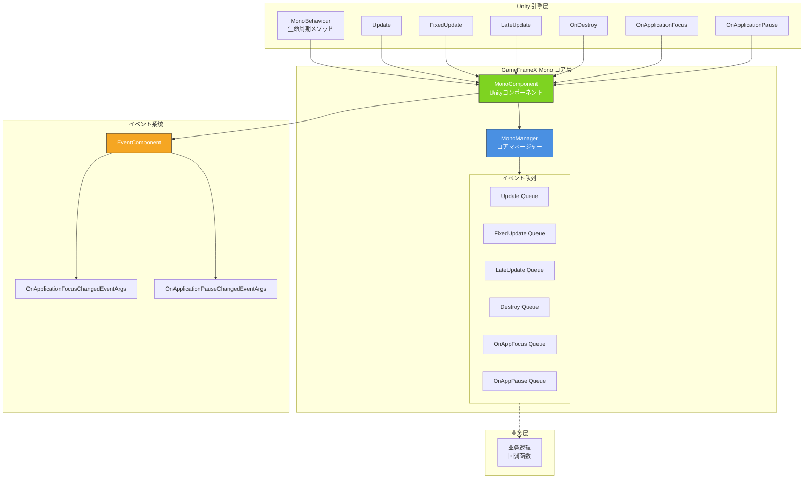

# 

GameFrameX Unity Mono コンポーネントは GameFrameX ゲームフレームワークのコアモジュール，に Unity  MonoBehaviour のイベント，のイベント。

## 

に Unity ，MonoBehaviour のメソッド（ `Update`、`FixedUpdate`、`LateUpdate`、`OnDestroy` ）はゲームのコア。，に：

- ****：に MonoBehaviour ，とテスト
- ****：のイベント，
- ****：と MonoBehaviour 

GameFrameX Mono コンポーネントをじて：

- ****：をじて MonoManager イベント
- ****：/イベント，
- ****：の
- **イベント**：と Event コンポーネント，サポートグローバルイベント

## アーキテクチャ



### コアコンポーネント

| コンポーネント |  |  |
|------|------|------|
| **MonoManager** | コアマネージャー | イベントのと |
| **MonoComponent** | Unity コンポーネント |  Unity のイベント，イベント |
| **IMonoManager** | インターフェース |  MonoManager のインターフェース，テストと |

### イベントフロー

```mermaid
sequenceDiagram
    participant Unity as Unity 引擎
    participant MC as MonoComponent
    participant MM as MonoManager
    participant EC as EventComponent
    participant BL as 业务逻辑

    Unity->>MC: Unity 生命周期メソッド呼び出し
    activate MC
    MC->>MM: 转发イベント
    activate MM
    MM->>BL: 遍历呼び出し回调队列
    BL-->>MM: 実行回调
    deactivate BL
    
    MM-->>MC: 戻す
    deactivate MM
    
    alt 应用焦点/暂停イベント
        MC->>EC: Fire イベント
        activate EC
        EC-->>MC: イベント分发
        deactivate EC
    end
    
    MC-->>Unity: 戻す
    deactivate MC
```

## 

### 1. イベント

MonoManager サポートイベントの：

| イベント |  | パラメータ |
|------|------|----------|
| **Update** | びし | `(float elapseSeconds, float realElapseSeconds)` |
| **FixedUpdate** | びし | `(float elapseSeconds, float fixedElapseSeconds)` |
| **LateUpdate** |  Update びし | `(float elapseSeconds, float fixedElapseSeconds)` |
| **OnDestroy** | びし | `()` |
| **OnApplicationFocus** |  | `(bool focusStatus)` |
| **OnApplicationPause** |  | `(bool pauseStatus)` |

### 2. 

イベントの `lock` ：

```csharp
// 线程安全の添加监听器例
public void AddUpdateListener(Action<float, float> action)
{
    if (action == null)
    {
        throw new ArgumentNullException(nameof(action));
    }

    lock (Lock)
    {
        _updateQueue.AddLast(action);
    }
}
```
> Source: [MonoManager.cs](https://github.com/GameFrameX/com.gameframex.unity.mono/blob/main/Runtime/Mono/MonoManager.cs#L176-L187)

### 3. 

のびしむに try-catch ，のの：

```csharp
private static void QueueInvoking(LinkedList<Action<float, float>> list, float elapseSeconds, float fixedElapseSeconds)
{
    lock (Lock)
    {
        foreach (var action in list)
        {
            try
            {
                action.Invoke(elapseSeconds, fixedElapseSeconds);
            }
            catch (Exception e)
            {
                Log.Error(e);
            }
        }
    }
}
```
> Source: [MonoManager.cs](https://github.com/GameFrameX/com.gameframex.unity.mono/blob/main/Runtime/Mono/MonoManager.cs#L364-L380)

### 4. 

-  Unity Profiler 
- サポートリソース (`Release()` メソッド)
-  LinkedList  O(1) の/

## クイックスタート

### フロー

1. ** MonoComponent**：に `MonoComponent` の GameObject
2. **マネージャー**：をじて `MonoComponent` イベント
3. ****：のイベント
4. ****：に
5. ****：に（）

### コード

```csharp
public class MyGameController : MonoBehaviour
{
    private MonoComponent _monoComponent;

    private void Start()
    {
        // 获取 MonoComponent
        _monoComponent = GetComponent<MonoComponent>();
        
        // 注册 Update 监听
        _monoComponent.AddUpdateListener(OnUpdate);
        
        // 注册 FixedUpdate 监听
        _monoComponent.AddFixedUpdateListener(OnFixedUpdate);
        
        // 注册应用暂停监听
        _monoComponent.AddOnApplicationPauseListener(OnApplicationPause);
    }

    private void OnUpdate(float elapseSeconds, float realElapseSeconds)
    {
        // 每帧実行の逻辑
    }

    private void OnFixedUpdate(float elapseSeconds, float fixedElapseSeconds)
    {
        // 固定帧率実行の逻辑（如物理计算）
    }

    private void OnApplicationPause(bool pauseStatus)
    {
        Debug.Log($"应用暂停状態: {pauseStatus}");
    }

    private void OnDestroy()
    {
        // 移除所有监听器
        if (_monoComponent != null)
        {
            _monoComponent.RemoveUpdateListener(OnUpdate);
            _monoComponent.RemoveFixedUpdateListener(OnFixedUpdate);
            _monoComponent.RemoveOnApplicationPauseListener(OnApplicationPause);
        }
    }
}
```
> Source: [MonoComponent.cs](https://github.com/GameFrameX/com.gameframex.unity.mono/blob/main/Runtime/Mono/MonoComponent.cs#L186-L210)

## 

GameFrameX Mono コンポーネントモジュール：

| モジュール | バージョン |  |
|----------|----------|------|
| GameFrameX.Runtime | ≥1.0.0 | コアフレームワーク， |
| GameFrameX.Event | ≥1.0.0 | イベント，サポートグローバルイベント |

```json
{
  "dependencies": {
    "com.gameframex.unity.runtime": ">=1.0.0",
    "com.gameframex.unity.event": ">=1.0.0"
  }
}
```
> Source: [GameFrameX.Mono.Runtime.asmdef](https://github.com/GameFrameX/com.gameframex.unity.mono/blob/main/Runtime/GameFrameX.Mono.Runtime.asmdef#L3-L6)

## バージョン

| バージョン |  |
|------|----------|
| 1.1.0 | バージョン |
| 1.0.0 | バージョン |

- **Unity バージョンサポート**：2017.1+
- ****：MIT + Apache License 2.0 

## リンク

- [インストールガイド](./2-installation.1-installation-methods)
- [](./3-getting-started.1-basic-usage)
- [MonoManager ](./4-core-components.1-monomanager)
- [MonoComponent ](./4-core-components.2-monocomponent)
- [イベントタイプ](./5-events.1-event-types)
- [イベント](./5-events.2-event-args)
- [よくある](./6-troubleshooting.1-faq)
- [GitHub リポジトリ](https://github.com/GameFrameX/com.gameframex.unity.mono.git)
- [ドキュメント](https://gameframex.doc.alianblank.com/)
