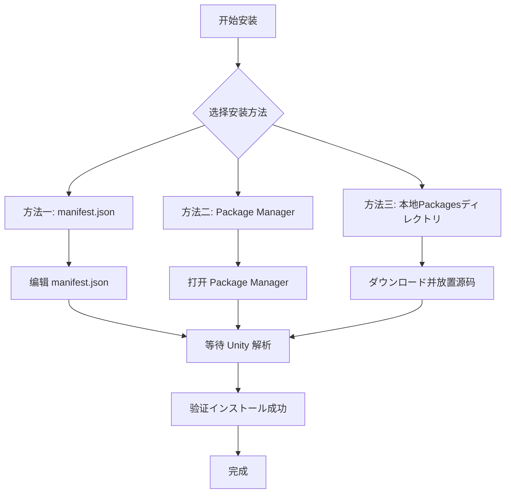

# 安装方法

本文档介绍如何将 GameFrameX Mono コンポーネント安装到您的 Unity プロジェクト中。

## 概要

**GameFrameX Mono** 是 GameFrameX フレームワーク的 MonoBehaviour 生命周期管理コンポーネント，提供します一种简便的方法来监听和管理 Unity 生命周期イベント（如 Update、FixedUpdate、LateUpdate、OnDestroy 等）。

### 前置要求

| 要求 | 最小バージョン |
|------|----------|
| Unity | 2017.1+ |
| GameFrameX.Runtime | 最新版本 |
| GameFrameX.Event.Runtime | 最新版本 |

> **注意**：Mono コンポーネント依赖于 Event コンポーネント，必ず已安装 [com.alianblank.gameframex.unity.event](https://github.com/GameFrameX/com.alianblank.gameframex.unity.event)。

### インストールメソッド概要



---

## 安装メソッド

### メソッド一：を通じて manifest.json 安装（推荐）

这是最推荐的安装方法，方便版本管理和团队协作。

**手順：**

1. 找到您 Unity プロジェクト的 `Packages/manifest.json` ファイル
2. 在 `dependencies` 节点中添加以下の内容：

```json
{
  "dependencies": {
    "com.gameframex.unity.mono": "https://github.com/GameFrameX/com.gameframex.unity.mono.git"
  }
}
```

> Source: [README.md](https://github.com/GameFrameX/com.gameframex.unity.mono/blob/main/README.md#L46-L50)

3. 保存ファイル后，Unity 会自动解析并ダウンロード包

**优点：**
- 版本管理方便
- 团队成员自动同步
- 可能锁定特定版本

---

### メソッド二：を通じて Unity Package Manager 安装

适合喜欢使用 GUI 的開発者。

**手順：**

1. 打开 Unity 编辑器
2. 进入 **Window → Package Manager**
3. 点击左上角的 **+** 按钮
4. 选择 **Add package from git URL**
5. 输入以下地址：

```
https://github.com/GameFrameX/com.gameframex.unity.mono.git
```

6. 点击 **Add** 按钮等待安装完成

> Source: [README.md](https://github.com/GameFrameX/com.gameframex.unity.mono/blob/main/README.md#L50)

**优点：**
- 操作简单直观
- 无需手动编辑ファイル

---

### メソッド三：本地 Packages ディレクトリ安装

适合离线环境或必要深度定制源码的シーン。

**手順：**

1. 克隆或ダウンロード GitHub 仓库：

```bash
git clone https://github.com/GameFrameX/com.gameframex.unity.mono.git
```

2. 将ダウンロード的ファイル夹复制到您 Unity プロジェクト的 `Packages` ディレクトリ下
3. Unity 会自动识别并加载该包

> Source: [README.md](https://github.com/GameFrameX/com.gameframex.unity.mono/blob/main/README.md#L52)

**优点：**
- 无需网络连接
- 可能直接修改源码进行调试

**注意事项：**
- 必要手动更新包的内容
- 可能会被 Unity 自动清理機能影响

---

## 安装验证

インストール完了後，以下のメソッドで確認可能是否成功：

### メソッド一：检查 Package Manager

在 Unity 中打开 **Window → Package Manager**，确认 `GameFrameX Mono` 出现在已安装包列表中。

### メソッド二：检查程序集定义

确认以下程序集定义ファイル存在：
- `Packages/com.gameframex.unity.mono/Runtime/GameFrameX.Mono.Runtime.asmdef`
- `Packages/com.gameframex.unity.mono/Editor/GameFrameX.Mono.Editor.asmdef`

### メソッド三：代码引用测试

在プロジェクト中尝试引用 Mono コンポーネント名前空間：

```csharp
using GameFrameX.Mono.Runtime;

// 确保 IMonoManager 和 MonoComponent 可用
public class TestComponent : MonoBehaviour
{
    private void Start()
    {
        var monoManager = MonoManager.Instance;
        Debug.Log("GameFrameX Mono インストール成功！");
    }
}
```

---

## 包信息

| プロパティ | 值 |
|------|-----|
| 包名 | com.gameframex.unity.mono |
| 显示名称 | Game Frame X Mono |
| 版本 | 1.1.0 |
| Unity 最小バージョン | 2017.1 |
| 分クラス | Game Framework X |

> Source: [package.json](https://github.com/GameFrameX/com.gameframex.unity.mono/blob/main/package.json#L1-L10)

---

## 関連リンク

- [插件介绍](../1-overview.1-introduction)
- [基础使用](../3-getting-started.1-basic-usage)
- [MonoManager 文档](../4-core-components.1-monomanager)
- [MonoComponent 文档](../4-core-components.2-monocomponent)
- [GitHub 仓库](https://github.com/GameFrameX/com.gameframex.unity.mono.git)
- [依赖コンポーネント：Event](https://github.com/GameFrameX/com.alianblank.gameframex.unity.event)
