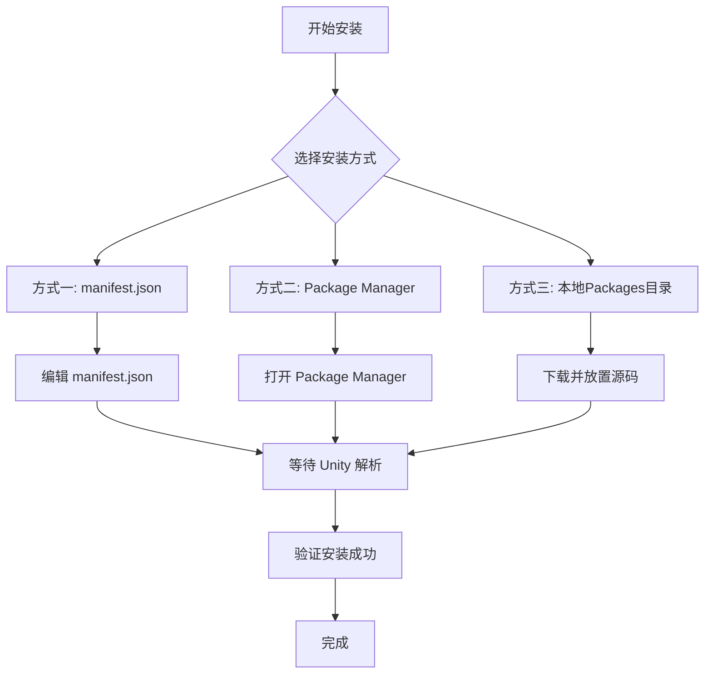

# インストールメソッド

このドキュメント介绍如何将 GameFrameX Mono コンポーネントインストール到您的 Unity プロジェクト中。

## 概要

**GameFrameX Mono** 是 GameFrameX フレームワーク的 MonoBehaviour ライフサイクル管理コンポーネント，提供します一种简便的方法来监听和管理 Unity ライフサイクルイベント（如 Update、FixedUpdate、LateUpdate、OnDestroy 等）。

### 前提条件

| 要求 | 最低バージョン |
|------|----------|
| Unity | 2017.1+ |
| GameFrameX.Runtime | 最新バージョン |
| GameFrameX.Event.Runtime | 最新バージョン |

> **注意**：Mono コンポーネント依赖于 Event コンポーネント，请確認してください已インストール [com.alianblank.gameframex.unity.event](https://github.com/GameFrameX/com.alianblank.gameframex.unity.event)。

### インストールメソッド概览



---

## インストールメソッド

### 方法一：通过 manifest.json インストール（推奨）

这是最推奨的インストール方法，方便バージョン管理和团队协作。

**ステップ：**

1. 找到您 Unity プロジェクト的 `Packages/manifest.json` ファイル
2. 在 `dependencies` 节点中追加以下内容：

```json
{
  "dependencies": {
    "com.gameframex.unity.mono": "https://github.com/GameFrameX/com.gameframex.unity.mono.git"
  }
}
```

> Source: [README.md](https://github.com/GameFrameX/com.gameframex.unity.mono/blob/main/README.md#L46-L50)

3. 保存ファイル后，Unity 会自动解析并下载パッケージ

**优点：**
- バージョン管理方便
- 团队成员自动同步
- 〜できます锁定特定バージョン

---

### 方法二：通过 Unity Package Manager インストール

适合喜欢使用 GUI 的開発者。

**ステップ：**

1. 打开 Unity エディタ
2. 进入 **Window → Package Manager**
3. 点击左上角的 **+** ボタン
4. 选择 **Add package from git URL**
5. 输入以下地址：

```
https://github.com/GameFrameX/com.gameframex.unity.mono.git
```

6. 点击 **Add** ボタン等待インストール完成

> Source: [README.md](https://github.com/GameFrameX/com.gameframex.unity.mono/blob/main/README.md#L50)

**优点：**
- 操作シンプル直观
- 无需手动编辑ファイル

---

### 方法三：本地 Packages ディレクトリインストール

适合离线環境或〜する必要があります深度定制ソースコード的シーン。

**ステップ：**

1. 克隆或下载 GitHub リポジトリ：

```bash
git clone https://github.com/GameFrameX/com.gameframex.unity.mono.git
```

2. 将下载的ファイル夹复制到您 Unity プロジェクト的 `Packages` ディレクトリ下
3. Unity 会自动识别并ロード该パッケージ

> Source: [README.md](https://github.com/GameFrameX/com.gameframex.unity.mono/blob/main/README.md#L52)

**优点：**
- 无需网络连接
- 〜できます直接変更ソースコード进行デバッグ

**注意事项：**
- 〜する必要があります手动アップデートパッケージ的内容
- 〜の可能性があります会被 Unity 自动清理機能影响

---

## インストールの確認

インストール完成后，〜できます通过以下方法検証是否成功：

### メソッド一：確認 Package Manager

在 Unity 中打开 **Window → Package Manager**，確認 `GameFrameX Mono` 出现在已インストールパッケージ列表中。

### メソッド二：確認アセンブリ定義

確認以下アセンブリ定義ファイル存在：
- `Packages/com.gameframex.unity.mono/Runtime/GameFrameX.Mono.Runtime.asmdef`
- `Packages/com.gameframex.unity.mono/Editor/GameFrameX.Mono.Editor.asmdef`

### メソッド三：コード参照テスト

在プロジェクト中尝试参照 Mono コンポーネント名前空間：

```csharp
using GameFrameX.Mono.Runtime;

// 确保 IMonoManager 和 MonoComponent 可用
public class TestComponent : MonoBehaviour
{
    private void Start()
    {
        var monoManager = MonoManager.Instance;
        Debug.Log("GameFrameX Mono 安装成功！");
    }
}
```

---

## パッケージ情報

| プロパティ | 值 |
|------|-----|
| パッケージ名 | com.gameframex.unity.mono |
| 显示名称 | Game Frame X Mono |
| バージョン | 1.1.0 |
| Unity 最低バージョン | 2017.1 |
| 分类 | Game Framework X |

> Source: [package.json](https://github.com/GameFrameX/com.gameframex.unity.mono/blob/main/package.json#L1-L10)

---

## 関連リンク

- [プラグイン介绍](../1-overview.1-introduction)
- [基本使用](../3-getting-started.1-basic-usage)
- [MonoManager ドキュメント](../4-core-components.1-monomanager)
- [MonoComponent ドキュメント](../4-core-components.2-monocomponent)
- [GitHub リポジトリ](https://github.com/GameFrameX/com.gameframex.unity.mono.git)
- [依赖コンポーネント：Event](https://github.com/GameFrameX/com.alianblank.gameframex.unity.event)
