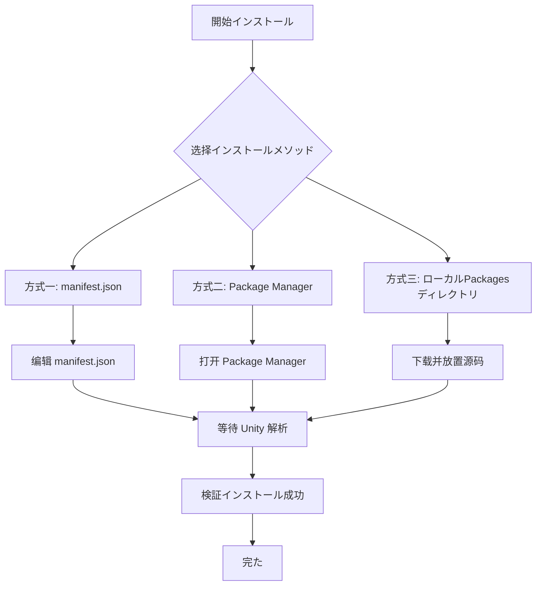

# インストールメソッド

ドキュメント GameFrameX Mono コンポーネントインストールの Unity プロジェクト。

## 

**GameFrameX Mono** は GameFrameX フレームワークの MonoBehaviour コンポーネント，たのと Unity イベント（ Update、FixedUpdate、LateUpdate、OnDestroy ）。

### 

|  | バージョン |
|------|----------|
| Unity | 2017.1+ |
| GameFrameX.Runtime | バージョン |
| GameFrameX.Event.Runtime | バージョン |

> ****：Mono コンポーネント Event コンポーネント，インストール [com.alianblank.gameframex.unity.event](https://github.com/GameFrameX/com.alianblank.gameframex.unity.event)。

### インストールメソッド



---

## インストールメソッド

### ：をじて manifest.json インストール（）

はのインストールメソッド，バージョンと。

**ステップ：**

1.  Unity プロジェクトの `Packages/manifest.json` ファイル
2. に `dependencies` ：

```json
{
  "dependencies": {
    "com.gameframex.unity.mono": "https://github.com/GameFrameX/com.gameframex.unity.mono.git"
  }
}
```

> Source: [README.md](https://github.com/GameFrameX/com.gameframex.unity.mono/blob/main/README.md#L46-L50)

3. ファイル，Unity 

**：**
- バージョン
- 
- バージョン

---

### ：をじて Unity Package Manager インストール

 GUI の。

**ステップ：**

1.  Unity エディター
2.  **Window → Package Manager**
3. の **+** 
4.  **Add package from git URL**
5. ：

```
https://github.com/GameFrameX/com.gameframex.unity.mono.git
```

6.  **Add** インストールた

> Source: [README.md](https://github.com/GameFrameX/com.gameframex.unity.mono/blob/main/README.md#L50)

**：**
- シンプル
- ファイル

---

### ：ローカル Packages ディレクトリインストール

の。

**ステップ：**

1.  GitHub リポジトリ：

```bash
git clone https://github.com/GameFrameX/com.gameframex.unity.mono.git
```

2. のファイル Unity プロジェクトの `Packages` ディレクトリ
3. Unity ロード

> Source: [README.md](https://github.com/GameFrameX/com.gameframex.unity.mono/blob/main/README.md#L52)

**：**
- ネットワーク
- デバッグ

**：**
- の
-  Unity 

---

## インストール

インストールた，をじては：

### メソッド： Package Manager

に Unity  **Window → Package Manager**， `GameFrameX Mono` にインストール。

### メソッド：

ファイルに：
- `Packages/com.gameframex.unity.mono/Runtime/GameFrameX.Mono.Runtime.asmdef`
- `Packages/com.gameframex.unity.mono/Editor/GameFrameX.Mono.Editor.asmdef`

### メソッド：コードテスト

にプロジェクト Mono コンポーネント：

```csharp
using GameFrameX.Mono.Runtime;

// 确保 IMonoManager と MonoComponent 可用
public class TestComponent : MonoBehaviour
{
    private void Start()
    {
        var monoManager = MonoManager.Instance;
        Debug.Log("GameFrameX Mono インストール成功！");
    }
}
```

---

## 

| プロパティ |  |
|------|-----|
|  | com.gameframex.unity.mono |
|  | Game Frame X Mono |
| バージョン | 1.1.0 |
| Unity バージョン | 2017.1 |
| クラス | Game Framework X |

> Source: [package.json](https://github.com/GameFrameX/com.gameframex.unity.mono/blob/main/package.json#L1-L10)

---

## リンク

- [](../1-overview.1-introduction)
- [](../3-getting-started.1-basic-usage)
- [MonoManager ドキュメント](../4-core-components.1-monomanager)
- [MonoComponent ドキュメント](../4-core-components.2-monocomponent)
- [GitHub リポジトリ](https://github.com/GameFrameX/com.gameframex.unity.mono.git)
- [コンポーネント：Event](https://github.com/GameFrameX/com.alianblank.gameframex.unity.event)
