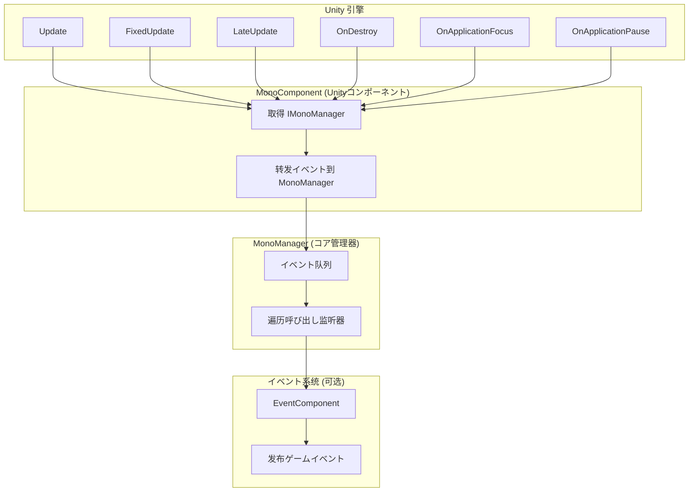
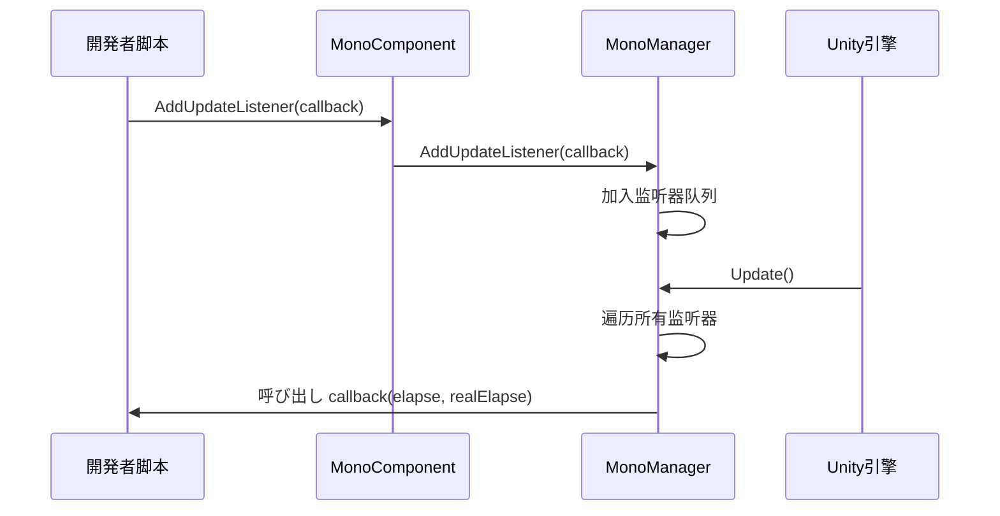

# 基础使用

GameFrameX Mono 生命周期コンポーネント的基础使用指南，帮助開発者快速上手并理解フレームワーク的コア用法。

## 概要

Mono 生命周期コンポーネント是 GameFrameX フレームワーク的コア模块之一，に使用统一管理 Unity 中 `MonoBehaviour` 的各种生命周期イベント。该コンポーネント提供します简洁的监听器模式，使開発者可能方便地订阅和管理 `Update`、`FixedUpdate`、`LateUpdate`、`OnDestroy`、`OnApplicationFocus` 以及 `OnApplicationPause` 等イベント，而无需在每个脚本中单独处理这些回调。

> **设计意图**：将分散在各处的生命周期回调逻辑集中到统一的イベント管理系统中，避免代码耦合，メンテナンスと拡張が容易。

## アーキテクチャ概要



**架构説明**：
- **MonoComponent**：挂载在 GameObject 上的 Unity コンポーネント，负责接收 Unity 生命周期回调并转发给 MonoManager
- **MonoManager**：コア管理器，维护各个イベント的监听器列表，在收到回调时依次呼び出し所有监听器
- **EventSystem**：可选模块，当焦点或暂停ステータス变化时，を通じて EventComponent 发布ゲームイベント供其他模块订阅

## コアコンセプト

### 监听器模式

フレームワーク采用经典的监听器（Observer）模式，開発者可能订阅感兴趣的イベント并在イベント触发时获得通知。



### 线程安全设计

所有监听器的添加和移除操作都使用 `lock` 保护，确保在多线程环境下的安全性。监听器的呼び出し也在锁内执行，防止在呼び出し过程中监听器被意外修改。

> **性能优化**：MonoManager 使用 `LinkedList<T>` 存储监听器，サポート高效的添加、删除和遍历操作。

## 使用メソッド

### 第一步：添加 MonoComponent

在 Unity 编辑器中，選択必要使用生命周期イベント的 GameObject，点击 **Add Component**，搜索 **GameFrameX/Mono** 并添加。

```csharp
// 源码位置：Runtime/Mono/MonoComponent.cs#L42-L44
[DisallowMultipleComponent]
[AddComponentMenu("GameFrameX/Mono")]
public class MonoComponent : GameFrameworkComponent
```

或者を通じて代码动态添加：

```csharp
var monoComponent = gameObject.AddComponent<GameFrameX.Mono.Runtime.MonoComponent>();
```
> Source: [MonoComponent.cs](https://github.com/GameFrameX/com.gameframex.unity.mono/blob/main/Runtime/Mono/MonoComponent.cs#L42-L44)

### 第二步：订阅生命周期イベント

在脚本中取得 `MonoComponent` インスタンス后，可能呼び出し相应的メソッド订阅イベント。以下是完整的使用示例：

```csharp
using UnityEngine;
using GameFrameX.Mono.Runtime;
using System;

public class Example : MonoBehaviour
{
    private MonoComponent _monoComponent;

    private void Awake()
    {
        // 取得 MonoComponent インスタンス
        _monoComponent = GetComponent<MonoComponent>();
    }

    private void Start()
    {
        // 订阅 Update イベント
        _monoComponent.AddUpdateListener(OnGameUpdate);
        
        // 订阅 FixedUpdate イベント
        _monoComponent.AddFixedUpdateListener(OnFixedUpdate);
        
        // 订阅 LateUpdate イベント
        _monoComponent.AddLateUpdateListener(OnLateUpdate);
        
        // 订阅 OnDestroy イベント
        _monoComponent.AddDestroyListener(OnGameObjectDestroy);
        
        // 订阅焦点变化イベント
        _monoComponent.AddOnApplicationFocusListener(OnApplicationFocus);
        
        // 订阅暂停ステータス变化イベント
        _monoComponent.AddOnApplicationPauseListener(OnApplicationPause);
    }

    private void OnDestroy()
    {
        // 页面销毁时移除监听器，避免内存泄漏
        if (_monoComponent != null)
        {
            _monoComponent.RemoveUpdateListener(OnGameUpdate);
            _monoComponent.RemoveFixedUpdateListener(OnFixedUpdate);
            _monoComponent.RemoveLateUpdateListener(OnLateUpdate);
            _monoComponent.RemoveDestroyListener(OnGameObjectDestroy);
            _monoComponent.RemoveOnApplicationFocusListener(OnApplicationFocus);
            _monoComponent.RemoveOnApplicationPauseListener(OnApplicationPause);
        }
    }

    // Update: 每帧呼び出し，第一个参数是距离上一帧的时间，第二个参数是真实流逝时间
    private void OnGameUpdate(float elapseSeconds, float realElapseSeconds)
    {
        // 编写ゲーム逻辑
    }

    // FixedUpdate: 固定帧率呼び出し，适合物理関連的逻辑
    private void OnFixedUpdate(float elapseSeconds, float fixedElapseSeconds)
    {
        // 编写物理逻辑
    }

    // LateUpdate: 所有 Update 呼び出し后呼び出し，适合相机跟随等必要在所有移动逻辑执行后的操作
    private void OnLateUpdate(float elapseSeconds, float fixedElapseSeconds)
    {
        // 编写必要在最后执行的逻辑
    }

    // OnDestroy: GameObject 销毁时呼び出し，适合リソース清理
    private void OnGameObjectDestroy()
    {
        // 清理リソース
    }

    // OnApplicationFocus: 应用程序焦点变化时呼び出し
    private void OnApplicationFocus(bool focusStatus)
    {
        if (focusStatus)
        {
            Debug.Log("应用程序获得焦点");
        }
        else
        {
            Debug.Log("应用程序失去焦点");
        }
    }

    // OnApplicationPause: 应用程序暂停ステータス变化时呼び出し
    private void OnApplicationPause(bool pauseStatus)
    {
        if (pauseStatus)
        {
            Debug.Log("ゲーム已暂停");
        }
        else
        {
            Debug.Log("ゲーム已恢复");
        }
    }
}
```

> Source: [MonoComponent.cs](https://github.com/GameFrameX/com.gameframex.unity.mono/blob/main/Runtime/Mono/MonoComponent.cs#L126-L300)

## イベントクラス型详解

| イベントクラス型 | 回调参数 | 呼び出し时机 | 适用シーン |
|---------|---------|---------|---------|
| **Update** | `(float elapseSeconds, float realElapseSeconds)` | 每帧呼び出し，最先执行 | ゲーム主循环逻辑、输入检测 |
| **FixedUpdate** | `(float elapseSeconds, float fixedElapseSeconds)` | 固定帧率呼び出し（默认0.02秒） | 物理引擎関連逻辑 |
| **LateUpdate** | `(float elapseSeconds, float fixedElapseSeconds)` | 所有 Update 后呼び出し | 相机跟随、角色移动后的处理 |
| **OnDestroy** | `()` | GameObject 销毁时呼び出し | リソース清理、イベント注销 |
| **OnApplicationFocus** | `(bool focusStatus)` | 应用获得/失去焦点时呼び出し | 暂停ゲーム、记录ステータス |
| **OnApplicationPause** | `(bool pauseStatus)` | 应用暂停/恢复时呼び出し | 保存数据、停止音乐 |

### 参数説明

- **elapseSeconds**：距离上一帧的流逝时间（秒），受时间缩放影响
- **realElapseSeconds**：真实流逝时间（秒），不受时间缩放影响
- **fixedElapseSeconds**：固定更新模式的流逝时间
- **focusStatus**：焦点ステータス，`true` 表示获得焦点，`false` 表示失去焦点
- **pauseStatus**：暂停ステータス，`true` 表示暂停，`false` 表示恢复

## イベント系统集成

除了を通じて监听器回调，`OnApplicationFocus` 和 `OnApplicationPause` イベント还会を通じて GameFrameX 的イベント系统发布，開発者也可能使用イベント系统来订阅这些变化：

```csharp
using GameFrameX.Event.Runtime;
using GameFrameX.Mono.Runtime;

// 订阅焦点变化イベント
EventComponent.Subscribe<OnApplicationFocusChangedEventArgs>(OnFocusChanged);

// 订阅暂停变化イベント
EventComponent.Subscribe<OnApplicationPauseChangedEventArgs>(OnPauseChanged);

private void OnFocusChanged(OnApplicationFocusChangedEventArgs args)
{
    Debug.Log($"焦点变化: {args.IsFocus}");
}

private void OnPauseChanged(OnApplicationPauseChangedEventArgs args)
{
    Debug.Log($"暂停ステータス: {args.IsPause}");
}
```

> **注意**：イベント系统的发布在 MonoComponent 中実装，詳細説明お願いします参阅 [イベント系统文档](../5-events.1-event-types)。

## 最佳实践

### 1. 及时移除监听器

在 `OnDestroy` 或コンポーネント禁用时移除监听器，避免内存泄漏和空引用異常：

```csharp
private void OnDestroy()
{
    // 检查是否为 null，因为 Unity 可能在コンポーネント销毁时先清理引用
    _monoComponent?.RemoveUpdateListener(OnGameUpdate);
}
```

### 2. 不要在监听器中执行耗时操作

生命周期イベント每帧都会呼び出し，耗时操作会阻塞ゲーム主线程，影响性能：

```csharp
// ❌ 不推荐：执行耗时操作
private void OnGameUpdate(float elapse, float realElapse)
{
    LoadLargeResource(); // 这会阻塞主线程
}

// ✅ 推荐：使用コルーチン或异步操作
private void OnGameUpdate(float elapse, float realElapse)
{
    StartCoroutine(LoadResourceAsync());
}
```

### 3. 異常隔离

MonoManager 実装了異常隔离机制，单个监听器的異常不会影响其他监听器的执行：

```csharp
// MonoManager 内部実装（源码片段）
private static void QueueInvoking(LinkedList<Action<float, float>> list, float elapseSeconds, float fixedElapseSeconds)
{
    lock (Lock)
    {
        foreach (var action in list)
        {
            try
            {
                action.Invoke(elapseSeconds, fixedElapseSeconds);
            }
            catch (Exception e)
            {
                Log.Error(e); // 记录異常但继续执行其他监听器
            }
        }
    }
}
```
> Source: [MonoManager.cs](https://github.com/GameFrameX/com.gameframex.unity.mono/blob/main/Runtime/Mono/MonoManager.cs#L364-L380)

### 4. 使用有意义的监听器メソッド名

为监听器使用説明性的メソッド名，提高代码可读性：

```csharp
// ✅ 推荐
_monoComponent.AddUpdateListener(UpdatePlayerMovement);
_monoComponent.AddFixedUpdateListener(SyncPhysicsState);

// ❌ 不推荐
_monoComponent.AddUpdateListener(Update);
_monoComponent.AddFixedUpdateListener(Fixed);
```

## よくある質問

### Q1: MonoComponent 必要挂载在哪里？

MonoComponent 必要挂载在必要接收生命周期イベント的 GameObject 上。建议挂载在ゲームエントリーポイント的 GameObject 上（如 GameManager），这样可能在一个地方管理所有生命周期イベント。

### Q2: 监听器回调中的異常会影响ゲーム运行吗？

不会。MonoManager 実装了異常隔离，单个监听器的異常会被捕获并记录，不会影响其他监听器的执行。

### Q3: Update、FixedUpdate、LateUpdate 有什么区别？

- **Update**：每帧呼び出し，时间间隔受 `Time.timeScale` 影响
- **FixedUpdate**：固定时间间隔呼び出し（默认 0.02 秒），适合物理计算
- **LateUpdate**：在所有 Update 呼び出し后呼び出し，适合相机跟随等必要等待其他逻辑完成后的操作

### Q4: 如何取得 MonoManager インスタンス？

を通じて GameFrameworkEntry 取得：

```csharp
var monoManager = GameFrameworkEntry.GetModule<IMonoManager>();
```

### Q5: イベント监听器和イベント系统有什么区别？

- **监听器**：を通じて MonoComponent 添加回调，直接在イベント触发时呼び出し，适合一对一的通信
- **イベント系统**：を通じて EventComponent 发布/订阅イベント，サポート多订阅者，适合一对多的通信

## 関連リンク

- [MonoManager コアコンポーネント详解](../4-core-components.1-monomanager)
- [MonoComponent コンポーネント详解](../4-core-components.2-monocomponent)
- [イベントクラス型详解](../5-events.1-event-types)
- [イベント参数详解](../5-events.2-event-args)
- [安装指南](../2-installation.1-installation-methods)
- [插件介绍](../1-overview.1-introduction)
