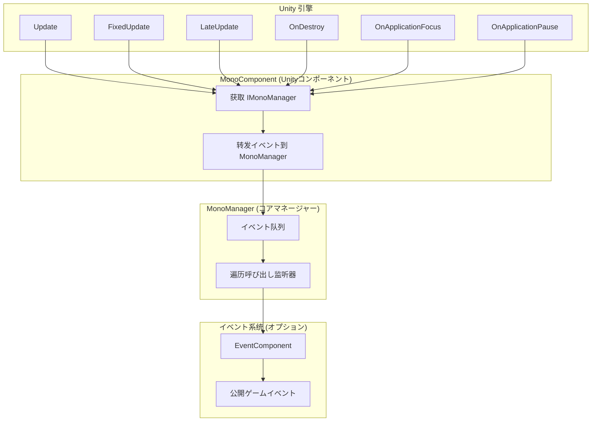
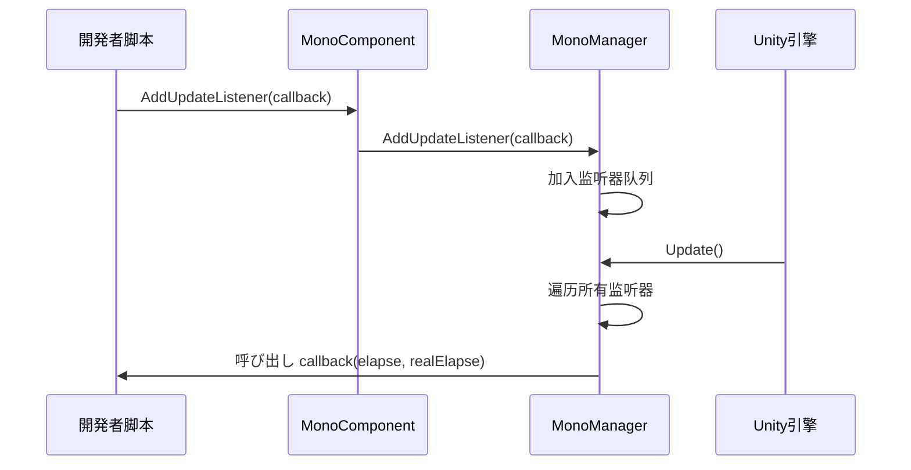

# 

GameFrameX Mono コンポーネントのガイド，フレームワークのコア。

## 

Mono コンポーネントは GameFrameX フレームワークのコアモジュール，に Unity  `MonoBehaviour` のイベント。コンポーネントたの，と `Update`、`FixedUpdate`、`LateUpdate`、`OnDestroy`、`OnApplicationFocus`  `OnApplicationPause` イベント，に。

> ****：にののイベント，コード，と。

## アーキテクチャ



**アーキテクチャ**：
- **MonoComponent**：に GameObject の Unity コンポーネント， Unity  MonoManager
- **MonoManager**：コアマネージャー，イベントの，にびし
- **EventSystem**：オプションモジュール，，をじて EventComponent ゲームイベントモジュール

## コアコンセプト

### 

フレームワークの（Observer），のイベントにイベント。



### 

のと `lock` ，にの。のびしに，にびし。

> ****：MonoManager  `LinkedList<T>` ，サポートの、と。

## 

### ： MonoComponent

に Unity エディター，イベントの GameObject， **Add Component**， **GameFrameX/Mono** 。

```csharp
// 源码位置：Runtime/Mono/MonoComponent.cs#L42-L44
[DisallowMultipleComponent]
[AddComponentMenu("GameFrameX/Mono")]
public class MonoComponent : GameFrameworkComponent
```

をじてコード：

```csharp
var monoComponent = gameObject.AddComponent<GameFrameX.Mono.Runtime.MonoComponent>();
```
> Source: [MonoComponent.cs](https://github.com/GameFrameX/com.gameframex.unity.mono/blob/main/Runtime/Mono/MonoComponent.cs#L42-L44)

### ：イベント

に `MonoComponent` ，びしのメソッドイベント。はの：

```csharp
using UnityEngine;
using GameFrameX.Mono.Runtime;
using System;

public class Example : MonoBehaviour
{
    private MonoComponent _monoComponent;

    private void Awake()
    {
        // 获取 MonoComponent 实例
        _monoComponent = GetComponent<MonoComponent>();
    }

    private void Start()
    {
        // 订阅 Update イベント
        _monoComponent.AddUpdateListener(OnGameUpdate);
        
        // 订阅 FixedUpdate イベント
        _monoComponent.AddFixedUpdateListener(OnFixedUpdate);
        
        // 订阅 LateUpdate イベント
        _monoComponent.AddLateUpdateListener(OnLateUpdate);
        
        // 订阅 OnDestroy イベント
        _monoComponent.AddDestroyListener(OnGameObjectDestroy);
        
        // 订阅焦点变化イベント
        _monoComponent.AddOnApplicationFocusListener(OnApplicationFocus);
        
        // 订阅暂停状態变化イベント
        _monoComponent.AddOnApplicationPauseListener(OnApplicationPause);
    }

    private void OnDestroy()
    {
        // 页面销毁时移除监听器，避免内存泄漏
        if (_monoComponent != null)
        {
            _monoComponent.RemoveUpdateListener(OnGameUpdate);
            _monoComponent.RemoveFixedUpdateListener(OnFixedUpdate);
            _monoComponent.RemoveLateUpdateListener(OnLateUpdate);
            _monoComponent.RemoveDestroyListener(OnGameObjectDestroy);
            _monoComponent.RemoveOnApplicationFocusListener(OnApplicationFocus);
            _monoComponent.RemoveOnApplicationPauseListener(OnApplicationPause);
        }
    }

    // Update: 每帧呼び出し，第一个パラメータは距离上一帧の时间，第二个パラメータは真实流逝时间
    private void OnGameUpdate(float elapseSeconds, float realElapseSeconds)
    {
        // 编写ゲーム逻辑
    }

    // FixedUpdate: 固定帧率呼び出し，适合物理関連の逻辑
    private void OnFixedUpdate(float elapseSeconds, float fixedElapseSeconds)
    {
        // 编写物理逻辑
    }

    // LateUpdate: 所有 Update 呼び出し后呼び出し，适合相机跟随等必要に所有移动逻辑実行后の操作
    private void OnLateUpdate(float elapseSeconds, float fixedElapseSeconds)
    {
        // 编写必要に最后実行の逻辑
    }

    // OnDestroy: GameObject 销毁时呼び出し，适合リソース清理
    private void OnGameObjectDestroy()
    {
        // 清理リソース
    }

    // OnApplicationFocus: 应用程序焦点变化时呼び出し
    private void OnApplicationFocus(bool focusStatus)
    {
        if (focusStatus)
        {
            Debug.Log("应用程序获得焦点");
        }
        else
        {
            Debug.Log("应用程序失去焦点");
        }
    }

    // OnApplicationPause: 应用程序暂停状態变化时呼び出し
    private void OnApplicationPause(bool pauseStatus)
    {
        if (pauseStatus)
        {
            Debug.Log("ゲーム已暂停");
        }
        else
        {
            Debug.Log("ゲーム已恢复");
        }
    }
}
```

> Source: [MonoComponent.cs](https://github.com/GameFrameX/com.gameframex.unity.mono/blob/main/Runtime/Mono/MonoComponent.cs#L126-L300)

## イベントタイプ

| イベントタイプ | パラメータ | びし |  |
|---------|---------|---------|---------|
| **Update** | `(float elapseSeconds, float realElapseSeconds)` | びし， | ゲーム、 |
| **FixedUpdate** | `(float elapseSeconds, float fixedElapseSeconds)` | びし（デフォルト0.02） |  |
| **LateUpdate** | `(float elapseSeconds, float fixedElapseSeconds)` |  Update びし | 、の |
| **OnDestroy** | `()` | GameObject びし | リソース、イベント |
| **OnApplicationFocus** | `(bool focusStatus)` | /びし | ゲーム、 |
| **OnApplicationPause** | `(bool pauseStatus)` | /びし | データ、 |

### パラメータ

- **elapseSeconds**：の（），
- **realElapseSeconds**：（），
- **fixedElapseSeconds**：の
- **focusStatus**：，`true` ，`false` 
- **pauseStatus**：，`true` ，`false` 

## イベント

たをじて，`OnApplicationFocus` と `OnApplicationPause` イベントをじて GameFrameX のイベント，イベント：

```csharp
using GameFrameX.Event.Runtime;
using GameFrameX.Mono.Runtime;

// 订阅焦点变化イベント
EventComponent.Subscribe<OnApplicationFocusChangedEventArgs>(OnFocusChanged);

// 订阅暂停变化イベント
EventComponent.Subscribe<OnApplicationPauseChangedEventArgs>(OnPauseChanged);

private void OnFocusChanged(OnApplicationFocusChangedEventArgs args)
{
    Debug.Log($"焦点变化: {args.IsFocus}");
}

private void OnPauseChanged(OnApplicationPauseChangedEventArgs args)
{
    Debug.Log($"暂停状態: {args.IsPause}");
}
```

> ****：イベントのに MonoComponent ， [イベントドキュメント](../5-events.1-event-types)。

## 

### 1. 

に `OnDestroy` コンポーネント，と：

```csharp
private void OnDestroy()
{
    // 检查は否为 null，因为 Unity 可能にコンポーネント销毁时先清理引用
    _monoComponent?.RemoveUpdateListener(OnGameUpdate);
}
```

### 2. に

イベントびし，ゲーム，：

```csharp
// ❌ 不推荐：実行耗时操作
private void OnGameUpdate(float elapse, float realElapse)
{
    LoadLargeResource(); // 这会阻塞主线程
}

// ✅ 推荐：使用コルーチン或异步操作
private void OnGameUpdate(float elapse, float realElapse)
{
    StartCoroutine(LoadResourceAsync());
}
```

### 3. 

MonoManager た，のの：

```csharp
// MonoManager 内部实现（源码片段）
private static void QueueInvoking(LinkedList<Action<float, float>> list, float elapseSeconds, float fixedElapseSeconds)
{
    lock (Lock)
    {
        foreach (var action in list)
        {
            try
            {
                action.Invoke(elapseSeconds, fixedElapseSeconds);
            }
            catch (Exception e)
            {
                Log.Error(e); // 记录例外但继续実行其他监听器
            }
        }
    }
}
```
> Source: [MonoManager.cs](https://github.com/GameFrameX/com.gameframex.unity.mono/blob/main/Runtime/Mono/MonoManager.cs#L364-L380)

### 4. のメソッド

のメソッド，コード：

```csharp
// ✅ 推荐
_monoComponent.AddUpdateListener(UpdatePlayerMovement);
_monoComponent.AddFixedUpdateListener(SyncPhysicsState);

// ❌ 不推荐
_monoComponent.AddUpdateListener(Update);
_monoComponent.AddFixedUpdateListener(Fixed);
```

## よくある

### Q1: MonoComponent に？

MonoComponent にイベントの GameObject 。にゲームの GameObject （ GameManager），にイベント。

### Q2: のゲーム？

。MonoManager た，の，の。

### Q3: Update、FixedUpdate、LateUpdate ？

- **Update**：びし， `Time.timeScale` 
- **FixedUpdate**：びし（デフォルト 0.02 ），
- **LateUpdate**：に Update びしびし，たの

### Q4:  MonoManager ？

をじて GameFrameworkEntry ：

```csharp
var monoManager = GameFrameworkEntry.GetModule<IMonoManager>();
```

### Q5: イベントとイベント？

- ****：をじて MonoComponent ，にイベントびし，の
- **イベント**：をじて EventComponent /イベント，サポート，の

## リンク

- [MonoManager コアコンポーネント](../4-core-components.1-monomanager)
- [MonoComponent コンポーネント](../4-core-components.2-monocomponent)
- [イベントタイプ](../5-events.1-event-types)
- [イベント](../5-events.2-event-args)
- [インストールガイド](../2-installation.1-installation-methods)
- [](../1-overview.1-introduction)
