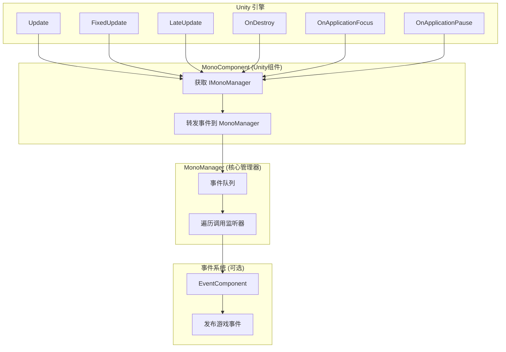
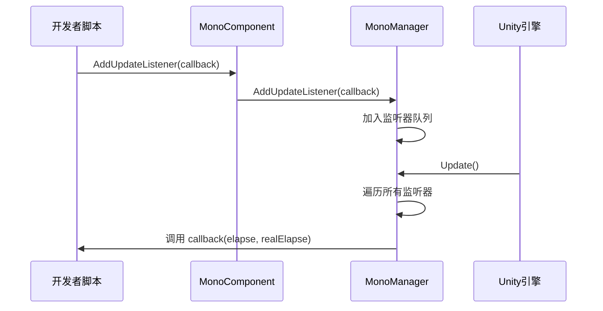

# 基本使用

GameFrameX Mono ライフサイクルコンポーネント的基本使用ガイド，帮助開発者快速上手并理解フレームワーク的コア用法。

## 概要

Mono ライフサイクルコンポーネント是 GameFrameX フレームワーク的コアモジュール之一，用于統一された管理 Unity 中 `MonoBehaviour` 的各种ライフサイクルイベント。该コンポーネント提供しますシンプル的监听器モード，使開発者〜できます方便地購読和管理 `Update`、`FixedUpdate`、`LateUpdate`、`OnDestroy`、`OnApplicationFocus` および `OnApplicationPause` 等イベント，而无需在每个脚本中单独処理这些コールバック。

> **設計意图**：将分散在各处的ライフサイクルコールバック逻辑集中到統一された的イベント管理系统中，避免コード耦合，便于维护和拡張。

## アーキテクチャ概览



**アーキテクチャ説明**：
- **MonoComponent**：挂载在 GameObject 上的 Unity コンポーネント，负责受信 Unity ライフサイクルコールバック并转发给 MonoManager
- **MonoManager**：コアマネージャー，维护各个イベント的监听器列表，在收到コールバック时依次呼び出し所有监听器
- **EventSystem**：可选モジュール，当焦点或暂停ステータス变化时，通过 EventComponent リリース游戏イベント供其他モジュール購読

## コアコンセプト

### 监听器モード

フレームワーク采用经典的监听器（Observer）モード，開発者〜できます購読感兴趣的イベント并在イベントトリガー时获得通知。



### 线程安全設計

所有监听器的追加和移除操作都使用 `lock` 保护，確認してください在多线程環境下的安全性。监听器的呼び出し也在锁内执行，防止在呼び出し过程中监听器被意外変更。

> **性能最適化**：MonoManager 使用 `LinkedList<T>` 存储监听器，サポート効率的的追加、削除和遍历操作。

## 使用方法

### 第1步：追加 MonoComponent

在 Unity エディタ中，选中〜する必要があります使用ライフサイクルイベント的 GameObject，点击 **Add Component**，検索 **GameFrameX/Mono** 并追加。

```csharp
// 源码位置：Runtime/Mono/MonoComponent.cs#L42-L44
[DisallowMultipleComponent]
[AddComponentMenu("GameFrameX/Mono")]
public class MonoComponent : GameFrameworkComponent
```

または通过コード动态追加：

```csharp
var monoComponent = gameObject.AddComponent<GameFrameX.Mono.Runtime.MonoComponent>();
```
> Source: [MonoComponent.cs](https://github.com/GameFrameX/com.gameframex.unity.mono/blob/main/Runtime/Mono/MonoComponent.cs#L42-L44)

### 第2步：購読ライフサイクルイベント

在脚本中取得 `MonoComponent` インスタンス后，〜できます呼び出し相应的メソッド購読イベント。以下是完全な的使用例：

```csharp
using UnityEngine;
using GameFrameX.Mono.Runtime;
using System;

public class Example : MonoBehaviour
{
    private MonoComponent _monoComponent;

    private void Awake()
    {
        // 获取 MonoComponent 实例
        _monoComponent = GetComponent<MonoComponent>();
    }

    private void Start()
    {
        // 订阅 Update 事件
        _monoComponent.AddUpdateListener(OnGameUpdate);
        
        // 订阅 FixedUpdate 事件
        _monoComponent.AddFixedUpdateListener(OnFixedUpdate);
        
        // 订阅 LateUpdate 事件
        _monoComponent.AddLateUpdateListener(OnLateUpdate);
        
        // 订阅 OnDestroy 事件
        _monoComponent.AddDestroyListener(OnGameObjectDestroy);
        
        // 订阅焦点变化事件
        _monoComponent.AddOnApplicationFocusListener(OnApplicationFocus);
        
        // 订阅暂停状态变化事件
        _monoComponent.AddOnApplicationPauseListener(OnApplicationPause);
    }

    private void OnDestroy()
    {
        // 页面销毁时移除监听器，避免内存泄漏
        if (_monoComponent != null)
        {
            _monoComponent.RemoveUpdateListener(OnGameUpdate);
            _monoComponent.RemoveFixedUpdateListener(OnFixedUpdate);
            _monoComponent.RemoveLateUpdateListener(OnLateUpdate);
            _monoComponent.RemoveDestroyListener(OnGameObjectDestroy);
            _monoComponent.RemoveOnApplicationFocusListener(OnApplicationFocus);
            _monoComponent.RemoveOnApplicationPauseListener(OnApplicationPause);
        }
    }

    // Update: 每帧调用，第一个参数是距离上一帧的时间，第二个参数是真实流逝时间
    private void OnGameUpdate(float elapseSeconds, float realElapseSeconds)
    {
        // 编写游戏逻辑
    }

    // FixedUpdate: 固定帧率调用，适合物理相关的逻辑
    private void OnFixedUpdate(float elapseSeconds, float fixedElapseSeconds)
    {
        // 编写物理逻辑
    }

    // LateUpdate: 所有 Update 调用后调用，适合相机跟随等需要在所有移动逻辑执行后的操作
    private void OnLateUpdate(float elapseSeconds, float fixedElapseSeconds)
    {
        // 编写需要在最后执行的逻辑
    }

    // OnDestroy: GameObject 销毁时调用，适合资源清理
    private void OnGameObjectDestroy()
    {
        // 清理资源
    }

    // OnApplicationFocus: 应用程序焦点变化时调用
    private void OnApplicationFocus(bool focusStatus)
    {
        if (focusStatus)
        {
            Debug.Log("应用程序获得焦点");
        }
        else
        {
            Debug.Log("应用程序失去焦点");
        }
    }

    // OnApplicationPause: 应用程序暂停状态变化时调用
    private void OnApplicationPause(bool pauseStatus)
    {
        if (pauseStatus)
        {
            Debug.Log("游戏已暂停");
        }
        else
        {
            Debug.Log("游戏已恢复");
        }
    }
}
```

> Source: [MonoComponent.cs](https://github.com/GameFrameX/com.gameframex.unity.mono/blob/main/Runtime/Mono/MonoComponent.cs#L126-L300)

## イベントタイプ详解

| イベントタイプ | コールバックパラメータ | 呼び出し时机 | 适用シーン |
|---------|---------|---------|---------|
| **Update** | `(float elapseSeconds, float realElapseSeconds)` | 每帧呼び出し，最先执行 | 游戏主循环逻辑、输入检测 |
| **FixedUpdate** | `(float elapseSeconds, float fixedElapseSeconds)` | 固定帧率呼び出し（デフォルト0.02秒） | 物理引擎相关逻辑 |
| **LateUpdate** | `(float elapseSeconds, float fixedElapseSeconds)` | 所有 Update 后呼び出し | 相机跟随、角色移动后的処理 |
| **OnDestroy** | `()` | GameObject 破棄时呼び出し | リソース清理、イベント注销 |
| **OnApplicationFocus** | `(bool focusStatus)` | 应用获得/失去焦点时呼び出し | 暂停游戏、记录ステータス |
| **OnApplicationPause** | `(bool pauseStatus)` | 应用暂停/恢复时呼び出し | 保存数据、停止音乐 |

### パラメータ説明

- **elapseSeconds**：距离上一帧的流逝时间（秒），受时间缩放影响
- **realElapseSeconds**：真实流逝时间（秒），不受时间缩放影响
- **fixedElapseSeconds**：固定アップデートモード的流逝时间
- **focusStatus**：焦点ステータス，`true` 表示获得焦点，`false` 表示失去焦点
- **pauseStatus**：暂停ステータス，`true` 表示暂停，`false` 表示恢复

## イベント系统集成

除了通过监听器コールバック，`OnApplicationFocus` 和 `OnApplicationPause` イベント还会通过 GameFrameX 的イベント系统リリース，開発者也〜できます使用イベント系统来購読这些变化：

```csharp
using GameFrameX.Event.Runtime;
using GameFrameX.Mono.Runtime;

// 订阅焦点变化事件
EventComponent.Subscribe<OnApplicationFocusChangedEventArgs>(OnFocusChanged);

// 订阅暂停变化事件
EventComponent.Subscribe<OnApplicationPauseChangedEventArgs>(OnPauseChanged);

private void OnFocusChanged(OnApplicationFocusChangedEventArgs args)
{
    Debug.Log($"焦点变化: {args.IsFocus}");
}

private void OnPauseChanged(OnApplicationPauseChangedEventArgs args)
{
    Debug.Log($"暂停状态: {args.IsPause}");
}
```

> **注意**：イベント系统的リリース在 MonoComponent 中実装，詳細説明请参照 [イベント系统ドキュメント](../5-events.1-event-types)。

## ベストプラクティス

### 1. 及时移除监听器

在 `OnDestroy` 或コンポーネント禁用时移除监听器，避免内存泄漏和空参照例外：

```csharp
private void OnDestroy()
{
    // 检查是否为 null，因为 Unity 可能在组件销毁时先清理引用
    _monoComponent?.RemoveUpdateListener(OnGameUpdate);
}
```

### 2. 不要在监听器中执行耗时操作

ライフサイクルイベント每帧都会呼び出し，耗时操作会阻塞游戏主线程，影响性能：

```csharp
// ❌ 不推荐：执行耗时操作
private void OnGameUpdate(float elapse, float realElapse)
{
    LoadLargeResource(); // 这会阻塞主线程
}

// ✅ 推荐：使用协程或异步操作
private void OnGameUpdate(float elapse, float realElapse)
{
    StartCoroutine(LoadResourceAsync());
}
```

### 3. 例外隔离

MonoManager 実装了例外隔离机制，单个监听器的例外不会影响其他监听器的执行：

```csharp
// MonoManager 内部实现（源码片段）
private static void QueueInvoking(LinkedList<Action<float, float>> list, float elapseSeconds, float fixedElapseSeconds)
{
    lock (Lock)
    {
        foreach (var action in list)
        {
            try
            {
                action.Invoke(elapseSeconds, fixedElapseSeconds);
            }
            catch (Exception e)
            {
                Log.Error(e); // 记录异常但继续执行其他监听器
            }
        }
    }
}
```
> Source: [MonoManager.cs](https://github.com/GameFrameX/com.gameframex.unity.mono/blob/main/Runtime/Mono/MonoManager.cs#L364-L380)

### 4. 使用有意义的监听器メソッド名

为监听器使用説明性的メソッド名，提高コード可读性：

```csharp
// ✅ 推荐
_monoComponent.AddUpdateListener(UpdatePlayerMovement);
_monoComponent.AddFixedUpdateListener(SyncPhysicsState);

// ❌ 不推荐
_monoComponent.AddUpdateListener(Update);
_monoComponent.AddFixedUpdateListener(Fixed);
```

## よくある問題

### Q1: MonoComponent 〜する必要があります挂载在哪里？

MonoComponent 〜する必要があります挂载在〜する必要があります受信ライフサイクルイベント的 GameObject 上。お勧め挂载在游戏入口的 GameObject 上（如 GameManager），这样〜できます在一个地方管理所有ライフサイクルイベント。

### Q2: 监听器コールバック中的例外会影响游戏运行吗？

不会。MonoManager 実装了例外隔离，单个监听器的例外会被捕获并记录，不会影响其他监听器的执行。

### Q3: Update、FixedUpdate、LateUpdate 有什么区别？

- **Update**：每帧呼び出し，时间间隔受 `Time.timeScale` 影响
- **FixedUpdate**：固定时间间隔呼び出し（デフォルト 0.02 秒），适合物理计算
- **LateUpdate**：在所有 Update 呼び出し后呼び出し，适合相机跟随等〜する必要があります等待其他逻辑完成后的操作

### Q4: 如何取得 MonoManager インスタンス？

通过 GameFrameworkEntry 取得：

```csharp
var monoManager = GameFrameworkEntry.GetModule<IMonoManager>();
```

### Q5: イベント监听器和イベント系统有什么区别？

- **监听器**：通过 MonoComponent 追加コールバック，直接在イベントトリガー时呼び出し，适合一对一的通信
- **イベント系统**：通过 EventComponent リリース/購読イベント，サポート多購読者，适合一对多的通信

## 関連リンク

- [MonoManager コアコンポーネント详解](../4-core-components.1-monomanager)
- [MonoComponent コンポーネント详解](../4-core-components.2-monocomponent)
- [イベントタイプ详解](../5-events.1-event-types)
- [イベントパラメータ详解](../5-events.2-event-args)
- [インストールガイド](../2-installation.1-installation-methods)
- [プラグイン介绍](../1-overview.1-introduction)
