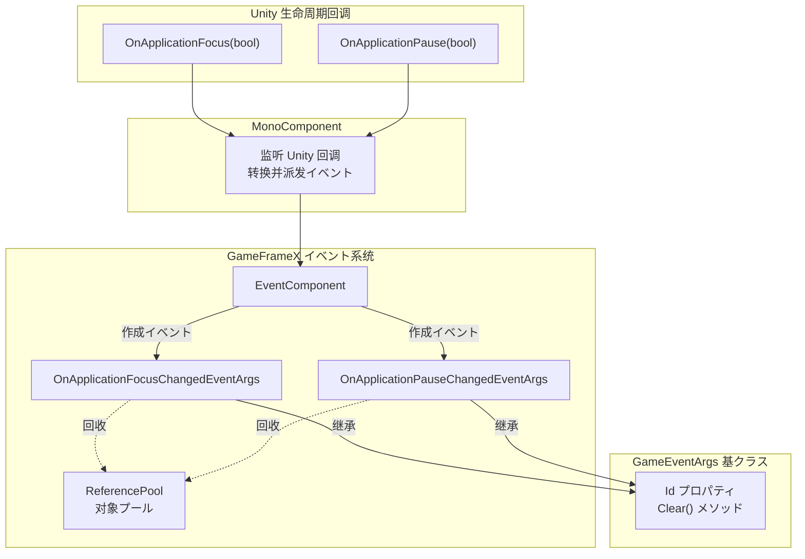
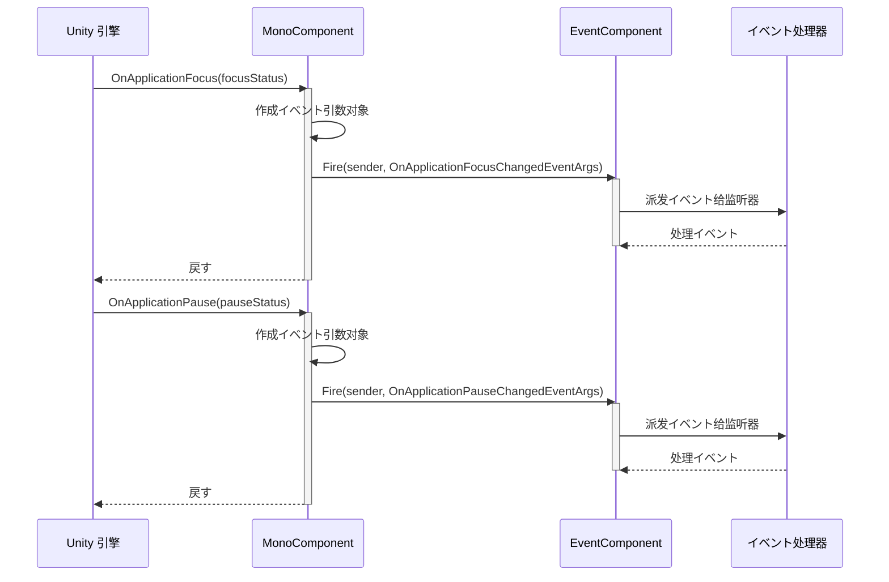

# イベントタイプ

ドキュメント GameFrameX Mono のイベントタイプ，に Unity のと。

## 

GameFrameX Mono たコアイベントタイプ，に Unity の。イベントにづく GameFrameX イベントビルド，サポートプール，と。

**イベントタイプ:**

| イベントタイプ |  | イベントID |
|---------|------|--------|
| OnApplicationFocusChangedEventArgs | イベント | クラスの |
| OnApplicationPauseChangedEventArgs | /イベント | クラスの |

## アーキテクチャ



**アーキテクチャ:**

1. **MonoComponent**: にの Unity コンポーネント， Unity  (`OnApplicationFocus` と `OnApplicationPause`)
2. **イベント**:  Unity のパラメータタイプのイベント
3. **EventComponent**: GameFrameX コアのイベントコンポーネント，イベントのと
4. **イベント**:  `GameEventArgs` クラス，のインターフェースとプールサポート

## イベントタイプ

### OnApplicationFocusChangedEventArgs

イベント，。

```csharp
public sealed class OnApplicationFocusChangedEventArgs : GameEventArgs
{
    /// <summary>
    /// 应用程序前后台切换イベント编号。
    /// </summary>
    public static readonly string EventId = typeof(OnApplicationFocusChangedEventArgs).FullName;

    /// <summary>
    /// は否は前台。
    /// </summary>
    public bool IsFocus { get; private set; }

    /// <summary>
    /// 作成应用程序前后台切换イベント。
    /// </summary>
    public static OnApplicationFocusChangedEventArgs Create(bool isFocus)
    {
        var args = ReferencePool.Acquire<OnApplicationFocusChangedEventArgs>();
        args.IsFocus = isFocus;
        return args;
    }

    /// <summary>
    /// 清理前后台切换イベント。
    /// </summary>
    public override void Clear()
    {
        IsFocus = false;
    }
}
```

> Source: [OnApplicationFocusChangedEventArgs.cs](https://github.com/GameFrameX/com.gameframex.unity.mono/blob/main/Runtime/EventArgs/OnApplicationFocusChangedEventArgs.cs#L40-L87)

**プロパティ:**

| プロパティ | タイプ |  |
|-----|------|------|
| Id | string (override) | すイベント |
| IsFocus | bool | true （），false （） |

**シーン:**
- ゲーム
- ゲーム
- はにとゲーム

### OnApplicationPauseChangedEventArgs

イベント，。

```csharp
public sealed class OnApplicationPauseChangedEventArgs : GameEventArgs
{
    /// <summary>
    /// 应用程序は否は暂停状態变化イベント编号。
    /// </summary>
    public static readonly string EventId = typeof(OnApplicationPauseChangedEventArgs).FullName;

    /// <summary>
    /// は否暂停。
    /// </summary>
    public bool IsPause { get; private set; }

    /// <summary>
    /// 作成应用程序は否は暂停状態变化イベント。
    /// </summary>
    public static OnApplicationPauseChangedEventArgs Create(bool isPause)
    {
        var args = ReferencePool.Acquire<OnApplicationPauseChangedEventArgs>();
        args.IsPause = isPause;
        return args;
    }

    /// <summary>
    /// 清理应用程序は否は暂停状態变化イベント。
    /// </summary>
    public override void Clear()
    {
        IsPause = false;
    }
}
```

> Source: [OnApplicationPauseChangedEventArgs.cs](https://github.com/GameFrameX/com.gameframex.unity.mono/blob/main/Runtime/EventArgs/OnApplicationPauseChangedEventArgs.cs#L40-L88)

**プロパティ:**

| プロパティ | タイプ |  |
|-----|------|------|
| Id | string (override) | すイベント |
| IsPause | bool | true ，false  |

**シーン:**
- ゲーム
- 
-  iOS/Android の

## イベントフロー



**フロー:**

1. Unity 
2. びし `MonoComponent` の `OnApplicationFocus`  `OnApplicationPause` 
3. のイベント（ `Create` メソッド）
4. をじて `EventComponent.Fire()` イベント
5. イベントタイプのびし
6. イベントた， `ReferencePool` 

## 

### イベント

```csharp
using GameFrameX.Event.Runtime;
using GameFrameX.Mono.Runtime;

// に必要监听イベントのクラス中
public class GameManager : MonoBehaviour
{
    private void Start()
    {
        // 订阅应用程序焦点变化イベント
        EventComponent.Instance.Subscribe<OnApplicationFocusChangedEventArgs>(OnAppFocusChanged);
    }

    private void OnDestroy()
    {
        // 取消订阅イベント（重要：防止内存泄漏）
        EventComponent.Instance.Unsubscribe<OnApplicationFocusChangedEventArgs>(OnAppFocusChanged);
    }

    private void OnAppFocusChanged(object sender, OnApplicationFocusChangedEventArgs e)
    {
        if (e.IsFocus)
        {
            Debug.Log("应用程序进入前台");
            // 恢复ゲーム
        }
        else
        {
            Debug.Log("应用程序进入后台");
            // 保存ゲーム进度
        }
    }
}
```

> Source: [MonoComponent.cs](https://github.com/GameFrameX/com.gameframex.unity.mono/blob/main/Runtime/Mono/MonoComponent.cs#L100-L107)

### イベント

```csharp
using GameFrameX.Event.Runtime;
using GameFrameX.Mono.Runtime;

public class PauseManager : MonoBehaviour
{
    private void Start()
    {
        EventComponent.Instance.Subscribe<OnApplicationPauseChangedEventArgs>(OnAppPauseChanged);
    }

    private void OnDestroy()
    {
        EventComponent.Instance.Unsubscribe<OnApplicationPauseChangedEventArgs>(OnAppPauseChanged);
    }

    private void OnAppPauseChanged(object sender, OnApplicationPauseChangedEventArgs e)
    {
        if (e.IsPause)
        {
            Debug.Log("ゲーム已暂停");
            Time.timeScale = 0f; // 暂停ゲーム时间
        }
        else
        {
            Debug.Log("ゲーム已恢复");
            Time.timeScale = 1f; // 恢复ゲーム时间
        }
    }
}
```

> Source: [MonoComponent.cs](https://github.com/GameFrameX/com.gameframex.unity.mono/blob/main/Runtime/Mono/MonoComponent.cs#L113-L120)

## 

1. ****: に `OnDestroy` コンポーネントびし `Unsubscribe` イベント，
2. **プール**: イベント ReferencePool ，イベント `Create` メソッド
3. ****: イベント，びし `Clear()` メソッドプール
4. ****: イベントに，

## リンク

- [MonoManager](./4-core-components.1-monomanager) - Mono マネージャードキュメント
- [MonoComponent](./4-core-components.2-monocomponent) - Mono コンポーネントドキュメント
- [イベント](./5-events.2-event-args) - イベント
- [](./3-getting-started.1-basic-usage) - ガイド
