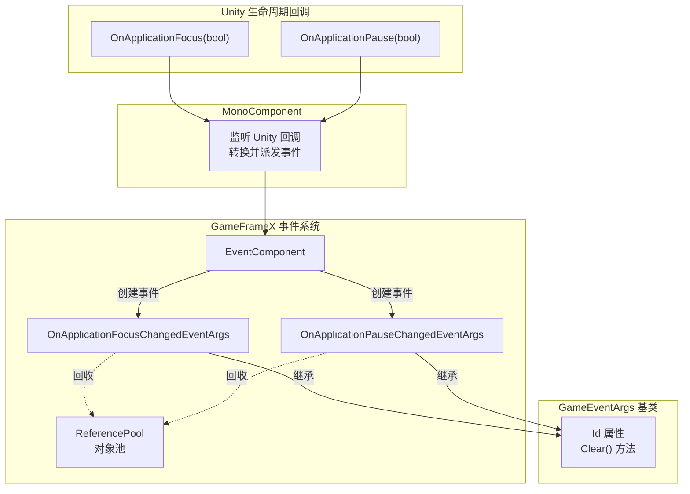
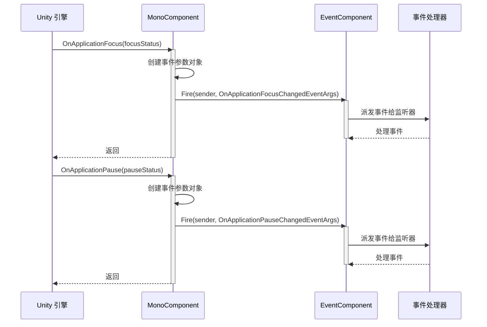

# イベントタイプ

このドキュメント介绍 GameFrameX Mono プラグイン中定義的イベントタイプ，用于処理 Unity 应用程序ライフサイクル中的焦点和暂停ステータス变化。

## 概要

GameFrameX Mono プラグイン提供します两个コアイベントタイプ，用于监听 Unity 应用程序的ライフサイクル变化。这些イベント基于 GameFrameX イベント系统ビルド，サポート对象池回收机制，〜できます効率的地処理应用程序前后台切换和暂停恢复シーン。

**イベントタイプ列表:**

| イベントタイプ | 用途 | イベントID |
|---------|------|--------|
| OnApplicationFocusChangedEventArgs | 应用程序前后台切换イベント | 类的完全な名称 |
| OnApplicationPauseChangedEventArgs | 应用程序暂停/恢复イベント | 类的完全な名称 |

## アーキテクチャ



**アーキテクチャ説明:**

1. **MonoComponent**: 挂载在シーン中的 Unity コンポーネント，监听 Unity ライフサイクルコールバック (`OnApplicationFocus` 和 `OnApplicationPause`)
2. **イベント转换**: 将 Unity 的布尔パラメータ转换为强タイプ的イベントパラメータ对象
3. **EventComponent**: GameFrameX コア的イベントコンポーネント，负责イベント的派发和监听管理
4. **イベントパラメータ**: 継承自 `GameEventArgs` 基底クラス，提供統一された的インターフェース和对象池サポート

## イベントタイプ详解

### OnApplicationFocusChangedEventArgs

应用程序前后台切换イベント，当应用程序获得或失去焦点时トリガー。

```csharp
public sealed class OnApplicationFocusChangedEventArgs : GameEventArgs
{
    /// <summary>
    /// 应用程序前后台切换事件编号。
    /// </summary>
    public static readonly string EventId = typeof(OnApplicationFocusChangedEventArgs).FullName;

    /// <summary>
    /// 是否是前台。
    /// </summary>
    public bool IsFocus { get; private set; }

    /// <summary>
    /// 创建应用程序前后台切换事件。
    /// </summary>
    public static OnApplicationFocusChangedEventArgs Create(bool isFocus)
    {
        var args = ReferencePool.Acquire<OnApplicationFocusChangedEventArgs>();
        args.IsFocus = isFocus;
        return args;
    }

    /// <summary>
    /// 清理前后台切换事件。
    /// </summary>
    public override void Clear()
    {
        IsFocus = false;
    }
}
```

> Source: [OnApplicationFocusChangedEventArgs.cs](https://github.com/GameFrameX/com.gameframex.unity.mono/blob/main/Runtime/EventArgs/OnApplicationFocusChangedEventArgs.cs#L40-L87)

**プロパティ説明:**

| プロパティ | タイプ | 説明 |
|-----|------|------|
| Id | string (override) | 返すイベント唯一标识符 |
| IsFocus | bool | true 表示获得焦点（进入前台），false 表示失去焦点（进入后台） |

**使用シーン:**
- プレイヤー切换到其他应用时暂停游戏音乐
- 切换到后台时保存游戏進捗
- 检测ユーザー是否〜中与游戏交互

### OnApplicationPauseChangedEventArgs

应用程序暂停ステータス变化イベント，当应用程序被暂停或恢复时トリガー。

```csharp
public sealed class OnApplicationPauseChangedEventArgs : GameEventArgs
{
    /// <summary>
    /// 应用程序是否是暂停状态变化事件编号。
    /// </summary>
    public static readonly string EventId = typeof(OnApplicationPauseChangedEventArgs).FullName;

    /// <summary>
    /// 是否暂停。
    /// </summary>
    public bool IsPause { get; private set; }

    /// <summary>
    /// 创建应用程序是否是暂停状态变化事件。
    /// </summary>
    public static OnApplicationPauseChangedEventArgs Create(bool isPause)
    {
        var args = ReferencePool.Acquire<OnApplicationPauseChangedEventArgs>();
        args.IsPause = isPause;
        return args;
    }

    /// <summary>
    /// 清理应用程序是否是暂停状态变化事件。
    /// </summary>
    public override void Clear()
    {
        IsPause = false;
    }
}
```

> Source: [OnApplicationPauseChangedEventArgs.cs](https://github.com/GameFrameX/com.gameframex.unity.mono/blob/main/Runtime/EventArgs/OnApplicationPauseChangedEventArgs.cs#L40-L88)

**プロパティ説明:**

| プロパティ | タイプ | 説明 |
|-----|------|------|
| Id | string (override) | 返すイベント唯一标识符 |
| IsPause | bool | true 表示应用程序暂停，false 表示应用程序恢复运行 |

**使用シーン:**
- 暂停游戏逻辑
- 显示暂停界面
- 処理 iOS/Android 系统的来电中断

## イベントフロー



**フロー説明:**

1. Unity 引擎检测到应用程序焦点或暂停ステータス变化
2. 呼び出し `MonoComponent` 的 `OnApplicationFocus` 或 `OnApplicationPause` コールバック
3. 作成对应的イベントパラメータ对象（使用 `Create` 静态メソッド）
4. 通过 `EventComponent.Fire()` 派发イベント
5. 所有購読该イベントタイプ的処理器被依次呼び出し
6. イベント処理完成后，对象被回收到 `ReferencePool` 供后续使用

## 使用例

### 購読应用程序焦点变化イベント

```csharp
using GameFrameX.Event.Runtime;
using GameFrameX.Mono.Runtime;

// 在需要监听事件的类中
public class GameManager : MonoBehaviour
{
    private void Start()
    {
        // 订阅应用程序焦点变化事件
        EventComponent.Instance.Subscribe<OnApplicationFocusChangedEventArgs>(OnAppFocusChanged);
    }

    private void OnDestroy()
    {
        // 取消订阅事件（重要：防止内存泄漏）
        EventComponent.Instance.Unsubscribe<OnApplicationFocusChangedEventArgs>(OnAppFocusChanged);
    }

    private void OnAppFocusChanged(object sender, OnApplicationFocusChangedEventArgs e)
    {
        if (e.IsFocus)
        {
            Debug.Log("应用程序进入前台");
            // 恢复游戏
        }
        else
        {
            Debug.Log("应用程序进入后台");
            // 保存游戏进度
        }
    }
}
```

> Source: [MonoComponent.cs](https://github.com/GameFrameX/com.gameframex.unity.mono/blob/main/Runtime/Mono/MonoComponent.cs#L100-L107)

### 購読应用程序暂停イベント

```csharp
using GameFrameX.Event.Runtime;
using GameFrameX.Mono.Runtime;

public class PauseManager : MonoBehaviour
{
    private void Start()
    {
        EventComponent.Instance.Subscribe<OnApplicationPauseChangedEventArgs>(OnAppPauseChanged);
    }

    private void OnDestroy()
    {
        EventComponent.Instance.Unsubscribe<OnApplicationPauseChangedEventArgs>(OnAppPauseChanged);
    }

    private void OnAppPauseChanged(object sender, OnApplicationPauseChangedEventArgs e)
    {
        if (e.IsPause)
        {
            Debug.Log("游戏已暂停");
            Time.timeScale = 0f; // 暂停游戏时间
        }
        else
        {
            Debug.Log("游戏已恢复");
            Time.timeScale = 1f; // 恢复游戏时间
        }
    }
}
```

> Source: [MonoComponent.cs](https://github.com/GameFrameX/com.gameframex.unity.mono/blob/main/Runtime/Mono/MonoComponent.cs#L113-L120)

## 注意事项

1. **〜しなければなりません取消購読**: 在 `OnDestroy` 或コンポーネント破棄时呼び出し `Unsubscribe` 取消イベント購読，避免内存泄漏
2. **对象池机制**: イベントパラメータ使用 ReferencePool 管理，作成イベント时应使用 `Create` メソッド而非直接インスタンス化
3. **清理ステータス**: 使用完イベント后，系统会自动呼び出し `Clear()` メソッド重置ステータス并将对象回收到池中
4. **线程安全**: イベント派发在主线程进行，无需担心线程安全問題

## 関連リンク

- [MonoManager](./4-core-components.1-monomanager) - Mono マネージャードキュメント
- [MonoComponent](./4-core-components.2-monocomponent) - Mono コンポーネントドキュメント
- [イベントパラメータ](./5-events.2-event-args) - イベントパラメータ詳細説明
- [基本使用](./3-getting-started.1-basic-usage) - プラグイン基本使用ガイド
