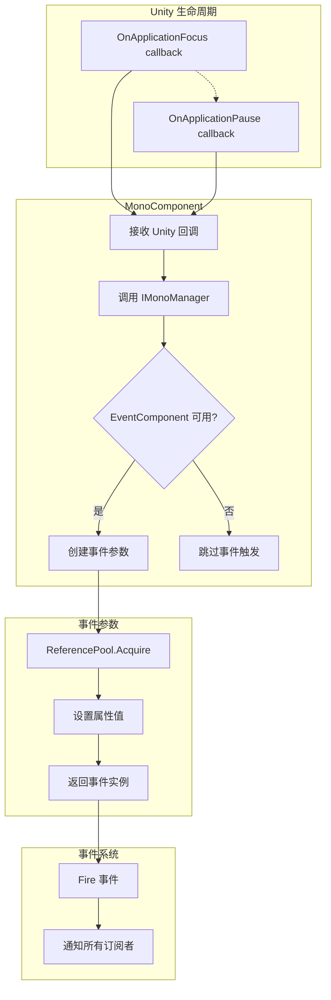

# イベントパラメータ

イベントパラメータ（EventArgs）是 GameFrameX Mono プラグイン中用于在应用程序ライフサイクルイベントトリガー时传递数据的容器类。このドキュメント詳細介绍当前プラグイン提供的两种イベントパラメータタイプ及其使用方法。

## 概要

在 Unity 应用程序运行过程中，某些系统级イベント（如应用程序切换到后台、暂停等）〜する必要があります被其他モジュール感知并作出响应。イベントパラメータ（EventArgs）作为イベント系统的コア组成部分，承担着カプセル化イベント相关数据的重要な职责。

GameFrameX Mono プラグイン基于 GameFrameX イベント系统ビルド，提供します两种针对 Unity 应用程序ライフサイクル的イベントパラメータタイプ：

- **OnApplicationFocusChangedEventArgs**：应用程序前后台切换イベント
- **OnApplicationPauseChangedEventArgs**：应用程序暂停/恢复イベント

这些イベントパラメータ采用对象池モード設計，通过 `ReferencePool` 実装对象的复用，有效减少了垃圾回收（GC）带来的性能开销。

## アーキテクチャ設計

### 类图结构

```mermaid
classDiagram
    class GameEventArgs {
        <<abstract>>
        +Id: string { get; }
        +Clear(): void
    }
    
    class OnApplicationFocusChangedEventArgs {
        +EventId: string
        +IsFocus: bool
        +Create(isFocus: bool): OnApplicationFocusChangedEventArgs
    }
    
    class OnApplicationPauseChangedEventArgs {
        +EventId: string
        +IsPause: bool
        +Create(isPause: bool): OnApplicationPauseChangedEventArgs
    }
    
    class ReferencePool {
        +Acquire~T~(): T
        +Release(instance): void
    }
    
    GameEventArgs <|-- OnApplicationFocusChangedEventArgs
    GameEventArgs <|-- OnApplicationPauseChangedEventArgs
    OnApplicationFocusChangedEventArgs ..> ReferencePool : uses
    OnApplicationPauseChangedEventArgs ..> ReferencePool : uses
```

### イベント流转フロー



## コアコンポーネント详解

### OnApplicationFocusChangedEventArgs

应用程序前后台切换イベントパラメータ，当 Unity 应用程序的焦点ステータス发生变化时トリガー。

```csharp
public sealed class OnApplicationFocusChangedEventArgs : GameEventArgs
{
    /// <summary>
    /// 应用程序前后台切换事件编号。
    /// </summary>
    public static readonly string EventId = typeof(OnApplicationFocusChangedEventArgs).FullName;

    /// <summary>
    /// 是否是前台。
    /// </summary>
    public bool IsFocus { get; private set; }

    /// <summary>
    /// 创建应用程序前后台切换事件。
    /// </summary>
    public static OnApplicationFocusChangedEventArgs Create(bool isFocus)
    {
        var loadDictionaryUpdateChangedEventArgs = ReferencePool.Acquire<OnApplicationFocusChangedEventArgs>();
        loadDictionaryUpdateChangedEventArgs.IsFocus = isFocus;
        return loadDictionaryUpdateChangedEventArgs;
    }

    /// <summary>
    /// 清理前后台切换事件。
    /// </summary>
    public override void Clear()
    {
        IsFocus = false;
    }
}
```

> Source: [OnApplicationFocusChangedEventArgs.cs](https://github.com/GameFrameX/com.gameframex.unity.mono/blob/main/Runtime/EventArgs/OnApplicationFocusChangedEventArgs.cs#L40-L87)

**プロパティ説明：**

| プロパティ | タイプ | 説明 |
|------|------|------|
| EventId | string | イベント的唯一标识符，使用タイプ的完全限定名 |
| IsFocus | bool | 应用程序是否获得焦点，`true` 表示在前台，`false` 表示在后台 |

### OnApplicationPauseChangedEventArgs

应用程序暂停ステータス变化イベントパラメータ，当 Unity 应用程序的暂停ステータス发生变化时トリガー。

```csharp
public sealed class OnApplicationPauseChangedEventArgs : GameEventArgs
{
    /// <summary>
    /// 应用程序是否是暂停状态变化事件编号。
    /// </summary>
    public static readonly string EventId = typeof(OnApplicationPauseChangedEventArgs).FullName;

    /// <summary>
    /// 是否暂停。
    /// </summary>
    public bool IsPause { get; private set; }

    /// <summary>
    /// 创建应用程序是否是暂停状态变化事件。
    /// </summary>
    public static OnApplicationPauseChangedEventArgs Create(bool isPause)
    {
        var loadDictionaryUpdateEventArgs = ReferencePool.Acquire<OnApplicationPauseChangedEventArgs>();
        loadDictionaryUpdateEventArgs.IsPause = isPause;
        return loadDictionaryUpdateEventArgs;
    }

    /// <summary>
    /// 清理应用程序是否是暂停状态变化事件。
    /// </summary>
    public override void Clear()
    {
        IsPause = false;
    }
}
```

> Source: [OnApplicationPauseChangedEventArgs.cs](https://github.com/GameFrameX/com.gameframex.unity.mono/blob/main/Runtime/EventArgs/OnApplicationPauseChangedEventArgs.cs#L40-L88)

**プロパティ説明：**

| プロパティ | タイプ | 説明 |
|------|------|------|
| EventId | string | イベント的唯一标识符，使用タイプ的完全限定名 |
| IsPause | bool | 应用程序是否暂停，`true` 表示暂停，`false` 表示恢复 |

## イベントトリガー时机

### OnApplicationFocus イベント

当应用程序获得或失去焦点时トリガー。在 Unity 中，这是由 `MonoBehaviour.OnApplicationFocus(bool)` コールバックトリガー的。

```csharp
/// <summary>
/// 当应用程序失去或获得焦点时调用。
/// </summary>
/// <param name="focusStatus">应用程序的焦点状态。true 表示获得焦点，false 表示失去焦点。</param>
private void OnApplicationFocus(bool focusStatus)
{
    _monoManager.OnApplicationFocus(focusStatus);
    if (m_EventComponent != null)
    {
        m_EventComponent.Fire(this, OnApplicationFocusChangedEventArgs.Create(focusStatus));
    }
}
```

> Source: [MonoComponent.cs](https://github.com/GameFrameX/com.gameframex.unity.mono/blob/main/Runtime/Mono/MonoComponent.cs#L96-L107)

### OnApplicationPause イベント

当应用程序暂停或恢复时トリガー。在 Unity 中，这是由 `MonoBehaviour.OnApplicationPause(bool)` コールバックトリガー的。

```csharp
/// <summary>
/// 当应用程序暂停或恢复时调用。
/// </summary>
/// <param name="pauseStatus">应用程序的暂停状态。true 表示暂停，false 表示恢复。</param>
private void OnApplicationPause(bool pauseStatus)
{
    _monoManager.OnApplicationPause(pauseStatus);
    if (m_EventComponent != null)
    {
        m_EventComponent.Fire(this, OnApplicationPauseChangedEventArgs.Create(pauseStatus));
    }
}
```

> Source: [MonoComponent.cs](https://github.com/GameFrameX/com.gameframex.unity.mono/blob/main/Runtime/Mono/MonoComponent.cs#L109-L120)

## 使用例

### 購読应用程序前后台イベント

```csharp
using GameFrameX.Event.Runtime;
using GameFrameX.Mono.Runtime;

public class GameController : MonoBehaviour
{
    private void Start()
    {
        // 订阅应用程序焦点变化事件
        EventComponent.Instance.Subscribe<OnApplicationFocusChangedEventArgs>(OnFocusChanged);
        
        // 订阅应用程序暂停变化事件
        EventComponent.Instance.Subscribe<OnApplicationPauseChangedEventArgs>(OnPauseChanged);
    }

    private void OnDestroy()
    {
        // 取消订阅事件
        EventComponent.Instance.Unsubscribe<OnApplicationFocusChangedEventArgs>(OnFocusChanged);
        EventComponent.Instance.Unsubscribe<OnApplicationPauseChangedEventArgs>(OnPauseChanged);
    }

    private void OnFocusChanged(object sender, OnApplicationFocusChangedEventArgs e)
    {
        if (e.IsFocus)
        {
            Debug.Log("应用程序获得焦点 - 进入前台");
        }
        else
        {
            Debug.Log("应用程序失去焦点 - 进入后台");
        }
    }

    private void OnPauseChanged(object sender, OnApplicationPauseChangedEventArgs e)
    {
        if (e.IsPause)
        {
            Debug.Log("应用程序暂停");
        }
        else
        {
            Debug.Log("应用程序恢复");
        }
    }
}
```

> Source: [MonoComponent.cs](https://github.com/GameFrameX/com.gameframex.unity.mono/blob/main/Runtime/Mono/MonoComponent.cs#L64-L120)

### 処理移动端ライフサイクルイベント

在移动设备上，应用程序经常会在不同ステータス之间切换，以下例表示如何処理这些シーン：

```csharp
public class MobileLifecycleHandler : MonoBehaviour
{
    private bool _isBackground;

    private void OnEnable()
    {
        EventComponent.Instance.Subscribe<OnApplicationFocusChangedEventArgs>(HandleFocusChange);
        EventComponent.Instance.Subscribe<OnApplicationPauseChangedEventArgs>(HandlePauseChange);
    }

    private void OnDisable()
    {
        EventComponent.Instance.Unsubscribe<OnApplicationFocusChangedEventArgs>(HandleFocusChange);
        EventComponent.Instance.Unsubscribe<OnApplicationPauseChangedEventArgs>(HandlePauseChange);
    }

    private void HandleFocusChange(object sender, OnApplicationFocusChangedEventArgs e)
    {
        _isBackground = !e.IsFocus;
        
        if (_isBackground)
        {
            // 保存游戏进度
            SaveGame();
        }
        else
        {
            // 恢复游戏
            ResumeGame();
        }
    }

    private void HandlePauseChange(object sender, OnApplicationPauseChangedEventArgs e)
    {
        if (e.IsPause)
        {
            // 暂停时暂停音乐
            AudioManager.Instance.PauseMusic();
        }
        else
        {
            // 恢复时继续音乐
            AudioManager.Instance.ResumeMusic();
        }
    }
}
```

## デザインパターン説明

### 对象池モード

イベントパラメータ类采用对象池モード設計，具有以下优势：

1. **减少 GC 压力**：通过复用对象，避免频繁作成和破棄イベントパラメータインスタンス
2. **提高性能**：对象池〜できます预分配对象，减少内存分配的开销

对象池的コアメソッド：

```csharp
// 从对象池获取实例
ReferencePool.Acquire<OnApplicationFocusChangedEventArgs>();

// 释放实例回对象池（通过 Clear 方法）
public override void Clear()
{
    IsFocus = false;
}
```

### 工厂メソッドモード

每个イベントパラメータ类都提供一个静态的 `Create()` 工厂メソッド：

- **カプセル化作成逻辑**：将对象取得和プロパティ初期化的逻辑カプセル化在工厂メソッド中
- **保证一致性**：確認してください每次作成的イベントパラメータ都经过正确初期化
- **簡素化呼び出し**：使用者只需呼び出し一个メソッドつまり可取得完全な設定的イベントパラメータ

## API リファレンス

### OnApplicationFocusChangedEventArgs

#### プロパティ

| プロパティ名 | タイプ | 访问级别 | 説明 |
|--------|------|----------|------|
| EventId | string | public static readonly | イベント唯一标识符 |
| Id | string | public override | オーバーライド的基底クラスプロパティ，返す EventId |
| IsFocus | bool | public get; private set | 应用程序是否在前台 |

#### メソッド

| メソッド名 | 返すタイプ | 説明 |
|--------|----------|------|
| Create(bool isFocus) | OnApplicationFocusChangedEventArgs | 静态工厂メソッド，作成イベントインスタンス |
| Clear() | void | 重置イベントステータス，用于对象池回收 |

---

### OnApplicationPauseChangedEventArgs

#### プロパティ

| プロパティ名 | タイプ | 访问级别 | 説明 |
|--------|------|----------|------|
| EventId | string | public static readonly | イベント唯一标识符 |
| Id | string | public override | オーバーライド的基底クラスプロパティ，返す EventId |
| IsPause | bool | public get; private set | 应用程序是否暂停 |

#### メソッド

| メソッド名 | 返すタイプ | 説明 |
|--------|----------|------|
| Create(bool isPause) | OnApplicationPauseChangedEventArgs | 静态工厂メソッド，作成イベントインスタンス |
| Clear() | void | 重置イベントステータス，用于对象池回收 |

## 関連リンク

- [イベントタイプ](./5-events.1-event-types) - 理解する GameFrameX イベント系统的完全なタイプ体系
- [MonoComponent](./4-core-components.2-monocomponent) - 理解する如何トリガー这些イベント的コンポーネント
- [MonoManager](./4-core-components.1-monomanager) - 理解する Mono マネージャー的コア機能
