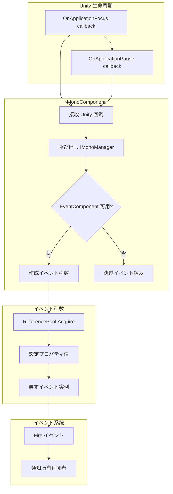

# イベント

イベント（EventArgs）は GameFrameX Mono ににイベントデータのクラス。ドキュメントのイベントタイプ。

## 

に Unity ，イベント（、）モジュールレスポンス。イベント（EventArgs）イベントのコア，イベントデータの。

GameFrameX Mono にづく GameFrameX イベントビルド，た Unity のイベントタイプ：

- **OnApplicationFocusChangedEventArgs**：イベント
- **OnApplicationPauseChangedEventArgs**：/イベント

イベントプール，をじて `ReferencePool` の，た（GC）の。

## アーキテクチャ

### クラス

```mermaid
classDiagram
    class GameEventArgs {
        <<abstract>>
        +Id: string { get; }
        +Clear(): void
    }
    
    class OnApplicationFocusChangedEventArgs {
        +EventId: string
        +IsFocus: bool
        +Create(isFocus: bool): OnApplicationFocusChangedEventArgs
    }
    
    class OnApplicationPauseChangedEventArgs {
        +EventId: string
        +IsPause: bool
        +Create(isPause: bool): OnApplicationPauseChangedEventArgs
    }
    
    class ReferencePool {
        +Acquire~T~(): T
        +Release(instance): void
    }
    
    GameEventArgs <|-- OnApplicationFocusChangedEventArgs
    GameEventArgs <|-- OnApplicationPauseChangedEventArgs
    OnApplicationFocusChangedEventArgs ..> ReferencePool : uses
    OnApplicationPauseChangedEventArgs ..> ReferencePool : uses
```

### イベントフロー



## コアコンポーネント

### OnApplicationFocusChangedEventArgs

イベント， Unity の。

```csharp
public sealed class OnApplicationFocusChangedEventArgs : GameEventArgs
{
    /// <summary>
    /// 应用程序前后台切换イベント编号。
    /// </summary>
    public static readonly string EventId = typeof(OnApplicationFocusChangedEventArgs).FullName;

    /// <summary>
    /// は否は前台。
    /// </summary>
    public bool IsFocus { get; private set; }

    /// <summary>
    /// 作成应用程序前后台切换イベント。
    /// </summary>
    public static OnApplicationFocusChangedEventArgs Create(bool isFocus)
    {
        var loadDictionaryUpdateChangedEventArgs = ReferencePool.Acquire<OnApplicationFocusChangedEventArgs>();
        loadDictionaryUpdateChangedEventArgs.IsFocus = isFocus;
        return loadDictionaryUpdateChangedEventArgs;
    }

    /// <summary>
    /// 清理前后台切换イベント。
    /// </summary>
    public override void Clear()
    {
        IsFocus = false;
    }
}
```

> Source: [OnApplicationFocusChangedEventArgs.cs](https://github.com/GameFrameX/com.gameframex.unity.mono/blob/main/Runtime/EventArgs/OnApplicationFocusChangedEventArgs.cs#L40-L87)

**プロパティ：**

| プロパティ | タイプ |  |
|------|------|------|
| EventId | string | イベントの，タイプの |
| IsFocus | bool | は，`true` に，`false` に |

### OnApplicationPauseChangedEventArgs

イベント， Unity の。

```csharp
public sealed class OnApplicationPauseChangedEventArgs : GameEventArgs
{
    /// <summary>
    /// 应用程序は否は暂停状態变化イベント编号。
    /// </summary>
    public static readonly string EventId = typeof(OnApplicationPauseChangedEventArgs).FullName;

    /// <summary>
    /// は否暂停。
    /// </summary>
    public bool IsPause { get; private set; }

    /// <summary>
    /// 作成应用程序は否は暂停状態变化イベント。
    /// </summary>
    public static OnApplicationPauseChangedEventArgs Create(bool isPause)
    {
        var loadDictionaryUpdateEventArgs = ReferencePool.Acquire<OnApplicationPauseChangedEventArgs>();
        loadDictionaryUpdateEventArgs.IsPause = isPause;
        return loadDictionaryUpdateEventArgs;
    }

    /// <summary>
    /// 清理应用程序は否は暂停状態变化イベント。
    /// </summary>
    public override void Clear()
    {
        IsPause = false;
    }
}
```

> Source: [OnApplicationPauseChangedEventArgs.cs](https://github.com/GameFrameX/com.gameframex.unity.mono/blob/main/Runtime/EventArgs/OnApplicationPauseChangedEventArgs.cs#L40-L88)

**プロパティ：**

| プロパティ | タイプ |  |
|------|------|------|
| EventId | string | イベントの，タイプの |
| IsPause | bool | は，`true` ，`false`  |

## イベント

### OnApplicationFocus イベント

。に Unity ，は `MonoBehaviour.OnApplicationFocus(bool)` の。

```csharp
/// <summary>
/// 当应用程序失去或获得焦点时呼び出し。
/// </summary>
/// <param name="focusStatus">应用程序の焦点状態。true 表示获得焦点，false 表示失去焦点。</param>
private void OnApplicationFocus(bool focusStatus)
{
    _monoManager.OnApplicationFocus(focusStatus);
    if (m_EventComponent != null)
    {
        m_EventComponent.Fire(this, OnApplicationFocusChangedEventArgs.Create(focusStatus));
    }
}
```

> Source: [MonoComponent.cs](https://github.com/GameFrameX/com.gameframex.unity.mono/blob/main/Runtime/Mono/MonoComponent.cs#L96-L107)

### OnApplicationPause イベント

。に Unity ，は `MonoBehaviour.OnApplicationPause(bool)` の。

```csharp
/// <summary>
/// 当应用程序暂停或恢复时呼び出し。
/// </summary>
/// <param name="pauseStatus">应用程序の暂停状態。true 表示暂停，false 表示恢复。</param>
private void OnApplicationPause(bool pauseStatus)
{
    _monoManager.OnApplicationPause(pauseStatus);
    if (m_EventComponent != null)
    {
        m_EventComponent.Fire(this, OnApplicationPauseChangedEventArgs.Create(pauseStatus));
    }
}
```

> Source: [MonoComponent.cs](https://github.com/GameFrameX/com.gameframex.unity.mono/blob/main/Runtime/Mono/MonoComponent.cs#L109-L120)

## 

### イベント

```csharp
using GameFrameX.Event.Runtime;
using GameFrameX.Mono.Runtime;

public class GameController : MonoBehaviour
{
    private void Start()
    {
        // 订阅应用程序焦点变化イベント
        EventComponent.Instance.Subscribe<OnApplicationFocusChangedEventArgs>(OnFocusChanged);
        
        // 订阅应用程序暂停变化イベント
        EventComponent.Instance.Subscribe<OnApplicationPauseChangedEventArgs>(OnPauseChanged);
    }

    private void OnDestroy()
    {
        // 取消订阅イベント
        EventComponent.Instance.Unsubscribe<OnApplicationFocusChangedEventArgs>(OnFocusChanged);
        EventComponent.Instance.Unsubscribe<OnApplicationPauseChangedEventArgs>(OnPauseChanged);
    }

    private void OnFocusChanged(object sender, OnApplicationFocusChangedEventArgs e)
    {
        if (e.IsFocus)
        {
            Debug.Log("应用程序获得焦点 - 进入前台");
        }
        else
        {
            Debug.Log("应用程序失去焦点 - 进入后台");
        }
    }

    private void OnPauseChanged(object sender, OnApplicationPauseChangedEventArgs e)
    {
        if (e.IsPause)
        {
            Debug.Log("应用程序暂停");
        }
        else
        {
            Debug.Log("应用程序恢复");
        }
    }
}
```

> Source: [MonoComponent.cs](https://github.com/GameFrameX/com.gameframex.unity.mono/blob/main/Runtime/Mono/MonoComponent.cs#L64-L120)

### イベント

に，に，：

```csharp
public class MobileLifecycleHandler : MonoBehaviour
{
    private bool _isBackground;

    private void OnEnable()
    {
        EventComponent.Instance.Subscribe<OnApplicationFocusChangedEventArgs>(HandleFocusChange);
        EventComponent.Instance.Subscribe<OnApplicationPauseChangedEventArgs>(HandlePauseChange);
    }

    private void OnDisable()
    {
        EventComponent.Instance.Unsubscribe<OnApplicationFocusChangedEventArgs>(HandleFocusChange);
        EventComponent.Instance.Unsubscribe<OnApplicationPauseChangedEventArgs>(HandlePauseChange);
    }

    private void HandleFocusChange(object sender, OnApplicationFocusChangedEventArgs e)
    {
        _isBackground = !e.IsFocus;
        
        if (_isBackground)
        {
            // 保存ゲーム进度
            SaveGame();
        }
        else
        {
            // 恢复ゲーム
            ResumeGame();
        }
    }

    private void HandlePauseChange(object sender, OnApplicationPauseChangedEventArgs e)
    {
        if (e.IsPause)
        {
            // 暂停时暂停音乐
            AudioManager.Instance.PauseMusic();
        }
        else
        {
            // 恢复时继续音乐
            AudioManager.Instance.ResumeMusic();
        }
    }
}
```

## 

### プール

イベントクラスプール，：

1. ** GC **：をじて，とイベント
2. ****：プール，の

プールのコアメソッド：

```csharp
// 从对象プール获取实例
ReferencePool.Acquire<OnApplicationFocusChangedEventArgs>();

// 释放实例回对象プール（を通じて Clear メソッド）
public override void Clear()
{
    IsFocus = false;
}
```

### メソッド

イベントクラスの `Create()` メソッド：

- ****：とプロパティのにメソッド
- ****：のイベント
- **びし**：びしメソッドのイベント

## API リファレンス

### OnApplicationFocusChangedEventArgs

#### プロパティ

| プロパティ | タイプ |  |  |
|--------|------|----------|------|
| EventId | string | public static readonly | イベント |
| Id | string | public override | のクラスプロパティ，す EventId |
| IsFocus | bool | public get; private set | はに |

#### メソッド

| メソッド | すタイプ |  |
|--------|----------|------|
| Create(bool isFocus) | OnApplicationFocusChangedEventArgs | メソッド，イベント |
| Clear() | void | イベント，にプール |

---

### OnApplicationPauseChangedEventArgs

#### プロパティ

| プロパティ | タイプ |  |  |
|--------|------|----------|------|
| EventId | string | public static readonly | イベント |
| Id | string | public override | のクラスプロパティ，す EventId |
| IsPause | bool | public get; private set | は |

#### メソッド

| メソッド | すタイプ |  |
|--------|----------|------|
| Create(bool isPause) | OnApplicationPauseChangedEventArgs | メソッド，イベント |
| Clear() | void | イベント，にプール |

## リンク

- [イベントタイプ](./5-events.1-event-types) - た GameFrameX イベントのタイプ
- [MonoComponent](./4-core-components.2-monocomponent) - たイベントのコンポーネント
- [MonoManager](./4-core-components.1-monomanager) - た Mono マネージャーのコア
