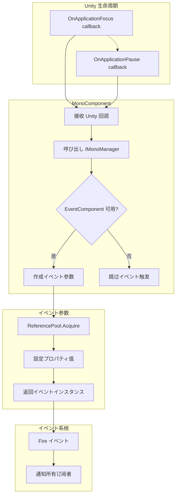

# イベント参数

イベント参数（EventArgs）是 GameFrameX Mono 插件中に使用在应用程序生命周期イベント触发时传递数据的容器クラス。本文档详细介绍当前插件提供的两种イベント参数クラス型及其使用方法。

## 概要

在 Unity 应用程序运行过程中，某些系统级イベント（如应用程序切换到后台、暂停等）必要被其他模块感知并作出响应。イベント参数（EventArgs）作为イベント系统的コア组成部分，承担着封装イベント関連数据的重要职责。

GameFrameX Mono 插件基づく GameFrameX イベント系统构建，提供します两种针对 Unity 应用程序生命周期的イベント参数クラス型：

- **OnApplicationFocusChangedEventArgs**：应用程序前后台切换イベント
- **OnApplicationPauseChangedEventArgs**：应用程序暂停/恢复イベント

这些イベント参数采用オブジェクトプール模式设计，を通じて `ReferencePool` 実装对象的复用，有效减少了垃圾回收（GC）带来的性能开销。

## アーキテクチャ設計

### クラス图结构

```mermaid
classDiagram
    class GameEventArgs {
        <<abstract>>
        +Id: string { get; }
        +Clear(): void
    }
    
    class OnApplicationFocusChangedEventArgs {
        +EventId: string
        +IsFocus: bool
        +Create(isFocus: bool): OnApplicationFocusChangedEventArgs
    }
    
    class OnApplicationPauseChangedEventArgs {
        +EventId: string
        +IsPause: bool
        +Create(isPause: bool): OnApplicationPauseChangedEventArgs
    }
    
    class ReferencePool {
        +Acquire~T~(): T
        +Release(instance): void
    }
    
    GameEventArgs <|-- OnApplicationFocusChangedEventArgs
    GameEventArgs <|-- OnApplicationPauseChangedEventArgs
    OnApplicationFocusChangedEventArgs ..> ReferencePool : uses
    OnApplicationPauseChangedEventArgs ..> ReferencePool : uses
```

### イベント流转フロー



## コアコンポーネント详解

### OnApplicationFocusChangedEventArgs

应用程序前后台切换イベント参数，当 Unity 应用程序的焦点ステータス发生变化时触发。

```csharp
public sealed class OnApplicationFocusChangedEventArgs : GameEventArgs
{
    /// <summary>
    /// 应用程序前后台切换イベント编号。
    /// </summary>
    public static readonly string EventId = typeof(OnApplicationFocusChangedEventArgs).FullName;

    /// <summary>
    /// 是否是前台。
    /// </summary>
    public bool IsFocus { get; private set; }

    /// <summary>
    /// 作成应用程序前后台切换イベント。
    /// </summary>
    public static OnApplicationFocusChangedEventArgs Create(bool isFocus)
    {
        var loadDictionaryUpdateChangedEventArgs = ReferencePool.Acquire<OnApplicationFocusChangedEventArgs>();
        loadDictionaryUpdateChangedEventArgs.IsFocus = isFocus;
        return loadDictionaryUpdateChangedEventArgs;
    }

    /// <summary>
    /// 清理前后台切换イベント。
    /// </summary>
    public override void Clear()
    {
        IsFocus = false;
    }
}
```

> Source: [OnApplicationFocusChangedEventArgs.cs](https://github.com/GameFrameX/com.gameframex.unity.mono/blob/main/Runtime/EventArgs/OnApplicationFocusChangedEventArgs.cs#L40-L87)

**プロパティ説明：**

| プロパティ | クラス型 | 説明 |
|------|------|------|
| EventId | string | イベント的唯一标识符，使用クラス型的完全限定名 |
| IsFocus | bool | 应用程序是否获得焦点，`true` 表示在前台，`false` 表示在后台 |

### OnApplicationPauseChangedEventArgs

应用程序暂停ステータス变化イベント参数，当 Unity 应用程序的暂停ステータス发生变化时触发。

```csharp
public sealed class OnApplicationPauseChangedEventArgs : GameEventArgs
{
    /// <summary>
    /// 应用程序是否是暂停ステータス变化イベント编号。
    /// </summary>
    public static readonly string EventId = typeof(OnApplicationPauseChangedEventArgs).FullName;

    /// <summary>
    /// 是否暂停。
    /// </summary>
    public bool IsPause { get; private set; }

    /// <summary>
    /// 作成应用程序是否是暂停ステータス变化イベント。
    /// </summary>
    public static OnApplicationPauseChangedEventArgs Create(bool isPause)
    {
        var loadDictionaryUpdateEventArgs = ReferencePool.Acquire<OnApplicationPauseChangedEventArgs>();
        loadDictionaryUpdateEventArgs.IsPause = isPause;
        return loadDictionaryUpdateEventArgs;
    }

    /// <summary>
    /// 清理应用程序是否是暂停ステータス变化イベント。
    /// </summary>
    public override void Clear()
    {
        IsPause = false;
    }
}
```

> Source: [OnApplicationPauseChangedEventArgs.cs](https://github.com/GameFrameX/com.gameframex.unity.mono/blob/main/Runtime/EventArgs/OnApplicationPauseChangedEventArgs.cs#L40-L88)

**プロパティ説明：**

| プロパティ | クラス型 | 説明 |
|------|------|------|
| EventId | string | イベント的唯一标识符，使用クラス型的完全限定名 |
| IsPause | bool | 应用程序是否暂停，`true` 表示暂停，`false` 表示恢复 |

## イベント触发时机

### OnApplicationFocus イベント

当应用程序获得或失去焦点时触发。在 Unity 中，这是由 `MonoBehaviour.OnApplicationFocus(bool)` 回调触发的。

```csharp
/// <summary>
/// 当应用程序失去或获得焦点时呼び出し。
/// </summary>
/// <param name="focusStatus">应用程序的焦点ステータス。true 表示获得焦点，false 表示失去焦点。</param>
private void OnApplicationFocus(bool focusStatus)
{
    _monoManager.OnApplicationFocus(focusStatus);
    if (m_EventComponent != null)
    {
        m_EventComponent.Fire(this, OnApplicationFocusChangedEventArgs.Create(focusStatus));
    }
}
```

> Source: [MonoComponent.cs](https://github.com/GameFrameX/com.gameframex.unity.mono/blob/main/Runtime/Mono/MonoComponent.cs#L96-L107)

### OnApplicationPause イベント

当应用程序暂停或恢复时触发。在 Unity 中，这是由 `MonoBehaviour.OnApplicationPause(bool)` 回调触发的。

```csharp
/// <summary>
/// 当应用程序暂停或恢复时呼び出し。
/// </summary>
/// <param name="pauseStatus">应用程序的暂停ステータス。true 表示暂停，false 表示恢复。</param>
private void OnApplicationPause(bool pauseStatus)
{
    _monoManager.OnApplicationPause(pauseStatus);
    if (m_EventComponent != null)
    {
        m_EventComponent.Fire(this, OnApplicationPauseChangedEventArgs.Create(pauseStatus));
    }
}
```

> Source: [MonoComponent.cs](https://github.com/GameFrameX/com.gameframex.unity.mono/blob/main/Runtime/Mono/MonoComponent.cs#L109-L120)

## 使用例

### 订阅应用程序前后台イベント

```csharp
using GameFrameX.Event.Runtime;
using GameFrameX.Mono.Runtime;

public class GameController : MonoBehaviour
{
    private void Start()
    {
        // 订阅应用程序焦点变化イベント
        EventComponent.Instance.Subscribe<OnApplicationFocusChangedEventArgs>(OnFocusChanged);
        
        // 订阅应用程序暂停变化イベント
        EventComponent.Instance.Subscribe<OnApplicationPauseChangedEventArgs>(OnPauseChanged);
    }

    private void OnDestroy()
    {
        // 取消订阅イベント
        EventComponent.Instance.Unsubscribe<OnApplicationFocusChangedEventArgs>(OnFocusChanged);
        EventComponent.Instance.Unsubscribe<OnApplicationPauseChangedEventArgs>(OnPauseChanged);
    }

    private void OnFocusChanged(object sender, OnApplicationFocusChangedEventArgs e)
    {
        if (e.IsFocus)
        {
            Debug.Log("应用程序获得焦点 - 进入前台");
        }
        else
        {
            Debug.Log("应用程序失去焦点 - 进入后台");
        }
    }

    private void OnPauseChanged(object sender, OnApplicationPauseChangedEventArgs e)
    {
        if (e.IsPause)
        {
            Debug.Log("应用程序暂停");
        }
        else
        {
            Debug.Log("应用程序恢复");
        }
    }
}
```

> Source: [MonoComponent.cs](https://github.com/GameFrameX/com.gameframex.unity.mono/blob/main/Runtime/Mono/MonoComponent.cs#L64-L120)

### 处理移动端生命周期イベント

在移动设备上，应用程序经常会在不同ステータス之间切换，以下示例展示如何处理这些シーン：

```csharp
public class MobileLifecycleHandler : MonoBehaviour
{
    private bool _isBackground;

    private void OnEnable()
    {
        EventComponent.Instance.Subscribe<OnApplicationFocusChangedEventArgs>(HandleFocusChange);
        EventComponent.Instance.Subscribe<OnApplicationPauseChangedEventArgs>(HandlePauseChange);
    }

    private void OnDisable()
    {
        EventComponent.Instance.Unsubscribe<OnApplicationFocusChangedEventArgs>(HandleFocusChange);
        EventComponent.Instance.Unsubscribe<OnApplicationPauseChangedEventArgs>(HandlePauseChange);
    }

    private void HandleFocusChange(object sender, OnApplicationFocusChangedEventArgs e)
    {
        _isBackground = !e.IsFocus;
        
        if (_isBackground)
        {
            // 保存ゲーム进度
            SaveGame();
        }
        else
        {
            // 恢复ゲーム
            ResumeGame();
        }
    }

    private void HandlePauseChange(object sender, OnApplicationPauseChangedEventArgs e)
    {
        if (e.IsPause)
        {
            // 暂停时暂停音乐
            AudioManager.Instance.PauseMusic();
        }
        else
        {
            // 恢复时继续音乐
            AudioManager.Instance.ResumeMusic();
        }
    }
}
```

## 设计模式説明

### オブジェクトプール模式

イベント参数クラス采用オブジェクトプール模式设计，具有以下优势：

1. **减少 GC 压力**：を通じて复用对象，避免频繁作成和销毁イベント参数インスタンス
2. **提高性能**：オブジェクトプール可能预分配对象，减少内存分配的开销

オブジェクトプール的コアメソッド：

```csharp
// 从オブジェクトプール取得インスタンス
ReferencePool.Acquire<OnApplicationFocusChangedEventArgs>();

// 释放インスタンス回オブジェクトプール（を通じて Clear メソッド）
public override void Clear()
{
    IsFocus = false;
}
```

### 工厂メソッド模式

每个イベント参数クラス都提供一个静态的 `Create()` 工厂メソッド：

- **封装作成逻辑**：将对象取得和プロパティ初期化的逻辑封装在工厂メソッド中
- **保证一致性**：确保每次作成的イベント参数都经过正确初期化
- **简化呼び出し**：使用者只需呼び出し一个メソッド即可取得完整配置的イベント参数

## API 参考

### OnApplicationFocusChangedEventArgs

#### プロパティ

| プロパティ名 | クラス型 | 访问级别 | 説明 |
|--------|------|----------|------|
| EventId | string | public static readonly | イベント唯一标识符 |
| Id | string | public override | 重写的基クラスプロパティ，返回 EventId |
| IsFocus | bool | public get; private set | 应用程序是否在前台 |

#### メソッド

| メソッド名 | 返回クラス型 | 説明 |
|--------|----------|------|
| Create(bool isFocus) | OnApplicationFocusChangedEventArgs | 静态工厂メソッド，作成イベントインスタンス |
| Clear() | void | 重置イベントステータス，に使用オブジェクトプール回收 |

---

### OnApplicationPauseChangedEventArgs

#### プロパティ

| プロパティ名 | クラス型 | 访问级别 | 説明 |
|--------|------|----------|------|
| EventId | string | public static readonly | イベント唯一标识符 |
| Id | string | public override | 重写的基クラスプロパティ，返回 EventId |
| IsPause | bool | public get; private set | 应用程序是否暂停 |

#### メソッド

| メソッド名 | 返回クラス型 | 説明 |
|--------|----------|------|
| Create(bool isPause) | OnApplicationPauseChangedEventArgs | 静态工厂メソッド，作成イベントインスタンス |
| Clear() | void | 重置イベントステータス，に使用オブジェクトプール回收 |

## 関連リンク

- [イベントクラス型](./5-events.1-event-types) - 了解 GameFrameX イベント系统的完整クラス型体系
- [MonoComponent](./4-core-components.2-monocomponent) - 了解如何触发这些イベント的コンポーネント
- [MonoManager](./4-core-components.1-monomanager) - 了解 Mono 管理器的コア機能
