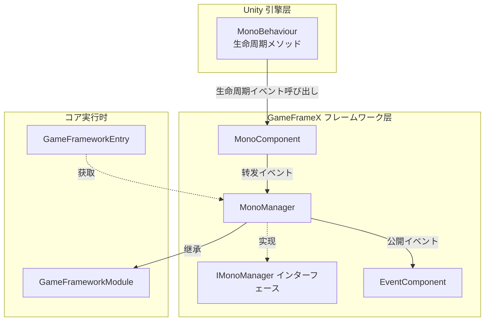
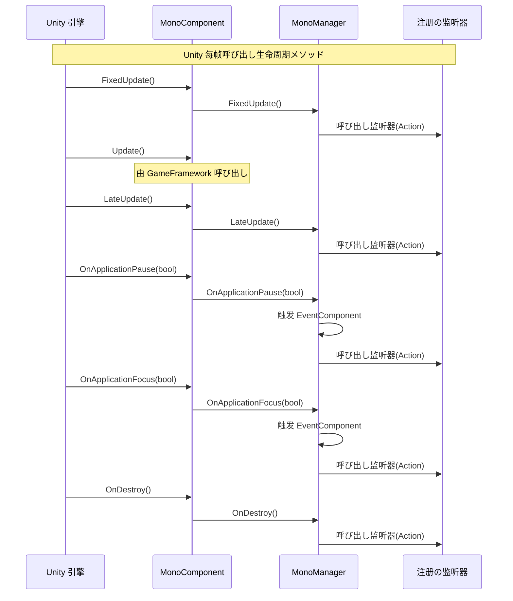

# MonoManager

MonoManager は GameFrameX フレームワークのコアモジュール， Unity MonoBehaviour のイベント， Update、FixedUpdate、LateUpdate、OnDestroy、OnApplicationPause と OnApplicationFocus 。

## 

MonoManager た Unity イベントの。にの Unity ，に MonoBehaviour メソッド，コード。MonoManager をじて（），にとイベントの，コードの。

モジュール `GameFrameworkModule`，は GameFrameX フレームワークのコアコンポーネント。をじて `MonoComponent` と Unity の MonoBehaviour ， Unity のイベントの。

### コア

- **のイベント**： MonoBehaviour イベント
- ****：の
- ****： Unity Profiler 
- **イベント**：サポートをじて EventComponent とイベントフレームワークイベント

## アーキテクチャ



### コンポーネント

| コンポーネント |  |  |
|------|------|------|
| MonoBehaviour | Unity  | Unity の |
| MonoComponent |  |  Unity イベント MonoManager |
| MonoManager | コアマネージャー | とイベント |
| IMonoManager | インターフェース |  MonoManager のインターフェース |
| EventComponent | イベント | イベントフレームワークイベント |

## フロー

### イベントフロー



### フロー


## 

### 

をじて `MonoComponent`  Update ：

```csharp
using UnityEngine;
using GameFrameX.Mono.Runtime;

public class ExampleScript : MonoBehaviour
{
    private MonoComponent _monoComponent;

    private void Awake()
    {
        // 获取 MonoComponent コンポーネント（需に场景中已添加）
        _monoComponent = GetComponent<MonoComponent>();
    }

    private void OnEnable()
    {
        // 添加 Update 监听器
        _monoComponent.AddUpdateListener(OnUpdate);
    }

    private void OnDisable()
    {
        // 移除 Update 监听器
        _monoComponent.RemoveUpdateListener(OnUpdate);
    }

    private void OnUpdate(float elapseSeconds, float realElapseSeconds)
    {
        // に每帧 Update 时実行
        Debug.Log($"Update: {elapseSeconds:F2}s");
    }
}
```
> Source: [MonoComponent.cs](https://github.com/GameFrameX/com.gameframex.unity.mono/blob/main/Runtime/Mono/MonoComponent.cs#L186-L195)

###  FixedUpdate

FixedUpdate にの，びし：

```csharp
private MonoComponent _monoComponent;

private void OnEnable()
{
    // 添加 FixedUpdate 监听器
    _monoComponent.AddFixedUpdateListener(OnFixedUpdate);
}

private void OnDisable()
{
    // 移除 FixedUpdate 监听器
    _monoComponent.RemoveFixedUpdateListener(OnFixedUpdate);
}

private void OnFixedUpdate(float elapseSeconds, float realElapseSeconds)
{
    // 物理更新逻辑
}
```
> Source: [MonoComponent.cs](https://github.com/GameFrameX/com.gameframex.unity.mono/blob/main/Runtime/Mono/MonoComponent.cs#L156-L164)

### イベント

```csharp
private MonoComponent _monoComponent;

private void OnEnable()
{
    // 监听应用暂停イベント
    _monoComponent.AddOnApplicationPauseListener(OnApplicationPause);
}

private void OnDisable()
{
    // 移除应用暂停监听器
    _monoComponent.RemoveOnApplicationPauseListener(OnApplicationPause);
}

private void OnApplicationPause(bool pauseStatus)
{
    if (pauseStatus)
    {
        Debug.Log("ゲーム已暂停");
    }
    else
    {
        Debug.Log("ゲーム已恢复");
    }
}
```
> Source: [MonoComponent.cs](https://github.com/GameFrameX/com.gameframex.unity.mono/blob/main/Runtime/Mono/MonoComponent.cs#L246-L254)

### イベント

```csharp
private MonoComponent _monoComponent;

private void OnEnable()
{
    // 监听应用焦点变化イベント
    _monoComponent.AddOnApplicationFocusListener(OnApplicationFocus);
}

private void OnDisable()
{
    // 移除应用焦点监听器
    _monoComponent.RemoveOnApplicationFocusListener(OnApplicationFocus);
}

private void OnApplicationFocus(bool focusStatus)
{
    Debug.Log(focusStatus ? "应用获得焦点" : "应用失去焦点");
}
```
> Source: [MonoComponent.cs](https://github.com/GameFrameX/com.gameframex.unity.mono/blob/main/Runtime/Mono/MonoComponent.cs#L276-L284)

### イベント

```csharp
private MonoComponent _monoComponent;

private void OnEnable()
{
    // 监听对象销毁イベント
    _monoComponent.AddDestroyListener(OnDestroyCallback);
}

private void OnDisable()
{
    // 移除销毁监听器
    _monoComponent.RemoveDestroyListener(OnDestroyCallback);
}

private void OnDestroyCallback()
{
    // 对象销毁时の清理逻辑
    Debug.Log("对象即将销毁，実行清理...");
}
```
> Source: [MonoComponent.cs](https://github.com/GameFrameX/com.gameframex.unity.mono/blob/main/Runtime/Mono/MonoComponent.cs#L216-L224)

## API リファレンス

### IMonoManager インターフェース

`IMonoManager` インターフェースた MonoManager のメソッド。

#### Update 

```csharp
void AddUpdateListener(Action<float, float> action)
```
に Update びしの。

**パラメータ：**
- `action` (Action<float, float>)：。パラメータは，パラメータは。

```csharp
void RemoveUpdateListener(Action<float, float> action)
```
 Update 。

**パラメータ：**
- `action` (Action<float, float>)：。

#### FixedUpdate 

```csharp
void AddFixedUpdateListener(Action<float, float> action)
```
に FixedUpdate びしの。

**パラメータ：**
- `action` (Action<float, float>)：。パラメータは，パラメータは。

```csharp
void RemoveFixedUpdateListener(Action<float, float> action)
```
 FixedUpdate 。

**パラメータ：**
- `action` (Action<float, float>)：。

#### LateUpdate 

```csharp
void AddLateUpdateListener(Action<float, float> action)
```
に LateUpdate びしの。

**パラメータ：**
- `action` (Action<float, float>)：。パラメータは，パラメータは。

```csharp
void RemoveLateUpdateListener(Action<float, float> action)
```
 LateUpdate 。

**パラメータ：**
- `action` (Action<float, float>)：。

#### Destroy 

```csharp
void AddDestroyListener(Action action)
```
に OnDestroy びしの。

**パラメータ：**
- `action` (Action)：。

```csharp
void RemoveDestroyListener(Action action)
```
 Destroy 。

**パラメータ：**
- `action` (Action)：。

#### ApplicationPause 

```csharp
void AddOnApplicationPauseListener(Action<bool> action)
```
に OnApplicationPause びしの。

**パラメータ：**
- `action` (`Action<bool>`)：。パラメータ。

```csharp
void RemoveOnApplicationPauseListener(Action<bool> action)
```
 OnApplicationPause 。

**パラメータ：**
- `action` (`Action<bool>`)：。

#### ApplicationFocus 

```csharp
void AddOnApplicationFocusListener(Action<bool> action)
```
に OnApplicationFocus びしの。

**パラメータ：**
- `action` (`Action<bool>`)：。パラメータ。

```csharp
void RemoveOnApplicationFocusListener(Action<bool> action)
```
 OnApplicationFocus 。

**パラメータ：**
- `action` (`Action<bool>`)：。

### MonoManager メソッド

メソッド MonoComponent びし，：

```csharp
void FixedUpdate()
```
にのびし。

```csharp
void LateUpdate()
```
に Update びしびし。

```csharp
void OnDestroy()
```
 MonoBehaviour びし。

```csharp
void OnApplicationFocus(bool focusStatus)
```
びし。

**パラメータ：**
- `focusStatus` (bool)：の。true ，false 。

```csharp
void OnApplicationPause(bool pauseStatus)
```
びし。

**パラメータ：**
- `pauseStatus` (bool)：の。true ，false 。

## 

### 

の Unity ， MonoBehaviour メソッド。に：
1. **コード**：と Unity メソッド
2. **テスト**：テスト
3. ****：に

MonoManager をじてた，に，のコード。

### の

MonoManager  `lock` の，に（ Job System ）と。

### 

1. **Unity Profiler **： `Profiler.BeginSample` と `Profiler.EndSample` パス，に Unity Profiler 。
2. ****：のびしむに try-catch ，のの。
3. **LinkedList **： LinkedList ， List  O(1) のと。

## リンク

- [MonoComponent](./4-core-components.2-monocomponent) - MonoComponent コンポーネントドキュメント
- [イベントタイプ](./5-events.1-event-types) - フレームワークイベントタイプ
- [イベント](./5-events.2-event-args) - フレームワークイベント
- [GitHub リポジトリ](https://github.com/GameFrameX/com.gameframex.unity.mono.git) -  GitHub リポジトリ
- [ドキュメント](https://gameframex.doc.alianblank.com/) - GameFrameX ドキュメント
