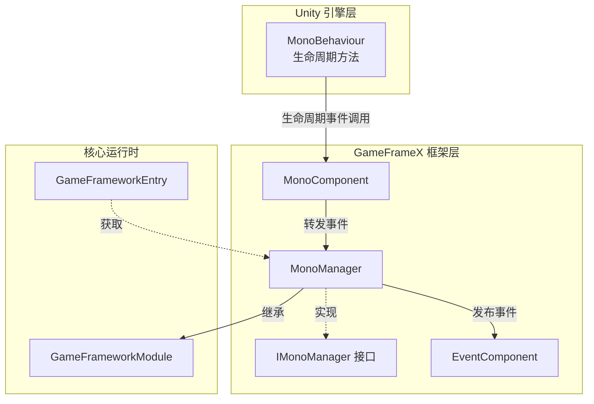
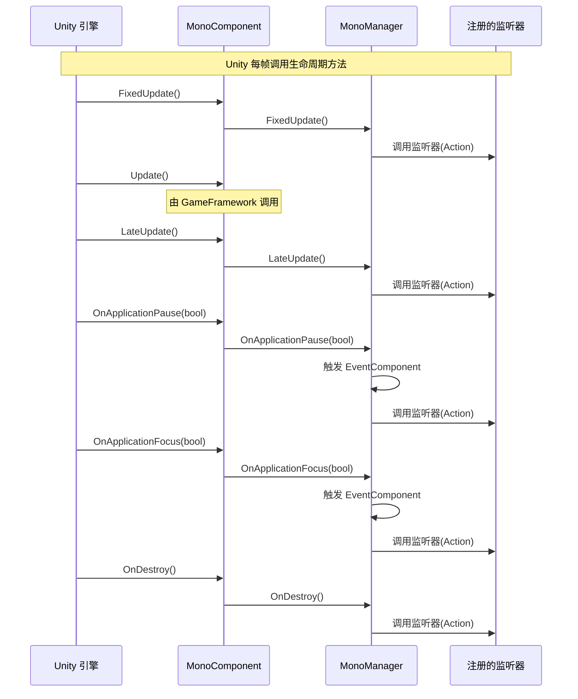
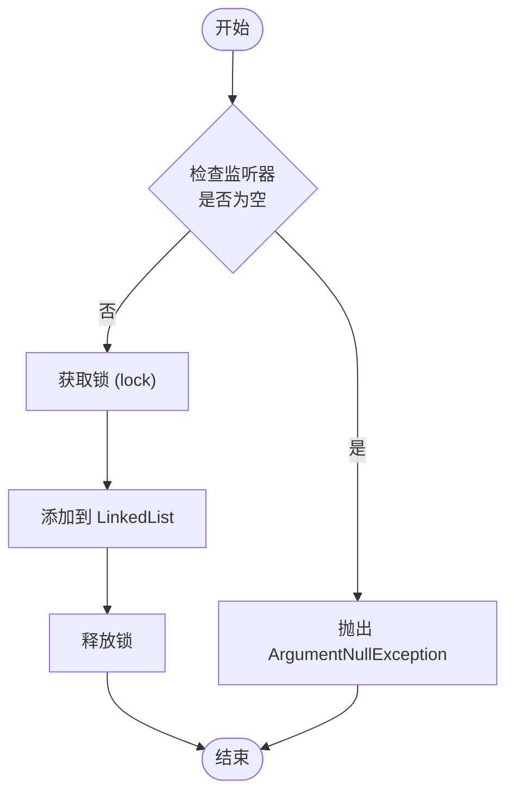

# MonoManager

MonoManager 是 GameFrameX フレームワーク中的コアモジュール，负责統一された管理 Unity MonoBehaviour 的ライフサイクルイベント，含みます Update、FixedUpdate、LateUpdate、OnDestroy、OnApplicationPause 和 OnApplicationFocus 等。

## 概要

MonoManager 提供します一种集中管理 Unity ライフサイクルイベント的机制。在传统的 Unity 开发中，開発者通常〜する必要があります在每个 MonoBehaviour 脚本中分别実装这些ライフサイクルメソッド，这导致コード分散且难以维护。MonoManager 通过观察者モード（监听器モード），允许開発者在任意位置登録和注销对特定ライフサイクルイベント的监听，从而実装コード的解耦。

该モジュール継承自 `GameFrameworkModule`，是 GameFrameX フレームワーク的コアコンポーネント之一。它通过 `MonoComponent` 与 Unity 引擎的 MonoBehaviour ライフサイクル进行桥接，将 Unity 的ライフサイクルイベント統一された收集并分发给已登録的监听器。

### コア機能

- **統一された的イベント管理**：集中管理所有 MonoBehaviour ライフサイクルイベント
- **线程安全**：使用锁机制確認してください多线程環境下的安全访问
- **性能最適化**：使用 Unity Profiler 进行性能分析
- **イベント转发**：サポート通过 EventComponent 将应用焦点和暂停イベント作为フレームワークイベントリリース

## アーキテクチャ



### コンポーネント説明

| コンポーネント | 角色 | 説明 |
|------|------|------|
| MonoBehaviour | Unity 入口 | Unity 引擎的ライフサイクルコールバック入口 |
| MonoComponent | 桥接器 | 将 Unity ライフサイクルイベント转发给 MonoManager |
| MonoManager | コアマネージャー | 管理和分发所有ライフサイクルイベント监听器 |
| IMonoManager | インターフェース定義 | 定義 MonoManager 的公开インターフェース |
| EventComponent | イベント系统 | 将部分イベント转换为フレームワークイベントリリース |

## ワークフロー

### イベント循环フロー



### 监听器登録フロー



## 使用例

### 基本使用

通过 `MonoComponent` 追加 Update 监听器：

```csharp
using UnityEngine;
using GameFrameX.Mono.Runtime;

public class ExampleScript : MonoBehaviour
{
    private MonoComponent _monoComponent;

    private void Awake()
    {
        // 获取 MonoComponent 组件（需在场景中已添加）
        _monoComponent = GetComponent<MonoComponent>();
    }

    private void OnEnable()
    {
        // 添加 Update 监听器
        _monoComponent.AddUpdateListener(OnUpdate);
    }

    private void OnDisable()
    {
        // 移除 Update 监听器
        _monoComponent.RemoveUpdateListener(OnUpdate);
    }

    private void OnUpdate(float elapseSeconds, float realElapseSeconds)
    {
        // 在每帧 Update 时执行
        Debug.Log($"Update: {elapseSeconds:F2}s");
    }
}
```
> Source: [MonoComponent.cs](https://github.com/GameFrameX/com.gameframex.unity.mono/blob/main/Runtime/Mono/MonoComponent.cs#L186-L195)

### 使用 FixedUpdate

FixedUpdate 適しています物理相关的アップデート，每隔固定时间呼び出し：

```csharp
private MonoComponent _monoComponent;

private void OnEnable()
{
    // 添加 FixedUpdate 监听器
    _monoComponent.AddFixedUpdateListener(OnFixedUpdate);
}

private void OnDisable()
{
    // 移除 FixedUpdate 监听器
    _monoComponent.RemoveFixedUpdateListener(OnFixedUpdate);
}

private void OnFixedUpdate(float elapseSeconds, float realElapseSeconds)
{
    // 物理更新逻辑
}
```
> Source: [MonoComponent.cs](https://github.com/GameFrameX/com.gameframex.unity.mono/blob/main/Runtime/Mono/MonoComponent.cs#L156-L164)

### 监听应用暂停イベント

```csharp
private MonoComponent _monoComponent;

private void OnEnable()
{
    // 监听应用暂停事件
    _monoComponent.AddOnApplicationPauseListener(OnApplicationPause);
}

private void OnDisable()
{
    // 移除应用暂停监听器
    _monoComponent.RemoveOnApplicationPauseListener(OnApplicationPause);
}

private void OnApplicationPause(bool pauseStatus)
{
    if (pauseStatus)
    {
        Debug.Log("游戏已暂停");
    }
    else
    {
        Debug.Log("游戏已恢复");
    }
}
```
> Source: [MonoComponent.cs](https://github.com/GameFrameX/com.gameframex.unity.mono/blob/main/Runtime/Mono/MonoComponent.cs#L246-L254)

### 监听应用焦点イベント

```csharp
private MonoComponent _monoComponent;

private void OnEnable()
{
    // 监听应用焦点变化事件
    _monoComponent.AddOnApplicationFocusListener(OnApplicationFocus);
}

private void OnDisable()
{
    // 移除应用焦点监听器
    _monoComponent.RemoveOnApplicationFocusListener(OnApplicationFocus);
}

private void OnApplicationFocus(bool focusStatus)
{
    Debug.Log(focusStatus ? "应用获得焦点" : "应用失去焦点");
}
```
> Source: [MonoComponent.cs](https://github.com/GameFrameX/com.gameframex.unity.mono/blob/main/Runtime/Mono/MonoComponent.cs#L276-L284)

### 监听破棄イベント

```csharp
private MonoComponent _monoComponent;

private void OnEnable()
{
    // 监听对象销毁事件
    _monoComponent.AddDestroyListener(OnDestroyCallback);
}

private void OnDisable()
{
    // 移除销毁监听器
    _monoComponent.RemoveDestroyListener(OnDestroyCallback);
}

private void OnDestroyCallback()
{
    // 对象销毁时的清理逻辑
    Debug.Log("对象即将销毁，执行清理...");
}
```
> Source: [MonoComponent.cs](https://github.com/GameFrameX/com.gameframex.unity.mono/blob/main/Runtime/Mono/MonoComponent.cs#L216-L224)

## API リファレンス

### IMonoManager インターフェース

`IMonoManager` インターフェース定義了 MonoManager 的所有公开メソッド。

#### Update 监听器

```csharp
void AddUpdateListener(Action<float, float> action)
```
追加一个在 Update 期间呼び出し的监听器。

**パラメータ：**
- `action` (Action<float, float>)：监听器函数。第1个パラメータ是流逝时间，第2个パラメータ是真实流逝时间。

```csharp
void RemoveUpdateListener(Action<float, float> action)
```
从 Update 中移除一个监听器。

**パラメータ：**
- `action` (Action<float, float>)：监听器函数。

#### FixedUpdate 监听器

```csharp
void AddFixedUpdateListener(Action<float, float> action)
```
追加一个在 FixedUpdate 期间呼び出し的监听器。

**パラメータ：**
- `action` (Action<float, float>)：监听器函数。第1个パラメータ是流逝时间，第2个パラメータ是固定流逝时间。

```csharp
void RemoveFixedUpdateListener(Action<float, float> action)
```
从 FixedUpdate 中移除一个监听器。

**パラメータ：**
- `action` (Action<float, float>)：监听器函数。

#### LateUpdate 监听器

```csharp
void AddLateUpdateListener(Action<float, float> action)
```
追加一个在 LateUpdate 期间呼び出し的监听器。

**パラメータ：**
- `action` (Action<float, float>)：监听器函数。第1个パラメータ是流逝时间，第2个パラメータ是固定流逝时间。

```csharp
void RemoveLateUpdateListener(Action<float, float> action)
```
从 LateUpdate 中移除一个监听器。

**パラメータ：**
- `action` (Action<float, float>)：监听器函数。

#### Destroy 监听器

```csharp
void AddDestroyListener(Action action)
```
追加一个在 OnDestroy 期间呼び出し的监听器。

**パラメータ：**
- `action` (Action)：监听器函数。

```csharp
void RemoveDestroyListener(Action action)
```
从 Destroy 中移除一个监听器。

**パラメータ：**
- `action` (Action)：监听器函数。

#### ApplicationPause 监听器

```csharp
void AddOnApplicationPauseListener(Action<bool> action)
```
追加一个在 OnApplicationPause 期间呼び出し的监听器。

**パラメータ：**
- `action` (Action<bool>)：监听器函数。パラメータ为暂停ステータス。

```csharp
void RemoveOnApplicationPauseListener(Action<bool> action)
```
从 OnApplicationPause 中移除一个监听器。

**パラメータ：**
- `action` (Action<bool>)：监听器函数。

#### ApplicationFocus 监听器

```csharp
void AddOnApplicationFocusListener(Action<bool> action)
```
追加一个在 OnApplicationFocus 期间呼び出し的监听器。

**パラメータ：**
- `action` (Action<bool>)：监听器函数。パラメータ为焦点ステータス。

```csharp
void RemoveOnApplicationFocusListener(Action<bool> action)
```
从 OnApplicationFocus 中移除一个监听器。

**パラメータ：**
- `action` (Action<bool>)：监听器函数。

### MonoManager 内部メソッド

以下メソッド由 MonoComponent 呼び出し，不お勧め直接使用：

```csharp
void FixedUpdate()
```
在固定的帧率下呼び出し。

```csharp
void LateUpdate()
```
在所有 Update 函数呼び出し后每帧呼び出し。

```csharp
void OnDestroy()
```
当 MonoBehaviour 将被破棄时呼び出し。

```csharp
void OnApplicationFocus(bool focusStatus)
```
当应用程序失去或获得焦点时呼び出し。

**パラメータ：**
- `focusStatus` (bool)：应用程序的焦点ステータス。true 表示获得焦点，false 表示失去焦点。

```csharp
void OnApplicationPause(bool pauseStatus)
```
当应用程序暂停或恢复时呼び出し。

**パラメータ：**
- `pauseStatus` (bool)：应用程序的暂停ステータス。true 表示暂停，false 表示恢复。

## 設計意图

### 为什么使用监听器モード而非継承

传统的 Unity 开发中，開発者通常〜する必要があります让脚本継承 MonoBehaviour 并オーバーライド其ライフサイクルメソッド。这种方法存在以下問題：
1. **コード耦合**：业务逻辑与 Unity ライフサイクルメソッド紧密耦合
2. **难以テスト**：难以对业务逻辑进行单元テスト
3. **维护困难**：ライフサイクル逻辑散落在各个脚本中

MonoManager 通过监听器モード解决了这些問題，允许在任意位置登録监听器，実装更好的コード解耦。

### 线程安全的考虑

MonoManager 使用 `lock` 关键字保护所有监听器队列的変更操作，確認してください在多线程環境下（如使用 Job System 或多线程脚本时）仍然能够安全地追加和移除监听器。

### 性能最適化

1. **Unity Profiler 集成**：使用 `Profiler.BeginSample` 和 `Profiler.EndSample` 标记关键性能路径，便于在 Unity Profiler 中分析性能瓶颈。
2. **例外隔离**：每个监听器的呼び出し都パッケージ含在 try-catch 块中，確認してください单个监听器的例外不会影响其他监听器的执行。
3. **LinkedList 最適化**：使用 LinkedList 存储监听器，相比 List 具有 O(1) 的追加和移除时间複雑度。

## 関連リンク

- [MonoComponent](./4-core-components.2-monocomponent) - MonoComponent コンポーネントドキュメント
- [イベントタイプ](./5-events.1-event-types) - フレームワークイベントタイプ
- [イベントパラメータ](./5-events.2-event-args) - フレームワークイベントパラメータ
- [GitHub リポジトリ](https://github.com/GameFrameX/com.gameframex.unity.mono.git) - 官方 GitHub リポジトリ
- [官方ドキュメント](https://gameframex.doc.alianblank.com/) - GameFrameX 官方ドキュメント
