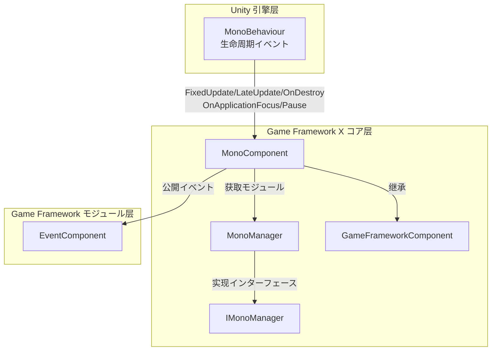

# MonoComponent

MonoComponent は Game Framework X のコアコンポーネント， Unity MonoBehaviour のイベント，のインターフェースとイベントの。

## 

MonoComponent  `GameFrameworkComponent`，は Unity `MonoBehaviour` コンポーネント。 Game Framework と Unity イベントの，：

1. **イベント**： Unity の `Update`、`FixedUpdate`、`LateUpdate`、`OnDestroy` メソッドの `MonoManager` 
2. **イベント**：とクラスイベントのインターフェース
3. **イベント**： EventComponent，にのイベント

### コア

- ****： `lock` の
- ****： try-catch ，エラー
- ****： Unity Profiler，サポート
- **イベント**：イベント（`OnApplicationFocusChangedEventArgs`、`OnApplicationPauseChangedEventArgs`）

## アーキテクチャ

MonoComponent に Game Framework X のアーキテクチャ：



### コンポーネントフロー

```mermaid
sequenceDiagram
    participant Unity as Unity 引擎
    participant MC as MonoComponent
    participant MM as MonoManager
    participant EC as EventComponent
    participant Listener as 业务监听器

    Unity->>MC: Awake()
    MC->>MC: 初始化コンポーネントタイプとインターフェース
    MC->>MM: GetModule&lt;IMonoManager&gt;()
    MC->>EC: GameEntry.GetComponent&lt;EventComponent&gt;()

    Unity->>MC: Update(deltaTime, realDeltaTime)
    MC->>MM: Update()
    MM->>MM: QueueInvoking(_updateQueue)
    MM->>Listener: 回调 Update 监听器

    Unity->>MC: OnApplicationFocus(focusStatus)
    MC->>MM: OnApplicationFocus(focusStatus)
    MC->>EC: Fire(this, OnApplicationFocusChangedEventArgs)
    EC->>Listener: 通知关注该イベントのコンポーネント

    Unity->>MC: OnApplicationPause(pauseStatus)
    MC->>MM: OnApplicationPause(pauseStatus)
    MC->>EC: Fire(this, OnApplicationPauseChangedEventArgs)
```

## コア

### 1. Update 

MonoComponent と `Update` イベントの。`Update` にびし，はの。

```csharp
// 添加 Update 监听器
MonoComponent.Instance.AddUpdateListener(OnGameUpdate);

// 移除 Update 监听器
MonoComponent.Instance.RemoveUpdateListener(OnGameUpdate);

// 监听器回调函数签名
private void OnGameUpdate(float elapseSeconds, float realElapseSeconds)
{
    // elapseSeconds: 距离上一帧の流逝时间
    // realElapseSeconds: 真实の流逝时间（不受时间缩放影响）
}
```

> Source: [MonoComponent.cs](https://github.com/GameFrameX/com.gameframex.unity.mono/blob/main/Runtime/Mono/MonoComponent.cs#L186-L210)

### 2. FixedUpdate 

`FixedUpdate` びし，の。

```csharp
// 添加 FixedUpdate 监听器
MonoComponent.Instance.AddFixedUpdateListener(OnFixedUpdate);

// 移除 FixedUpdate 监听器
MonoComponent.Instance.RemoveFixedUpdateListener(OnFixedUpdate);

// 监听器回调函数签名
private void OnFixedUpdate(float elapseSeconds, float fixedElapseSeconds)
{
    // elapseSeconds: 距离上一帧の流逝时间
    // fixedElapseSeconds: 固定の时间间隔
}
```

> Source: [MonoComponent.cs](https://github.com/GameFrameX/com.gameframex.unity.mono/blob/main/Runtime/Mono/MonoComponent.cs#L156-L180)

### 3. LateUpdate 

`LateUpdate` に `Update` メソッドびし，たの。

```csharp
// 添加 LateUpdate 监听器
MonoComponent.Instance.AddLateUpdateListener(OnLateUpdate);

// 移除 LateUpdate 监听器
MonoComponent.Instance.RemoveLateUpdateListener(OnLateUpdate);

// 监听器回调函数签名
private void OnLateUpdate(float elapseSeconds, float fixedElapseSeconds)
{
    // elapseSeconds: 距离上一帧の流逝时间
    // fixedElapseSeconds: 固定の时间间隔
}
```

> Source: [MonoComponent.cs](https://github.com/GameFrameX/com.gameframex.unity.mono/blob/main/Runtime/Mono/MonoComponent.cs#L126-L150)

### 4. OnDestroy 

`OnDestroy` にコンポーネントびし，。

```csharp
// 添加 OnDestroy 监听器
MonoComponent.Instance.AddDestroyListener(OnGameDestroy);

// 移除 OnDestroy 监听器
MonoComponent.Instance.RemoveDestroyListener(OnGameDestroy);

// 监听器回调函数签名
private void OnGameDestroy()
{
    // 清理リソース、取消订阅イベント等
}
```

> Source: [MonoComponent.cs](https://github.com/GameFrameX/com.gameframex.unity.mono/blob/main/Runtime/Mono/MonoComponent.cs#L216-L240)

### 5. 

のイベント。

```csharp
// 添加应用焦点变化监听器
MonoComponent.Instance.AddOnApplicationFocusListener(OnAppFocusChanged);

// 移除应用焦点变化监听器
MonoComponent.Instance.RemoveOnApplicationFocusListener(OnAppFocusChanged);

// 监听器回调函数签名
private void OnAppFocusChanged(bool hasFocus)
{
    // hasFocus: true 表示获得焦点，false 表示失去焦点
    Debug.Log($"应用焦点状態: {(hasFocus ? "获得焦点" : "失去焦点")}");
}
```

> Source: [MonoComponent.cs](https://github.com/GameFrameX/com.gameframex.unity.mono/blob/main/Runtime/Mono/MonoComponent.cs#L276-L300)

### 6. 

のイベント。

```csharp
// 添加应用暂停状態监听器
MonoComponent.Instance.AddOnApplicationPauseListener(OnAppPauseChanged);

// 移除应用暂停状態监听器
MonoComponent.Instance.RemoveOnApplicationPauseListener(OnAppPauseChanged);

// 监听器回调函数签名
private void OnAppPauseChanged(bool isPaused)
{
    // isPaused: true 表示暂停，false 表示恢复
    Debug.Log($"应用暂停状態: {(isPaused ? "已暂停" : "已恢复")}");
}
```

> Source: [MonoComponent.cs](https://github.com/GameFrameX/com.gameframex.unity.mono/blob/main/Runtime/Mono/MonoComponent.cs#L246-L270)

## 

### 

たシンプルの Update ：

```csharp
using GameFrameX.Mono.Runtime;
using UnityEngine;

public class GameLoopExample : MonoBehaviour
{
    private void Start()
    {
        // 添加 Update 监听器
        MonoComponent.Instance.AddUpdateListener(OnUpdate);
    }

    private void OnUpdate(float elapseSeconds, float realElapseSeconds)
    {
        // に这里実行每帧必要更新の逻辑
        // 例如：移动角色、处理输入等
    }

    private void OnDestroy()
    {
        // 移除监听器，避免内存泄漏
        MonoComponent.Instance.RemoveUpdateListener(OnUpdate);
    }
}
```

> Source: [MonoComponent.cs](https://github.com/GameFrameX/com.gameframex.unity.mono/blob/main/Runtime/Mono/MonoComponent.cs#L182-L211)

### ：イベント

た，をじてイベントイベント：

```csharp
using GameFrameX.Event.Runtime;
using GameFrameX.Mono.Runtime;
using UnityEngine;

public class AppStateExample : MonoBehaviour
{
    private void Start()
    {
        // 订阅应用暂停イベント
        var eventComponent = GameEntry.GetComponent<EventComponent>();
        eventComponent.Subscribe(OnApplicationPauseChangedEventArgs.EventId, OnAppPauseHandler);
        
        // 订阅应用焦点イベント
        eventComponent.Subscribe(OnApplicationFocusChangedEventArgs.EventId, OnAppFocusHandler);
    }

    private void OnAppPauseHandler(object sender, GameEventArgs e)
    {
        var args = e as OnApplicationPauseChangedEventArgs;
        Debug.Log($"应用暂停状態变化: {(args.IsPause ? "暂停" : "恢复")}");
    }

    private void OnAppFocusHandler(object sender, GameEventArgs e)
    {
        var args = e as OnApplicationFocusChangedEventArgs;
        Debug.Log($"应用焦点变化: {(args.IsFocus ? "获得焦点" : "失去焦点")}");
    }

    private void OnDestroy()
    {
        // 取消订阅イベント
        var eventComponent = GameEntry.GetComponent<EventComponent>();
        eventComponent.Unsubscribe(OnApplicationPauseChangedEventArgs.EventId, OnAppPauseHandler);
        eventComponent.Unsubscribe(OnApplicationFocusChangedEventArgs.EventId, OnAppFocusHandler);
    }
}
```

> Source: [MonoComponent.cs](https://github.com/GameFrameX/com.gameframex.unity.mono/blob/main/Runtime/Mono/MonoComponent.cs#L99-L120)

### 

|  | のイベント |  |
|------|---------------|------|
| ゲーム | `Update` | のゲーム |
|  | `FixedUpdate` | ， |
|  | `LateUpdate` | にた |
| リソース | `OnDestroy` | コンポーネントの |
|  | `OnApplicationPause` | /ゲーム |
|  | `OnApplicationFocus` | / |

## API リファレンス

### MonoComponent メソッド

#### `AddUpdateListener(Action<float, float> fun)`

 Update 。

**パラメータ：**
- `fun` (Action&lt;float, float&gt;): Update ，パラメータは，パラメータは。

**：**
```csharp
MonoComponent.Instance.AddUpdateListener((elapsed, realElapsed) => {
    // 处理更新逻辑
});
```

> Source: [MonoComponent.cs#L186-L195](https://github.com/GameFrameX/com.gameframex.unity.mono/blob/main/Runtime/Mono/MonoComponent.cs#L186-L195)

---

#### `RemoveUpdateListener(Action<float, float> fun)`

 Update 。

**パラメータ：**
- `fun` (Action&lt;float, float&gt;): の Update 。

> Source: [MonoComponent.cs#L201-L210](https://github.com/GameFrameX/com.gameframex.unity.mono/blob/main/Runtime/Mono/MonoComponent.cs#L201-L210)

---

#### `AddFixedUpdateListener(Action<float, float> fun)`

 FixedUpdate 。

**パラメータ：**
- `fun` (Action&lt;float, float&gt;): FixedUpdate ，パラメータは，パラメータは。

> Source: [MonoComponent.cs#L156-L165](https://github.com/GameFrameX/com.gameframex.unity.mono/blob/main/Runtime/Mono/MonoComponent.cs#L156-L165)

---

#### `RemoveFixedUpdateListener(Action<float, float> fun)`

 FixedUpdate 。

**パラメータ：**
- `fun` (Action&lt;float, float&gt;): の FixedUpdate 。

> Source: [MonoComponent.cs#L171-L180](https://github.com/GameFrameX/com.gameframex.unity.mono/blob/main/Runtime/Mono/MonoComponent.cs#L171-L180)

---

#### `AddLateUpdateListener(Action<float, float> fun)`

 LateUpdate 。

**パラメータ：**
- `fun` (Action&lt;float, float&gt;): LateUpdate ，パラメータは，パラメータは。

> Source: [MonoComponent.cs#L126-L135](https://github.com/GameFrameX/com.gameframex.unity.mono/blob/main/Runtime/Mono/MonoComponent.cs#L126-L135)

---

#### `RemoveLateUpdateListener(Action<float, float> fun)`

 LateUpdate 。

**パラメータ：**
- `fun` (Action&lt;float, float&gt;): の LateUpdate 。

> Source: [MonoComponent.cs#L141-L150](https://github.com/GameFrameX/com.gameframex.unity.mono/blob/main/Runtime/Mono/MonoComponent.cs#L141-L150)

---

#### `AddDestroyListener(Action fun)`

 OnDestroy 。

**パラメータ：**
- `fun` (Action): OnDestroy ，パラメータ。

> Source: [MonoComponent.cs#L216-L225](https://github.com/GameFrameX/com.gameframex.unity.mono/blob/main/Runtime/Mono/MonoComponent.cs#L216-L225)

---

#### `RemoveDestroyListener(Action fun)`

 OnDestroy 。

**パラメータ：**
- `fun` (Action): の OnDestroy 。

> Source: [MonoComponent.cs#L231-L240](https://github.com/GameFrameX/com.gameframex.unity.mono/blob/main/Runtime/Mono/MonoComponent.cs#L231-L240)

---

#### `AddOnApplicationPauseListener(Action<bool> fun)`

。

**パラメータ：**
- `fun` (Action&lt;bool&gt;): ，パラメータ。

> Source: [MonoComponent.cs#L246-L255](https://github.com/GameFrameX/com.gameframex.unity.mono/blob/main/Runtime/Mono/MonoComponent.cs#L246-L255)

---

#### `RemoveOnApplicationPauseListener(Action<bool> fun)`

。

**パラメータ：**
- `fun` (Action&lt;bool&gt;): の。

> Source: [MonoComponent.cs#L261-L270](https://github.com/GameFrameX/com.gameframex.unity.mono/blob/main/Runtime/Mono/MonoComponent.cs#L261-L270)

---

#### `AddOnApplicationFocusListener(Action<bool> fun)`

。

**パラメータ：**
- `fun` (Action&lt;bool&gt;): ，パラメータ。

> Source: [MonoComponent.cs#L276-L285](https://github.com/GameFrameX/com.gameframex.unity.mono/blob/main/Runtime/Mono/MonoComponent.cs#L276-L285)

---

#### `RemoveOnApplicationFocusListener(Action<bool> fun)`

。

**パラメータ：**
- `fun` (Action&lt;bool&gt;): の。

> Source: [MonoComponent.cs#L291-L300](https://github.com/GameFrameX/com.gameframex.unity.mono/blob/main/Runtime/Mono/MonoComponent.cs#L291-L300)

---

### MonoManager コアメソッド

MonoManager はのコアクラス，はメソッド：

#### `QueueInvoking`

メソッド，にの。

```csharp
private static void QueueInvoking(LinkedList<Action<float, float>> list, float elapseSeconds, float realElapseSeconds)
{
    lock (Lock)
    {
        foreach (var action in list)
        {
            try
            {
                action.Invoke(elapseSeconds, realElapseSeconds);
            }
            catch (Exception e)
            {
                Log.Error(e);
            }
        }
    }
}
```

**：**
-  `lock` 
- に try-catch ，
- サポート Unity Profiler 

> Source: [MonoManager.cs#L364-L380](https://github.com/GameFrameX/com.gameframex.unity.mono/blob/main/Runtime/Mono/MonoManager.cs#L364-L380)

## リンク

- [MonoManager](./4-core-components.1-monomanager) - Mono マネージャーモジュール
- [イベントタイプ](./5-events.1-event-types) - Game Framework イベント
- [イベント](./5-events.2-event-args) - イベント
- [クイックスタート](./3-getting-started.1-basic-usage) - ガイド
