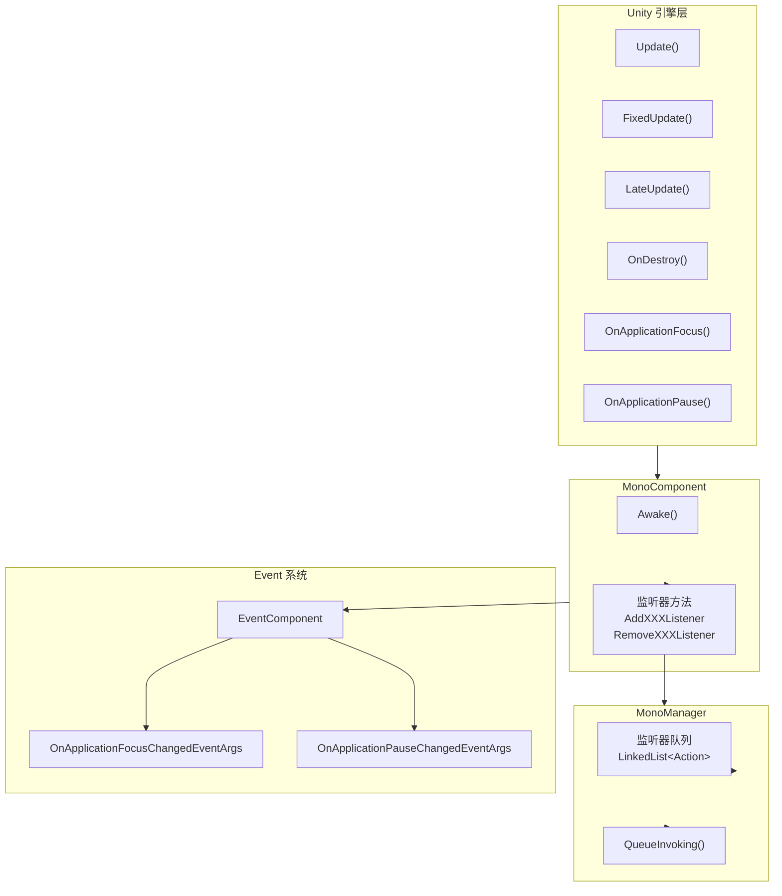

# よくある問題解答

このドキュメント汇总了使用 GameFrameX Unity Mono ライフサイクルコンポーネント时常见的疑问解答。

## 概要

Mono ライフサイクルコンポーネント是 GameFrameX フレームワーク的コアモジュール之一，用于統一された管理 Unity MonoBehaviour 的各种ライフサイクルイベント，含みます Update、FixedUpdate、LateUpdate、OnDestroy、OnApplicationFocus 和 OnApplicationPause。このドキュメント旨在帮助開発者快速解决使用过程中遇到的常见問題。

## 依赖問題

### Q1: コンパイル报错找不到 GameFrameX.Runtime 名前空間

**問題説明：**
在プロジェクト中追加 Mono コンポーネント后，コンパイル出现类似以下エラー：
```
The type or namespace name 'Runtime' does not exist in the namespace 'GameFrameX'
```

**原因分析：**
Mono コンポーネント依赖于 GameFrameX コアランタイム库。该库是整个 GameFrameX フレームワーク的基本，〜しなければなりませんまずインストール。

**解決策：**
〜する必要がありますインストール `com.alianblank.gameframex.unity.runtime` パッケージ。インストール方法是在プロジェクト的 `manifest.json` 中追加依赖：

```json
{
  "dependencies": {
    "com.alianblank.gameframex.unity.runtime": "https://github.com/GameFrameX/com.alianblank.gameframex.unity.runtime.git"
  }
}
```

> Source: [README.md](https://github.com/GameFrameX/com.gameframex.unity.mono/blob/main/README.md#L42)

---

### Q2: コンパイル报错找不到 Event コンポーネント

**問題説明：**
コンパイル时出现以下エラー：
```
The type or namespace name 'Event' does not exist in the namespace 'GameFrameX'
```

**原因分析：**
MonoComponent 在 `OnApplicationFocus` 和 `OnApplicationPause` イベントトリガー时，会通过 EventComponent リリース游戏イベント。因此〜する必要がありますインストール Event コンポーネント。

**解決策：**
インストール Event コンポーネントパッケージ：

```json
{
  "dependencies": {
    "com.alianblank.gameframex.unity.event": "https://github.com/GameFrameX/com.alianblank.gameframex.unity.event.git"
  }
}
```

> Source: [README.md](https://github.com/GameFrameX/com.gameframex.unity.mono/blob/main/README.md#L42)

---

## 使用問題

### Q3: 如何登録 Update 监听器？

**問題説明：**
開発者想要在游戏每帧执行特定逻辑，但不想作成额外的 MonoBehaviour 脚本。

**解決策：**
使用 MonoComponent 提供的监听器メソッド。まず〜する必要があります在シーン中確認してください有 MonoComponent コンポーネント（通常由 GameFramework 自动作成），次に通过该コンポーネント登録监听器：

```csharp
// 获取 MonoComponent 实例（通过 Unity 组件或 GameEntry）
var monoComponent = GameEntry.GetComponent<MonoComponent>();

// 注册 Update 监听器
monoComponent.AddUpdateListener(OnGameUpdate);

// 定义回调方法
private void OnGameUpdate(float elapseSeconds, float realElapseSeconds)
{
    // elapseSeconds: 流逝时间
    // realElapseSeconds: 真实流逝时间
    Debug.Log($"Update called, elapsed: {elapseSeconds}");
}

// 重要：不再使用时需要移除监听器
monoComponent.RemoveUpdateListener(OnGameUpdate);
```

> Source: [MonoComponent.cs](https://github.com/GameFrameX/com.gameframex.unity.mono/blob/main/Runtime/Mono/MonoComponent.cs#L186-L210)

---

### Q4: Update、FixedUpdate、LateUpdate 有什么区别？

**問題説明：**
这三个メソッド都有对应的监听器，開発者不清楚〜すべき选择哪一个。

**技术説明：**
- **Update**：每帧呼び出し一次，呼び出し间隔不固定，受帧率影响。适合大多数游戏逻辑。
- **FixedUpdate**：固定时间间隔呼び出し（デフォルト 0.02 秒，つまり 50 次/秒）。适合物理相关的逻辑。
- **LateUpdate**：在所有 Update 呼び出し完成后呼び出し。适合跟随摄像机等〜する必要があります在其他アップデート后执行的逻辑。

**使用お勧め：**
- 普通游戏逻辑 → 使用 Update
- 物理计算相关 → 使用 FixedUpdate
- 相机跟随、UI アップデート等 → 使用 LateUpdate

```csharp
// Update 示例 - 每帧执行
monoComponent.AddUpdateListener((elapsed, realElapsed) => {
    // 游戏主逻辑
});

// FixedUpdate 示例 - 固定间隔执行
monoComponent.AddFixedUpdateListener((elapsed, fixedElapsed) => {
    // 物理逻辑
});

// LateUpdate 示例 - 最后执行
monoComponent.AddLateUpdateListener((elapsed, fixedElapsed) => {
    // 相机跟随等
});
```

> Source: [MonoManager.cs](https://github.com/GameFrameX/com.gameframex.unity.mono/blob/main/Runtime/Mono/MonoManager.cs#L63-L76)

---

### Q5: 监听器传入 null 会发生什么？

**問題説明：**
開発者在登録监听器时不小心传入了 null，想知道会发生什么。

**コード行为：**
確認ソースコード〜できます发现，系统会对 null パラメータ进行检测并抛出例外：

```csharp
public void AddUpdateListener(Action<float, float> fun)
{
    if (fun == null)
    {
        Log.Fatal(nameof(fun) + "is invalid.");
        return;
    }
    _monoManager.AddUpdateListener(fun);
}
```

MonoComponent 中传入 null 会记录致命ログ并直接返す，不会抛出例外。而 MonoManager 中传入 null 会抛出 `ArgumentNullException`。

> Source: [MonoComponent.cs](https://github.com/GameFrameX/com.gameframex.unity.mono/blob/main/Runtime/Mono/MonoComponent.cs#L188-L195)
> Source: [MonoManager.cs](https://github.com/GameFrameX/com.gameframex.unity.mono/blob/main/Runtime/Mono/MonoManager.cs#L176-L187)

---

### Q6: 如何监听应用程序暂停/恢复イベント？

**問題説明：**
開発者〜する必要があります在プレイヤー切换到后台或恢复游戏时执行特定操作。

**解決策：**
使用 `OnApplicationPause` 监听器：

```csharp
// 注册暂停监听器
monoComponent.AddOnApplicationPauseListener(OnApplicationPauseChanged);

// 回调方法
private void OnApplicationPauseChanged(bool isPaused)
{
    if (isPaused)
    {
        Debug.Log("游戏已暂停");
        // 保存游戏数据
    }
    else
    {
        Debug.Log("游戏已恢复");
        // 恢复游戏状态
    }
}
```

同样地，〜できます使用 `OnApplicationFocusListener` 监听焦点变化：

```csharp
monoComponent.AddOnApplicationFocusListener(OnApplicationFocusChanged);

private void OnApplicationFocusChanged(bool hasFocus)
{
    Debug.Log($"应用程序焦点: {hasFocus}");
}
```

> Source: [MonoComponent.cs](https://github.com/GameFrameX/com.gameframex.unity.mono/blob/main/Runtime/Mono/MonoComponent.cs#L246-L270)

---

### Q7: 为什么推奨使用 MonoComponent 而不是直接使用 MonoManager？

**問題説明：**
開発者〜できます直接通过 `GameFrameworkEntry.GetModule<IMonoManager>()` 取得 MonoManager，为什么还要使用 MonoComponent？

**設計説明：**
MonoComponent 継承自 Unity 的 MonoBehaviour，具有以下优势：

1. **自动ライフサイクル绑定**：MonoComponent 自动绑定到 Unity 的ライフサイクルメソッド（Update、OnDestroy 等），无需手动呼び出し。
2. **与 GameFramework 无缝集成**：MonoComponent 是 GameFramework 的コンポーネント体系的一部分，〜できます方便地通过 GameEntry 访问。
3. **エディタ使いやすい**：MonoComponent 带有 `[DisallowMultipleComponent]` 和 `[AddComponentMenu("GameFrameX/Mono")]` プロパティ，在 Unity エディタ中易于查找和管理。

```csharp
// 通过 GameEntry 获取 MonoComponent
var monoComponent = GameEntry.GetComponent<MonoComponent>();

// 或者直接在场景中的 GameObject 上获取
var monoComponent = someGameObject.GetComponent<MonoComponent>();
```

> Source: [MonoComponent.cs](https://github.com/GameFrameX/com.gameframex.unity.mono/blob/main/Runtime/Mono/MonoComponent.cs#L42-L70)

---

## ライフサイクル管理問題

### Q8: 不移除监听器会有什么后果？

**問題説明：**
開発者在シーン切换或对象破棄时忘记移除监听器，想知道会产生什么問題。

**〜の可能性があります后果：**
1. **内存泄漏**：监听器参照的对象无法被垃圾回收。
2. **空参照例外**：监听器コールバック尝试访问已破棄的对象。
3. **逻辑エラー**：过期的监听器〜の可能性があります执行不正确的游戏逻辑。

**最佳实践：**
始终在适当的时机移除监听器，例えば：

```csharp
public class MyController : MonoBehaviour
{
    private MonoComponent _monoComponent;

    private void OnEnable()
    {
        _monoComponent = GameEntry.GetComponent<MonoComponent>();
        _monoComponent.AddUpdateListener(OnUpdate);
        _monoComponent.AddDestroyListener(OnDestroy);
    }

    private void OnDisable()
    {
        if (_monoComponent != null)
        {
            _monoComponent.RemoveUpdateListener(OnUpdate);
            _monoComponent.RemoveDestroyListener(OnDestroy);
        }
    }

    private void OnUpdate(float elapse, float realElapse) { }
    private void OnDestroy() { }
}
```

---

### Q9: MonoManager 是线程安全的吗？

**問題説明：**
開発者在多线程環境下使用监听器，想知道是否存在线程安全問題。

**技术説明：**
是的，MonoManager 是线程安全的。所有监听器的追加和移除操作都使用了 `lock` 锁来保护：

```csharp
public void AddUpdateListener(Action<float, float> action)
{
    if (action == null)
    {
        throw new ArgumentNullException(nameof(action));
    }

    lock (Lock)
    {
        _updateQueue.AddLast(action);
    }
}
```

但请注意，监听器コールバック本身的执行是在 Unity 主线程中呼び出し的，因此不〜する必要があります担心コールバック中的线程安全問題。

> Source: [MonoManager.cs](https://github.com/GameFrameX/com.gameframex.unity.mono/blob/main/Runtime/Mono/MonoManager.cs#L364-L380)

---

## イベント系统問題

### Q10: 如何通过イベント系统监听应用程序ステータス变化？

**問題説明：**
除了使用监听器コールバック，開発者还想通过イベント系统（EventSystem）来响应应用程序ステータス变化。

**解決策：**
MonoComponent 在トリガー OnApplicationFocus 和 OnApplicationPause 时会同時にリリース游戏イベント。〜できます通过購読这些イベント来响应：

```csharp
// 订阅事件
EventComponent eventComponent = GameEntry.GetComponent<EventComponent>();
eventComponent.Subscribe<OnApplicationFocusChangedEventArgs>(OnFocusChanged);
eventComponent.Subscribe<OnApplicationPauseChangedEventArgs>(OnPauseChanged);

// 事件处理方法
private void OnFocusChanged(object sender, OnApplicationFocusChangedEventArgs e)
{
    Debug.Log($"焦点变化: {e.IsFocus}");
}

private void OnPauseChanged(object sender, OnApplicationPauseChangedEventArgs e)
{
    Debug.Log($"暂停状态: {e.IsPause}");
}

// 取消订阅
eventComponent.Unsubscribe<OnApplicationFocusChangedEventArgs>(OnFocusChanged);
eventComponent.Unsubscribe<OnApplicationPauseChangedEventArgs>(OnPauseChanged);
```

> Source: [OnApplicationFocusChangedEventArgs.cs](https://github.com/GameFrameX/com.gameframex.unity.mono/blob/main/Runtime/EventArgs/OnApplicationFocusChangedEventArgs.cs#L40-L87)

---

## インストール問題

### Q11: 如何インストール Mono コンポーネント？

**問題説明：**
初次使用该プラグイン，不清楚如何正确インストール。

**解決策：**
有三种インストール方法可供选择：

**方法一：通过 manifest.json インストール（推奨）**
在プロジェクト的 `Packages/manifest.json` ファイル中追加依赖：

```json
{
  "dependencies": {
    "com.gameframex.unity.mono": "https://github.com/GameFrameX/com.gameframex.unity.mono.git"
  }
}
```

**方法二：通过 Unity Package Manager**
1. 打开 Unity エディタ
2. 进入 Window → Package Manager
3. 点击 + ボタン，选择 "Add package from git URL"
4. 输入：`https://github.com/GameFrameX/com.gameframex.unity.mono.git`

**方法三：直接下载放置**
直接从 GitHub 下载リポジトリ，将内容复制到 Unity プロジェクト的 `Packages` ディレクトリ下，系统会自动识别ロード。

> Source: [README.md](https://github.com/GameFrameX/com.gameframex.unity.mono/blob/main/README.md#L44-L51)

---

## アーキテクチャ图

以下图表表示了 Mono コンポーネント的内部アーキテクチャ和イベント流：



**图解説明：**
1. Unity 引擎的ライフサイクルメソッド自动呼び出し到 MonoComponent
2. MonoComponent 暴露公共监听器メソッド供外部呼び出し
3. MonoManager 内部使用线程安全的 LinkedList 存储监听器
4. OnApplicationFocus 和 OnApplicationPause イベント还会リリース到 Event 系统

---

## 関連リンク

- [プラグイン介绍](../1-overview.1-introduction)
- [インストールガイド](../2-installation.1-installation-methods)
- [基本使用](../3-getting-started.1-basic-usage)
- [MonoManager 详解](../4-core-components.1-monomanager)
- [MonoComponent 详解](../4-core-components.2-monocomponent)
- [イベントタイプ](../5-events.1-event-types)
- [イベントパラメータ](../5-events.2-event-args)
