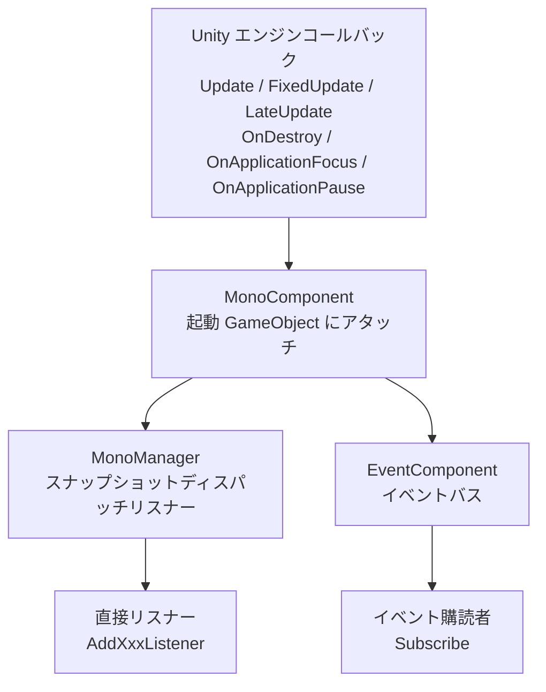

# Mono コンポーネントパッケージの紹介

`com.gameframex.unity.mono` は GameFrameX フレームワーク下の Mono ライフサイクルコンポーネントパッケージです。Unity の `MonoBehaviour` の `Update`、`FixedUpdate`、`LateUpdate`、`OnDestroy`、`OnApplicationFocus`、`OnApplicationPause` などのコールバックをグローバルリスナーリストに統一登録し、業務側で `MonoBehaviour` を継承せずにこれらのイベントを購読できるようにします。パッケージ内では `MonoComponent`(GameFramework の起動 GameObject にアタッチ)と `MonoManager`(実際のディスパッチャ)の二段階で協調動作し、フォーカス / 一時停止イベントを `EventComponent` のイベントバスに転送します。

## クイックスタート

### 1. パッケージのインストール

Unity プロジェクトの `Packages/manifest.json` を編集し、`dependencies` に以下を追加します:

```json
"com.gameframex.unity.mono": "1.1.1"
```

GameFrameX の UPM レジストリをまだ設定していない場合は、`scopedRegistries`(`scopes: ["com.gameframex"]`)を宣言し、`https://gameframex.upm.alianblank.uk` を指す必要があります。完全な例は `README.zh-CN.md` を参照してください。

依存パッケージは `com.gameframex.unity.event` 1.1.0 のみです。

### 2. MonoComponent のアタッチ

`MonoComponent` を GameFramework の起動 GameObject(`EventComponent`、`BaseComponent` などと同階層)にアタッチします。このコンポーネントは `Awake` 時にリフレクションで `MonoManager` 実装クラスを検索し、`Start` 時に `EventComponent` を取得してフォーカス / 一時停止イベントの転送に使用します。

```csharp
// MonoComponent クラス宣言とコンポーネントメニュー
[DisallowMultipleComponent]
[AddComponentMenu("GameFrameX/Mono")]
public sealed class MonoComponent : GameFrameworkComponent
```

Source: [MonoComponent.cs#L42-L44](https://github.com/GameFrameX/com.gameframex.unity.mono/blob/main/Runtime/Mono/MonoComponent.cs#L42-L44)

### 3. ライフサイクルリスナーの登録

任意のスクリプトでまずコンポーネントを取得し、その後コールバックを登録します:

```csharp
var monoComponent = GameEntry.GetComponent<MonoComponent>();

private void OnUpdate(float elapseSeconds, float realElapseSeconds) { /* 毎フレーム */ }
private void OnFixedUpdate(float elapseSeconds, float realElapseSeconds) { /* 物理ステップ */ }
private void OnLateUpdate(float elapseSeconds, float realElapseSeconds) { /* フレーム末尾 */ }
private void OnDestroyCallback() { /* コンポーネント破棄 */ }
private void OnApplicationFocus(bool isFocus) { /* フォーカス変化 */ }
private void OnApplicationPause(bool isPause) { /* 一時停止変化 */ }

monoComponent.AddUpdateListener(OnUpdate);
monoComponent.AddFixedUpdateListener(OnFixedUpdate);
monoComponent.AddLateUpdateListener(OnLateUpdate);
monoComponent.AddDestroyListener(OnDestroyCallback);
monoComponent.AddOnApplicationFocusListener(OnApplicationFocus);
monoComponent.AddOnApplicationPauseListener(OnApplicationPause);
```

`Update / FixedUpdate / LateUpdate` コールバックの `elapseSeconds` はスケーリング後の増分時間、`realElapseSeconds` はスケーリングされていない実際の増分時間で、`IMonoManager` インターフェースで定義されています。

Source: [IMonoManager.cs](https://github.com/GameFrameX/com.gameframex.unity.mono/blob/main/Runtime/Mono/IMonoManager.cs)

### 4. フォーカス / 一時停止イベントバスの購読(オプション)

`MonoComponent` は Unity のフォーカス / 一時停止コールバックを受信すると、直接リスナーを呼び出すだけでなく、`EventComponent` へイベントを発行します。業務側はイベントバスから購読することができます:

```csharp
var eventComponent = GameEntry.GetComponent<EventComponent>();
eventComponent.Subscribe(OnApplicationFocusChangedEventArgs.EventId, OnFocusChanged);
eventComponent.Subscribe(OnApplicationPauseChangedEventArgs.EventId, OnPauseChanged);

private void OnFocusChanged(object sender, GameEventArgs e)
{
    var args = (OnApplicationFocusChangedEventArgs)e;
    if (args.IsFocus) { /* フォーカスを取得 */ }
}
private void OnPauseChanged(object sender, GameEventArgs e)
{
    var args = (OnApplicationPauseChangedEventArgs)e;
    if (args.IsPause) { /* 一時停止に入った */ }
}
```

イベントは `MonoComponent.OnApplicationFocus / OnApplicationPause` から `EventComponent.Fire` によって発行されます。

Source: [MonoComponent.cs#L111-L141](https://github.com/GameFrameX/com.gameframex.unity.mono/blob/main/Runtime/Mono/MonoComponent.cs#L111-L141)

## 動作原理の概要

パッケージ全体には2つのメインリンクしかありません: `Unity コールバック → MonoComponent → MonoManager → 業務リスナー`、および `Unity コールバック → MonoComponent → EventComponent → イベント購読者`。



## 次に進む

- リスナーの登録・削除の詳細とスレッドセーフに関する説明は [README.zh-CN.md](https://github.com/GameFrameX/com.gameframex.unity.mono/blob/main/README.zh-CN.md) を参照
- インターフェースシグネチャとデフォルト実装は [IMonoManager.cs](https://github.com/GameFrameX/com.gameframex.unity.mono/blob/main/Runtime/Mono/IMonoManager.cs) と [MonoManager.cs](https://github.com/GameFrameX/com.gameframex.unity.mono/blob/main/Runtime/Mono/MonoManager.cs) を参照
- イベント引数の定義は [OnApplicationFocusChangedEventArgs.cs](https://github.com/GameFrameX/com.gameframex.unity.mono/blob/main/Runtime/EventArgs/OnApplicationFocusChangedEventArgs.cs) と [OnApplicationPauseChangedEventArgs.cs](https://github.com/GameFrameX/com.gameframex.unity.mono/blob/main/Runtime/EventArgs/OnApplicationPauseChangedEventArgs.cs) を参照
- Inspector のカスタマイズは [MonoComponentInspector.cs](https://github.com/GameFrameX/com.gameframex.unity.mono/blob/main/Editor/Inspector/MonoComponentInspector.cs) を参照
- 単体テストの参考は [UnitTests.cs](https://github.com/GameFrameX/com.gameframex.unity.mono/blob/main/Tests/UnitTests.cs) を参照