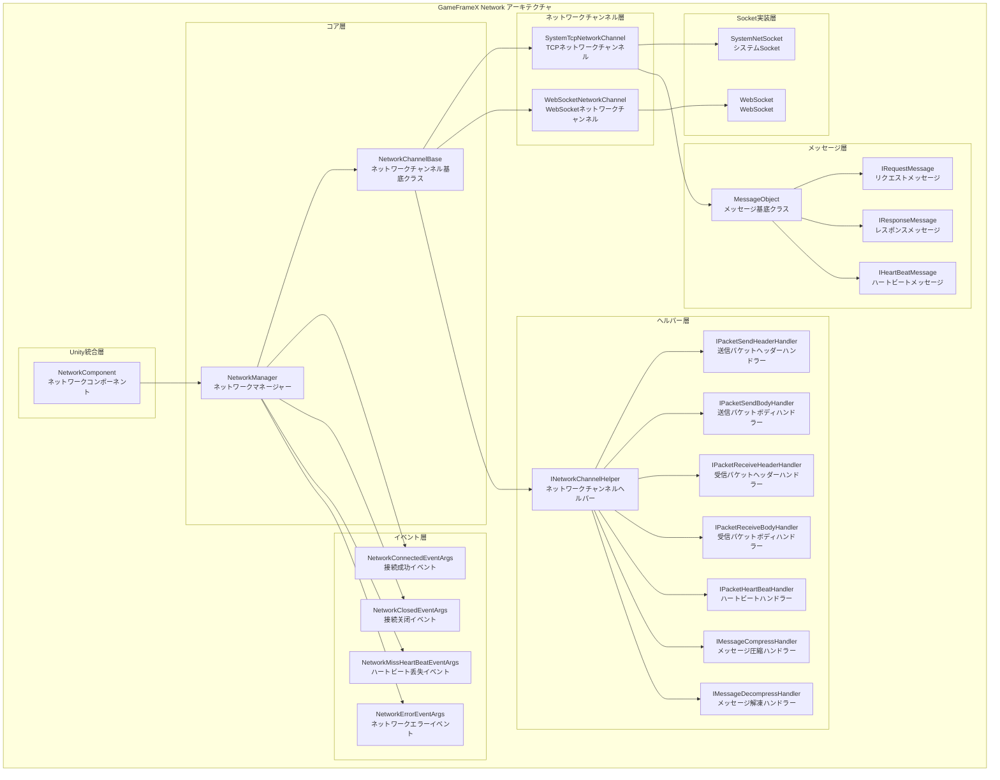
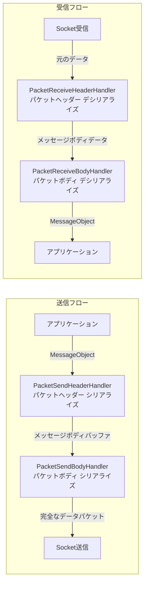
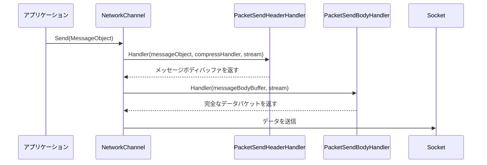
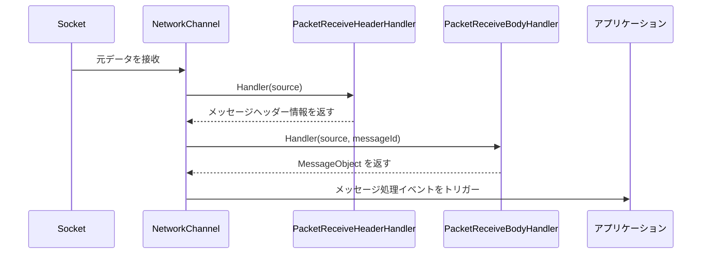
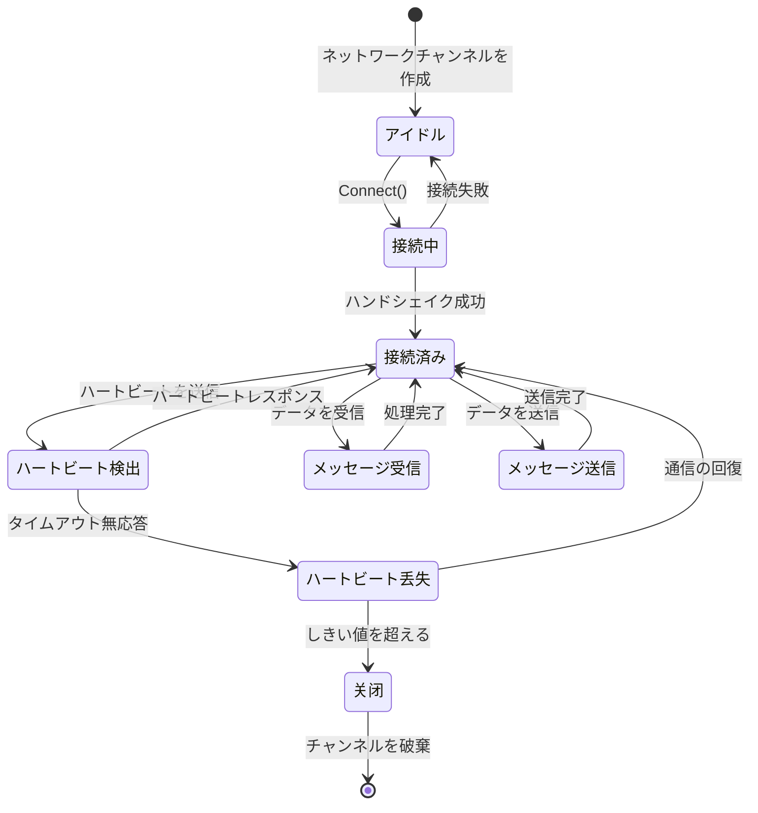
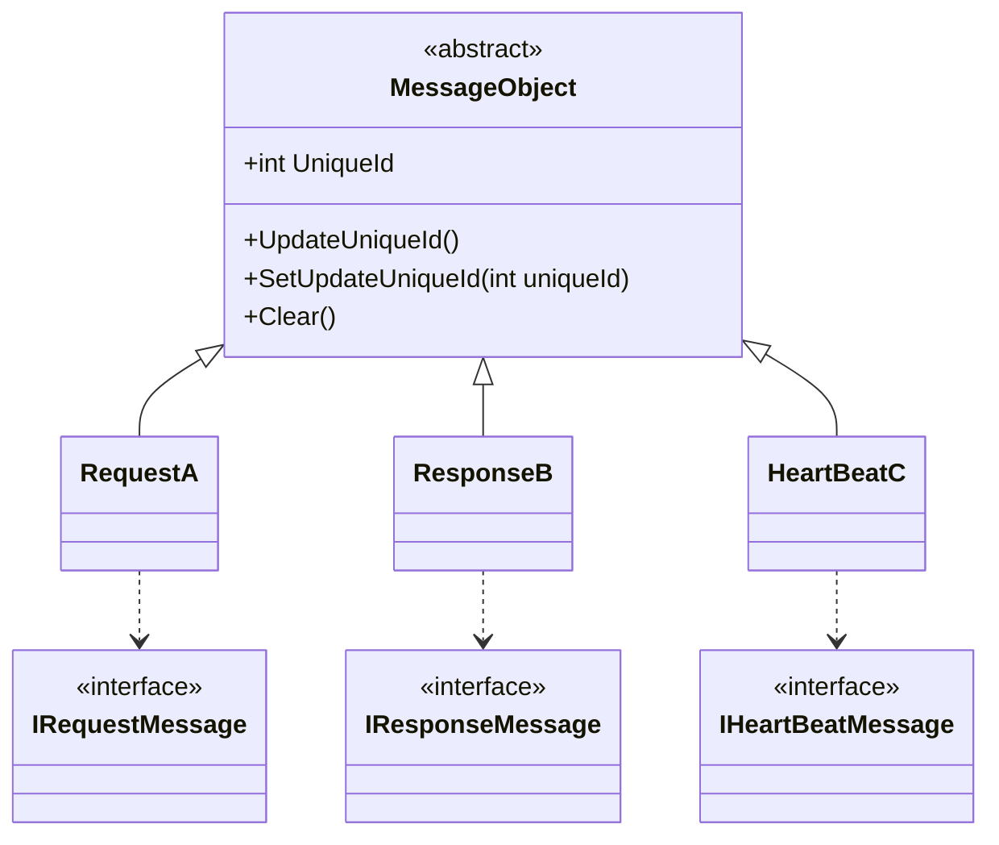
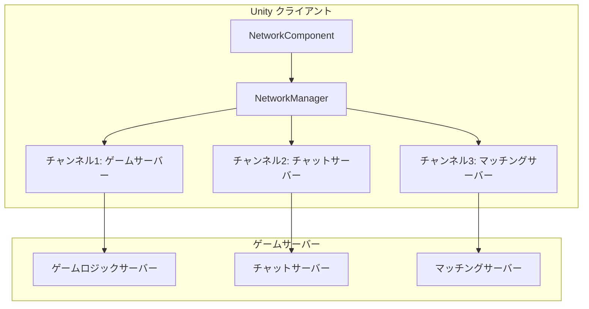

# 概要

GameFrameX Network ロングポーリングネットワークコンポーネントは、GameFrameX フレームワークのコアネットワークモジュールであり、Unity ゲームに可靠性の高いロングポーリング通信機能を提供します。このコンポーネントは TCP と WebSocket の2つのトランスポートプロトコルをサポートし、完全なハートビートメカニズム、RPC リモート呼び出し、メッセージ圧縮などの機能を実装しています。

> Source: [README.md](https://github.com/GameFrameX/com.gameframex.unity.network/blob/main/README.md#L1-L9)

## Overview

GameFrameX Network ロングポーリングネットワークコンポーネントは、Unity ゲーム向けに設計された高性能ネットワーク通信ライブラリです。GameFrameX フレームワークのコアコンポーネントの一つであり、稳定性和信頼性の高いロングポーリングネットワーク通信機能を提供し、各种のサーバーとリアルタイムデータ交互が必要なゲームシナリオに適用します。

このコンポーネントはモジュラーデザインを採用し、ネットワーク接続の各側面（接続管理、メッセージシリアライゼーション、ハートビート検出、イベント通知など）を独立したコンポーネントに分離し、開発者は実際の需求に応じて灵活に構成と拡張を行うことができます。

## Architecture



### コアコンポーネントの説明

#### 1. NetworkManager（ネットワークマネージャー）

NetworkManager はネットワークコンポーネント全体のコアであり、すべてのネットワークチャンネル（NetworkChannel）を管理します。GameFrameworkModule を継承し、GameFrameX フレームワークの標準モジュール実装です。

```csharp
public sealed partial class NetworkManager : GameFrameworkModule, INetworkManager
{
    private readonly Dictionary<string, NetworkChannelBase> m_NetworkChannels;
}
```

> Source: [NetworkManager.cs](https://github.com/GameFrameX/com.gameframex.unity.network/blob/main/Runtime/Network/Network/NetworkManager.cs#L37-L63)

**主な役割：**
- ネットワークチャンネルの作成と破棄
- 複数の同時ネットワーク接続の管理
- ネットワーク関連イベントのトリガー
- すべてのネットワークチャンネルの状态的 polled 更新

#### 2. NetworkChannel（ネットワークチャンネル）

ネットワークチャンネルは独立したネットワーク接続を表します。各チャンネルは固有の名前をを持ち、TCP と WebSocket の2つの実装をサポートします：

- **SystemTcpNetworkChannel**：System.Net.Sockets に基づく TCP 接続実装
- **WebSocketNetworkChannel**：WebSocket に基づく接続実装（WebGL プラットフォームに適用）

```csharp
#if (ENABLE_GAME_FRAME_X_WEB_SOCKET && UNITY_WEBGL) || FORCE_ENABLE_GAME_FRAME_X_WEB_SOCKET
    NetworkChannelBase networkChannel = new WebSocketNetworkChannel(channelName, networkChannelHelper, rpcTimeout);
#else
    NetworkChannelBase networkChannel = new SystemTcpNetworkChannel(channelName, networkChannelHelper, rpcTimeout);
#endif
```

> Source: [NetworkManager.cs](https://github.com/GameFrameX/com.gameframex.unity.network/blob/main/Runtime/Network/Network/NetworkManager.cs#L212-L216)

#### 3. メッセージ処理パイプライン

メッセージ処理は分层パイプラindi設計を採用しており、各層は特定の機能を担当します：



#### 4. イベントシステム

ネットワークコンポーネントはイベントシステムを通じてアプリケーションに接続状态的の変化を通知します：

| イベント | 説明 | 用途 |
|------|------|------|
| NetworkConnected | 接続成功イベント | タイミング：ネットワーク接続の確立に成功した場合 |
| NetworkClosed | 接続关闭イベント | タイミング：ネットワーク接続が閉じられた場合 |
| NetworkMissHeartBeat | ハートビート丢失イベント | タイミング：連続的なハートビート丢失がしきい値に達した場合 |
| NetworkError | ネットワークエラーイベント | タイミング：ネットワークエラーが発生した場合 |

## 機能特性

### 1. マルチチャンネルサポート

NetworkManager は同時に複数のネットワークチャンネルを管理することをサポートし、各チャンネルは独立して異なるサーバーに接続できます：

```csharp
// 複数のネットワークチャンネルを作成
var channel1 = networkManager.CreateNetworkChannel("GameServer", helper1, 5000);
var channel2 = networkManager.CreateNetworkChannel("ChatServer", helper2, 3000);
```

> Source: [NetworkManager.cs](https://github.com/GameFrameX/com.gameframex.unity.network/blob/main/Runtime/Network/Network/NetworkManager.cs#L196-L223)

### 2. RPC リモート呼び出し

コンポーネントは RPC スタイルのリクエスト・レスポンスパターンをサポートし、Task による非同期待機を実装しています：

```csharp
// RPC リクエストを送信し、レスポンスを待機
Task<TResult> Call<TResult>(MessageObject messageObject, bool isIgnoreErrorCode = false) where TResult : MessageObject, IResponseMessage;
```

> Source: [INetworkChannel.cs](https://github.com/GameFrameX/com.gameframex.unity.network/blob/main/Runtime/Network/Interface/INetworkChannel.cs#L235-L241)

### 3. ハートビートメカニズム

组み込みのハートビート検出メカニズムを提供し、接続がまだ存活しているかどうかを検出するために使用されます：

- **デフォルトハートビート間隔**：30秒
- **デフォルト許可丢失回数**：10回
- **フォーカスハートビートサポート**：アプリケーションがフォーカス失去時にハートビートを送信し続けるかどうか

```csharp
/// <summary>
/// デフォルトハートビート間隔
/// </summary>
private const float DefaultHeartBeatInterval = 30f;

/// <summary>
/// デフォルトハートビート丢失断开回数
/// </summary>
private const int DefaultMissHeartBeatCountByClose = 10;
```

> Source: [NetworkManager.NetworkChannelBase.cs](https://github.com/GameFrameX/com.gameframex.unity.network/blob/main/Runtime/Network/Network/NetworkManager.NetworkChannelBase.cs#L50-L57)

### 4. メッセージ圧縮

カスタムメッセージ圧縮ハンドラーをサポートし、ネットワーク帯域幅の使用いを减少させます：

```csharp
public interface IMessageCompressHandler
{
    byte[] Compress(byte[] data);
}

public interface IMessageDecompressHandler
{
    byte[] Decompress(byte[] data);
}
```

> Source: [IMessageCompressHandler.cs](https://github.com/GameFrameX/com.gameframex.unity.network/blob/main/Runtime/Network/Interface/IMessageCompressHandler.cs)

### 5. Unity 統合

NetworkComponent コンポーネントにより、Unity シーンでネットワーク機能を 쉽게 使用できます：

```csharp
[DisallowMultipleComponent]
[AddComponentMenu("GameFrameX/Network")]
public sealed class NetworkComponent : GameFrameworkComponent
{
    [SerializeField] private int m_rpcTimeout = 5000;
    [SerializeField] private bool m_FocusHeartbeat = false;
}
```

> Source: [NetworkComponent.cs](https://github.com/GameFrameX/com.gameframex.unity.network/blob/main/Runtime/Network/NetworkComponent.cs#L39-L68)

## データフロー

### メッセージ送信フロー



### メッセージ受信フロー



### 接続ライフサイクル



## メッセージタイプ体系

すべてのネットワークメッセージは MessageObject 基底クラスを継承します：



> Source: [MessageObject.cs](https://github.com/GameFrameX/com.gameframex.unity.network/blob/main/Runtime/Network/Base/MessageObject.cs#L1-L56)

## 使用シナリオ

### 典型的なゲームネットワークアーキテクチャ



### 適用シナリオ

1. **リアルタイムゲーム通信**：プレイヤー動作の同期、状态的更新
2. **マルチプレイヤーオンラインゲーム**：ルーム管理、プレイヤーリスト、チャット機能
3. **データ永続化**：ゲームセーブのクラウド同期
4. **リアルタイムランキング**：スコアップpload、ランキングクエリ
5. **マッチングシステム**：プレイヤーマッチング、バトルルーム作成

## プラットフォームサポート

| プラットフォーム | サポート状況 | 説明 |
|------|----------|------|
| Windows | 完全サポート | TCP + WebSocket |
| macOS | 完全サポート | TCP + WebSocket |
| Linux | 完全サポート | TCP + WebSocket |
| Android | 完全サポート | TCP + WebSocket |
| iOS | 完全サポート | TCP + WebSocket |
| WebGL | 部分サポート | WebSocket のみ |

## バージョン情報

現在のバージョン：2.5.0

このコンポーネントは MIT ライセンスと Apache License 2.0 のデュアルライセンスで配布されています。

> Source: [CHANGELOG.md](https://github.com/GameFrameX/com.gameframex.unity.network/blob/main/CHANGELOG.md#L1-L22)

## 関連リンク

- [インストールガイド](./2-installation)
- [クイックスタート](./3-getting-started)
- [ネットワークマネージャー](./4-core-concepts.1-network-manager)
- [ネットワークチャンネル](./4-core-concepts.2-network-channel)
- [メッセージタイプ](./4-core-concepts.3-message-types)
- [パケットハンドラー](./4-core-concepts.4-packet-handlers)
- [ハートビート](./5-heartbeat)
- [イベントシステム](./6-events)
- [メッセージ圧縮](./7-message-compression)
- [RPCリモート呼び出し](./8-rpc)
- [エディター設定](./9-editor-configuration)
- [トラブルシューティング](./10-troubleshooting)
