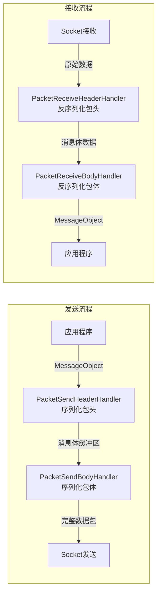
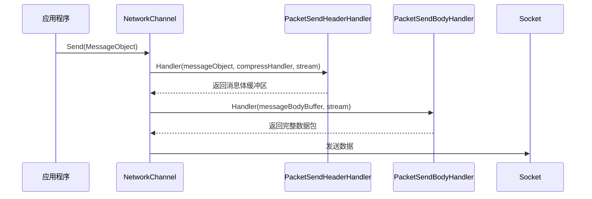
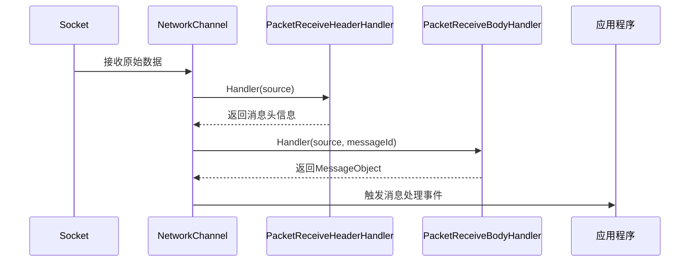
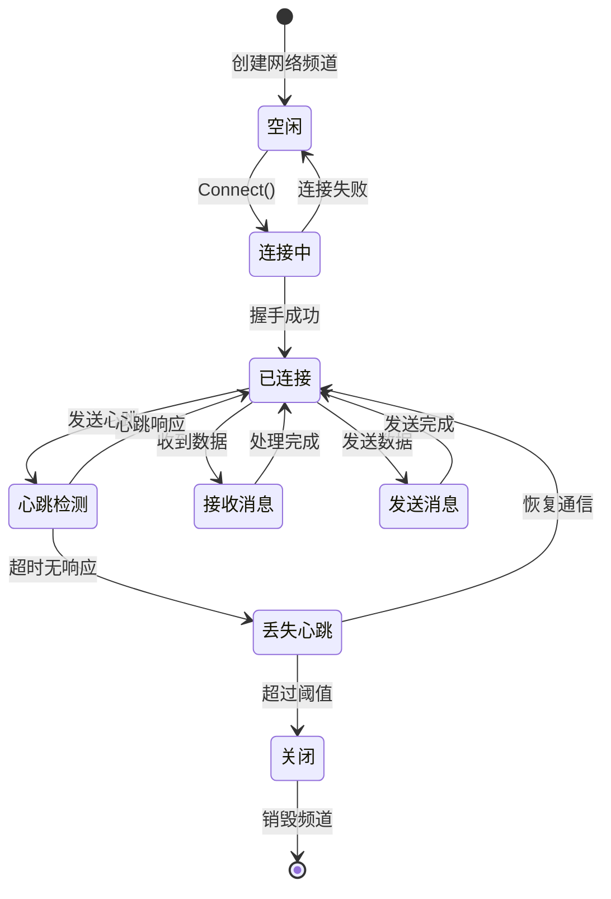
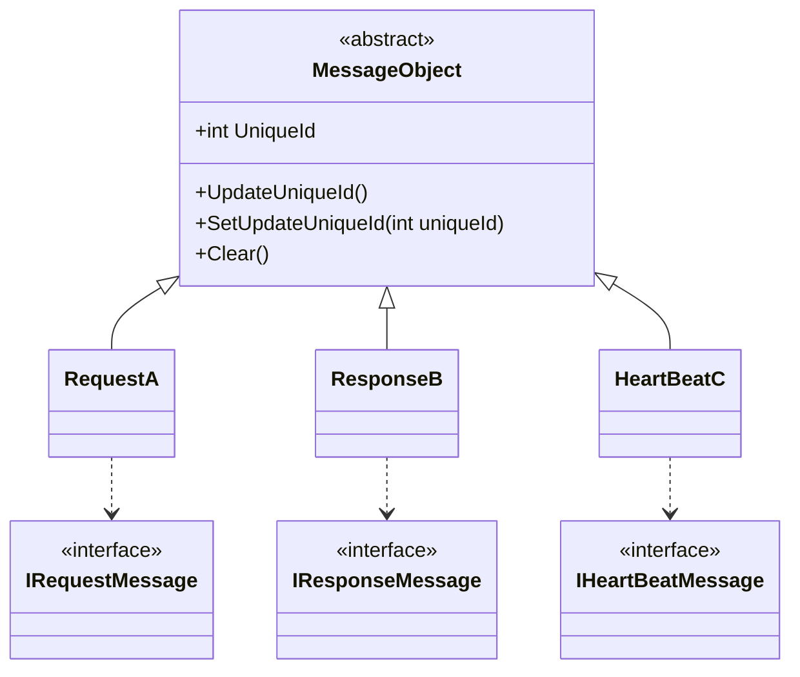
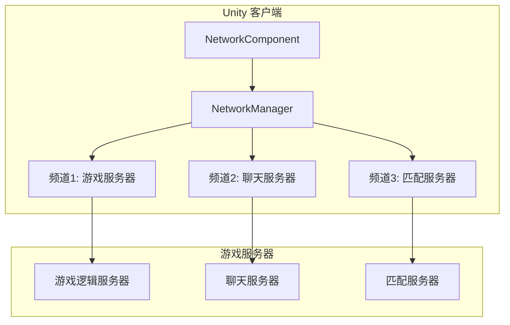

# 概要

GameFrameX Network 长连接网络コンポーネント是 GameFrameX フレームワーク的コア网络モジュール，为 Unity 游戏提供可靠的长连接通信能力。该コンポーネントサポート TCP 和 WebSocket 两种传输协议，実装了完全な的心跳机制、RPC 远程呼び出し、メッセージ压缩等機能。

> Source: [README.md](https://github.com/GameFrameX/com.gameframex.unity.network/blob/main/README.md#L1-L9)

## Overview

GameFrameX Network 长连接网络コンポーネント是专门为 Unity 游戏設計的高性能网络通信库。作为 GameFrameX フレームワーク的コアコンポーネント之一，它提供します稳定、可靠的长连接网络通信能力，適しています各类〜する必要があります与服务器进行实时数据交互的游戏シーン。

该コンポーネント采用モジュール化設計，将网络连接的各个方面（连接管理、メッセージシリアライズ、心跳检测、イベント通知等）解耦为独立的コンポーネント，開発者〜できます根据实际需求柔軟設定和拡張。

## Architecture

```mermaid
flowchart TD
    subgraph GameFrameX_Network["GameFrameX Network 架构"]
        subgraph Core["核心层"]
            NM[NetworkManager<br/>网络管理器]
            NCB[NetworkChannelBase<br/>网络频道基类]
        end
        
        subgraph Channel["网络频道层"]
            TCP[SystemTcpNetworkChannel<br/>TCP网络频道]
            WS[WebSocketNetworkChannel<br/>WebSocket网络频道]
        end
        
        subgraph Socket["Socket实现层"]
            SNS[SystemNetSocket<br/>系统Socket]
            WSS[WebSocket<br/>WebSocket]
        end
        
        subgraph Helper["辅助器层"]
            NCH[INetworkChannelHelper<br/>网络频道辅助器]
            PSH[IPacketSendHeaderHandler<br/>发送包头处理器]
            PSB[IPacketSendBodyHandler<br/>发送包体处理器]
            PRH[IPacketReceiveHeaderHandler<br/>接收包头处理器]
            PRB[IPacketReceiveBodyHandler<br/>接收包体处理器]
            HBH[IPacketHeartBeatHandler<br/>心跳处理器]
            MCH[IMessageCompressHandler<br/>消息压缩处理器]
            MDH[IMessageDecompressHandler<br/>消息解压处理器]
        end
        
        subgraph Message["消息层"]
            MO[MessageObject<br/>消息基类]
            RM[IRequestMessage<br/>请求消息]
            RPM[IResponseMessage<br/>响应消息]
            HB[IHeartBeatMessage<br/>心跳消息]
        end
        
        subgraph Events["事件层"]
            NCE[NetworkConnectedEventArgs<br/>连接成功事件]
            NCLE[NetworkClosedEventArgs<br/>连接关闭事件]
            NMHE[NetworkMissHeartBeatEventArgs<br/>心跳丢失事件]
            NEE[NetworkErrorEventArgs<br/>网络错误事件]
        end
        
        subgraph Unity["Unity集成层"]
            NC[NetworkComponent<br/>网络组件]
        end
    end
    
    NM --> NCB
    NCB --> TCP
    NCB --> WS
    TCP --> SNS
    WS --> WSS
    NCB --> NCH
    NCH --> PSH
    NCH --> PSB
    NCH --> PRH
    NCH --> PRB
    NCH --> HBH
    NCH --> MCH
    NCH --> MDH
    TCP --> MO
    MO --> RM
    MO --> RPM
    MO --> HB
    NM --> NCE
    NM --> NCLE
    NM --> NMHE
    NM --> NEE
    NC --> NM
```



### コアコンポーネント説明

#### 1. NetworkManager（网络マネージャー）

NetworkManager 是整个网络コンポーネント的コア，负责管理所有的网络频道（NetworkChannel）。它継承自 GameFrameworkModule，是 GameFrameX フレームワーク的標準モジュール実装。

```csharp
public sealed partial class NetworkManager : GameFrameworkModule, INetworkManager
{
    private readonly Dictionary<string, NetworkChannelBase> m_NetworkChannels;
}
```

> Source: [NetworkManager.cs](https://github.com/GameFrameX/com.gameframex.unity.network/blob/main/Runtime/Network/Network/NetworkManager.cs#L37-L63)

**主な职责：**
- 作成和破棄网络频道
- 管理多个并发网络连接
- トリガー网络相关イベント
- 轮询アップデート所有网络频道ステータス

#### 2. NetworkChannel（网络频道）

网络频道代表一个独立的网络连接。每个频道都有唯一的名称，サポート TCP 和 WebSocket 两种実装：

- **SystemTcpNetworkChannel**：基于 System.Net.Sockets 的 TCP 连接実装
- **WebSocketNetworkChannel**：基于 WebSocket 的连接実装（適しています WebGL プラットフォーム）

```csharp
#if (ENABLE_GAME_FRAME_X_WEB_SOCKET && UNITY_WEBGL) || FORCE_ENABLE_GAME_FRAME_X_WEB_SOCKET
    NetworkChannelBase networkChannel = new WebSocketNetworkChannel(channelName, networkChannelHelper, rpcTimeout);
#else
    NetworkChannelBase networkChannel = new SystemTcpNetworkChannel(channelName, networkChannelHelper, rpcTimeout);
#endif
```

> Source: [NetworkManager.cs](https://github.com/GameFrameX/com.gameframex.unity.network/blob/main/Runtime/Network/Network/NetworkManager.cs#L212-L216)

#### 3. メッセージ処理管道

メッセージ処理采用分层管道設計，每层负责特定的機能：



#### 4. イベント系统

网络コンポーネント通过イベント系统通知应用程序连接ステータス的变化：

| イベント | 説明 | 用途 |
|------|------|------|
| NetworkConnected | 连接成功イベント | トリガー时机：成功建立网络连接 |
| NetworkClosed | 连接閉じるイベント | トリガー时机：网络连接被閉じる |
| NetworkMissHeartBeat | 心跳丢失イベント | トリガー时机：连续丢失心跳达到阈值 |
| NetworkError | 网络エラーイベント | トリガー时机：发生网络エラー |

## 機能特性

### 1. 多通道サポート

NetworkManager サポート同時に管理多个网络频道，每个频道〜できます独立连接到不同的服务器：

```csharp
// 创建多个网络频道
var channel1 = networkManager.CreateNetworkChannel("GameServer", helper1, 5000);
var channel2 = networkManager.CreateNetworkChannel("ChatServer", helper2, 3000);
```

> Source: [NetworkManager.cs](https://github.com/GameFrameX/com.gameframex.unity.network/blob/main/Runtime/Network/Network/NetworkManager.cs#L196-L223)

### 2. RPC 远程呼び出し

コンポーネントサポート RPC 风格的请求-响应モード，通过 Task 実装异步等待：

```csharp
// 发送 RPC 请求并等待响应
Task<TResult> Call<TResult>(MessageObject messageObject, bool isIgnoreErrorCode = false) where TResult : MessageObject, IResponseMessage;
```

> Source: [INetworkChannel.cs](https://github.com/GameFrameX/com.gameframex.unity.network/blob/main/Runtime/Network/Interface/INetworkChannel.cs#L235-L241)

### 3. 心跳机制

内置心跳检测机制，用于检测连接是否仍然存活：

- **デフォルト心跳间隔**：30秒
- **デフォルト允许丢失次数**：10次
- **サポート焦点心跳**：应用程序失去焦点时是否继续发送心跳

```csharp
/// <summary>
/// 默认心跳间隔
/// </summary>
private const float DefaultHeartBeatInterval = 30f;

/// <summary>
/// 默认心跳丢失断开次数
/// </summary>
private const int DefaultMissHeartBeatCountByClose = 10;
```

> Source: [NetworkManager.NetworkChannelBase.cs](https://github.com/GameFrameX/com.gameframex.unity.network/blob/main/Runtime/Network/Network/NetworkManager.NetworkChannelBase.cs#L50-L57)

### 4. メッセージ压缩

サポート自定義メッセージ压缩処理器，减少网络带宽占用：

```csharp
public interface IMessageCompressHandler
{
    byte[] Compress(byte[] data);
}

public interface IMessageDecompressHandler
{
    byte[] Decompress(byte[] data);
}
```

> Source: [IMessageCompressHandler.cs](https://github.com/GameFrameX/com.gameframex.unity.network/blob/main/Runtime/Network/Interface/IMessageCompressHandler.cs)

### 5. Unity 集成

通过 NetworkComponent コンポーネント，〜できます方便地在 Unity シーン中使用网络機能：

```csharp
[DisallowMultipleComponent]
[AddComponentMenu("GameFrameX/Network")]
public sealed class NetworkComponent : GameFrameworkComponent
{
    [SerializeField] private int m_rpcTimeout = 5000;
    [SerializeField] private bool m_FocusHeartbeat = false;
}
```

> Source: [NetworkComponent.cs](https://github.com/GameFrameX/com.gameframex.unity.network/blob/main/Runtime/Network/NetworkComponent.cs#L39-L68)

## 数据フロー

### メッセージ发送フロー



### メッセージ受信フロー



### 连接ライフサイクル



## メッセージタイプ体系

所有网络メッセージ都継承自 MessageObject 基底クラス：



> Source: [MessageObject.cs](https://github.com/GameFrameX/com.gameframex.unity.network/blob/main/Runtime/Network/Base/MessageObject.cs#L1-L56)

## 使用シーン

### 典型游戏网络アーキテクチャ



### 适用シーン

1. **实时游戏通信**：プレイヤー动作同步、ステータスアップデート
2. **多人在线游戏**：房间管理、プレイヤー列表、聊天機能
3. **数据持久化**：游戏存档云端同步
4. **实时排行榜**：分数上传、排名查询
5. **匹配系统**：プレイヤー匹配、对战房间作成

## プラットフォームサポート

| プラットフォーム | サポート情况 | 説明 |
|------|----------|------|
| Windows | ✅ 完全サポート | TCP + WebSocket |
| macOS | ✅ 完全サポート | TCP + WebSocket |
| Linux | ✅ 完全サポート | TCP + WebSocket |
| Android | ✅ 完全サポート | TCP + WebSocket |
| iOS | ✅ 完全サポート | TCP + WebSocket |
| WebGL | ⚠️ 部ブランチ持 | 仅 WebSocket |

## バージョン情報

当前バージョン：2.5.0

该コンポーネント采用 MIT 许可证与 Apache License 2.0 双许可证分发。

> Source: [CHANGELOG.md](https://github.com/GameFrameX/com.gameframex.unity.network/blob/main/CHANGELOG.md#L1-L22)

## 関連リンク

- [インストールガイド](./2-installation)
- [快速开始](./3-getting-started)
- [网络マネージャー](./4-core-concepts.1-network-manager)
- [网络频道](./4-core-concepts.2-network-channel)
- [メッセージタイプ](./4-core-concepts.3-message-types)
- [数据パッケージ処理器](./4-core-concepts.4-packet-handlers)
- [心跳机制](./5-heartbeat)
- [イベント系统](./6-events)
- [メッセージ压缩](./7-message-compression)
- [RPC远程呼び出し](./8-rpc)
- [エディタ設定](./9-editor-configuration)
- [常见問題](./10-troubleshooting)
