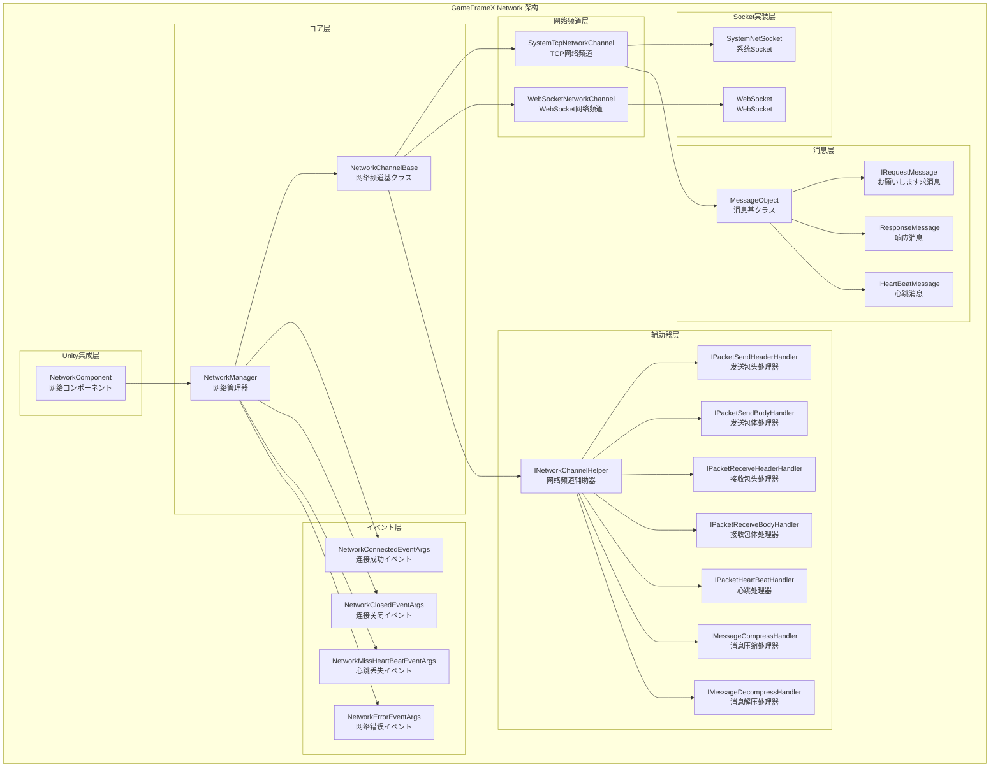
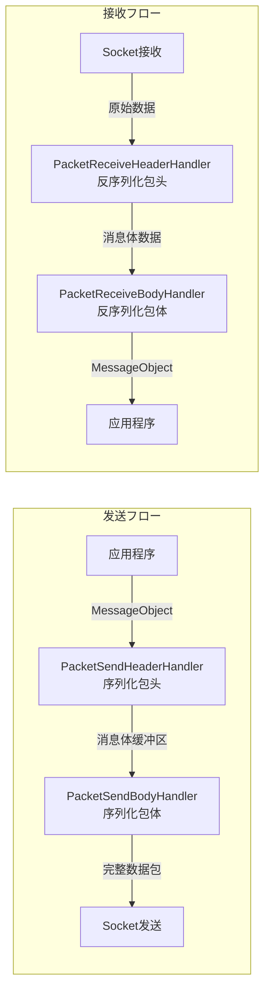
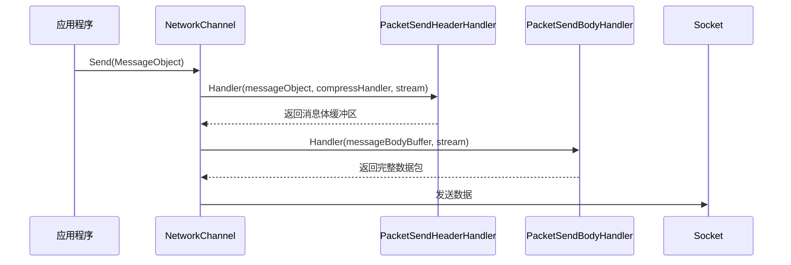
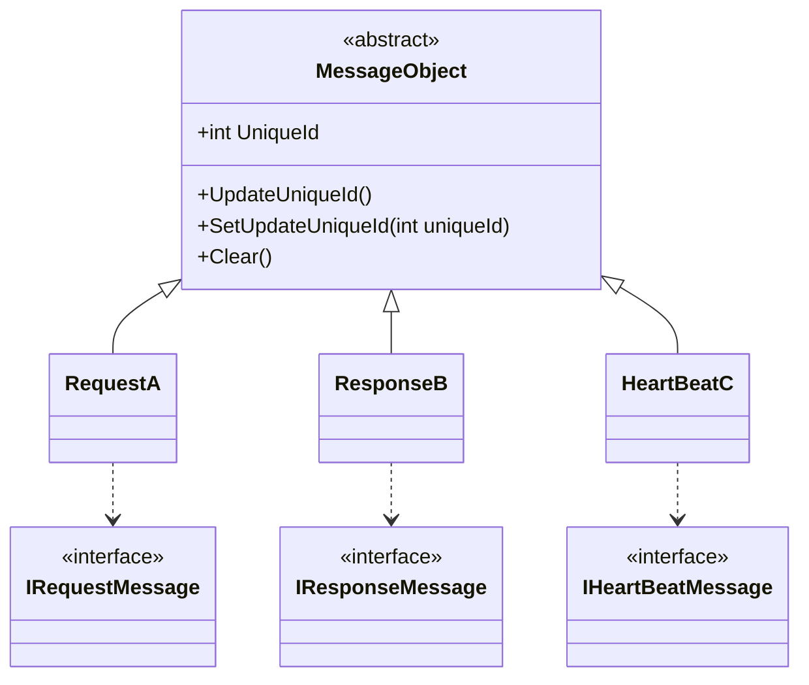
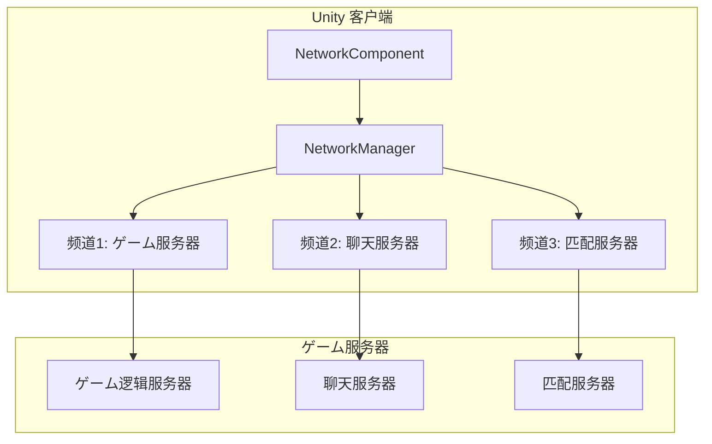

# 概要

GameFrameX Network 长连接网络コンポーネント是 GameFrameX フレームワーク的コア网络模块，为 Unity ゲーム提供可靠的长连接通信能力。该コンポーネントサポート TCP 和 WebSocket 两种传输协议，実装了完整的心跳机制、RPC 远程呼び出し、消息压缩等機能。

> Source: [README.md](https://github.com/GameFrameX/com.gameframex.unity.network/blob/main/README.md#L1-L9)

## Overview

GameFrameX Network 长连接网络コンポーネント是专门为 Unity ゲーム设计的高性能网络通信库。作为 GameFrameX フレームワーク的コアコンポーネント之一，它提供します稳定、可靠的长连接网络通信能力，适に使用各クラス必要与服务器进行实时数据交互的ゲームシーン。

该コンポーネント采用モジュラー設計，将网络连接的各个方面（连接管理、消息序列化、心跳检测、イベント通知等）解耦为独立的コンポーネント，開発者可能に基づいて实际需求灵活配置和扩展。

## Architecture



### コアコンポーネント説明

#### 1. NetworkManager（网络管理器）

NetworkManager 是整个网络コンポーネント的コア，负责管理所有的网络频道（NetworkChannel）。它を継承 GameFrameworkModule，是 GameFrameX フレームワーク的标准模块実装。

```csharp
public sealed partial class NetworkManager : GameFrameworkModule, INetworkManager
{
    private readonly Dictionary<string, NetworkChannelBase> m_NetworkChannels;
}
```

> Source: [NetworkManager.cs](https://github.com/GameFrameX/com.gameframex.unity.network/blob/main/Runtime/Network/Network/NetworkManager.cs#L37-L63)

**主要职责：**
- 作成和销毁网络频道
- 管理多个并发网络连接
- 触发网络関連イベント
- 轮询更新所有网络频道ステータス

#### 2. NetworkChannel（网络频道）

网络频道代表一个独立的网络连接。每个频道都有唯一的名称，サポート TCP 和 WebSocket 两种実装：

- **SystemTcpNetworkChannel**：基づく System.Net.Sockets 的 TCP 连接実装
- **WebSocketNetworkChannel**：基づく WebSocket 的连接実装（适に使用 WebGL 平台）

```csharp
#if (ENABLE_GAME_FRAME_X_WEB_SOCKET && UNITY_WEBGL) || FORCE_ENABLE_GAME_FRAME_X_WEB_SOCKET
    NetworkChannelBase networkChannel = new WebSocketNetworkChannel(channelName, networkChannelHelper, rpcTimeout);
#else
    NetworkChannelBase networkChannel = new SystemTcpNetworkChannel(channelName, networkChannelHelper, rpcTimeout);
#endif
```

> Source: [NetworkManager.cs](https://github.com/GameFrameX/com.gameframex.unity.network/blob/main/Runtime/Network/Network/NetworkManager.cs#L212-L216)

#### 3. 消息处理管道

消息处理采用分层管道设计，每层负责特定的機能：



#### 4. イベント系统

网络コンポーネントを通じてイベント系统通知应用程序连接ステータス的变化：

| イベント | 説明 | 用途 |
|------|------|------|
| NetworkConnected | 连接成功イベント | 触发时机：成功建立网络连接 |
| NetworkClosed | 连接关闭イベント | 触发时机：网络连接被关闭 |
| NetworkMissHeartBeat | 心跳丢失イベント | 触发时机：连续丢失心跳达到阈值 |
| NetworkError | 网络错误イベント | 触发时机：发生网络错误 |

## 機能特性

### 1. 多通道サポート

NetworkManager サポート同时管理多个网络频道，每个频道可能独立连接到不同的服务器：

```csharp
// 作成多个网络频道
var channel1 = networkManager.CreateNetworkChannel("GameServer", helper1, 5000);
var channel2 = networkManager.CreateNetworkChannel("ChatServer", helper2, 3000);
```

> Source: [NetworkManager.cs](https://github.com/GameFrameX/com.gameframex.unity.network/blob/main/Runtime/Network/Network/NetworkManager.cs#L196-L223)

### 2. RPC 远程呼び出し

コンポーネントサポート RPC 风格的お願いします求-响应模式，を通じて Task 実装异步等待：

```csharp
// 发送 RPC お願いします求并等待响应
Task<TResult> Call<TResult>(MessageObject messageObject, bool isIgnoreErrorCode = false) where TResult : MessageObject, IResponseMessage;
```

> Source: [INetworkChannel.cs](https://github.com/GameFrameX/com.gameframex.unity.network/blob/main/Runtime/Network/Interface/INetworkChannel.cs#L235-L241)

### 3. 心跳机制

内置心跳检测机制，に使用检测连接是否仍然存活：

- **默认心跳间隔**：30秒
- **默认允许丢失次数**：10次
- **サポート焦点心跳**：应用程序失去焦点时是否继续发送心跳

```csharp
/// <summary>
/// 默认心跳间隔
/// </summary>
private const float DefaultHeartBeatInterval = 30f;

/// <summary>
/// 默认心跳丢失断开次数
/// </summary>
private const int DefaultMissHeartBeatCountByClose = 10;
```

> Source: [NetworkManager.NetworkChannelBase.cs](https://github.com/GameFrameX/com.gameframex.unity.network/blob/main/Runtime/Network/Network/NetworkManager.NetworkChannelBase.cs#L50-L57)

### 4. 消息压缩

サポート自定义消息压缩处理器，减少网络带宽占用：

```csharp
public interface IMessageCompressHandler
{
    byte[] Compress(byte[] data);
}

public interface IMessageDecompressHandler
{
    byte[] Decompress(byte[] data);
}
```

> Source: [IMessageCompressHandler.cs](https://github.com/GameFrameX/com.gameframex.unity.network/blob/main/Runtime/Network/Interface/IMessageCompressHandler.cs)

### 5. Unity 集成

を通じて NetworkComponent コンポーネント，可能方便地在 Unity シーン中使用网络機能：

```csharp
[DisallowMultipleComponent]
[AddComponentMenu("GameFrameX/Network")]
public sealed class NetworkComponent : GameFrameworkComponent
{
    [SerializeField] private int m_rpcTimeout = 5000;
    [SerializeField] private bool m_FocusHeartbeat = false;
}
```

> Source: [NetworkComponent.cs](https://github.com/GameFrameX/com.gameframex.unity.network/blob/main/Runtime/Network/NetworkComponent.cs#L39-L68)

## 数据フロー

### 消息发送フロー



### 消息接收フロー


### 连接生命周期


## 消息クラス型体系

所有网络消息都を継承 MessageObject 基クラス：



> Source: [MessageObject.cs](https://github.com/GameFrameX/com.gameframex.unity.network/blob/main/Runtime/Network/Base/MessageObject.cs#L1-L56)

## 使用シーン

### 典型ゲーム网络架构



### 适用シーン

1. **实时ゲーム通信**：玩家动作同步、ステータス更新
2. **多人在线ゲーム**：房间管理、玩家列表、聊天機能
3. **数据持久化**：ゲームセーブデータ云端同步
4. **实时排行榜**：分数上传、排名查询
5. **匹配系统**：玩家匹配、对战房间作成

## プラットフォーム対応

| 平台 | サポート情况 | 説明 |
|------|----------|------|
| Windows | ✅ 完全サポート | TCP + WebSocket |
| macOS | ✅ 完全サポート | TCP + WebSocket |
| Linux | ✅ 完全サポート | TCP + WebSocket |
| Android | ✅ 完全サポート | TCP + WebSocket |
| iOS | ✅ 完全サポート | TCP + WebSocket |
| WebGL | ⚠️ 部分サポート | 仅 WebSocket |

## バージョン情報

当前版本：2.5.0

该コンポーネント采用 MIT 许可证与 Apache License 2.0 双许可证分发。

> Source: [CHANGELOG.md](https://github.com/GameFrameX/com.gameframex.unity.network/blob/main/CHANGELOG.md#L1-L22)

## 関連リンク

- [安装指南](./2-installation)
- [快速开始](./3-getting-started)
- [网络管理器](./4-core-concepts.1-network-manager)
- [网络频道](./4-core-concepts.2-network-channel)
- [消息クラス型](./4-core-concepts.3-message-types)
- [数据包处理器](./4-core-concepts.4-packet-handlers)
- [心跳机制](./5-heartbeat)
- [イベント系统](./6-events)
- [消息压缩](./7-message-compression)
- [RPC远程呼び出し](./8-rpc)
- [编辑器配置](./9-editor-configuration)
- [常见问题](./10-troubleshooting)
