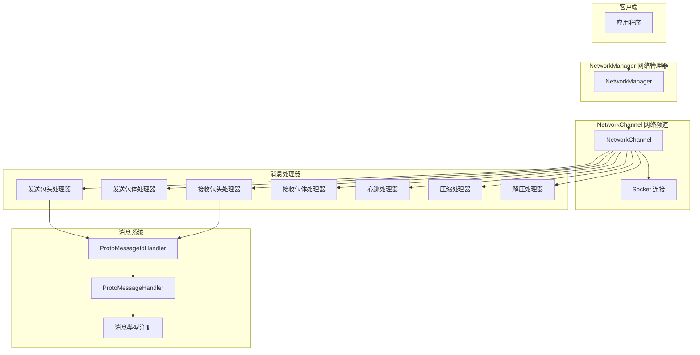
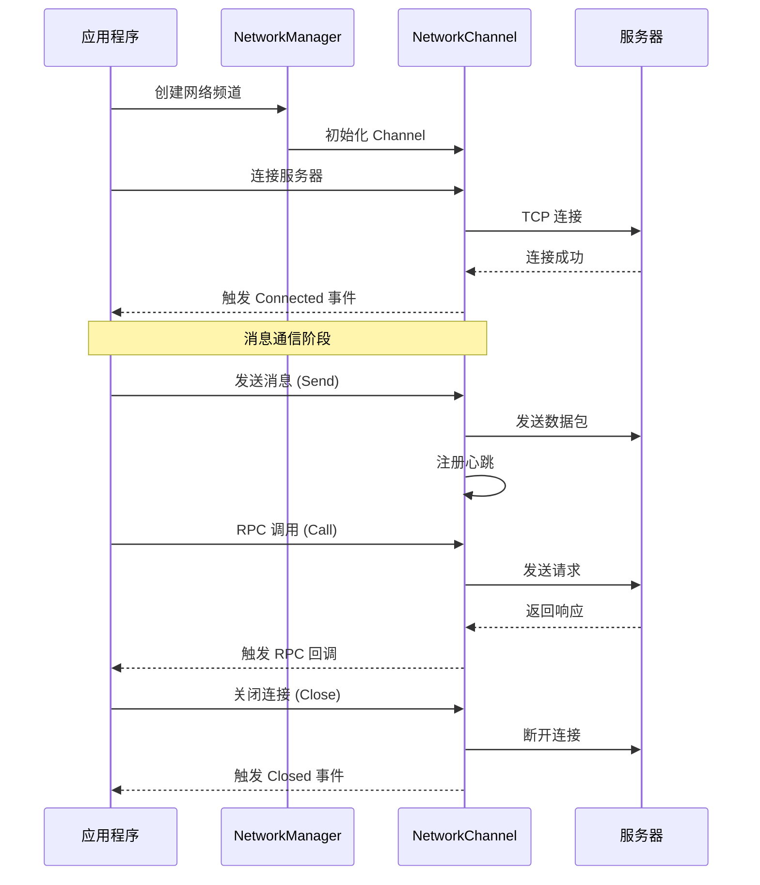
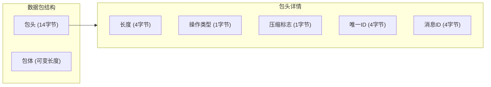

# クイックスタート

このドキュメント将帮助您快速上手 GameFrameX Network 网络コンポーネント，理解する其コアコンセプト并开始ビルド您的网络应用程序。

## 概要

GameFrameX Network 是 GameFrameX 游戏フレームワーク的コア网络コンポーネント，提供 TCP 长连接機能，サポート：
- 基于 TCP 的可靠连接
- Protocol Buffers メッセージシリアライズ
- RPC 远程过程呼び出し
- 心跳检测与自动重连
- メッセージ压缩与解压

## コアアーキテクチャ



## 基本使用フロー



## 定義メッセージタイプ

まず，〜する必要があります定義您的请求和响应メッセージタイプ。メッセージ〜しなければなりません継承自 `MessageObject` 类：

### 请求メッセージ

```csharp
using GameFrameX.Network.Runtime;
using ProtoBuf;

namespace MyGame.Network.Messages
{
    /// <summary>
    /// 登录请求消息
    /// </summary>
    [MessageTypeHandler(1001)]  // 消息ID，不能重复
    [ProtoContract]
    public class C2G_LoginRequest : MessageObject, IRequestMessage
    {
        /// <summary>
        /// 用户名
        /// </summary>
        [ProtoMember(1)]
        public string UserName { get; set; }

        /// <summary>
        /// 密码
        /// </summary>
        [ProtoMember(2)]
        public string Password { get; set; }
    }
}
```

> Source: [MessageObject.cs](https://github.com/GameFrameX/com.gameframex.unity.network/blob/main/Runtime/Network/Base/MessageObject.cs#L15-L56)
> Source: [MessageTypeHandlerAttribute.cs](https://github.com/GameFrameX/com.gameframex.unity.network/blob/main/Runtime/Network/Base/MessageTypeHandlerAttribute.cs#L10-L27)

### 响应メッセージ

```csharp
using GameFrameX.Network.Runtime;
using ProtoBuf;

namespace MyGame.Network.Messages
{
    /// <summary>
    /// 登录响应消息
    /// </summary>
    [MessageTypeHandler(1002)]  // 对应的响应消息ID
    [ProtoContract]
    public class G2C_LoginResponse : MessageObject, IResponseMessage
    {
        /// <summary>
        /// 错误码，0表示成功
        /// </summary>
        [ProtoMember(1)]
        public int ErrorCode { get; set; }

        /// <summary>
        /// 玩家ID
        /// </summary>
        [ProtoMember(2)]
        public long PlayerId { get; set; }

        /// <summary>
        /// 玩家名称
        /// </summary>
        [ProtoMember(3)]
        public string PlayerName { get; set; }
    }
}
```

> Source: [IResponseMessage.cs](https://github.com/GameFrameX/com.gameframex.unity.network/blob/main/Runtime/Network/Base/IResponseMessage.cs#L1-L13)

### 心跳メッセージ

```csharp
using GameFrameX.Network.Runtime;
using ProtoBuf;

namespace MyGame.Network.Messages
{
    /// <summary>
    /// 心跳消息
    /// </summary>
    [MessageTypeHandler(1)]  // 心跳消息ID
    [ProtoContract]
    public class HeartBeatMessage : MessageObject, IHeartBeatMessage
    {
        /// <summary>
        /// 时间戳
        /// </summary>
        [ProtoMember(1)]
        public long Timestamp { get; set; }
    }
}
```

## 作成メッセージ処理器

使用 `MessageHandlerAttribute` 特性来登録メッセージ処理函数：

```csharp
using GameFrameX.Network.Runtime;
using GameFrameX.Runtime;

namespace MyGame.Network.Handlers
{
    /// <summary>
    /// 登录消息处理器
    /// </summary>
    public class LoginMessageHandler : MonoBehaviour
    {
        /// <summary>
        /// 处理登录响应
        /// </summary>
        /// <param name="message">登录响应消息</param>
        [MessageHandler(typeof(G2C_LoginResponse), nameof(OnLoginResponse))]
        private void OnLoginResponse(G2C_LoginResponse message)
        {
            if (message.ErrorCode == 0)
            {
                Debug.Log($"登录成功！玩家ID: {message.PlayerId}, 名称: {message.PlayerName}");
            }
            else
            {
                Debug.LogError($"登录失败，错误码: {message.ErrorCode}");
            }
        }
    }
}
```

> Source: [MessageHandlerAttribute.cs](https://github.com/GameFrameX/com.gameframex.unity.network/blob/main/Runtime/Network/Base/MessageHandlerAttribute.cs#L1-L60)

## 初期化网络コンポーネント

### ステップ 1：初期化メッセージタイプ

在应用程序启动时，〜する必要があります初期化メッセージタイプ映射：

```csharp
using GameFrameX.Network.Runtime;
using GameFrameX.Runtime;
using System.Reflection;

public class GameEntry : MonoBehaviour
{
    public void Awake()
    {
        // 初始化消息ID映射
        ProtoMessageIdHandler.Init(typeof(GameEntry).Assembly);
    }
}
```

> Source: [ProtoMessageIdHandler.cs](https://github.com/GameFrameX/com.gameframex.unity.network/blob/main/Runtime/Network/Network/ProtoMessageIdHandler.cs#L107-L168)

### ステップ 2：作成网络频道

```csharp
using GameFrameX.Network.Runtime;
using GameFrameX.Runtime;

// 获取网络管理器
var networkManager = GameEntry.GetComponent<NetworkManager>();

// 创建网络频道
// 参数说明：
// - channelName: 频道名称，用于标识不同的连接
// - networkChannelHelper: 网络频道辅助器
// - rpcTimeout: RPC 超时时间（毫秒），最小值 3000
var networkChannel = networkManager.CreateNetworkChannel(
    "GameServer",
    new DefaultNetworkChannelHelper(),
    30000  // 30秒超时
);

// 设置心跳间隔（单位：秒）
networkChannel.HeartBeatInterval = 30f;

// 收到消息时重置心跳计时
networkChannel.ResetHeartBeatElapseSecondsWhenReceivePacket = true;
```

> Source: [NetworkManager.cs](https://github.com/GameFrameX/com.gameframex.unity.network/blob/main/Runtime/Network/Network/NetworkManager.cs#L196-L223)

### ステップ 3：購読网络イベント

```csharp
using GameFrameX.Network.Runtime;
using GameFrameX.Runtime;

// 获取网络管理器
var networkManager = GameEntry.GetComponent<NetworkManager>();

// 订阅连接成功事件
networkManager.NetworkConnected += OnNetworkConnected;

// 订阅连接关闭事件
networkManager.NetworkClosed += OnNetworkClosed;

// 订阅心跳丢失事件
networkManager.NetworkMissHeartBeat += OnNetworkMissHeartBeat;

// 订阅网络错误事件
networkManager.NetworkError += OnNetworkError;

private void OnNetworkConnected(object sender, NetworkConnectedEventArgs e)
{
    Debug.Log($"网络连接成功: {e.NetworkChannel.Name}");
    // 可以在这里处理连接成功后的逻辑
}

private void OnNetworkClosed(object sender, NetworkClosedEventArgs e)
{
    Debug.Log($"网络连接关闭: {e.NetworkChannel.Name}, 原因: {e.Reason}, 错误码: {e.ErrorCode}");
    // 可以在这里处理断线重连逻辑
}

private void OnNetworkMissHeartBeat(object sender, NetworkMissHeartBeatEventArgs e)
{
    Debug.LogWarning($"心跳丢失: {e.NetworkChannel.Name}, 丢失次数: {e.MissCount}");
}

private void OnNetworkError(object sender, NetworkErrorEventArgs e)
{
    Debug.LogError($"网络错误: {e.NetworkChannel.Name}, 错误码: {e.ErrorCode}, 错误信息: {e.ErrorMessage}");
}
```

> Source: [NetworkConnectedEventArgs.cs](https://github.com/GameFrameX/com.gameframex.unity.network/blob/main/Runtime/EventArgs/NetworkConnectedEventArgs.cs#L40-L98)

### ステップ 4：连接到服务器

```csharp
using System;

// 创建 Uri
var address = new Uri("tcp://127.0.0.1:8888");

// 获取网络频道并连接
var networkChannel = networkManager.GetNetworkChannel("GameServer");
networkChannel.Connect(address, "用户数据");
```

> Source: [INetworkChannel.cs](https://github.com/GameFrameX/com.gameframex.unity.network/blob/main/Runtime/Network/Interface/INetworkChannel.cs#L207-L212)

## 发送メッセージ

### 单向发送（无需等待响应）

```csharp
using MyGame.Network.Messages;

// 创建消息对象
var request = new C2G_LoginRequest
{
    UserName = "player1",
    Password = "123456"
};

// 发送消息
networkChannel.Send(request);
```

> Source: [INetworkChannel.cs](https://github.com/GameFrameX/com.gameframex.unity.network/blob/main/Runtime/Network/Interface/INetworkChannel.cs#L228-L233)

### RPC 呼び出し（等待响应）

```csharp
using MyGame.Network.Messages;
using System.Threading.Tasks;

// 创建请求消息
var request = new C2G_LoginRequest
{
    UserName = "player1",
    Password = "123456"
};

// 发送 RPC 请求并等待响应
var response = await networkChannel.Call<G2C_LoginResponse>(request);

// 处理响应
if (response.ErrorCode == 0)
{
    Debug.Log($"登录成功，玩家ID: {response.PlayerId}");
}
else
{
    Debug.LogError($"登录失败，错误码: {response.ErrorCode}");
}
```

> Source: [INetworkChannel.cs](https://github.com/GameFrameX/com.gameframex.unity.network/blob/main/Runtime/Network/Interface/INetworkChannel.cs#L235-L242)

### 忽略エラー码的 RPC 呼び出し

```csharp
// 设置 isIgnoreErrorCode = true 时，即使服务器返回错误码也不会抛出异常
var response = await networkChannel.Call<G2C_LoginResponse>(request, isIgnoreErrorCode: true);
```

## 閉じる连接

```csharp
// 关闭网络频道
// 参数：关闭原因，错误码
networkChannel.Close("用户主动关闭", 0);

// 或者通过管理器销毁
networkManager.DestroyNetworkChannel("GameServer");
```

> Source: [INetworkChannel.cs](https://github.com/GameFrameX/com.gameframex.unity.network/blob/main/Runtime/Network/Interface/INetworkChannel.cs#L221-L226)

## 完全な例

以下は完全な的客户端例，表示了从连接到处发送メッセージ的完全なフロー：

```csharp
using GameFrameX.Network.Runtime;
using GameFrameX.Runtime;
using MyGame.Network.Messages;
using System;
using System.Threading.Tasks;
using UnityEngine;

public class NetworkExample : MonoBehaviour
{
    private NetworkManager _networkManager;
    private INetworkChannel _channel;

    private void Start()
    {
        // 1. 初始化消息类型映射
        ProtoMessageIdHandler.Init(typeof(NetworkExample).Assembly);

        // 2. 获取网络管理器
        _networkManager = GameEntry.GetComponent<NetworkManager>();

        // 3. 订阅网络事件
        _networkManager.NetworkConnected += OnConnected;
        _networkManager.NetworkClosed += OnClosed;
        _networkManager.NetworkMissHeartBeat += OnMissHeartBeat;
        _networkManager.NetworkError += OnError;

        // 4. 创建网络频道
        _channel = _networkManager.CreateNetworkChannel(
            "GameServer",
            new DefaultNetworkChannelHelper(),
            30000
        );

        // 5. 设置心跳
        _channel.HeartBeatInterval = 30f;
        _channel.ResetHeartBeatElapseSecondsWhenReceivePacket = true;

        // 6. 连接服务器
        _channel.Connect(new Uri("tcp://127.0.0.1:8888"));
    }

    private async void Login(string userName, string password)
    {
        if (_channel == null || !_channel.Connected)
        {
            Debug.LogError("未连接到服务器");
            return;
        }

        var request = new C2G_LoginRequest
        {
            UserName = userName,
            Password = password
        };

        try
        {
            var response = await _channel.Call<G2C_LoginResponse>(request);
            if (response.ErrorCode == 0)
            {
                Debug.Log($"登录成功！玩家ID: {response.PlayerId}");
            }
            else
            {
                Debug.LogError($"登录失败，错误码: {response.ErrorCode}");
            }
        }
        catch (Exception ex)
        {
            Debug.LogError($"RPC 调用失败: {ex.Message}");
        }
    }

    private void OnConnected(object sender, NetworkConnectedEventArgs e)
    {
        Debug.Log($"已连接到: {e.NetworkChannel.Name}");
    }

    private void OnClosed(object sender, NetworkClosedEventArgs e)
    {
        Debug.Log($"连接已关闭: {e.Reason}");
    }

    private void OnMissHeartBeat(object sender, NetworkMissHeartBeatEventArgs e)
    {
        Debug.LogWarning($"心跳丢失次数: {e.MissCount}");
    }

    private void OnError(object sender, NetworkErrorEventArgs e)
    {
        Debug.LogError($"网络错误: {e.ErrorMessage}");
    }

    private void OnDestroy()
    {
        if (_channel != null)
        {
            _channel.Close("客户端销毁");
        }
    }
}
```

## メッセージ协议フォーマット

网络コンポーネント使用自定義的二进制协议フォーマット，パッケージ含 14 字节的パッケージ头：



| フィールド | 长度 | 説明 |
|------|------|------|
| PacketLength | 4 字节 | 整个数据パッケージ的长度（网络字节序） |
| OperationType | 1 字节 | 操作タイプ：1=心跳，4=普通メッセージ |
| ZipFlag | 1 字节 | 压缩标志：0=未压缩，1=已压缩 |
| UniqueId | 4 字节 | メッセージ唯一编号，用于 RPC 匹配 |
| MessageId | 4 字节 | メッセージタイプ ID |

> Source: [DefaultPacketSendHeaderHandler.cs](https://github.com/GameFrameX/com.gameframex.unity.network/blob/main/Runtime/Network/Helper/DefaultPacketSendHeaderHandler.cs#L38-L44)

## 設定オプション

### NetworkChannel 設定

通过 `INetworkChannel` インターフェース〜できます設定以下オプション：

| プロパティ | タイプ | デフォルト值 | 説明 |
|------|------|--------|------|
| HeartBeatInterval | float | 30f | 心跳发送间隔（秒） |
| ResetHeartBeatElapseSecondsWhenReceivePacket | bool | true | 收到メッセージ时是否重置心跳计时 |
| PacketSendHeaderHandler | IPacketSendHeaderHandler | DefaultPacketSendHeaderHandler | 发送パッケージ头処理器 |
| PacketSendBodyHandler | IPacketSendBodyHandler | - | 发送パッケージ体処理器 |
| PacketReceiveHeaderHandler | IPacketReceiveHeaderHandler | DefaultPacketReceiveHeaderHandler | 受信パッケージ头処理器 |
| PacketReceiveBodyHandler | IPacketReceiveBodyHandler | - | 受信パッケージ体処理器 |
| MessageCompressHandler | IMessageCompressHandler | - | メッセージ压缩処理器 |
| MessageDecompressHandler | IMessageDecompressHandler | - | メッセージ解压処理器 |

> Source: [INetworkChannel.cs](https://github.com/GameFrameX/com.gameframex.unity.network/blob/main/Runtime/Network/Interface/INetworkChannel.cs#L42-L132)

## 関連リンク

- [概要](./1-overview) - 理解する更多关于网络コンポーネント的整体設計
- [インストール](./2-installation) - インストール和設定网络コンポーネント
- [网络マネージャー](./4-core-concepts.1-network-manager) - NetworkManager 詳細 API
- [网络频道](./4-core-concepts.2-network-channel) - NetworkChannel 詳細 API
- [メッセージタイプ](./4-core-concepts.3-message-types) - メッセージタイプ系统详解
- [数据パッケージ処理器](./4-core-concepts.4-packet-handlers) - 数据パッケージ処理机制
- [心跳机制](./5-heartbeat) - 心跳检测机制详解
- [イベント系统](./6-events) - 网络イベント系统
- [メッセージ压缩](./7-message-compression) - メッセージ压缩設定
- [RPC 远程呼び出し](./8-rpc) - RPC 呼び出し机制
- [常见問題](./10-troubleshooting) - 常见問題与解決策
