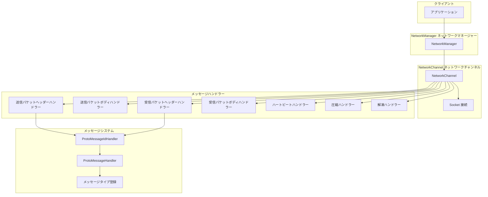
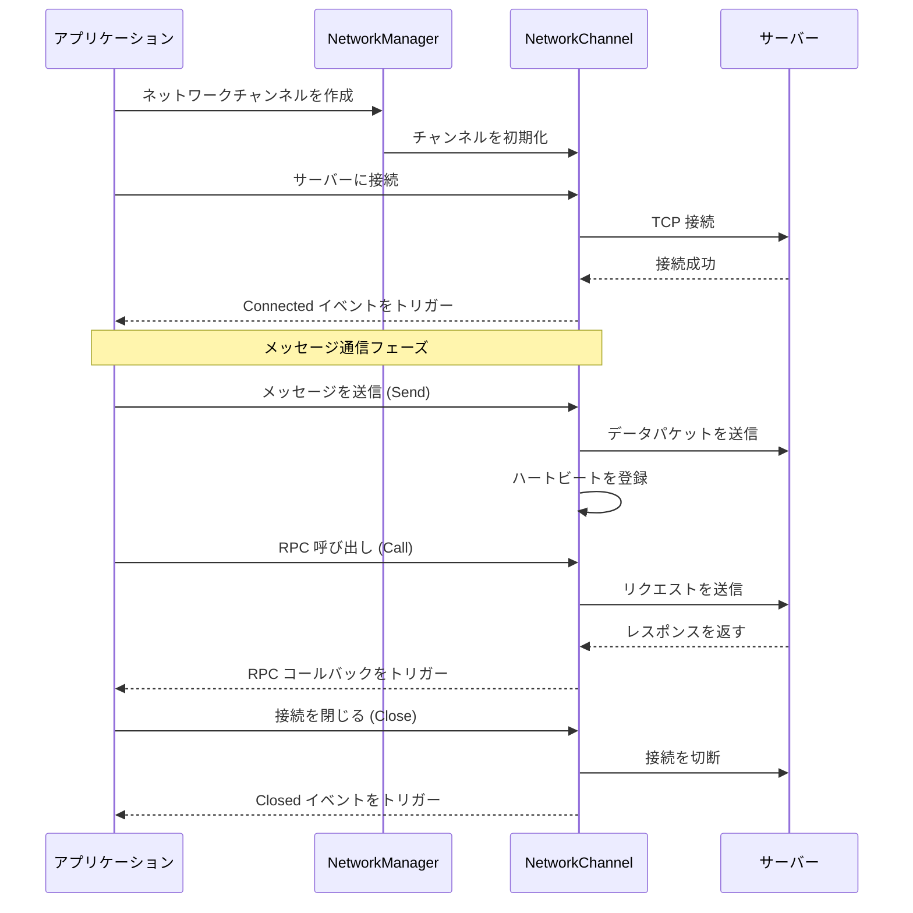
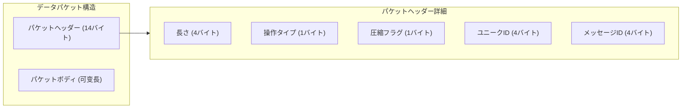

# クイックスタート

このドキュメントは、GameFrameX Network ネットワークコンポーネントのクイックスタートを支援し、コアコンセプトを理解し、ネットワークアプリケーションの構築を開始するのに役立ちます。

## 概要

GameFrameX Network は GameFrameX ゲームフレームワークのコアネットワークコンポーネントであり、TCP ロングポーリング機能を提供します：
- TCP に基づく可靠接続
- Protocol Buffers メッセージシリアライゼーション
- RPC リモートプロシージャ呼び出し
- ハートビート検出と自動再接続
- メッセージ圧縮と解凍

## コアアーキテクチャ



## 基本的な使用フロー



## メッセージタイプを定義する

まず、リクエストとレスポンスのメッセージタイプを定義する必要があります。メッセージは `MessageObject` クラスを継承する必要があります：

### リクエストメッセージ

```csharp
using GameFrameX.Network.Runtime;
using ProtoBuf;

namespace MyGame.Network.Messages
{
    /// <summary>
    /// ログインリクエストメッセージ
    /// </summary>
    [MessageTypeHandler(1001)]  // メッセージID、重複不可
    [ProtoContract]
    public class C2G_LoginRequest : MessageObject, IRequestMessage
    {
        /// <summary>
        /// ユーザー名
        /// </summary>
        [ProtoMember(1)]
        public string UserName { get; set; }

        /// <summary>
        /// パスワード
        /// </summary>
        [ProtoMember(2)]
        public string Password { get; set; }
    }
}
```

> Source: [MessageObject.cs](https://github.com/GameFrameX/com.gameframex.unity.network/blob/main/Runtime/Network/Base/MessageObject.cs#L15-L56)
> Source: [MessageTypeHandlerAttribute.cs](https://github.com/GameFrameX/com.gameframex.unity.network/blob/main/Runtime/Network/Base/MessageTypeHandlerAttribute.cs#L10-L27)

### レスポンスメッセージ

```csharp
using GameFrameX.Network.Runtime;
using ProtoBuf;

namespace MyGame.Network.Messages
{
    /// <summary>
    /// ログインレスポンスメッセージ
    /// </summary>
    [MessageTypeHandler(1002)]  // 対応するレスポンスメッセージID
    [ProtoContract]
    public class G2C_LoginResponse : MessageObject, IResponseMessage
    {
        /// <summary>
        /// エラーコード、0は成功を意味します
        /// </summary>
        [ProtoMember(1)]
        public int ErrorCode { get; set; }

        /// <summary>
        /// プレイヤーID
        /// </summary>
        [ProtoMember(2)]
        public long PlayerId { get; set; }

        /// <summary>
        /// プレイヤー名
        /// </summary>
        [ProtoMember(3)]
        public string PlayerName { get; set; }
    }
}
```

> Source: [IResponseMessage.cs](https://github.com/GameFrameX/com.gameframex.unity.network/blob/main/Runtime/Network/Base/IResponseMessage.cs#L1-L13)

### ハートビートメッセージ

```csharp
using GameFrameX.Network.Runtime;
using ProtoBuf;

namespace MyGame.Network.Messages
{
    /// <summary>
    /// ハートビートメッセージ
    /// </summary>
    [MessageTypeHandler(1)]  // ハートビートメッセージID
    [ProtoContract]
    public class HeartBeatMessage : MessageObject, IHeartBeatMessage
    {
        /// <summary>
        /// タイムスタンプ
        /// </summary>
        [ProtoMember(1)]
        public long Timestamp { get; set; }
    }
}
```

## メッセージハンドラーを作成する

`MessageHandlerAttribute` 特性を使用して、メッセージ処理関数を登録します：

```csharp
using GameFrameX.Network.Runtime;
using GameFrameX.Runtime;

namespace MyGame.Network.Handlers
{
    /// <summary>
    /// ログインessage handler
    /// </summary>
    public class LoginMessageHandler : MonoBehaviour
    {
        /// <summary>
        /// ログインレスポンスを処理
        /// </summary>
        /// <param name="message">ログインレスポンスメッセージ</param>
        [MessageHandler(typeof(G2C_LoginResponse), nameof(OnLoginResponse))]
        private void OnLoginResponse(G2C_LoginResponse message)
        {
            if (message.ErrorCode == 0)
            {
                Debug.Log($"ログイン成功！プレイヤーID: {message.PlayerId}, 名前: {message.PlayerName}");
            }
            else
            {
                Debug.LogError($"ログイン失敗、エラーコード: {message.ErrorCode}");
            }
        }
    }
}
```

> Source: [MessageHandlerAttribute.cs](https://github.com/GameFrameX/com.gameframex.unity.network/blob/main/Runtime/Network/Base/MessageHandlerAttribute.cs#L1-L60)

## ネットワークコンポーネントを初期化する

### ステップ1：メッセージタイプを初期化する

アプリケーション起動時に、メッセージタイプのマッピングを初期化する必要があります：

```csharp
using GameFrameX.Network.Runtime;
using GameFrameX.Runtime;
using System.Reflection;

public class GameEntry : MonoBehaviour
{
    public void Awake()
    {
        // メッセージIDマッピングを初期化
        ProtoMessageIdHandler.Init(typeof(GameEntry).Assembly);
    }
}
```

> Source: [ProtoMessageIdHandler.cs](https://github.com/GameFrameX/com.gameframex.unity.network/blob/main/Runtime/Network/Network/ProtoMessageIdHandler.cs#L107-L168)

### ステップ2：ネットワークチャンネルを作成する

```csharp
using GameFrameX.Network.Runtime;
using GameFrameX.Runtime;

// ネットワークマネージャーを取得
var networkManager = GameEntry.GetComponent<NetworkManager>();

// ネットワークチャンネルを作成
// パラメータ説明：
// - channelName: チャンネル名、異なる接続を識別するために使用
// - networkChannelHelper: ネットワークチャンネルヘルパー
// - rpcTimeout: RPC タイムアウト時間（ミリ秒）、最小値 3000
var networkChannel = networkManager.CreateNetworkChannel(
    "GameServer",
    new DefaultNetworkChannelHelper(),
    30000  // 30秒タイムアウト
);

// ハートビート間隔を設定（単位：秒）
networkChannel.HeartBeatInterval = 30f;

// メッセージ受信時にハートビートタイマーをリセット
networkChannel.ResetHeartBeatElapseSecondsWhenReceivePacket = true;
```

> Source: [NetworkManager.cs](https://github.com/GameFrameX/com.gameframex.unity.network/blob/main/Runtime/Network/Network/NetworkManager.cs#L196-L223)

### ステップ3：ネットワークイベントを購読する

```csharp
using GameFrameX.Network.Runtime;
using GameFrameX.Runtime;

// ネットワークマネージャーを取得
var networkManager = GameEntry.GetComponent<NetworkManager>();

// 接続成功イベントを購読
networkManager.NetworkConnected += OnNetworkConnected;

// 接続关闭イベントを購読
networkManager.NetworkClosed += OnNetworkClosed;

// ハートビート丢失イベントを購読
networkManager.NetworkMissHeartBeat += OnNetworkMissHeartBeat;

// ネットワークエラーイベントを購読
networkManager.NetworkError += OnNetworkError;

private void OnNetworkConnected(object sender, NetworkConnectedEventArgs e)
{
    Debug.Log($"ネットワーク接続成功: {e.NetworkChannel.Name}");
    // 接続成功後のロジックを処理できます
}

private void OnNetworkClosed(object sender, NetworkClosedEventArgs e)
{
    Debug.Log($"ネットワーク接続关闭: {e.NetworkChannel.Name}, 理由: {e.Reason}, エラーコード: {e.ErrorCode}");
    // オフライン再接続ロジックを処理できます
}

private void OnNetworkMissHeartBeat(object sender, NetworkMissHeartBeatEventArgs e)
{
    Debug.LogWarning($"ハートビート丢失: {e.NetworkChannel.Name}, 丢失回数: {e.MissCount}");
}

private void OnNetworkError(object sender, NetworkErrorEventArgs e)
{
    Debug.LogError($"ネットワークエラー: {e.NetworkChannel.Name}, エラーコード: {e.ErrorCode}, エラーメッセージ: {e.ErrorMessage}");
}
```

> Source: [NetworkConnectedEventArgs.cs](https://github.com/GameFrameX/com.gameframex.unity.network/blob/main/Runtime/EventArgs/NetworkConnectedEventArgs.cs#L40-L98)

### ステップ4：サーバーに接続する

```csharp
using System;

// Uri を作成
var address = new Uri("tcp://127.0.0.1:8888");

// ネットワークチャンネルを取得して接続
var networkChannel = networkManager.GetNetworkChannel("GameServer");
networkChannel.Connect(address, "ユーザーデータ");
```

> Source: [INetworkChannel.cs](https://github.com/GameFrameX/com.gameframex.unity.network/blob/main/Runtime/Network/Interface/INetworkChannel.cs#L207-L212)

## メッセージを送信する

### 一方向送信（レスポンスを待機しない）

```csharp
using MyGame.Network.Messages;

// メッセージオブジェクトを作成
var request = new C2G_LoginRequest
{
    UserName = "player1",
    Password = "123456"
};

// メッセージを送信
networkChannel.Send(request);
```

> Source: [INetworkChannel.cs](https://github.com/GameFrameX/com.gameframex.unity.network/blob/main/Runtime/Network/Interface/INetworkChannel.cs#L228-L233)

### RPC 呼び出し（レスポンスを待機）

```csharp
using MyGame.Network.Messages;
using System.Threading.Tasks;

// リクエストメッセージを作成
var request = new C2G_LoginRequest
{
    UserName = "player1",
    Password = "123456"
};

// RPC リクエストを送信し、レスポンスを待機
var response = await networkChannel.Call<G2C_LoginResponse>(request);

// レスポンスを処理
if (response.ErrorCode == 0)
{
    Debug.Log($"ログイン成功、プレイヤーID: {response.PlayerId}");
}
else
{
    Debug.LogError($"ログイン失敗、エラーコード: {response.ErrorCode}");
}
```

> Source: [INetworkChannel.cs](https://github.com/GameFrameX/com.gameframex.unity.network/blob/main/Runtime/Network/Interface/INetworkChannel.cs#L235-L242)

### エラーコードを無視する RPC 呼び出し

```csharp
// isIgnoreErrorCode = true を設定すると、サーバーがエラーコードを返しても例外をスローしません
var response = await networkChannel.Call<G2C_LoginResponse>(request, isIgnoreErrorCode: true);
```

## 接続を閉じる

```csharp
// ネットワークチャンネルを閉じる
// パラメータ：閉じる理由、エラーコード
networkChannel.Close("ユーザーが自ら閉じる", 0);

// またはマネージャー経由で破棄
networkManager.DestroyNetworkChannel("GameServer");
```

> Source: [INetworkChannel.cs](https://github.com/GameFrameX/com.gameframex.unity.network/blob/main/Runtime/Network/Interface/INetworkChannel.cs#L221-L226)

## 完全な例

以下は、接続からメッセージ送信までの完全なフローを示した完全なクライアント例です：

```csharp
using GameFrameX.Network.Runtime;
using GameFrameX.Runtime;
using MyGame.Network.Messages;
using System;
using System.Threading.Tasks;
using UnityEngine;

public class NetworkExample : MonoBehaviour
{
    private NetworkManager _networkManager;
    private INetworkChannel _channel;

    private void Start()
    {
        // 1. メッセージタイプマッピングを初期化
        ProtoMessageIdHandler.Init(typeof(NetworkExample).Assembly);

        // 2. ネットワークマネージャーを取得
        _networkManager = GameEntry.GetComponent<NetworkManager>();

        // 3. ネットワークイベントを購読
        _networkManager.NetworkConnected += OnConnected;
        _networkManager.NetworkClosed += OnClosed;
        _networkManager.NetworkMissHeartBeat += OnMissHeartBeat;
        _networkManager.NetworkError += OnError;

        // 4. ネットワークチャンネルを作成
        _channel = _networkManager.CreateNetworkChannel(
            "GameServer",
            new DefaultNetworkChannelHelper(),
            30000
        );

        // 5. ハートビートを設定
        _channel.HeartBeatInterval = 30f;
        _channel.ResetHeartBeatElapseSecondsWhenReceivePacket = true;

        // 6. サーバーに接続
        _channel.Connect(new Uri("tcp://127.0.0.1:8888"));
    }

    private async void Login(string userName, string password)
    {
        if (_channel == null || !_channel.Connected)
        {
            Debug.LogError("サーバーに接続されていません");
            return;
        }

        var request = new C2G_LoginRequest
        {
            UserName = userName,
            Password = password
        };

        try
        {
            var response = await _channel.Call<G2C_LoginResponse>(request);
            if (response.ErrorCode == 0)
            {
                Debug.Log($"ログイン成功！プレイヤーID: {response.PlayerId}");
            }
            else
            {
                Debug.LogError($"ログイン失敗、エラーコード: {response.ErrorCode}");
            }
        }
        catch (Exception ex)
        {
            Debug.LogError($"RPC 呼び出し失敗: {ex.Message}");
        }
    }

    private void OnConnected(object sender, NetworkConnectedEventArgs e)
    {
        Debug.Log($"接続先: {e.NetworkChannel.Name}");
    }

    private void OnClosed(object sender, NetworkClosedEventArgs e)
    {
        Debug.Log($"接続が关闭されました: {e.Reason}");
    }

    private void OnMissHeartBeat(object sender, NetworkMissHeartBeatEventArgs e)
    {
        Debug.LogWarning($"ハートビート丢失回数: {e.MissCount}");
    }

    private void OnError(object sender, NetworkErrorEventArgs e)
    {
        Debug.LogError($"ネットワークエラー: {e.ErrorMessage}");
    }

    private void OnDestroy()
    {
        if (_channel != null)
        {
            _channel.Close("クライアント破棄");
        }
    }
}
```

## メッセージプロトコルフォーマット

ネットワークコンポーネントは14バイトのパケットヘッダーを含むカスタムバイナリプロトコルフォーマットを使用します：



| フィールド | 長さ | 説明 |
|------|------|------|
| PacketLength | 4 バイト | 整个データパケットの長さ（ネットワークバイト順） |
| OperationType | 1 バイト | 操作タイプ：1=ハートビート、4=通常メッセージ |
| ZipFlag | 1 バイト | 圧縮フラグ：0=未圧縮、1=圧縮済み |
| UniqueId | 4 バイト | メッセージユニーク番号、RPC マッチング用 |
| MessageId | 4 バイト | メッセージタイプ ID |

> Source: [DefaultPacketSendHeaderHandler.cs](https://github.com/GameFrameX/com.gameframex.unity.network/blob/main/Runtime/Network/Helper/DefaultPacketSendHeaderHandler.cs#L38-L44)

## 設定オプション

### NetworkChannel 設定

`INetworkChannel` インターフェースを通じて以下のオプションを設定できます：

| プロパティ | タイプ | デフォルト値 | 説明 |
|------|------|--------|------|
| HeartBeatInterval | float | 30f | ハートビート送信間隔（秒） |
| ResetHeartBeatElapseSecondsWhenReceivePacket | bool | true | メッセージ受信時にハートビートタイマーをリセットするかどうか |
| PacketSendHeaderHandler | IPacketSendHeaderHandler | DefaultPacketSendHeaderHandler | 送信パケットヘッダーハンドラー |
| PacketSendBodyHandler | IPacketSendBodyHandler | - | 送信パケットボディハンドラー |
| PacketReceiveHeaderHandler | IPacketReceiveHeaderHandler | DefaultPacketReceiveHeaderHandler | 受信パケットヘッダーハンドラー |
| PacketReceiveBodyHandler | IPacketReceiveBodyHandler | - | 受信パケットボディハンドラー |
| MessageCompressHandler | IMessageCompressHandler | - | メッセージ圧縮ハンドラー |
| MessageDecompressHandler | IMessageDecompressHandler | - | メッセージ解凍ハンドラー |

> Source: [INetworkChannel.cs](https://github.com/GameFrameX/com.gameframex.unity.network/blob/main/Runtime/Network/Interface/INetworkChannel.cs#L42-L132)

## 関連リンク

- [概要](./1-overview) - ネットワークコンポーネントの全体設計の詳細
- [インストール](./2-installation) - ネットワークコンポーネントのインストールと設定
- [ネットワークマネージャー](./4-core-concepts.1-network-manager) - NetworkManager 詳細 API
- [ネットワークチャンネル](./4-core-concepts.2-network-channel) - NetworkChannel 詳細 API
- [メッセージタイプ](./4-core-concepts.3-message-types) - メッセージタイプシステムの詳細
- [パケットハンドラー](./4-core-concepts.4-packet-handlers) - データパケット処理メカニズム
- [ハートビート](./5-heartbeat) - ハートビート検出メカニズムの詳細
- [イベントシステム](./6-events) - ネットワークイベントシステム
- [メッセージ圧縮](./7-message-compression) - メッセージ圧縮設定
- [RPC リモート呼び出し](./8-rpc) - RPC 呼び出しメカニズム
- [トラブルシューティング](./10-troubleshooting) - よくある問題と解決策
