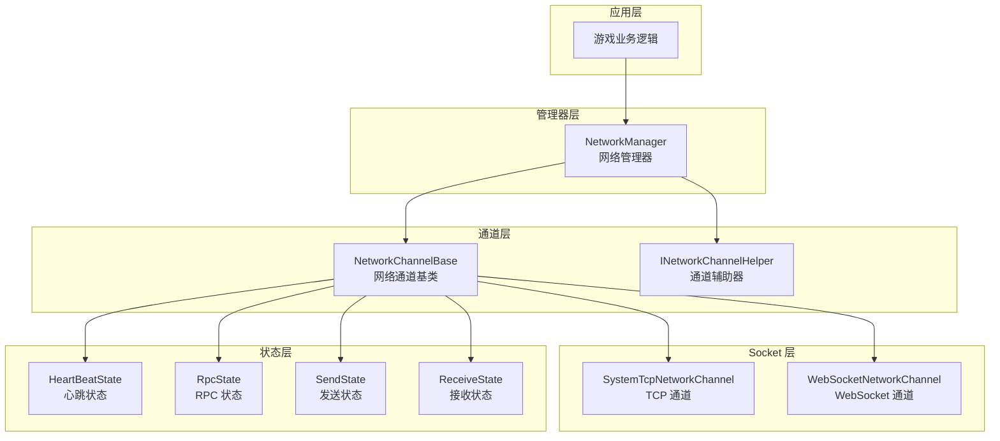
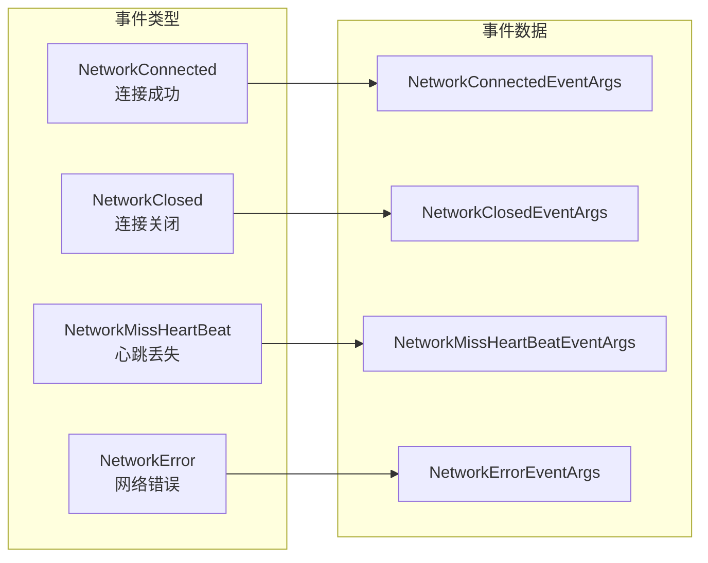

# 网络マネージャー

NetworkManager 是 GameFrameX 网络モジュール的コアコンポーネント，负责統一された管理游戏中的所有网络连接通道。它提供します网络频道作成与破棄、连接ステータス管理、心跳检测、RPC 远程呼び出し等コア機能。

## 概要

网络マネージャー作为 GameFrameX フレームワーク的网络层コア，扮演着连接游戏客户端与服务器的关键角色。其設計理念是提供一个統一された、シンプル且強力的网络抽象層，让開発者〜できます专注于业务逻辑而不必关心底层网络通信细节。

### コア职责

NetworkManager 的主な职责含みます：

1. **多通道管理**：サポート同時に维护多个独立的网络通道，每个通道〜できます连接到不同的服务器
2. **连接ライフサイクル**：管理网络连接的建立、保持和閉じる过程
3. **心跳检测**：通过定时发送心跳パッケージ检测连接健康ステータス，自动処理断开连接
4. **RPC 调度**：カプセル化远程过程呼び出し的请求/响应机制，サポート异步等待服务器返す
5. **イベント通知**：通过イベント系统向业务层通知网络ステータス变化

### 設計理念

NetworkManager 采用了以下設計原则：

- **モジュール化設計**：将网络通道、心跳、RPC 等機能分离为独立ステータス类，便于维护和拡張
- **イベント驱动**：使用イベント机制解耦网络ステータス变化与业务処理
- **統一されたインターフェース**：通过 INetworkChannel インターフェース抽象不同的网络実装（TCP/WebSocket）
- **自动管理**：在游戏主循环中自动アップデート所有网络通道，减少手动轮询负担

## アーキテクチャ

NetworkManager 采用分层アーキテクチャ設計，从上到下分为以下几个层次：



### コンポーネント説明

| コンポーネント | 説明 |
|------|------|
| NetworkManager | 网络マネージャー主类，负责管理所有网络通道的ライフサイクル |
| NetworkChannelBase | 网络通道抽象基底クラス，カプセル化 Socket 操作和メッセージ処理逻辑 |
| INetworkChannelHelper | 通道辅助器インターフェース，负责メッセージ的シリアライズ和反シリアライズ |
| HeartBeatState | 心跳ステータス类，管理心跳计时和丢失计数 |
| RpcState | RPC ステータス类，管理等待响应的 RPC 请求和超时処理 |
| SendState | 发送ステータス类，管理待发送メッセージ队列 |
| ReceiveState | 受信ステータス类，管理受信缓冲区和数据パッケージ解析 |

### メッセージ処理フロー


## コア機能

### 网络通道管理

NetworkManager 使用字典结构存储所有网络通道，サポート通过通道名称进行快速检索：

```csharp
// 创建网络通道
INetworkChannel channel = networkManager.CreateNetworkChannel("MainServer", channelHelper, 30000);

// 检查通道是否存在
if (networkManager.HasNetworkChannel("MainServer"))
{
    // 获取通道
    INetworkChannel channel = networkManager.GetNetworkChannel("MainServer");
}

// 获取所有通道
INetworkChannel[] channels = networkManager.GetAllNetworkChannels();

// 销毁通道
networkManager.DestroyNetworkChannel("MainServer");
```

> Source: [NetworkManager.cs](https://github.com/GameFrameX/com.gameframex.unity.network/blob/main/Runtime/Network/Network/NetworkManager.cs#L203-L247)

### 连接管理

网络通道サポート连接到远程服务器，并提供完善的连接ステータス管理：

```csharp
// 连接到服务器
channel.Connect(new Uri("tcp://127.0.0.1:8888"), userData);

// 关闭连接
channel.Close("主动关闭");
```

> Source: [NetworkManager.NetworkChannelBase.cs](https://github.com/GameFrameX/com.gameframex.unity.network/blob/main/Runtime/Network/Network/NetworkManager.NetworkChannelBase.cs#L638-L756)

### RPC 远程呼び出し

NetworkManager 提供します基于 Task 的异步 RPC 呼び出し机制，サポート等待服务器响应：

```csharp
// 发送 RPC 请求并等待响应
var request = new C2S_LoginRequest { Username = "test", Password = "123" };
var response = await channel.Call<C2S_LoginResponse>(request);

// 设置 RPC 回调
channel.SetRPCStartHandler((sender, msg) => { 
    Debug.Log($"RPC 开始: {msg.GetType().Name}");
});

channel.SetRPCEndHandler((sender, msg) => { 
    Debug.Log($"RPC 结束: {msg.GetType().Name}");
});

channel.SetRPCErrorHandler((sender, msg) => { 
    Debug.Log($"RPC 错误: {msg.GetType().Name}");
});
```

> Source: [NetworkManager.RpcState.cs](https://github.com/GameFrameX/com.gameframex.unity.network/blob/main/Runtime/Network/Network/NetworkManager.RpcState.cs#L125-L144)

### 心跳检测

网络通道内置心跳检测机制，当丢失心跳达到阈值时自动断开连接：

```csharp
// 设置心跳间隔（秒）
channel.HeartBeatInterval = 30f;

// 设置收到消息时重置心跳计时
channel.ResetHeartBeatElapseSecondsWhenReceivePacket = true;

// 设置失去焦点时是否发送心跳
networkManager.SetFocusHeartbeat(true);
```

> Source: [NetworkManager.NetworkChannelBase.cs](https://github.com/GameFrameX/com.gameframex.unity.network/blob/main/Runtime/Network/Network/NetworkManager.NetworkChannelBase.cs#L293-L311)

## イベント系统

NetworkManager 提供します完全な的イベント系统，用于通知网络ステータス变化：



### イベントタイプ説明

| イベント | 説明 | イベントパラメータ |
|------|------|----------|
| NetworkConnected | 成功连接到服务器时トリガー | NetworkConnectedEventArgs |
| NetworkClosed | 连接閉じる时トリガー | NetworkClosedEventArgs |
| NetworkMissHeartBeat | 心跳丢失时トリガー | NetworkMissHeartBeatEventArgs |
| NetworkError | 发生网络エラー时トリガー | NetworkErrorEventArgs |

### イベント購読例

```csharp
// 订阅连接成功事件
networkManager.NetworkConnected += OnNetworkConnected;

// 订阅连接关闭事件
networkManager.NetworkClosed += OnNetworkClosed;

// 订阅心跳丢失事件
networkManager.NetworkMissHeartBeat += OnNetworkMissHeartBeat;

// 订阅网络错误事件
networkManager.NetworkError += OnNetworkError;

private void OnNetworkConnected(object sender, NetworkConnectedEventArgs e)
{
    Debug.Log($"连接成功: {e.NetworkChannel.Name}");
}

private void OnNetworkClosed(object sender, NetworkClosedEventArgs e)
{
    Debug.Log($"连接关闭: {e.NetworkChannel.Name}, 原因: {e.Reason}, 错误码: {e.ErrorCode}");
}

private void OnNetworkMissHeartBeat(object sender, NetworkMissHeartBeatEventArgs e)
{
    Debug.Log($"心跳丢失次数: {e.MissHeartBeatCount}");
}

private void OnNetworkError(object sender, NetworkErrorEventArgs e)
{
    Debug.Log($"网络错误: {e.ErrorCode}, 消息: {e.ErrorMessage}");
}
```

> Source: [NetworkConnectedEventArgs.cs](https://github.com/GameFrameX/com.gameframex.unity.network/blob/main/Runtime/EventArgs/NetworkConnectedEventArgs.cs)

## 数据パッケージ処理器

NetworkManager 通过可插拔的処理器机制処理数据パッケージ的发送和受信：

```csharp
// 注册发送头处理器
channel.RegisterHandler(new DefaultPacketSendHeaderHandler());

// 注册发送体处理器
channel.RegisterHandler(new DefaultPacketSendBodyHandler());

// 注册接收头处理器
channel.RegisterHandler(new DefaultPacketReceiveHeaderHandler());

// 注册接收体处理器
channel.RegisterHandler(new DefaultPacketReceiveBodyHandler());

// 注册心跳处理器
channel.RegisterHeartBeatHandler(new DefaultPacketHeartBeatHandler());
```

> Source: [INetworkChannel.cs](https://github.com/GameFrameX/com.gameframex.unity.network/blob/main/Runtime/Network/Interface/INetworkChannel.cs#L100-L174)

### メッセージ压缩

サポートメッセージ压缩以减少网络传输数据量：

```csharp
// 注册消息压缩处理器
channel.RegisterMessageCompressHandler(new DefaultMessageCompressHandler());

// 注册消息解压处理器
channel.RegisterMessageDecompressHandler(new DefaultMessageDecompressHandler());
```

## 設定オプション

### NetworkManager 設定

NetworkManager 本身作为 GameFrameworkModule 工作，无需直接設定。所有設定通过作成网络通道时指定。

### NetworkChannel 設定

| オプション | タイプ | デフォルト值 | 説明 |
|------|------|--------|------|
| HeartBeatInterval | float | 30.0 | 心跳发送间隔（秒） |
| ResetHeartBeatElapseSecondsWhenReceivePacket | bool | false | 收到メッセージ时是否重置心跳计时 |
| MissHeartBeatCountByClose | int | 10 | 丢失心跳次数阈值，超过则断开连接 |

> Source: [NetworkManager.NetworkChannelBase.cs](https://github.com/GameFrameX/com.gameframex.unity.network/blob/main/Runtime/Network/Network/NetworkManager.NetworkChannelBase.cs#L52-L77)

## API リファレンス

### `NetworkManager` 类

継承自 `GameFrameworkModule`，是网络モジュール的主入口。

#### プロパティ

| プロパティ | タイプ | 説明 |
|------|------|------|
| NetworkChannelCount | int | 取得网络通道数量 |

#### イベント

| イベント | 説明 |
|------|------|
| NetworkConnected | 网络连接成功イベント |
| NetworkClosed | 网络连接閉じるイベント |
| NetworkMissHeartBeat | 心跳丢失イベント |
| NetworkError | 网络エラーイベント |

#### メソッド

### `HasNetworkChannel(channelName: string): bool`

確認是否存在指定名称的网络通道。

**パラメータ：**
- `channelName` (string): 网络频道名称

**返す：** 是否存在网络频道

---

### `GetNetworkChannel(channelName: string): INetworkChannel`

取得指定名称的网络通道。

**パラメータ：**
- `channelName` (string): 网络频道名称

**返す：** 网络通道インターフェース，もし不存在则返す null

---

### `CreateNetworkChannel(channelName: string, networkChannelHelper: INetworkChannelHelper, rpcTimeout: int): INetworkChannel`

作成新的网络通道。

**パラメータ：**
- `channelName` (string): 网络频道名称
- `networkChannelHelper` (INetworkChannelHelper): 网络频道辅助器
- `rpcTimeout` (int): RPC 超时时间（毫秒），最小值 3000

**返す：** 作成的网络通道

**例外：**
- `GameFrameworkException`: 当通道已存在时抛出

---

### `DestroyNetworkChannel(channelName: string): bool`

破棄指定的网络通道。

**パラメータ：**
- `channelName` (string): 网络频道名称

**返す：** 是否破棄成功

---

### `SetFocusHeartbeat(hasFocus: bool): void`

設定是否在应用程序失去焦点时发送心跳パッケージ。

**パラメータ：**
- `hasFocus` (bool): 是否在获得焦点时发送心跳

---

### `INetworkChannel` インターフェース

网络通道インターフェース，定義网络通道的コア操作。

#### プロパティ

| プロパティ | タイプ | 説明 |
|------|------|------|
| Name | string | 取得通道名称 |
| Socket | INetworkSocket | 取得 Socket 对象 |
| Connected | bool | 取得是否已连接 |
| AddressFamily | AddressFamily | 取得地址タイプ |
| SendPacketCount | int | 取得待发送メッセージ数量 |
| SentPacketCount | int | 取得已发送メッセージ数量 |
| ReceivedPacketCount | int | 取得已受信メッセージ数量 |
| HeartBeatInterval | float | 取得或設定心跳间隔 |
| HeartBeatElapseSeconds | float | 取得心跳流逝时间 |
| MissHeartBeatCount | int | 取得丢失心跳次数 |

#### メソッド

### `Connect(address: Uri, userData: object): void`

连接到远程服务器。

**パラメータ：**
- `address` (Uri): 服务器地址
- `userData` (object): ユーザー自定義数据

---

### `Send<T>(messageObject: T): void` 

向服务器发送メッセージ。

**パラメータ：**
- `messageObject` (T): メッセージ对象，〜しなければなりません継承自 MessageObject

---

### `Call<TResult>(messageObject: MessageObject, isIgnoreErrorCode: bool): Task<TResult>`

发送 RPC 请求并等待响应。

**パラメータ：**
- `messageObject` (MessageObject): 请求メッセージ
- `isIgnoreErrorCode` (bool): 是否忽略エラー码

**返す：** 响应メッセージ的 Task

---

### `Close(reason: string, code: ushort): void`

閉じる网络通道。

**パラメータ：**
- `reason` (string): 閉じる原因
- `code` (ushort): エラー码

---

### `RegisterHandler(handler: IPacketSendHeaderHandler): void`

登録数据パッケージ发送头処理器。

---

### `RegisterHeartBeatHandler(handler: IPacketHeartBeatHandler): void`

登録心跳処理器。

---

### `SetRPCErrorHandler(handler: EventHandler<MessageObject>): void`

設定 RPC エラー処理函数。

---

### `SetRPCStartHandler(handler: EventHandler<MessageObject>): void`

設定 RPC 开始処理函数。

---

### `SetRPCEndHandler(handler: EventHandler<MessageObject>): void`

設定 RPC 结束処理函数。

---

## 関連リンク

- [网络频道](./4-core-concepts.2-network-channel) - 詳細理解する网络通道的実装
- [メッセージタイプ](./4-core-concepts.3-message-types) - 理解するメッセージ对象的定義
- [数据パッケージ処理器](./4-core-concepts.4-packet-handlers) - 理解する数据パッケージ的シリアライズ和処理
- [心跳机制](./5-heartbeat) - 深入理解する心跳检测机制
- [イベント系统](./6-events) - 理解するイベント系统的使用
- [メッセージ压缩](./7-message-compression) - 理解するメッセージ压缩機能
- [RPC 远程呼び出し](./8-rpc) - 深入理解する RPC 机制
