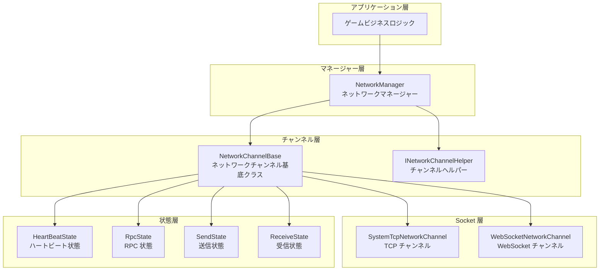
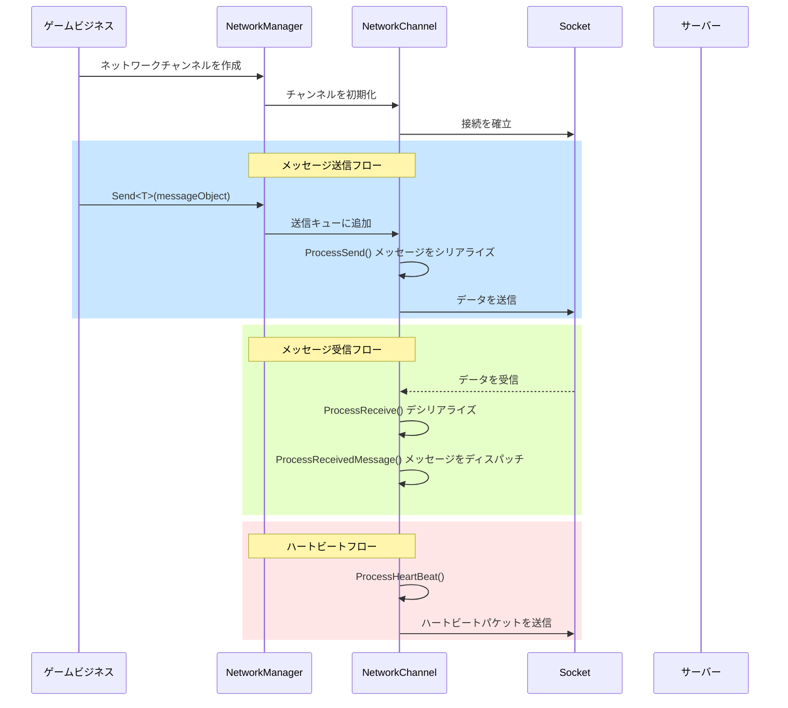
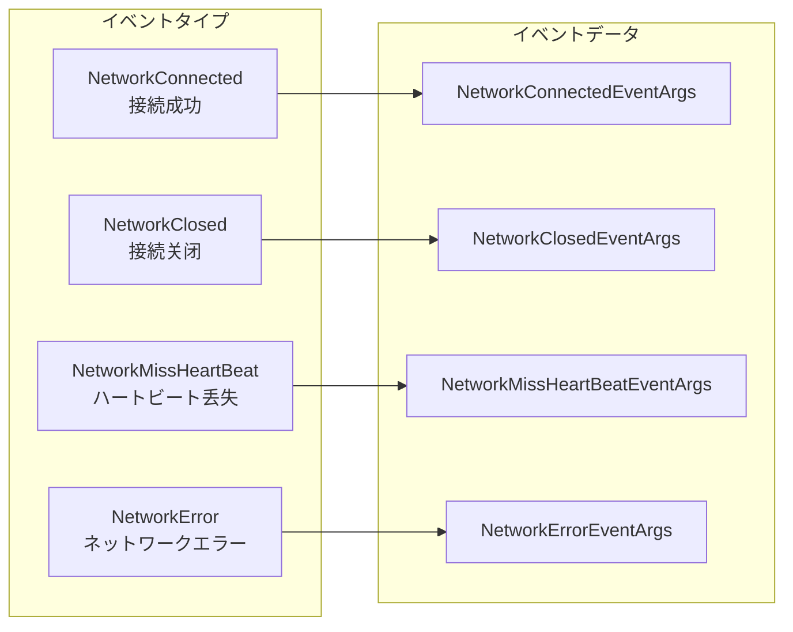

# ネットワークマネージャー

NetworkManager は GameFrameX ネットワークモジュールのコアコンポーネントであり、ゲーム内のすべてのネットワーク接続チャンネルを一元管理します。网络チャンネル作成と破棄、接続状態管理、ハートビート検出、RPC リモート呼び出しなどのコア機能を提供します。

## 概要

ネットワークマネージャーは GameFrameX フレームワークのネットワーク層コアとして、ゲームクライアントとサーバーの間の接続において重要な役割を果たします。その設計理念は、統一的で簡潔で強力なネットワーク抽象層を提供し、開発者が業務ロジックに集中できるようにし、低レベルのネットワーク通信の詳細を心配しないようにすることです。

### コア責務

NetworkManager の主な責務には以下が含まれます：

1. **マルチチャンネル管理**：同時に複数の独立したネットワークチャンネルを維持することをサポートし、各チャンネルは異なるサーバーに接続可能
2. **接続ライフサイクル**：ネットワーク接続の確立、維持、关闭プロセスを管理
3. **ハートビート検出**：定期的にハートビートパケットを送信して接続の健全性を検出、自动処理切断接続
4. **RPC スケジューリング**：リモートプロシージャ呼び出しのリクエスト/レスポンスメカニズムをラップし、非同期でサーバーの返回を待機
5. **イベント通知**：イベントシステムを通じてビジネス層にネットワーク状態の変化を通知

### 設計理念

NetworkManager は以下の設計原則を採用しています：

- **モジュラーデザイン**：ネットワークチャンネル、ハートビート、RPC などの機能を独立した状態クラスに分離し、保守と拡張が容易
- **イベント駆動**：イベントメカニズムを使用してネットワーク状態の変化とビジネス処理を分離
- **統一インターフェース**：`INetworkChannel` インターフェースを通じて異なるネットワーク実装（TCP/WebSocket）を抽象化
- **自動管理**：ゲームメ沃尔ープで自動的にすべてのネットワークチャンネルを更新し、手動ポーリングの負担を减少

## アーキテクチャ

NetworkManager は分层アーキテクチャを採用しており、上から下へ以下のレイヤーに分かれています：



### コンポーネントの説明

| コンポーネント | 説明 |
|------|------|
| NetworkManager | ネットワークマネージャーのメインクラス、すべてのネットワークチャンネルのライフサイクルを管理 |
| NetworkChannelBase | ネットワークチャンネルの抽象基底クラス、Socket 操作とメッセージ処理ロジックをカプセル化 |
| INetworkChannelHelper | チャンネルヘルパーインターフェース、メッセージのシリアライゼーションとデシリアライゼーションを担当 |
| HeartBeatState | ハートビート状態クラス、ハートビートタイマーと丢失カウントを管理 |
| RpcState | RPC 状態クラス、レスポンスを待機中の RPC リクエストとタイムアウト処理を管理 |
| SendState | 送信状態クラス、送信待ちメッセージキューを管理 |
| ReceiveState | 受信状態クラス、受信バッファとデータパケット解析を管理 |

### メッセージ処理フロー



## コア機能

### ネットワークチャンネル管理

NetworkManager は辞書構造を使用してすべてのネットワークチャンネルを存储し、チャンネル名による高速検索をサポート：

```csharp
// ネットワークチャンネルを作成
INetworkChannel channel = networkManager.CreateNetworkChannel("MainServer", channelHelper, 30000);

// チャンネルが存在するかどうかを確認
if (networkManager.HasNetworkChannel("MainServer"))
{
    // チャンネルを取得
    INetworkChannel channel = networkManager.GetNetworkChannel("MainServer");
}

// すべてのチャンネルを取得
INetworkChannel[] channels = networkManager.GetAllNetworkChannels();

// チャンネルを破棄
networkManager.DestroyNetworkChannel("MainServer");
```

> Source: [NetworkManager.cs](https://github.com/GameFrameX/com.gameframex.unity.network/blob/main/Runtime/Network/Network/NetworkManager.cs#L203-L247)

### 接続管理

ネットワークチャンネルはリモートサーバーへの接続をサポートし、完全な接続状態管理を提供します：

```csharp
// サーバーに接続
channel.Connect(new Uri("tcp://127.0.0.1:8888"), userData);

// 接続を閉じる
channel.Close("自発的に閉じる");
```

> Source: [NetworkManager.NetworkChannelBase.cs](https://github.com/GameFrameX/com.gameframex.unity.network/blob/main/Runtime/Network/Network/NetworkManager.NetworkChannelBase.cs#L638-L756)

### RPC リモート呼び出し

NetworkManager は Task ベースの非同期 RPC 呼び出しメカニズムを提供し、サーバーのレスポンス待機をサポート：

```csharp
// RPC リクエストを送信し、レスポンスを待機
var request = new C2S_LoginRequest { Username = "test", Password = "123" };
var response = await channel.Call<C2S_LoginResponse>(request);

// RPC コールバックを設定
channel.SetRPCStartHandler((sender, msg) => { 
    Debug.Log($"RPC 開始: {msg.GetType().Name}");
});

channel.SetRPCEndHandler((sender, msg) => { 
    Debug.Log($"RPC 終了: {msg.GetType().Name}");
});

channel.SetRPCErrorHandler((sender, msg) => { 
    Debug.Log($"RPC エラー: {msg.GetType().Name}");
});
```

> Source: [NetworkManager.RpcState.cs](https://github.com/GameFrameX/com.gameframex.unity.network/blob/main/Runtime/Network/Network/NetworkManager.RpcState.cs#L125-L144)

### ハートビート検出

ネットワークチャンネルには组み込みのハートビート検出メカニズムがあり、ハートビートの丢失がしきい値に達すると自動的に接続を切断します：

```csharp
// ハートビート間隔を設定（秒）
channel.HeartBeatInterval = 30f;

// メッセージ受信時にハートビートタイマーをリセット
channel.ResetHeartBeatElapseSecondsWhenReceivePacket = true;

// フォーカス失去時にハートビートを送信するかどうかを設定
networkManager.SetFocusHeartbeat(true);
```

> Source: [NetworkManager.NetworkChannelBase.cs](https://github.com/GameFrameX/com.gameframex.unity.network/blob/main/Runtime/Network/Network/NetworkManager.NetworkChannelBase.cs#L293-L311)

## イベントシステム

NetworkManager はネットワーク状態の変化を通知するための完全なイベントシステムを提供します：



### イベントタイプ説明

| イベント | 説明 | イベントパラメータ |
|------|------|----------|
| NetworkConnected | サーバーへの接続に成功したときにトリガー | NetworkConnectedEventArgs |
| NetworkClosed | 接続が关闭されたときにトリガー | NetworkClosedEventArgs |
| NetworkMissHeartBeat | ハートビートが丢失されたときにトリガー | NetworkMissHeartBeatEventArgs |
| NetworkError | ネットワークエラーが発生したときにトリガー | NetworkErrorEventArgs |

### イベント購読の例

```csharp
// 接続成功イベントを購読
networkManager.NetworkConnected += OnNetworkConnected;

// 接続关闭イベントを購読
networkManager.NetworkClosed += OnNetworkClosed;

// ハートビート丢失イベントを購読
networkManager.NetworkMissHeartBeat += OnNetworkMissHeartBeat;

// ネットワークエラーイベントを購読
networkManager.NetworkError += OnNetworkError;

private void OnNetworkConnected(object sender, NetworkConnectedEventArgs e)
{
    Debug.Log($"接続成功: {e.NetworkChannel.Name}");
}

private void OnNetworkClosed(object sender, NetworkClosedEventArgs e)
{
    Debug.Log($"接続关闭: {e.NetworkChannel.Name}, 理由: {e.Reason}, エラーコード: {e.ErrorCode}");
}

private void OnNetworkMissHeartBeat(object sender, NetworkMissHeartBeatEventArgs e)
{
    Debug.Log($"ハートビート丢失回数: {e.MissHeartBeatCount}");
}

private void OnNetworkError(object sender, NetworkErrorEventArgs e)
{
    Debug.Log($"ネットワークエラー: {e.ErrorCode}, メッセージ: {e.ErrorMessage}");
}
```

> Source: [NetworkConnectedEventArgs.cs](https://github.com/GameFrameX/com.gameframex.unity.network/blob/main/Runtime/EventArgs/NetworkConnectedEventArgs.cs)

## データパケットハンドラー

NetworkManager はプラグイン可能なハンドラーメカニズムを通じてデータパケットの送信と受信を処理：

```csharp
// 送信ヘッダーハンドラーを登録
channel.RegisterHandler(new DefaultPacketSendHeaderHandler());

// 送信ボディハンドラーを登録
channel.RegisterHandler(new DefaultPacketSendBodyHandler());

// 受信ヘッダーハンドラーを登録
channel.RegisterHandler(new DefaultPacketReceiveHeaderHandler());

// 受信ボディハンドラーを登録
channel.RegisterHandler(new DefaultPacketReceiveBodyHandler());

// ハートビートハンドラーを登録
channel.RegisterHeartBeatHandler(new DefaultPacketHeartBeatHandler());
```

> Source: [INetworkChannel.cs](https://github.com/GameFrameX/com.gameframex.unity.network/blob/main/Runtime/Network/Interface/INetworkChannel.cs#L100-L174)

### メッセージ圧縮

ネットワーク転送データ量を减少するためにメッセージ圧縮をサポート：

```csharp
// メッセージ圧縮ハンドラーを登録
channel.RegisterMessageCompressHandler(new DefaultMessageCompressHandler());

// メッセージ解凍ハンドラーを登録
channel.RegisterMessageDecompressHandler(new DefaultMessageDecompressHandler());
```

## 設定オプション

### NetworkManager 設定

NetworkManager は GameFrameworkModule として動作するため、直接設定は不要です。すべての設定はネットワークチャンネル作成時に指定します。

### NetworkChannel 設定

| オプション | タイプ | デフォルト値 | 説明 |
|------|------|--------|------|
| HeartBeatInterval | float | 30.0 | ハートビート送信間隔（秒） |
| ResetHeartBeatElapseSecondsWhenReceivePacket | bool | false | メッセージ受信時にハートビートタイマーをリセットするかどうか |
| MissHeartBeatCountByClose | int | 10 | ハートビート丢失回数しきい値、超えると接続を切断 |

> Source: [NetworkManager.NetworkChannelBase.cs](https://github.com/GameFrameX/com.gameframex.unity.network/blob/main/Runtime/Network/Network/NetworkManager.NetworkChannelBase.cs#L52-L77)

## API リファレンス

### `NetworkManager` クラス

`GameFrameworkModule` を継承し、ネットワークモジュールのメインエントリポイントです。

#### プロパティ

| プロパティ | タイプ | 説明 |
|------|------|------|
| NetworkChannelCount | int | ネットワークチャンネル数を取得 |

#### イベント

| イベント | 説明 |
|------|------|
| NetworkConnected | ネットワーク接続成功イベント |
| NetworkClosed | ネットワーク接続关闭イベント |
| NetworkMissHeartBeat | ハートビート丢失イベント |
| NetworkError | ネットワークエラーイベント |

#### メソッド

### `HasNetworkChannel(channelName: string): bool`

指定された名前のネットワークチャンネルの是否存在をチェックします。

**パラメータ：**
- `channelName` (string): ネットワークチャンネル名

**返回：** ネットワークチャンネルが存在するかどうか

---

### `GetNetworkChannel(channelName: string): INetworkChannel`

指定された名前のネットワークチャンネルを取得します。

**パラメータ：**
- `channelName` (string): ネットワークチャンネル名

**返回：** ネットワークチャンネルインターフェース、存在しない場合は null

---

### `CreateNetworkChannel(channelName: string, networkChannelHelper: INetworkChannelHelper, rpcTimeout: int): INetworkChannel`

新しいネットワークチャンネルを作成します。

**パラメータ：**
- `channelName` (string): ネットワークチャンネル名
- `networkChannelHelper` (INetworkChannelHelper): ネットワークチャンネルヘルパー
- `rpcTimeout` (int): RPC タイムアウト時間（ミリ秒）、最小値 3000

**返回：** 作成されたネットワークチャンネル

**例外：**
- `GameFrameworkException`: チャンネルが既に存在する場合にスロー

---

### `DestroyNetworkChannel(channelName: string): bool`

指定されたネットワークチャンネルを破棄します。

**パラメータ：**
- `channelName` (string): ネットワークチャンネル名

**返回：** 破棄に成功したかどうか

---

### `SetFocusHeartbeat(hasFocus: bool): void`

アプリケーションがフォーカスを失ったときにハートビートパケットを送信するかどうかを設定します。

**パラメータ：**
- `hasFocus` (bool): フォーカスを獲得的时候にハートビートを送信するかどうか

---

### `INetworkChannel` インターフェース

ネットワークチャンネルインターフェース、ネットワークチャンネルのコア操作を定義します。

#### プロパティ

| プロパティ | タイプ | 説明 |
|------|------|------|
| Name | string | チャンネル名を取得 |
| Socket | INetworkSocket | Socket オブジェクトを取得 |
| Connected | bool | 接続されているかどうかを取得 |
| AddressFamily | AddressFamily | アドレスタイプを取得 |
| SendPacketCount | int | 送信待ちメッセージ数を取得 |
| SentPacketCount | int | 送信済みメッセージ数を取得 |
| ReceivedPacketCount | int | 受信済みメッセージ数を取得 |
| HeartBeatInterval | float | ハートビート間隔を取得または設定 |
| HeartBeatElapseSeconds | float | ハートビートの経過時間を取得 |
| MissHeartBeatCount | int | ハートビート丢失回数を取得 |

#### メソッド

### `Connect(address: Uri, userData: object): void`

リモートサーバーに接続します。

**パラメータ：**
- `address` (Uri): サーバーアドレス
- `userData` (object): ユーザー定義データ

---

### `Send<T>(messageObject: T): void` 

サーバーにメッセージを送信します。

**パラメータ：**
- `messageObject` (T): MessageObject を継承するメッセージオブジェクト

---

### `Call<TResult>(messageObject: MessageObject, isIgnoreErrorCode: bool): Task<TResult>`

RPC リクエストを送信し、レスポンスを待機します。

**パラメータ：**
- `messageObject` (MessageObject): リクエストメッセージ
- `isIgnoreErrorCode` (bool): エラーコードを無視するかどうか

**返回：** レスポンスメッセージの Task

---

### `Close(reason: string, code: ushort): void`

ネットワークチャンネルを閉じます。

**パラメータ：**
- `reason` (string): 閉じる理由
- `code` (ushort): エラーコード

---

### `RegisterHandler(handler: IPacketSendHeaderHandler): void`

データパケット送信ヘッダーハンドラーを登録します。

---

### `RegisterHeartBeatHandler(handler: IPacketHeartBeatHandler): void`

ハートビートハンドラーを登録します。

---

### `SetRPCErrorHandler(handler: EventHandler<MessageObject>): void`

RPC エラー処理関数を設定します。

---

### `SetRPCStartHandler(handler: EventHandler<MessageObject>): void`

RPC 開始処理関数を設定します。

---

### `SetRPCEndHandler(handler: EventHandler<MessageObject>): void`

RPC 終了処理関数を設定します。

---

## 関連リンク

- [ネットワークチャンネル](./4-core-concepts.2-network-channel) - ネットワークチャンネルの実装の詳細な理解
- [メッセージタイプ](./4-core-concepts.3-message-types) - メッセージオブジェクトの定義を理解
- [パケットハンドラー](./4-core-concepts.4-packet-handlers) - データパケットのシリアライズと処理を理解
- [ハートビート](./5-heartbeat) - ハートビート検出メカニズムの詳細な理解
- [イベントシステム](./6-events) - イベントシステムの使用を理解
- [メッセージ圧縮](./7-message-compression) - メッセージ圧縮機能を理解
- [RPC リモート呼び出し](./8-rpc) - RPC メカニズムの詳細な理解
