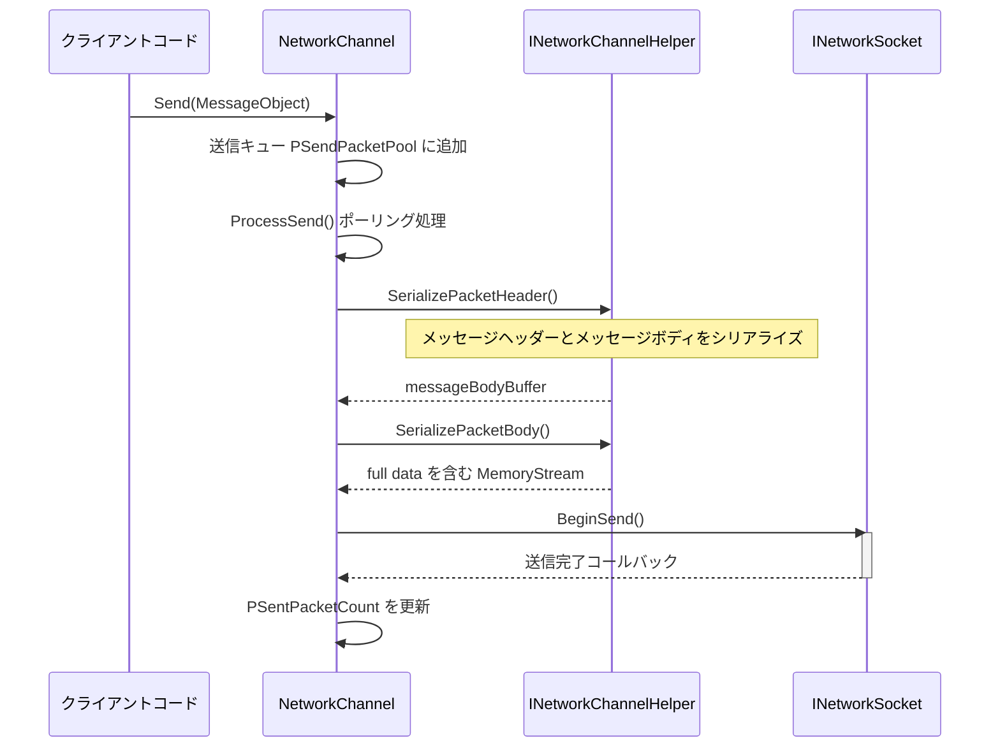
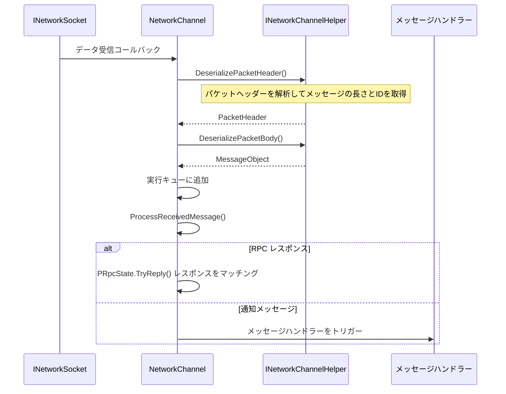
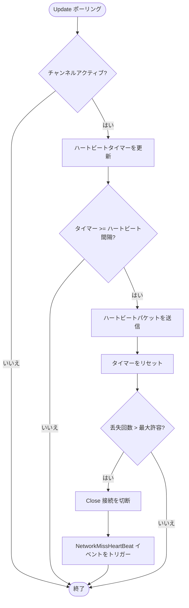

# ネットワークチャンネル

ネットワークチャンネル（Network Channel）は GameFrameX ネットワークフレームワークのコアコンポーネントであり、リモートサーバーとの单一接続を管理します。Socket 通信、メッセージのシリアライズ/デシリアライズ、ハートビート検出、RPC 呼び出しなどの完全な機能をカプセル化し、開発者がネットワーク通信開発を容易に行えるようにします。

## 概要

GameFrameX ネットワークフレームワークでは、各ネットワークチャンネルが独立したネットワーク接続を表します。フレームワークは複数のチャンネルを作成して異なるサーバーに同時に接続することをサポートし、各チャンネルは独自の接続状態、送信キュー、受信キュー、ハートビット状態を維持します。

ネットワークチャンネルは分层アーキテクチャを採用して設計されています：

- **インターフェース層**：`INetworkChannel` インターフェースを定義し、すべてのネットワーク操作を抽象化
- **基底クラス層**：`NetworkChannelBase` 抽象基底クラスを提供し、通用ロジックを実装
- **実装層**：`SystemTcpNetworkChannel`（TCP 接続）と `WebSocketNetworkChannel`（WebSocket 接続）を含む
- **ヘルパー層**：`INetworkChannelHelper` を通じてメッセージのシリアライズとデシリアライズを委任

### コア機能

ネットワークチャンネルは次のコア機能を提供します：

1. **接続管理**：リモートサーバーへの接続の確立と維持
2. **メッセージ送信**：MessageObject をネットワークデータにシリアライズして送信
3. **メッセージ受信**：ネットワークデータを受信して MessageObject にデシリアライズ
4. **ハートビートメカニズム**：定期的にハートビートパケットを送信して接続状態を検出
5. **RPC 呼び出し**：リクエスト・レスポンスモードのリモートプロシージャ呼び出しをサポート
6. **メッセージ圧縮**：メッセージ圧縮をサポートしてネットワーク転送量を减少
7. **イベント通知**：イベントシステムを通じて接続状態の変更を通知

## アーキテクチャ

```mermaid
graph TD
    subgraph "外部呼び出し"
        NetworkComponent
        GameLogic
    end
    
    subgraph "NetworkManager"
        Manager[ネットワークマネージャー]
    end
    
    subgraph "ネットワークチャンネル層"
        INetworkChannel[INetworkChannel インターフェース]
        BaseChannel[NetworkChannelBase 基底クラス]
        TcpChannel[SystemTcpNetworkChannel]
        WsChannel[WebSocketNetworkChannel]
    end
    
    subgraph "ハンドラー層"
        SendHeader[IPacketSendHeaderHandler]
        SendBody[IPacketSendBodyHandler]
        RecvHeader[IPacketReceiveHeaderHandler]
        RecvBody[IPacketReceiveBodyHandler]
        HeartBeat[IPacketHeartBeatHandler]
        Compress[IMessageCompressHandler]
        Decompress[IMessageDecompressHandler]
    end
    
    subgraph "ヘルパー層"
        Helper[INetworkChannelHelper]
        DefaultHelper[DefaultNetworkChannelHelper]
    end
    
    subgraph "低レベルネットワーク"
        Socket[INetworkSocket]
    end
    
    NetworkComponent --> Manager
    Manager --> INetworkChannel
    INetworkChannel <|-- BaseChannel
    BaseChannel --> TcpChannel
    BaseChannel --> WsChannel
    BaseChannel --> Helper
    BaseChannel --> SendHeader
    BaseChannel --> SendBody
    BaseChannel --> RecvHeader
    BaseChannel --> RecvBody
    BaseChannel --> HeartBeat
    BaseChannel --> Compress
    BaseChannel --> Decompress
    Helper <|.. DefaultHelper
    TcpChannel --> Socket
    WsChannel --> Socket
```

### コンポーネントの説明

| コンポーネント | 説明 |
|------|------|
| `INetworkChannel` | ネットワークチャンネルインターフェース、すべてのネットワーク操作を定義 |
| `NetworkChannelBase` | 抽象基底クラス、通用ロジックと状態管理を実装 |
| `SystemTcpNetworkChannel` | System.Net.Sockets に基づく TCP 実装 |
| `WebSocketNetworkChannel` | WebSocket に基づく接続実装 |
| `INetworkChannelHelper` | メッセージシリアライズ/デシリアライズヘルパーインターフェース |
| `DefaultNetworkChannelHelper` | デフォルト実装、ハンドラーを自動的に登録 |

## メッセージ処理フロー

### 送信フロー

クライアントが `Send` メソッドを呼び出してメッセージを送信するとき、ネットワークチャンネルは次のフローで処理します：



> Source: [NetworkManager.NetworkChannelBase.cs](https://github.com/GameFrameX/com.gameframex.unity.network/blob/main/Runtime/Network/Network/NetworkManager.NetworkChannelBase.cs#L779-L822)

### 受信フロー

ネットワークデータを受信すると、ネットワークチャンネルは次のフローで処理します：



> Source: [NetworkManager.NetworkChannelBase.cs](https://github.com/GameFrameX/com.gameframex.unity.network/blob/main/Runtime/Network/Network/NetworkManager.NetworkChannelBase.cs#L392-L430)

## ハートビートメカニズム

ネットワークチャンネルには组み込みのハートビートメカニズムがあり、接続がまだ有効かどうか検出するために使用されます。



> Source: [NetworkManager.NetworkChannelBase.cs](https://github.com/GameFrameX/com.gameframex.unity.network/blob/main/Runtime/Network/Network/NetworkManager.NetworkChannelBase.cs#L436-L479)

### ハートビート設定

| プロパティ | デフォルト値 | 説明 |
|------|--------|------|
| `HeartBeatInterval` | 30秒 | ハートビート送信間隔 |
| `MissHeartBeatCountByClose` | 10 | ハートビート丢失回数しきい値、超えると自動切断 |
| `ResetHeartBeatElapseSecondsWhenReceivePacket` | false | メッセージ受信時にハートビートタイマーをリセットするかどうか |

## 使用例

### チャンネルを作成

```csharp
// NetworkComponent を通じてネットワークチャンネルを作成
var networkChannel = networkComponent.CreateNetworkChannel(
    "GameServer", 
    new DefaultNetworkChannelHelper()
);
```

> Source: [NetworkComponent.cs](https://github.com/GameFrameX/com.gameframex.unity.network/blob/main/Runtime/Network/NetworkComponent.cs#L176-L180)

### サーバーに接続

```csharp
// リモートサーバーに接続
var channel = networkComponent.GetNetworkChannel("GameServer");
channel.Connect(new Uri("tcp://127.0.0.1:8888"));
```

> Source: [NetworkManager.NetworkChannelBase.cs](https://github.com/GameFrameX/com.gameframex.unity.network/blob/main/Runtime/Network/Network/NetworkManager.NetworkChannelBase.cs#L638-L706)

### メッセージを送信

```csharp
// メッセージを送信（非同期、戻り値なし）
var message = new C2S_LoginMessage 
{ 
    Username = "player1", 
    Password = "password" 
};
channel.Send(message);

// RPC リクエストを送信（レスポンスを待機）
var response = await channel.Call<S2C_LoginResponse>(new C2S_LoginMessage 
{ 
    Username = "player1", 
    Password = "password" 
});
```

> Source: [NetworkManager.NetworkChannelBase.cs](https://github.com/GameFrameX/com.gameframex.unity.network/blob/main/Runtime/Network/Network/NetworkManager.NetworkChannelBase.cs#L765-L771)

### ハートビートを設定

```csharp
// ハートビート間隔を15秒に設定
channel.HeartBeatInterval = 15f;

// 5回の丢失後に切断
MissHeartBeatCountByClose = 5;

// メッセージ受信時にハートビートタイマーをリセット
channel.ResetHeartBeatElapseSecondsWhenReceivePacket = true;
```

> Source: [NetworkManager.NetworkChannelBase.cs](https://github.com/GameFrameX/com.gameframex.unity.network/blob/main/Runtime/Network/Network/NetworkManager.NetworkChannelBase.cs#L290-L297)

### メッセージハンドラーを登録

```csharp
// DefaultNetworkChannelHelper.Initialize で自動的にすべてのハンドラーを登録
// 開発者は INetworkChannelChannelHelper を継承してカスタムハンドラー登録ロジックをカスタマイズ可能

// カスタムハートビートハンドラーを登録
channel.RegisterHeartBeatHandler(new CustomHeartBeatHandler());
```

> Source: [DefaultNetworkChannelHelper.cs](https://github.com/GameFrameX/com.gameframex.unity.network/blob/main/Runtime/Network/Helper/DefaultNetworkChannelHelper.cs#L40-L107)

### チャンネルを閉じる

```csharp
// ネットワークチャンネルを閉じる
channel.Close("自発的に閉じる", (ushort)NetworkErrorCode.Normal);
```

> Source: [NetworkManager.NetworkChannelBase.cs](https://github.com/GameFrameX/com.gameframex.unity.network/blob/main/Runtime/Network/Network/NetworkManager.NetworkChannelBase.cs#L714-L756)

## INetworkChannel インターフェースリファレンス

### 接続管理

| メソッド | 説明 |
|------|------|
| `Connect(Uri address, object userData = null)` | リモートサーバーに接続 |
| `Close(string reason, ushort code = 0)` | ネットワーク接続を閉じる |
| `Send<T>(T messageObject) where T : MessageObject` | メッセージを送信 |
| `Call<TResult>(MessageObject messageObject, bool isIgnoreErrorCode = false)` | RPC リクエストを送信してレスポンスを待機 |

### プロパティ

| プロパティ | タイプ | 説明 |
|------|------|------|
| `Name` | string | チャンネル名を取得 |
| `Connected` | bool | 接続されているかどうかを取得 |
| `AddressFamily` | AddressFamily | アドレスタイプ（IPv4/IPv6）を取得 |
| `Socket` | INetworkSocket | 底层 Socket を取得 |
| `SendPacketCount` | int | 送信待ちメッセージ数を取得 |
| `SentPacketCount` | int | 送信済みメッセージ総数を取得 |
| `ReceivedPacketCount` | int | 受信済みメッセージ総数を取得 |
| `HeartBeatInterval` | float | ハートビート間隔を取得または設定（秒） |
| `HeartBeatElapseSeconds` | float | ハートビートの経過時間を取得 |
| `MissHeartBeatCount` | int | ハートビート丢失回数を取得 |

### ハンドラー管理

| メソッド | 説明 |
|------|------|
| `RegisterHandler(IPacketSendHeaderHandler)` | 送信パケットヘッダーハンドラーを登録 |
| `RegisterHandler(IPacketSendBodyHandler)` | 送信パケットボディハンドラーを登録 |
| `RegisterHandler(IPacketReceiveHeaderHandler)` | 受信パケットヘッダーハンドラーを登録 |
| `RegisterHandler(IPacketReceiveBodyHandler)` | 受信パケットボディハンドラーを登録 |
| `RegisterHeartBeatHandler(IPacketHeartBeatHandler)` | ハートビートハンドラーを登録 |
| `RegisterMessageCompressHandler(IMessageCompressHandler)` | メッセージ圧縮ハンドラーを登録 |
| `RegisterMessageDecompressHandler(IMessageDecompressHandler)` | メッセージ解凍ハンドラーを登録 |

### RPC コールバック設定

| メソッド | 説明 |
|------|------|
| `SetRPCErrorCodeHandler(EventHandler<MessageObject>)` | RPC エラーコードコールバックを設定 |
| `SetRPCErrorHandler(EventHandler<MessageObject>)` | RPC エラーコールバックを設定 |
| `SetRPCStartHandler(EventHandler<MessageObject>)` | RPC 開始コールバックを設定 |
| `SetRPCEndHandler(EventHandler<MessageObject>)` | RPC 終了コールバックを設定 |

> Source: [INetworkChannel.cs](https://github.com/GameFrameX/com.gameframex.unity.network/blob/main/Runtime/Network/Interface/INetworkChannel.cs)

## INetworkChannelHelper インターフェースリファレンス

`INetworkChannelHelper` はネットワークチャンネルのヘルパーインターフェースであり、メッセージのシリアライズとデシリアライズを担当します。

| メソッド | 説明 |
|------|------|
| `Initialize(INetworkChannel)` | ヘルパーを初期化 |
| `Shutdown()` | 閉じてヘルパーをクリーンアップ |
| `PrepareForConnecting()` | 接続前の準備作業 |
| `SendHeartBeat()` | ハートビートメッセージを送信 |
| `SerializePacketHeader<T>()` | メッセージヘッダーをシリアライズ |
| `SerializePacketBody()` | メッセージボディをシリアライズ |
| `DeserializePacketHeader()` | メッセージヘッダーをデシリアライズ |
| `DeserializePacketBody()` | メッセージボディをデシリアライズ |

> Source: [INetworkChannelHelper.cs](https://github.com/GameFrameX/com.gameframex.unity.network/blob/main/Runtime/Network/Interface/INetworkChannelHelper.cs)

## 関連リンク

- [ネットワークマネージャー](./4-core-concepts.1-network-manager)
- [メッセージタイプ](./4-core-concepts.3-message-types)
- [パケットハンドラー](./4-core-concepts.4-packet-handlers)
- [ハートビート](./5-heartbeat)
- [イベントシステム](./6-events)
- [メッセージ圧縮](./7-message-compression)
- [RPC リモート呼び出し](./8-rpc)
