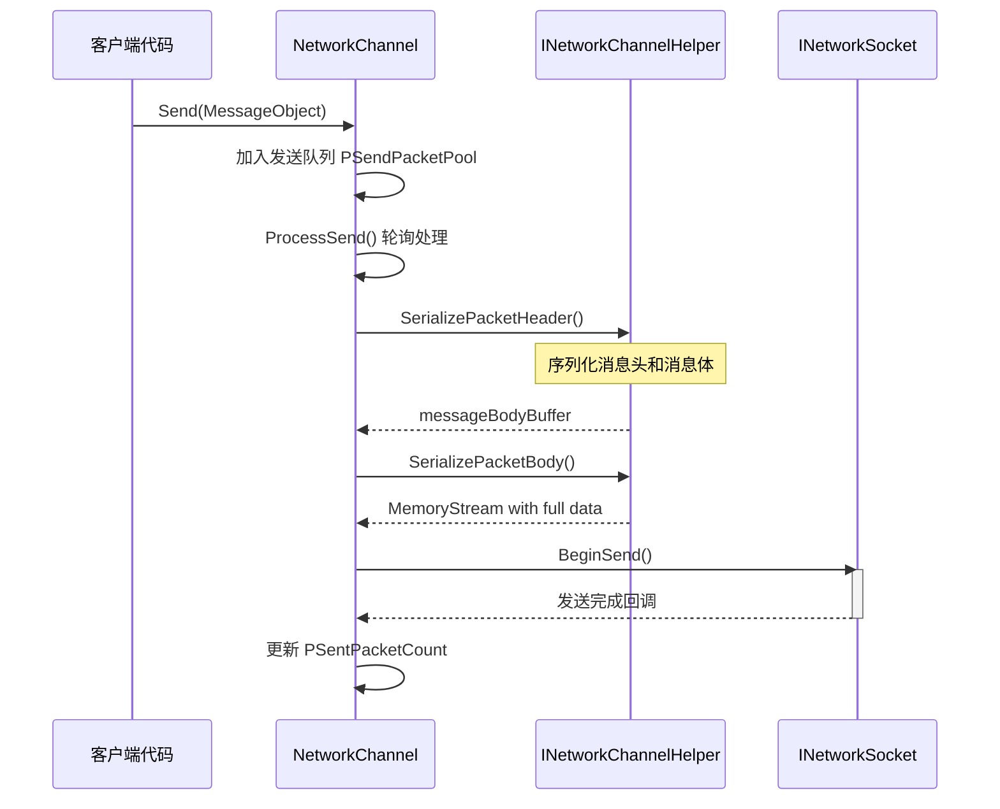
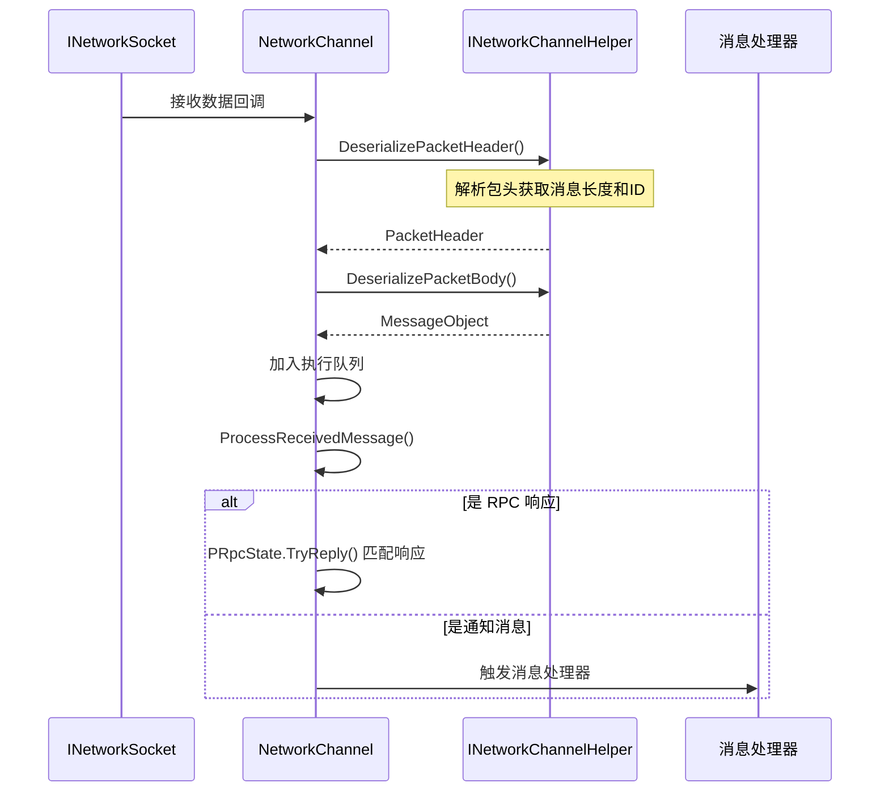
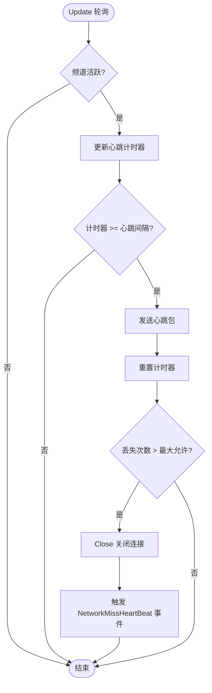

# 网络频道

网络频道（Network Channel）是 GameFrameX 网络フレームワーク中的コアコンポーネント，负责管理与远程服务器的单一连接。它カプセル化了 Socket 通信、メッセージシリアライズ/反シリアライズ、心跳检测、RPC 呼び出し等完全な機能，使開発者能够方便地进行网络通信开发。

## 概要

在 GameFrameX 网络フレームワーク中，每个网络频道代表一个独立的网络连接。フレームワークサポート作成多个频道同時に连接不同的服务器，每个频道维护自己的连接ステータス、发送队列、受信队列和心跳ステータス。

网络频道的設計采用了分层アーキテクチャ：

- **インターフェース層**：定義 `INetworkChannel` インターフェース，抽象所有网络操作
- **基底クラス层**：提供 `NetworkChannelBase` 抽象基底クラス，実装汎用逻辑
- **実装層**：含みます `SystemTcpNetworkChannel`（TCP 连接）和 `WebSocketNetworkChannel`（WebSocket 连接）
- **辅助层**：通过 `INetworkChannelHelper` デリゲートメッセージ的シリアライズ和反シリアライズ

### コア機能

网络频道提供以下コア機能：

1. **连接管理**：建立和维护与远程服务器的连接
2. **メッセージ发送**：将 MessageObject シリアライズ为网络数据并发送
3. **メッセージ受信**：受信网络数据并反シリアライズ为 MessageObject
4. **心跳机制**：定期发送心跳パッケージ检测连接ステータス
5. **RPC 呼び出し**：サポート请求-响应モード的远程过程呼び出し
6. **メッセージ压缩**：サポートメッセージ压缩以减少网络传输量
7. **イベント通知**：通过イベント系统通知连接ステータス变更

## アーキテクチャ

```mermaid
graph TD
    subgraph "外部调用"
        NetworkComponent
        GameLogic
    end
    
    subgraph "NetworkManager"
        Manager[网络管理器]
    end
    
    subgraph "网络频道层"
        INetworkChannel[INetworkChannel 接口]
        BaseChannel[NetworkChannelBase 基类]
        TcpChannel[SystemTcpNetworkChannel]
        WsChannel[WebSocketNetworkChannel]
    end
    
    subgraph "处理器层"
        SendHeader[IPacketSendHeaderHandler]
        SendBody[IPacketSendBodyHandler]
        RecvHeader[IPacketReceiveHeaderHandler]
        RecvBody[IPacketReceiveBodyHandler]
        HeartBeat[IPacketHeartBeatHandler]
        Compress[IMessageCompressHandler]
        Decompress[IMessageDecompressHandler]
    end
    
    subgraph "辅助层"
        Helper[INetworkChannelHelper]
        DefaultHelper[DefaultNetworkChannelHelper]
    end
    
    subgraph "底层网络"
        Socket[INetworkSocket]
    end
    
    NetworkComponent --> Manager
    Manager --> INetworkChannel
    INetworkChannel <|-- BaseChannel
    BaseChannel --> TcpChannel
    BaseChannel --> WsChannel
    BaseChannel --> Helper
    BaseChannel --> SendHeader
    BaseChannel --> SendBody
    BaseChannel --> RecvHeader
    BaseChannel --> RecvBody
    BaseChannel --> HeartBeat
    BaseChannel --> Compress
    BaseChannel --> Decompress
    Helper <|.. DefaultHelper
    TcpChannel --> Socket
    WsChannel --> Socket
```

### コンポーネント説明

| コンポーネント | 説明 |
|------|------|
| `INetworkChannel` | 网络频道インターフェース，定義所有网络操作 |
| `NetworkChannelBase` | 抽象基底クラス，実装汎用逻辑和ステータス管理 |
| `SystemTcpNetworkChannel` | 基于 System.Net.Sockets 的 TCP 実装 |
| `WebSocketNetworkChannel` | 基于 WebSocket 的连接実装 |
| `INetworkChannelHelper` | メッセージシリアライズ/反シリアライズ辅助器インターフェース |
| `DefaultNetworkChannelHelper` | デフォルト実装，自动登録処理器 |

## メッセージ処理フロー

### 发送フロー

当客户端呼び出し `Send` メソッド发送メッセージ时，网络频道按照以下フロー処理：



> Source: [NetworkManager.NetworkChannelBase.cs](https://github.com/GameFrameX/com.gameframex.unity.network/blob/main/Runtime/Network/Network/NetworkManager.NetworkChannelBase.cs#L779-L822)

### 受信フロー

受信到网络数据时，网络频道按照以下フロー処理：



> Source: [NetworkManager.NetworkChannelBase.cs](https://github.com/GameFrameX/com.gameframex.unity.network/blob/main/Runtime/Network/Network/NetworkManager.NetworkChannelBase.cs#L392-L430)

## 心跳机制

网络频道内置心跳机制，用于检测连接是否仍然有效。



> Source: [NetworkManager.NetworkChannelBase.cs](https://github.com/GameFrameX/com.gameframex.unity.network/blob/main/Runtime/Network/Network/NetworkManager.NetworkChannelBase.cs#L436-L479)

### 心跳設定

| プロパティ | デフォルト值 | 説明 |
|------|--------|------|
| `HeartBeatInterval` | 30秒 | 心跳发送间隔 |
| `MissHeartBeatCountByClose` | 10 | 丢失心跳次数阈值，超过后自动断开 |
| `ResetHeartBeatElapseSecondsWhenReceivePacket` | false | 收到メッセージ时是否重置心跳计时器 |

## 使用例

### 作成频道

```csharp
// 通过 NetworkComponent 创建网络频道
var networkChannel = networkComponent.CreateNetworkChannel(
    "GameServer", 
    new DefaultNetworkChannelHelper()
);
```

> Source: [NetworkComponent.cs](https://github.com/GameFrameX/com.gameframex.unity.network/blob/main/Runtime/Network/NetworkComponent.cs#L176-L180)

### 连接服务器

```csharp
// 连接到远程服务器
var channel = networkComponent.GetNetworkChannel("GameServer");
channel.Connect(new Uri("tcp://127.0.0.1:8888"));
```

> Source: [NetworkManager.NetworkChannelBase.cs](https://github.com/GameFrameX/com.gameframex.unity.network/blob/main/Runtime/Network/Network/NetworkManager.NetworkChannelBase.cs#L638-L706)

### 发送メッセージ

```csharp
// 发送消息（异步无返回）
var message = new C2S_LoginMessage 
{ 
    Username = "player1", 
    Password = "password" 
};
channel.Send(message);

// 发送 RPC 请求（等待响应）
var response = await channel.Call<S2C_LoginResponse>(new C2S_LoginMessage 
{ 
    Username = "player1", 
    Password = "password" 
});
```

> Source: [NetworkManager.NetworkChannelBase.cs](https://github.com/GameFrameX/com.gameframex.unity.network/blob/main/Runtime/Network/Network/NetworkManager.NetworkChannelBase.cs#L765-L771)

### 設定心跳

```csharp
// 设置心跳间隔为 15 秒
channel.HeartBeatInterval = 15f;

// 设置丢失 5 次心跳后断开
MissHeartBeatCountByClose = 5;

// 收到消息时重置心跳计时器
channel.ResetHeartBeatElapseSecondsWhenReceivePacket = true;
```

> Source: [NetworkManager.NetworkChannelBase.cs](https://github.com/GameFrameX/com.gameframex.unity.network/blob/main/Runtime/Network/Network/NetworkManager.NetworkChannelBase.cs#L290-L297)

### 登録メッセージ処理器

```csharp
// 在 DefaultNetworkChannelHelper.Initialize 中自动注册所有处理器
// 开发者可以通过继承 INetworkChannelChannelHelper 自定义处理器注册逻辑

// 注册自定义心跳处理器
channel.RegisterHeartBeatHandler(new CustomHeartBeatHandler());
```

> Source: [DefaultNetworkChannelHelper.cs](https://github.com/GameFrameX/com.gameframex.unity.network/blob/main/Runtime/Network/Helper/DefaultNetworkChannelHelper.cs#L40-L107)

### 閉じる频道

```csharp
// 关闭网络频道
channel.Close("主动关闭", (ushort)NetworkErrorCode.Normal);
```

> Source: [NetworkManager.NetworkChannelBase.cs](https://github.com/GameFrameX/com.gameframex.unity.network/blob/main/Runtime/Network/Network/NetworkManager.NetworkChannelBase.cs#L714-L756)

## INetworkChannel インターフェースリファレンス

### 连接管理

| メソッド | 説明 |
|------|------|
| `Connect(Uri address, object userData = null)` | 连接到远程服务器 |
| `Close(string reason, ushort code = 0)` | 閉じる网络连接 |
| `Send<T>(T messageObject) where T : MessageObject` | 发送メッセージ |
| `Call<TResult>(MessageObject messageObject, bool isIgnoreErrorCode = false)` | 发送 RPC 请求并等待响应 |

### プロパティ

| プロパティ | タイプ | 説明 |
|------|------|------|
| `Name` | string | 取得频道名称 |
| `Connected` | bool | 取得是否已连接 |
| `AddressFamily` | AddressFamily | 取得地址タイプ（IPv4/IPv6） |
| `Socket` | INetworkSocket | 取得底层 Socket |
| `SendPacketCount` | int | 取得待发送メッセージ数量 |
| `SentPacketCount` | int | 取得已发送メッセージ总数 |
| `ReceivedPacketCount` | int | 取得已受信メッセージ总数 |
| `HeartBeatInterval` | float | 取得或設定心跳间隔（秒） |
| `HeartBeatElapseSeconds` | float | 取得心跳流逝时间 |
| `MissHeartBeatCount` | int | 取得丢失心跳次数 |

### 処理器管理

| メソッド | 説明 |
|------|------|
| `RegisterHandler(IPacketSendHeaderHandler)` | 登録发送パッケージ头処理器 |
| `RegisterHandler(IPacketSendBodyHandler)` | 登録发送パッケージ体処理器 |
| `RegisterHandler(IPacketReceiveHeaderHandler)` | 登録受信パッケージ头処理器 |
| `RegisterHandler(IPacketReceiveBodyHandler)` | 登録受信パッケージ体処理器 |
| `RegisterHeartBeatHandler(IPacketHeartBeatHandler)` | 登録心跳処理器 |
| `RegisterMessageCompressHandler(IMessageCompressHandler)` | 登録メッセージ压缩処理器 |
| `RegisterMessageDecompressHandler(IMessageDecompressHandler)` | 登録メッセージ解压処理器 |

### RPC コールバック設定

| メソッド | 説明 |
|------|------|
| `SetRPCErrorCodeHandler(EventHandler<MessageObject>)` | 設定 RPC エラー码コールバック |
| `SetRPCErrorHandler(EventHandler<MessageObject>)` | 設定 RPC エラーコールバック |
| `SetRPCStartHandler(EventHandler<MessageObject>)` | 設定 RPC 开始コールバック |
| `SetRPCEndHandler(EventHandler<MessageObject>)` | 設定 RPC 结束コールバック |

> Source: [INetworkChannel.cs](https://github.com/GameFrameX/com.gameframex.unity.network/blob/main/Runtime/Network/Interface/INetworkChannel.cs)

## INetworkChannelHelper インターフェースリファレンス

`INetworkChannelHelper` 是网络频道的辅助器インターフェース，负责メッセージ的シリアライズ和反シリアライズ。

| メソッド | 説明 |
|------|------|
| `Initialize(INetworkChannel)` | 初期化辅助器 |
| `Shutdown()` | 閉じる并清理辅助器 |
| `PrepareForConnecting()` | 连接前准备工作 |
| `SendHeartBeat()` | 发送心跳メッセージ |
| `SerializePacketHeader<T>()` | シリアライズメッセージ头 |
| `SerializePacketBody()` | シリアライズメッセージ体 |
| `DeserializePacketHeader()` | 反シリアライズメッセージ头 |
| `DeserializePacketBody()` | 反シリアライズメッセージ体 |

> Source: [INetworkChannelHelper.cs](https://github.com/GameFrameX/com.gameframex.unity.network/blob/main/Runtime/Network/Interface/INetworkChannelHelper.cs)

## 関連リンク

- [网络マネージャー](./4-core-concepts.1-network-manager)
- [メッセージタイプ](./4-core-concepts.3-message-types)
- [数据パッケージ処理器](./4-core-concepts.4-packet-handlers)
- [心跳机制](./5-heartbeat)
- [イベント系统](./6-events)
- [メッセージ压缩](./7-message-compression)
- [RPC 远程呼び出し](./8-rpc)
